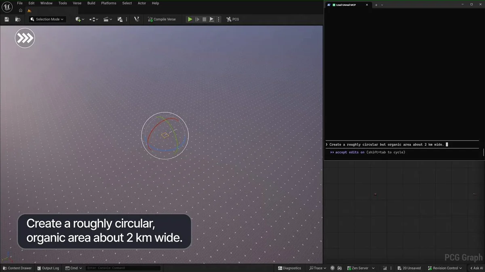
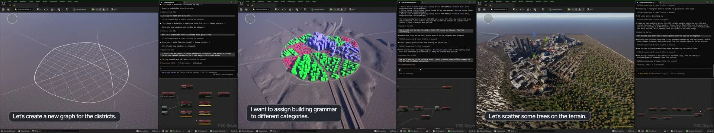

# Unreal Engine 5.8 MCP Deep Dive: Game Engines Are Becoming Agent-Operable World Runtimes

Unreal Engine announced on X that UE 5.8 has shipped with experimental Unreal MCP support. At first glance, this looks like another integration layer for Claude Code, Cursor, Gemini, Codex, and other agents. The larger signal is more important: **game engines are moving from human-clicked creation tools toward world runtimes that agents can read, operate, verify, and iterate.**

In Epic's demo, an agent drives a PCG workflow inside Unreal Editor: it creates a roughly 2 km circular area, builds a district graph, assigns building grammar to different categories, and scatters trees over terrain. The clip is short, but it combines two UE 5.8 themes: Unreal MCP lets external agents call editor capabilities, while PCG, Mesh Terrain, Procedural Vegetation, and related systems make worldbuilding more programmable.

## 1. This is not an AI chat panel; it is a local MCP server inside the editor

Epic's documentation defines Unreal MCP as an MCP server embedded in the Unreal Editor process. MCP-compatible agents connect over a local HTTP endpoint and drive editor functionality through tools. It is not a remote SaaS feature and not merely a chat assistant. It wraps editor capabilities as MCP Tools.

The default setup is deliberately engineering-oriented:

- The friendly plugin name is **Unreal MCP**, while source identifiers, `.uplugin` files, C++ symbols, and console commands use `ModelContextProtocol`.
- The default endpoint is `http://127.0.0.1:8000/mcp`.
- Auto-start is configured under `Edit > Editor Preferences > General > Model Context Protocol`.
- Manual startup uses `ModelContextProtocol.StartServer 8000`.
- `ModelContextProtocol.GenerateClientConfig ClaudeCode` or `All` writes client config files for supported agents.

That matters because it places agents inside Unreal's existing plugin, console-command, config-file, output-log, and debugging model. For production teams, this is more important than whether natural language can generate a pretty scene once. Agents only become useful in serious pipelines when they can be constrained, versioned, tested, and debugged.

## 2. Toolset Registry is the real interface layer

Unreal MCP does not simply expose the entire editor API to a model. It discovers capabilities through the **Toolset Registry**. A Toolset can be written in Python or C++, derives from `unreal.ToolsetDefinition` / `UToolsetDefinition`, and marks functions as callable tools. Epic notes that many shipped toolsets, including `SceneTools`, `ActorTools`, `MaterialInstanceTools`, and `ObjectTools`, are authored in Python.

This changes the product shape:

1. **Teams can define tool boundaries.** Instead of letting an agent manipulate the whole editor arbitrarily, teams expose named, schema-bearing, documented actions.
2. **Tool descriptions become product interfaces.** Function docstrings, parameter types, and return types flow into Tool schemas and directly shape agent behavior.
3. **Toolsets can serve multiple AI surfaces.** The Toolset Registry is not only for MCP; it can be consumed by other AI surfaces inside the engine.

In other words, UE 5.8 is not just adding an agent entry point. It is adding an AI-callable capability registry inside the engine. Future technical art and tools teams may ship not only Editor Utility Widgets or CLI scripts, but also toolsets that agents can compose and verify.

## 3. PCG plus MCP turns worldbuilding into a loopable task

UE 5.8's release notes include a dense set of PCG improvements: non-destructive manual editing, complex attributes such as arrays and structures, embedded subgraphs, a graph-parameters hierarchy editor, runtime GPU scatter performance improvements, actor/component-less runtime generation, HLSL kernel improvements, Data viewport manual overrides, and many new nodes and operators.

On their own, these features make PCG more capable. Combined with MCP, they make worldbuilding more agent-friendly:

- PCG graphs provide structured, reusable, parameterized generation logic.
- MCP Tools let an agent inspect project context and call editor actions.
- Manual overrides and the Data Overrides window preserve human art direction.
- GPU scatter, ISM reuse, and scheduling improvements make large-scale iteration more interactive.
- Nodes such as `Apply Spline to Component`, `Teleport Actors and Components`, and `Get Editor Cameras` bridge editor state and procedural graphs.

The demo's sequence — create a circular area, create district graphs, assign building grammar, scatter trees — is almost a canonical agent workflow. The goal can be expressed in natural language, execution requires tool calls, the result can be inspected in the viewport, and the next iteration can adjust parameters based on visual feedback.

## 4. It is still experimental: design the boundary first

Epic is explicit about Unreal MCP's current limits. It supports HTTP and Server-Sent Events only, not stdio or WebSocket. It is loopback-only by default. There is no authentication layer. It is not safe to expose beyond the local machine. Tool invocations are synchronized onto the Unreal game thread and run serially, so clients should not issue overlapping tool calls. Shipping toolsets do not advertise MCP Resources or Prompts. Live Coding does not propagate new `UFUNCTION` declarations, so adding a new tool requires an editor restart.

Those constraints suggest the right adoption pattern: **do not treat it as a remote automation platform on day one. Treat it as a local, controlled, debuggable editor collaboration layer.**

A practical rollout would have three layers:

1. **Exploration:** let agents query selected actors, list available toolsets, inspect scene structure, and explain PCG graphs.
2. **Reversible editing:** expose low-risk tools for temporary actors, material-instance tweaks, PCG parameters, and automation tests.
3. **Production pipeline:** wrap common team actions into custom Toolsets, then pair them with sandboxes, source control, automated tests, and MCP Inspector validation.

The lack of authentication is especially important. This should not be mapped directly to the public internet or a shared remote workstation. The reliable pattern is a local sidecar: agent and editor collaborate on the same machine, and outputs enter normal version-control and build workflows.

## 5. Why this matters for games and 3D agents

Many AI-for-3D workflows still stop at one-shot asset generation: a prompt creates a mesh, material, animation, or clip. UE 5.8 points at the next layer. The agent does not merely generate a static result; it enters the engine runtime and operates scenes, toolchains, PCG graphs, tests, and debugging surfaces.

That shifts the competitive axis for 3D agents from “can it generate a beautiful model?” to:

- Can it understand project structure, naming conventions, and level semantics?
- Can it call team-defined safe tools instead of directly mutating assets?
- Can it decompose a visual goal into verifiable PCG, material, lighting, and layout subtasks?
- Can it iterate inside Unreal Editor and validate through tests or viewport evidence?
- Can it preserve human designer overrides instead of regenerating everything from scratch?

This is also relevant to QCut, AI video, and 3D previs workflows. The valuable product is not a model that generates a scene or video once. It is a creation runtime decomposed into observable, callable, reversible tools. Unreal MCP is a strong signal that creative software is starting to expose those tools natively to agents.

## Conclusion

Unreal Engine 5.8's MCP support is still experimental, but the direction is significant. It connects agents to the real work surface of the engine: Editor, Toolsets, PCG, Automation, Output Log, and MCP Inspector. In the short term, it can help technical artists and tools teams inspect projects, generate PCG workflows, and automate editor tasks. In the long term, it may turn worldbuilding into an agent-native workflow.

The key question is not whether AI replaces level designers. It is how teams reorganize their creation pipeline once the engine itself becomes agent-readable and agent-callable. UE 5.8's answer is pragmatic: start with a local, safe, debuggable MCP server; expose worldbuilding as a set of callable tools; then let agents operate inside those boundaries.
