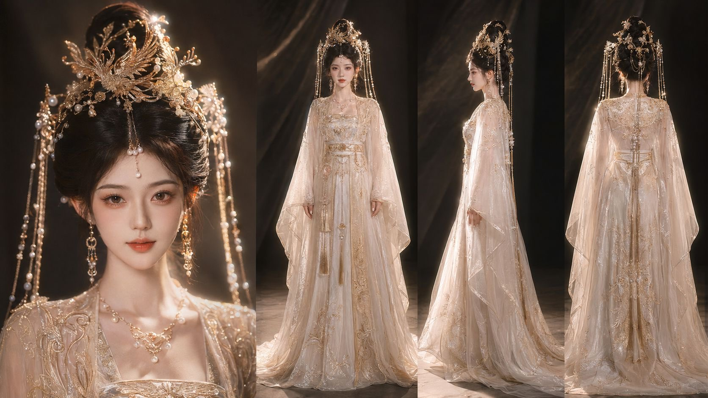
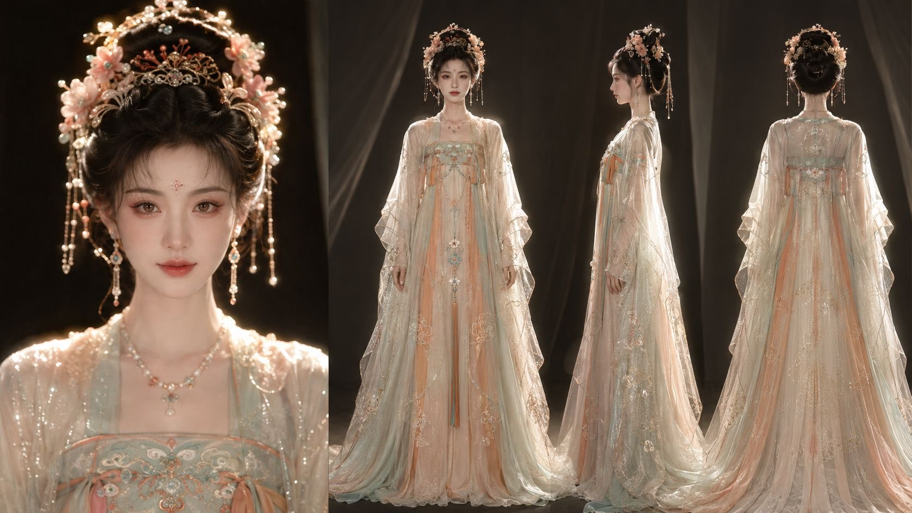
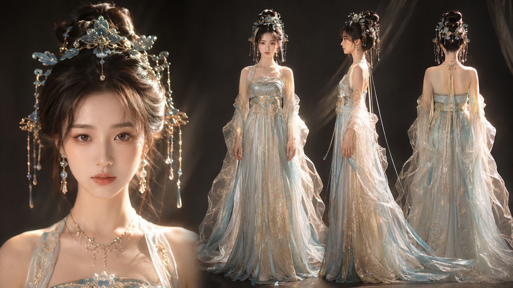
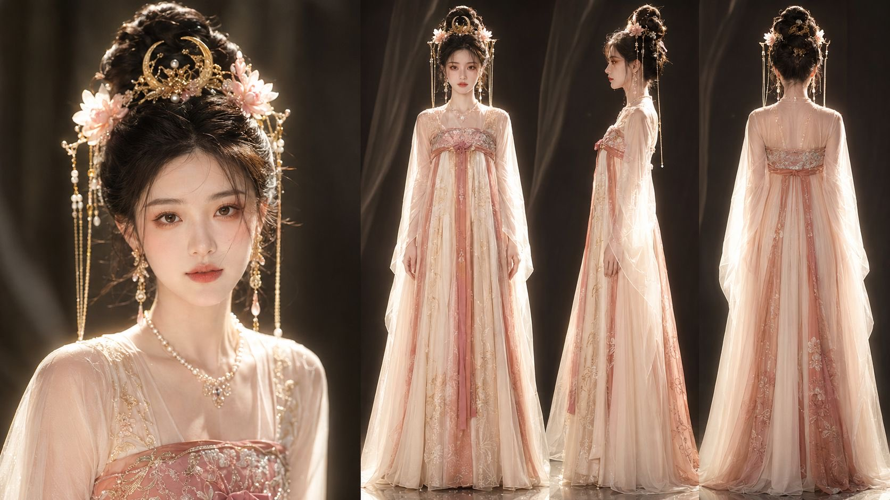

# GrayNoteLab Tang-Song Character Card Prompt: Character Consistency Comes from Turning Taste into a Four-View Spec

GrayNoteLab posted a long prompt on X for a Tang/Song-inspired female fantasy character sheet, along with four 16:9 character-card images. Each image follows the same structure: a close-up face and upper-body detail panel on the left, plus front, side, and back full-body views on the right.

At first glance, the post looks like another ornate Chinese-fantasy prompt. The more useful part is its production logic. It turns a fragile image-generation task into a character-spec problem: the same face, hair system, costume, jewelry, material stack, and body proportions need to hold across multiple views.



## One-Sentence Read

**The reusable value is not “make a beautiful ancient-style woman.” It is “deliver a four-view character card that can support character design, costume discussion, and later image-to-video or reference-image workflows.”**

That makes this different from GrayNoteLab’s June 17 scroll-break video prompt. The earlier prompt solved a spatial boundary problem inside a moving shot. This one solves an identity-consistency problem inside a character asset.

## Why a Character Card Is Harder Than a Pretty Portrait

A single portrait only needs one frame to look good. A character card has stricter constraints:

1. the close-up and full-body views must look like the same person;
2. the front, side, and back views cannot silently change the hair or crown;
3. the costume structure has to make sense from multiple angles;
4. translucent outerwear, wide sleeves, waist belts, and trains cannot disappear in the back view;
5. lighting and background need to feel like one studio setup, not four unrelated generations;
6. height, head-body ratio, shoulder width, and waistline need to remain stable.

That is where many AI character sheets fail. The model can generate something that looks like a character sheet without truly respecting the production purpose of one. It may change the outfit from view to view, simplify the back, or make the close-up face and full-body figure feel like different people.

The useful move in this prompt is that it names those failure modes before generation.

## The Prompt Is Really a Six-Layer Spec

Abstracted away from the decorative wording, the prompt has a clear structure.

| Layer | What it locks | Why it matters |
|---|---|---|
| Layout spec | 16:9 card, close-up on the left, three full-body views on the right | Tells the model this is a character sheet, not a poster |
| Identity spec | age impression, face shape, features, skin texture, expression | Keeps the close-up and body views tied to one identity |
| Hair system | high court hairstyle, phoenix crown, pearls, flowers, tassels, chains | Reduces drift when the angle changes |
| Costume spec | inner dress, waist structure, translucent outer robe | Turns “gorgeous dress” into trackable construction |
| View spec | front, side, and back views with relaxed arms | Forces product-reference logic instead of glamour posing |
| Camera spec | studio lighting, warm gold light, portrait lens, realistic materials | Keeps all panels in one visual world |

This is closer to a design handoff than a normal prompt. It describes style, but it also defines acceptance criteria.

## The Most Important Phrase Is “Same Outfit”

The source prompt repeatedly insists that the three views must use the same person, face, hairstyle, clothing, and jewelry. That repetition is not waste. It is a direct response to a default model behavior: optimizing each local view until the design quietly changes.

For character production, that “locally plausible, globally inconsistent” failure is painful. The front view may look elegant, the side view may have a different belt, and the back view may lose the outer robe entirely. Once that happens, a video team, illustrator, or 3D artist no longer knows which version is authoritative.

So the prompt decomposes the outfit into layers:

- inner embroidered dress;
- waist bands and belt structure;
- translucent outer robe covering shoulders, back, and arms;
- floor-length skirt with embroidery and a slight train.

That turns “luxury court dress” from an aesthetic description into a structural one. The model can still drift, but at least the continuity contract is explicit.



## The Back View Is the Consistency Test

The most valuable panel here is not the face close-up. It is the back view.

Many character prompts request front and side views, then treat the back as optional. In production, the back is where design continuity gets exposed:

- does the hairstyle have a real rear structure;
- can the crown and hanging chains be explained from behind;
- does the translucent robe actually cover the shoulders and back;
- do the belt, tassels, embroidery, and train continue logically;
- does the back still belong to the same costume as the front.

GrayNoteLab’s prompt spends real attention on the back because the back is not a bonus angle. It is the consistency test.

## Negative Constraints Become Production QA

The prompt includes constraints that are easy to dismiss as ordinary negative prompting: avoid oversized heads, short proportions, bulky bodies, broad shoulders, thick waists, and changed clothing structures. But in this task, those are not generic negatives. They are acceptance checks for a character card.

In a reusable workflow, the negative constraints become a QA checklist:

| Check | What to verify |
|---|---|
| Identity consistency | Does the close-up match the full-body panels? |
| Costume continuity | Do front, side, and back preserve the same robe, belt, sleeves, and skirt? |
| Hair continuity | Do crown, pearls, tassels, and chains stay logically consistent? |
| Proportion stability | Are height, head-body ratio, and waistline similar across views? |
| Material stability | Do translucent gauze, embroidery, pearls, and metal behave consistently? |
| Sheet readability | Is this still a character card, not four loosely related posters? |

This is where prompt writing becomes production constraint design. The best character-card prompt is not the one with the most adjectives. It is the one that names the continuity relationships the model tends to break.

## Why This Matters for AI Video and Short-Drama Workflows

Four-view cards are not just pretty posts. They can become upstream assets for image-to-video, character ref sheets, costume iterations, short-drama storyboards, cover design, and LoRA or reference-image workflows.

If an AI short-drama team only has a single front-facing beauty image, the next steps become fragile:

- side-face and back-shot references are missing;
- clothing drifts between shots;
- hair ornaments, sleeve shapes, and trains become unstable during movement;
- the more shots you generate, the less the character feels like one person;
- downstream tools cannot easily reuse the character asset.

A four-view card upgrades the character from “one nice image” to “a reusable reference base.” It does not guarantee stability, but it gives later tools a much stronger anchor.



## How This Could Become Product Fields

If this prompt were built into QCut, an AI short-drama tool, or a character-design workspace, the wrong product move would be asking users to paste the whole long prompt. The better move is to turn it into structured fields.

| Field | Example |
|---|---|
| Character identity | age impression, face shape, features, skin tone, expression |
| Layout | close-up on the left; front, side, and back views on the right |
| Hair system | bun height, crown shape, tassels, chains, symmetry |
| Costume layers | inner dress, waist belt, outer gauze robe, skirt, train |
| View constraints | same person, same outfit, same jewelry across all views |
| Material palette | satin, organza, translucent gauze, embroidery, pearls, metal |
| Camera and lighting | studio setup, portrait lens, warm key light, rim light |
| Failure checks | no face swap, no outfit swap, no missing robe, no distorted proportions |

Then creators can swap the genre: Tang/Song fantasy, cyber-Hanfu, Republican-era costume, mecha idol, game NPC, or brand avatar. The template stays stable; identity, costume, material, and worldbuilding change.

## Boundaries and Caveats

The prompt is useful, but it has limits:

1. **A long prompt is not guaranteed control.** Longer text can make a model overweight some phrases and ignore others.
2. **A four-view image is not a real production pattern.** A generated card may look continuous without being physically sewable, modelable, or filmable.
3. **Fantasy historical styling is not historical reconstruction.** This is better read as a Tang/Song-inspired palace fashion look than as strict costume research.
4. **Character consistency still needs tooling.** For video or multi-image series, teams should pair this with reference images, seeds, inpainting, character LoRA, or multi-image consistency tools.

So the best use of the post is as a character-asset spec sample, not as a magic text block that solves consistency by itself.



## Reusable Formula

The general pattern looks like this:

```text
Generate a [ratio] character design card.
Place [face / upper-body detail] on the left.
Place [front / side / back] full-body views of the same character on the right.
Lock the same [face, hairstyle, hair ornaments, costume, jewelry].
Break the costume into [inner layer / waist layer / outer layer / skirt / train].
Specify what each view must preserve: [structure, material, proportion].
Use negative constraints against [face drift, outfit drift, proportion drift, missing back structure, material loss].
```

This formula can serve many production contexts. For AI video, it is a character-consistency reference. For short drama, it is a costume and character asset card. For games and virtual humans, it is early visual development. For branded content, it turns “style” into a checkable visual spec.

## Closing

The value of GrayNoteLab’s prompt is not the density of ancient-style adjectives. It is the way it decomposes taste into the structures a character asset needs: layout, identity, hair, costume layers, views, materials, and acceptance checks.

As AI image generation moves deeper into production, prompt writing starts to look less like writing an inspiration sentence and more like writing a lightweight spec. The reusable asset is not the phrase “extremely beautiful.” It is the ability to make multiple views, shots, and tools keep working around the same character.
