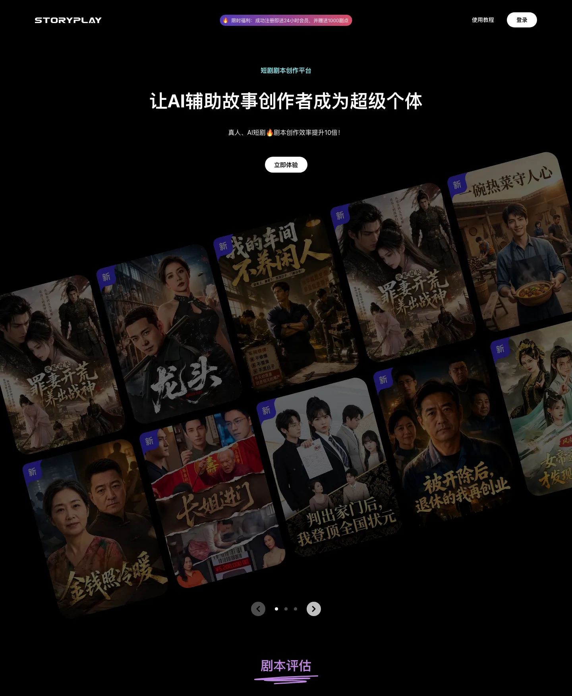

# StoryPlay AI Deep Dive: Short-Drama Creation Needs a Writing Workbench, Not Just a Script Generator

StoryPlay’s homepage positions the product as a short-drama script creation platform. Its headline says it helps story creators become “super individuals” with AI. The page metadata is more specific: StoryPlay AI is built for short-drama screenwriters and story creators, covering inspiration, script planning, first drafts, polishing, distribution, and script-to-video.

It would be easy to summarize this as “AI writes scripts.” That misses the more interesting product shape. StoryPlay does not present short-drama creation as one prompt box. Its public page breaks the upstream workflow into modules: drama breakdown, script evaluation, story planning, script writing, rewriting, web-novel adaptation, and creator feedback.

## One-Sentence Summary

**StoryPlay’s value is not that a model can generate one episode. It is that the product tries to structure the painful upstream work of short-drama writing: finding comparables, breaking down hits, evaluating pacing, planning settings, creating characters, organizing episode outlines, and drafting in a short-drama format.**

This is different from the Huobao Drama project we previously analyzed. Huobao is closer to a pipeline that moves from script to characters, scenes, storyboards, images, video, voice, and final composition. StoryPlay, based on its public homepage, sits further upstream as a writing workbench for selection, planning, evaluation, drafting, and polishing.

## Putting breakdown first is the important move

The first major product section after the hero is “短剧拉片,” or short-drama breakdown. The page says users do not need to watch the full drama manually. StoryPlay integrates platform-level metrics such as cumulative plays and heat values, screens strong dramas in popular categories, and breaks down their scripts for writers.

That matters more than “AI script generation.” Short-drama creation rarely starts from a blank page. It depends on topic validation, platform feedback, hook structure, emotional pacing, and comparable hits. A writing team often wants to know:

1. which topics are currently hot;
2. which hit dramas are worth comparing against;
3. how the opening hook works;
4. how dense the payoffs are;
5. where reversals, misunderstandings, pressure, and payment triggers appear;
6. whether their own script has similar pacing strength.

By placing breakdown early on the page, StoryPlay makes a clear product bet: the starting point for short-drama writing is not pure inspiration, but market examples and structural analysis.

## Script evaluation: from “the author feels it works” to visual pacing evidence

The next core module is script evaluation. The homepage says StoryPlay uses AI to analyze scripts from both the author’s intention and the viewer’s experience, breaking scenes down across high-dimensional criteria and visualizing the result.

This layer is especially relevant for short dramas. Unlike long-form series, short dramas have very little tolerance for weak pacing. If the first seconds do not hook the viewer, the user swipes away. If the first episodes do not create enough pressure, conversion drops. If each episode has uneven information density, paid traffic and monetization suffer.

The public screenshot shows an evaluation panel with a radar chart, pacing curve, scene analysis, and score-like modules. Even without access to the logged-in workspace, the visible product direction is clear: script quality is being turned into observable signals, not only editor intuition.

## Planning: turning a small idea into producible options

StoryPlay’s planning section says AI can generate multiple story-setting options from a simple idea. It also supports customization across target audience, genre, core setting, and style elements.

The key word is not “inspiration.” It is “multiple options.” In short-drama development, one premise is rarely enough. Teams need to compare different directions:

- whether the idea fits live-action, animated, or meme-style short drama;
- whether the protagonist’s identity and pressure relationship are clear;
- whether the first-episode hook is strong enough;
- how tags such as romance, urban, family, fantasy, cultivation, or revenge change the audience;
- whether the setting can sustain 20, 40, or 80 episodes.

If AI gives only one route, the creator is still trapped in a single path. Multiple planning options turn the model into a generator of alternatives, letting the writer choose and combine rather than accept the first draft.

## Script writing is only one part of the chain

The homepage carousel describes five writing-stage capabilities.

| Stage | Visible capability |
|---|---|
| Basic and deep settings | More specialized story framework design assisted by AI |
| Character bio workshop | Generates character files, personality, habits, catchphrases, action lines, and relationship graphs |
| Episode-outline simulation | Evaluates episode density and pacing, supports reorganizing plot modules |
| Professional short-drama format | Quickly generates first drafts for live-action or AI short dramas |
| Large-screen editing and polishing | Provides a desktop-like editing experience and AI polishing for drafts |

This design treats script writing as a chain of intermediate assets: settings, characters, relationships, episode outlines, plot modules, draft text, and polished text.

That is a good fit for short drama. The hard part is often not one line of dialogue. The hard part is unstable intermediate state: character motivation changes, episode pacing breaks, the premise cannot support enough turns, payoff density is uneven, and relationships stop evolving. Making those assets explicit is more reliable than asking a model to write an entire drama in one pass.

## The logged-in routes reveal three real workflows

The public frontend bundle exposes three product entry points behind login:

1. **New script**: combines creative ideation with original script creation, including hit-drama comparable planning.
2. **Web-novel adaptation**: imports novel text for script creation, including novel breakdown.
3. **Script rewriting**: imports a complete script for deep rewriting, including script breakdown.

These routes are realistic. Short-drama scripts do not all come from a single “original prompt” workflow:

- some start from a new topic;
- some start from web-novel IP;
- some are rewrites of existing scripts;
- some require hit-drama comparison;
- some need novel chapter breakdown before being compressed into short-drama pacing.

By separating these routes, StoryPlay acknowledges that short-drama writing is not one task. It is several source-material workflows entering the same production system.

## Company and market positioning

36Kr’s project page describes StoryPlay AI as an AI multimodal script creation platform for story creators. It says the company focuses on live-action and animated short dramas, serving screenwriters and web-novel authors across script planning, script generation, storyboarding, and multimodal content generation. The same page lists the operating company as Story Player (Hangzhou) Intelligent Technology Co., Ltd., founded on 2025-05-23.

Together with the homepage, this makes the positioning clearer. StoryPlay is not a general writing assistant. It targets a high-tempo, highly templated, conversion-driven vertical: Chinese short drama.

## How it differs from general writing tools

General writing tools usually optimize three things: speed, polish, and tone. A short-drama workbench has to optimize a different set of objects.

| General writing tool | Short-drama writing workbench |
|---|---|
| Centers on text quality | Centers on topic, pacing, payoff, and conversion |
| Edits paragraphs, tone, and structure | Manages characters, bios, plot modules, episode density, and script format |
| Input is often a topic or draft | Input may be hit dramas, novel text, a full script, or a raw idea |
| Output is an article or document | Output is a set of reusable production assets |
| Evaluation focuses on language | Evaluation also tracks viewer experience, pacing curves, and scene breakdown |

That is the opening for vertical products. StoryPlay does not need to beat general LLMs on every writing task. It needs to model the short-drama production object better than a generic chat interface.

## Implications for AI-video tools

The StoryPlay homepage metadata mentions script-to-video, and the 36Kr page mentions storyboarding and multimodal content generation. But the public homepage’s strongest visible evidence is upstream: breakdown, evaluation, planning, drafting, and polishing.

That is an important lesson for AI-video tools. Video generation should not start from a prompt alone. A stable AI short-drama pipeline needs upstream assets:

1. hot topics and comparable dramas;
2. script breakdown and payoff structure;
3. character files and relationship graphs;
4. episode outlines and pacing curves;
5. professional short-drama scripts;
6. storyboard, scene, character, and shot prompts;
7. images, videos, voices, and editing.

Without the first five layers, text-to-image, image-to-video, TTS, and editing tools can produce attractive but uncontrolled fragments. StoryPlay sits upstream and asks whether the story assets are producible in the first place.

## Risks and open questions

The public page also leaves several things to verify.

First, the source and update mechanism for breakdown data. The page mentions cumulative plays and heat values, but does not publicly explain which platforms are covered, how data is authorized, how often it updates, or how metrics are normalized.

Second, the interpretability of evaluation metrics. Radar charts and pacing curves are good product surfaces, but writers need to know how each dimension is defined, whether it can be audited, and whether it maps to concrete rewrite suggestions.

Third, copyright and compliance. Short drama already has pressure around adaptation rights, similarity, and platform review. A product that supports hit-drama comparison, novel adaptation, and script rewriting needs clear user guidance on authorization, originality, and platform rules.

Fourth, the depth of the multimodal chain. The homepage and company profile point toward storyboarding and script-to-video, but the public page mainly demonstrates the writing workbench. Video production, storyboard export, asset management, and model-provider integration need further logged-in or documentary evidence.

## Conclusion

StoryPlay AI is worth watching not because it is another AI writing page, but because it decomposes short-drama writing into a more industry-native workbench: breakdown for comparables, evaluation for pacing, planning for multiple routes, character files and relationship graphs for continuity, episode outlines for structure, and AI drafting plus polishing for delivery.

The hard part of short-drama creation is not whether a model can write one episode. It is whether teams can repeatedly produce scripts that are shootable, revisable, ad-friendly, and extendable across episodes. StoryPlay’s product direction shows that AI short-drama tools are moving from one-shot generation toward an upstream production control layer.

If StoryPlay can connect breakdown data, script evaluation, storyboard assets, video generation, and team collaboration, it could become more than a writing assistant. It could become an operating system for short-drama production.
