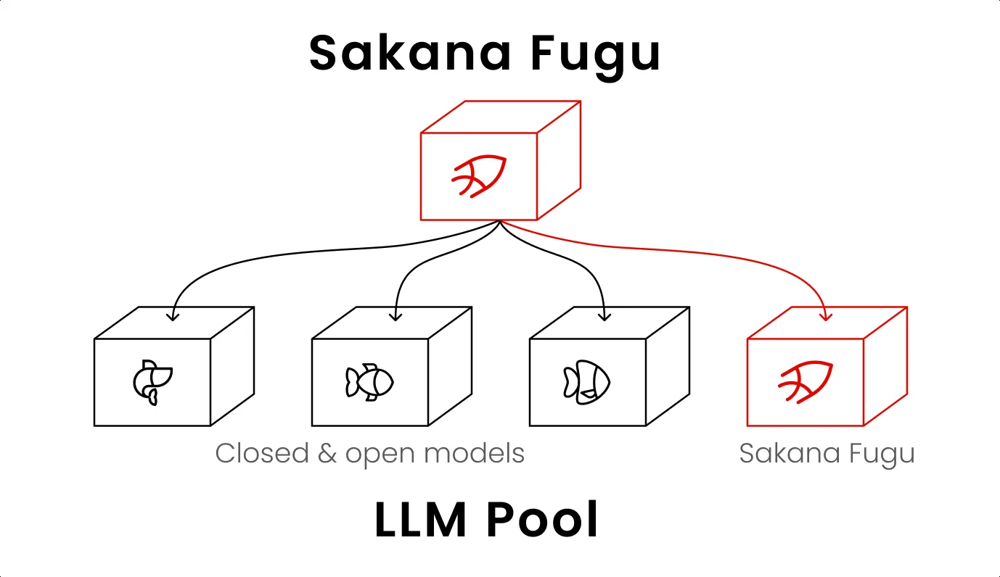
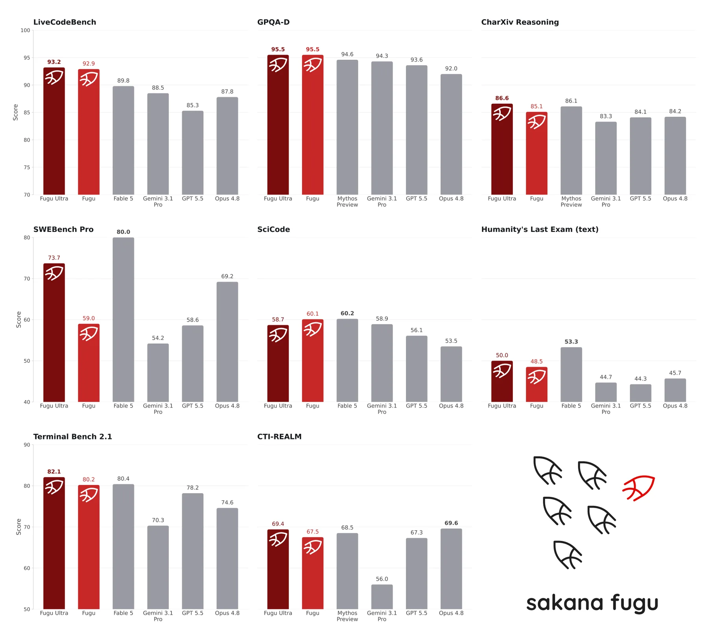
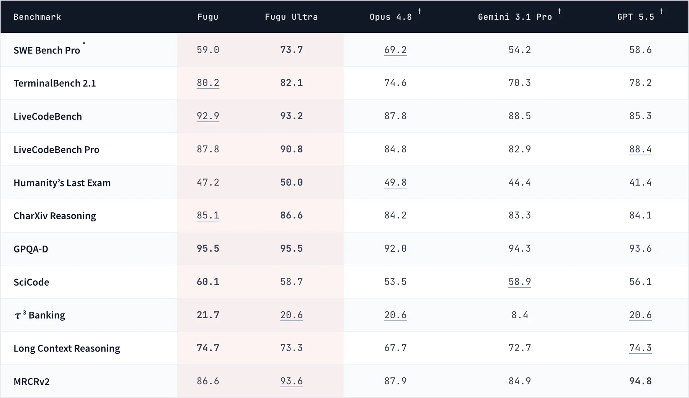
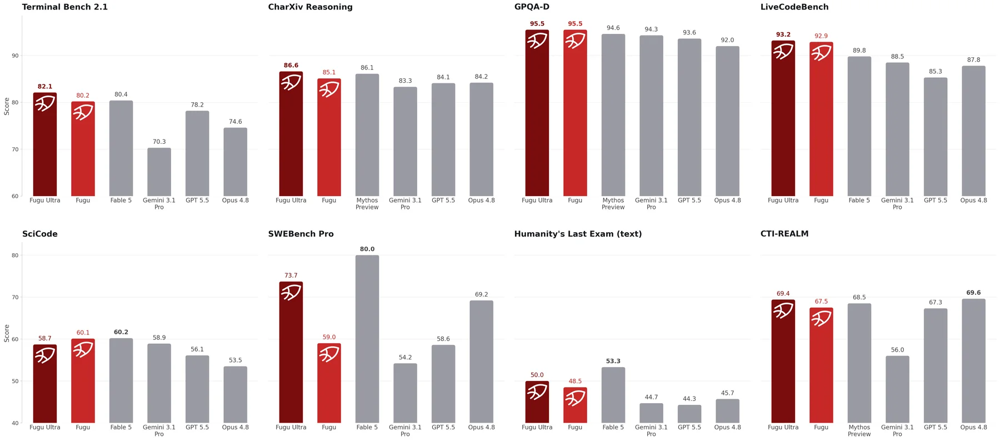

# Sakana Fugu Deep Dive: The Next Model Race May Be About Models That Orchestrate Models

Sakana AI released Sakana Fugu and Fugu Ultra on June 22, 2026. The official headline is blunt: **One Model to Command Them All**.

This is not a normal model launch. Fugu’s central claim is that a multi-model, multi-agent orchestration system can be packaged as one model API. From the outside, users call a single OpenAI-compatible endpoint. Inside the system, Fugu decides whether to answer directly, call other models, delegate work, verify intermediate results, and synthesize a final answer.

## One-Sentence Summary

**Sakana Fugu is not mainly claiming that one monolithic model is smarter than all others. It turns model selection, task delegation, verification, and synthesis into a trainable model capability. It moves part of the multi-agent runtime from application glue into the model interface itself.**

If this abstraction works, developers may increasingly integrate not just “a model,” but “a model that coordinates a model pool.”

## What Fugu Is

Sakana describes Fugu as a multi-agent system that behaves like a single model. A user sends a request to one endpoint, and Fugu decides how to handle it:

1. answer directly when the task is simple;
2. assemble expert models when the task is complex;
3. select models from an agent pool;
4. delegate subtasks to different agents;
5. verify intermediate work;
6. synthesize the final response.

The important part is that Sakana says Fugu is itself a language model trained to understand when to delegate, how agents should communicate, and how to combine their work into a reliable answer. The official diagram even shows Fugu calling closed and open models, plus recursive instances of itself.

This differs from a traditional agent framework. Usually developers write the router, planner, executor, critic, and verifier, then connect them with prompts and code. Fugu tries to learn those coordination strategies and expose them as a model-level capability.

## Two Models: Fugu and Fugu Ultra

The launch includes two models.

| Model | Official positioning | Good fit |
|---|---|---|
| Fugu | Balanced performance and low latency | Everyday work, Codex-like coding and review, chat services |
| Fugu Ultra | Maximum answer quality for hard problems | AI research, paper reproduction, cybersecurity analysis, literature and patent investigations |

Both are available through a single OpenAI-compatible API. The product page also says teams can opt specific agents out of the pool for data, privacy, compliance, or organizational requirements.

That is a practical detail. The enterprise problem with multi-model systems is not only whether they can call many models. It is which models are allowed to see which data. Without provider- and model-level exclusion controls, orchestration is hard to use in regulated workflows.

## Why Sakana Frames This as AI Sovereignty

The release is not only technical. It also makes a supply-chain resilience argument.

Sakana argues that organizations should not depend on one model vendor for critical work, especially in infrastructure, finance, and governance. API access may shift because of regulation, export controls, or foreign policy. The release uses the recent Anthropic Fable / Mythos access change as an example of how access can change quickly.

There is marketing in that framing, but it also reflects a real risk for agent products. Many teams currently bind their product capability to one vendor model:

- if pricing changes, the cost model changes;
- if rate limits change, reliability changes;
- if regional access changes, availability changes;
- if behavior changes, evaluations and prompts need repair;
- if a model is restricted or retired, production systems need emergency migration.

Fugu’s proposed answer is not to ask every customer to maintain a complicated router. It puts a learned orchestrator on top of a swappable agent pool. If a provider becomes unavailable, the system is designed to route around it.

The longer-term value is not avoiding one migration. It is turning model-supply resilience into a runtime capability.

## Benchmarks: Strong, but Read the Setup

Sakana’s official charts show Fugu Ultra approaching or beating several frontier baselines across LiveCodeBench, GPQA-D, CharXiv Reasoning, SWEBench Pro, SciCode, Humanity’s Last Exam, Terminal Bench 2.1, CTI-REALM, and other tasks.

There are several important caveats.

First, Sakana says scores for non-Fugu baselines come from model providers. For Fable 5 and Mythos Preview, when both scores are available on the same benchmark, the higher score is used.

Second, Fable 5 and Mythos Preview are not in Fugu’s agent pool because they are not publicly accessible. So the chart is not saying Fugu calls those models. It uses them as frontier comparisons.

Third, SWEBench Pro uses mini-swe-agent as the scaffolding. Agentic benchmark scores should not be read as pure bare-model ability; the harness is part of the system.

Fourth, Fugu is an orchestration model, and the underlying model pool can change. Its benchmark result is better understood as a point-in-time performance of the Fugu runtime, agent pool, and harness, not a static weight checkpoint with eternal behavior.

These caveats do not make Fugu less interesting. They show that this product category needs a different evaluation lens. We are comparing dynamic runtimes, not only single models.

## Fugu Is Not a Simple Ensemble

The release also includes a table comparing Fugu against the foundation models it uses underneath. The point is that Fugu is not merely averaging answers from multiple models. It aims to outperform underlying models on some tasks by coordinating, delegating, and synthesizing.

That is different from a standard ensemble.

Classic ensembles often use multiple answers, voting, reranking, or self-consistency. Fugu is closer to task-level coordination. Different agents may take planning, implementation, verification, search, explanation, or criticism roles. The collaboration pattern is not a fixed workflow hand-written by the user; it is something the model is trained to discover.

That is why Sakana anchors the product in two ICLR 2026 papers:

- **TRINITY** uses a lightweight evolved coordinator to assign Thinker, Worker, or Verifier roles across several turns.
- **Conductor** uses reinforcement learning to learn natural-language coordination strategies, communication patterns, and focused prompts.

Fugu looks like the productization of that research line: moving from “we can train coordinators” to “we can expose a coordinator as a model.”

## AutoResearch: Long-Horizon Work Is the Real Test

The most interesting evidence on the product page is not the ordinary benchmark grid. It is the AutoResearch case.

Sakana describes an AI agent autonomously improving a small GPT training recipe. Using AutoResearch, the agent repeatedly edits training code, runs experiments, and keeps only changes that reduce validation bits-per-byte. The run performed 123 experiments over roughly 14 hours on a single H100. Sakana reports that Fugu Ultra achieved the best mean BPB, 0.9774 ± 0.0019, ahead of Model C at 0.9781, Model B at 0.9793, and Model A at 0.9822. Its best single run reached 0.9748.

This kind of task says more about orchestration than a one-shot Q&A benchmark. It requires the system to:

1. understand the experimental goal;
2. modify code;
3. run training;
4. read metrics;
5. interpret failures;
6. try new hyperparameters;
7. maintain direction over many hours.

A single model may produce an excellent answer once. That does not mean it can conduct research iteration for 14 hours. Fugu Ultra’s claim is that when the task becomes long-running, open-ended, multi-step, and verification-heavy, orchestrating expert agents can be more reliable than calling one frontier model.

## Pricing Reveals the Product Problem

The product page describes pay-as-you-go and subscription plans. The more interesting part is the pay-as-you-go logic:

- when one agent is active, users pay the standard rate for that underlying model;
- when multiple agents are active, Sakana says model fees are not stacked; users are charged a single rate based on the highest-tier model involved;
- Fugu Ultra has fixed pricing for `fugu-ultra-20260615`;
- subscription tiers include both Fugu and Fugu Ultra.

This exposes a core problem for multi-agent products. If every internal agent call is billed as a visible stack of model fees, users cannot predict cost, and production adoption becomes painful. Fugu tries to wrap internal complexity in a more stable external pricing model.

That is inseparable from the API abstraction. A product cannot say “you only call one model” while exposing every internal agent cost as a raw implementation detail. Production-grade orchestration has to hide both technical complexity and cost complexity.

## What This Means for Developers

If products like Fugu work, the way developers integrate agentic capability may change.

The old path:

1. choose a primary model;
2. write a planner prompt;
3. connect search, code, browser, and other tools;
4. write a router;
5. write a verifier;
6. handle retries;
7. connect multiple providers for fallback.

The Fugu path:

1. call one OpenAI-compatible model;
2. let Fugu handle model orchestration;
3. use agent-pool controls for compliance boundaries;
4. evaluate at the task level instead of wiring every sub-agent by hand.

This does not remove application-level agent frameworks. Business systems still need permissions, tools, state, audit logs, files, databases, UI, and human acceptance. But if the model layer already knows how to orchestrate models, application agents can focus less on model routing and more on task state and safety boundaries.

## Risks and Open Questions

Fugu’s direction is important, but several risks need attention.

First, orchestration explainability. Users call one model, but the system may call multiple agents internally. Production users will need to know which providers saw data, why delegation happened, and which intermediate evidence was retained.

Second, benchmark reproducibility. Sakana already notes that many baseline scores are provider-reported, and agentic benchmarks depend on harnesses. Third-party reproduction, fixed agent-pool configurations, and more transparent evaluation traces would help.

Third, latency and cost. Fugu wraps a complex multi-agent system as one API, but complex tasks still require time and compute. The split between low-latency Fugu and quality-focused Fugu Ultra makes clear that this is not a free capability gain.

Fourth, security and data boundaries. Agent opt-out controls are useful, but enterprise users will also ask about logging, retention, regions, encryption, audit trails, and training-use policies.

Fifth, underlying model-pool drift. Fugu’s advantage comes from a swappable agent pool, but that also means behavior may shift as the pool changes. Versioning, regression tests, and task-level SLAs become important.

## Lessons for Agent Products

Fugu suggests three lessons for agent products.

First, **model selection can become a model capability**. We used to write routers in code. A trained orchestrator may increasingly learn the routing strategy.

Second, **multi-agent complexity does not have to be user-facing**. Users want a reliable result, not a transcript of ten agents talking to each other. Fugu’s single-model API is a strong UX claim.

Third, **AI sovereignty becomes architecture**. Swappable providers, controllable model pools, provider opt-out, and predictable pricing will become baseline expectations for enterprise agent runtimes.

This matters for systems like QCut, OpenClaw, and Hermes too. Application runtimes should not stop at a “model picker.” A more mature runtime will combine task type, data sensitivity, cost budget, latency target, reliability requirements, and provider availability into one scheduling layer.

## Conclusion

Sakana Fugu introduces a useful abstraction: **a model can answer questions, but it can also orchestrate other models.**

This does not replace progress in larger contexts, stronger coding models, or faster media generation. It points to another competitive layer: who can package the collective capability of many models, agents, and providers into an API developers trust.

If the last phase of model competition was mostly about scaling, Fugu is betting on orchestration. The practical questions become:

- who can pick the right model combination for a task?
- who can verify and revise over long-running work?
- who can preserve product availability when vendors change?
- who can compress multi-agent complexity into predictable API behavior, pricing, and compliance controls?

Fugu still needs more independent validation, but it brings an important question into focus: future agent runtimes may not depend only on one bigger brain. They may depend on a brain that knows how to organize many brains.
