# ByteDance Seed2.1 Deep Dive: Productivity Models Are Moving From Answers to Reliable Delivery

ByteDance Seed released the Seed2.1 series on June 23, 2026. The WeChat announcement is titled “Seed2.1 is officially released, going deeper into AI productivity.” Its subtitle is the real thesis: **Agent and coding capabilities have been broadly improved, with more stable delivery in complex scenarios.**

This is not just another score update. The center of the Seed2.1 story is not “one more benchmark went up.” It is about placing the model inside real productivity workflows: office work, research, repositories, GUIs, browsers, files, video, charts, long context, and tool use.

## One-Sentence Summary

**Seed2.1 pushes the model race from “can it answer intelligently?” toward “can it keep working through complex workflows, use tools, edit code, read materials, verify results, and deliver usable artifacts?”**

That is why the release keeps returning to agents, coding, computer use, visual agents, and Seed for Seed. These are not isolated features. They describe one direction: the model is moving from a chat surface into a workbench.

## What Seed2.1 Released

The launch centers on the Seed2.1 model series. The official page and WeChat article mainly discuss two usable variants.

| Model | Public positioning | Main use cases |
|---|---|---|
| Seed2.1 Pro | Stronger complex-task, agent, coding, and multimodal capability | High-value office work, complex consulting, software engineering, frontier research, multimodal understanding |
| Seed2.1 Turbo | More balanced production efficiency | Everyday agent workflows, tool use, multimodal tasks, coding assistance |

ByteDance says Seed2.1 is already available in Doubao and TRAE, while the API is also available through Volcano Engine. Users can select the “office task” mode in Doubao desktop or mobile, choose `Doubao-Seed-2.1-Pro` or `Doubao-Seed-2.1-Turbo` inside TRAE Work / TRAE IDE, or use the models in the Volcano Ark experience center.

That distribution matters. Seed2.1 is not only a research benchmark model. It enters ByteDance’s consumer product, developer tools, and cloud API from the start. In other words, it is placed inside a feedback loop between real usage and model iteration.

## The Point Is Delivery Surface, Not Leaderboard Theater

ByteDance frames Seed2.1 around three capability tracks:

1. more reliable general agent capability;
2. more stable code-engineering delivery;
3. stronger foundations across multimodal understanding, knowledge, reasoning, video, and long context.

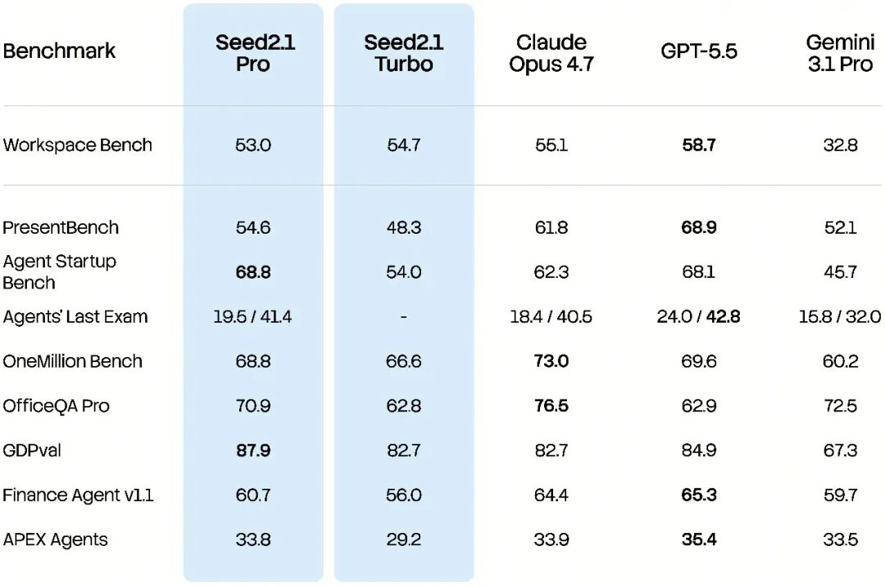

Those tracks look broad, but they point to the same product judgment: real productivity tasks are rarely single-turn Q&A.

An office task may involve reading materials, analyzing spreadsheets, producing slides, and writing an industry report. A software task may involve understanding requirements, locating code, changing several files, preparing the environment, and verifying the result. A visual task may begin with floor plans, screenshots, videos, or PDFs, and end as a webpage, code change, report, or interactive artifact.

So the real questions for Seed2.1 are not only whether it can answer a test question. They are:

- can it maintain the goal across multiple steps?
- can it move between files, web pages, code, GUIs, and tools?
- can it turn intermediate work into a final artifact?
- can it keep correcting after failure?
- can it connect vision, video, and long documents into the same task chain?

That is where agent products become hard. Prompts can make a model sound smart. Delivery needs planning, tools, state, verification, and recovery.

## General Agents: From Consulting to Office Delivery

The WeChat article emphasizes two scenarios: “high-economic-value work tasks” and “complex consulting scenarios in personal life.” The first covers document analysis, proposal design, content planning, and result organization. The second covers mixed inputs such as background context, historical records, industry reports, PDFs, and images.

This is not normal question answering. It is closer to a lightweight professional-service workflow.

ByteDance says Seed2.1 performs steadily on Workspace Bench, Agent Startup Bench, GDPval, Agents’ Last Exam, xDailyBench, Doubao Multi-Turn Bench, Toolathlon, and SeedClawBench. Workspace Bench focuses on retrieval, relational understanding, and result generation over complex work files. Agent Startup Bench evaluates quality in real AI-native startup scenarios. GDPval measures quality and economic value in real-world work tasks.

There is an important caveat: these scores come from official pages and the official article, and several benchmarks are new, internal, or self-developed. They are useful signals, but third-party reproduction, task samples, and harness details are still needed before treating them as general proof.

Still, the direction is clear. Model labs are starting to define “productivity” through task-level evaluations, not only knowledge, math, or small coding tests.

## Coding: From Writing Code to Repository-Level Delivery

Seed2.1’s coding story is not just code completion. ByteDance emphasizes end-to-end engineering delivery: requirement understanding, feature implementation, bug fixing, environment setup, and result verification.

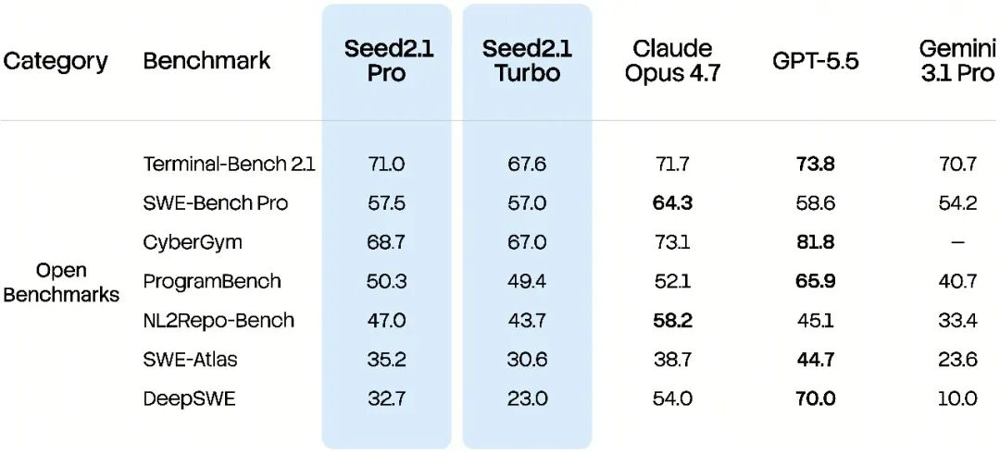

That matches the real bottleneck of coding agents. Users do not lack a model that can generate one function. The hard part is whether the model can enter an existing repository, understand architecture, dependencies, business logic, and test paths, then make maintainable multi-file changes.

In the official table, Seed2.1 Pro scores 47.0 on NL2Repo-Bench, while Seed2.1 Turbo scores 43.7. On Terminal Bench 2.1, they score 71.0 and 67.6. On SWE-Atlas, they score 35.2 and 30.6. The WeChat article also says that in a crowdsourced developer evaluation, Seed2.1 Pro achieved a 59.1% win rate over Claude Opus 4.6.

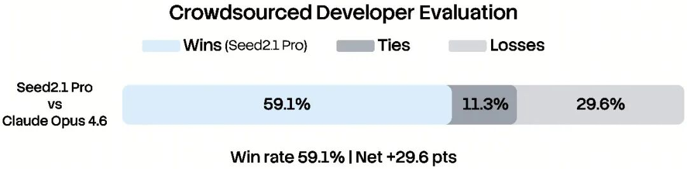

Crowdsourced engineering evaluations are closer to user perception than static coding problems because they judge final completion quality. They are also harder to reproduce: task selection, repository size, evaluator preference, tool environment, and test setup all matter.

Seed2.1 Preview also appeared on Code Arena: Frontend with a score of 1539, ranking eighth overall, and entered the top 10 in five of seven frontend subcategories.

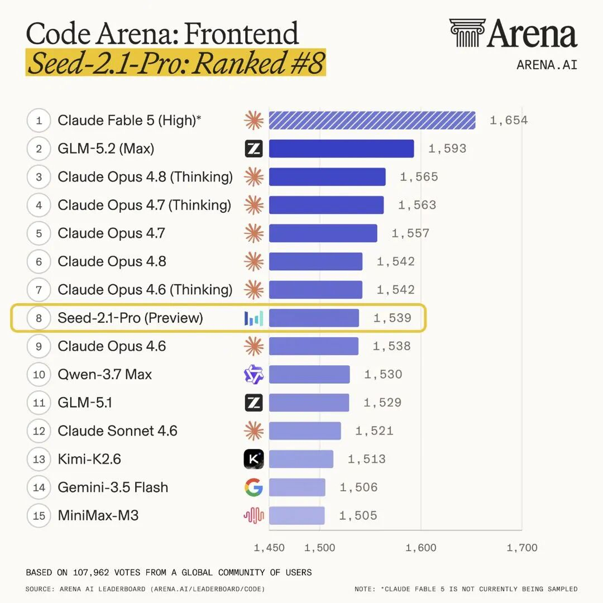

That signal is worth watching. Frontend work is a useful test of “deliverable” rather than merely “compilable”: layout, visual consistency, interaction states, mobile behavior, component hierarchy, and asset loading all affect human preference.

## Computer Use: Agents Need to Switch Between UI and Tools

Seed2.1 explicitly discusses the general-purpose Computer-Use Agent direction.

This is important because many real workflows do not live inside one API. They happen across multiple surfaces: browsers, search, spreadsheets, slides, design tools, repositories, chat windows, mobile apps, and external SaaS products. If a model can only call fixed tools, it gets stuck at product boundaries. If it can only look at screens and click, it becomes slow and brittle.

The WeChat article says Seed2.1 achieved the highest score on MobileWorld, remained competitive on OSWorld, and used reinforcement learning to guide agents to choose between GUI and non-GUI action spaces, reducing average task-completion steps by 16%. It also describes CreativeWork as covering Notion, Canva, and Figma to evaluate collaboration between GUI actions and MCP tools.

The lesson for agent runtimes is direct: GUI operation and tool use are not alternatives. Mature systems need models that can switch execution spaces. Click the UI when that is best. Call structured tools when available. Read files when needed. Write code when the task requires it.

## Multimodality Is Not an Add-On. It Is the Agent Input Layer

Seed2.1’s multimodal section covers visual understanding, spatial understanding, long context, multi-page materials, video understanding, streaming video, and multilingual knowledge.

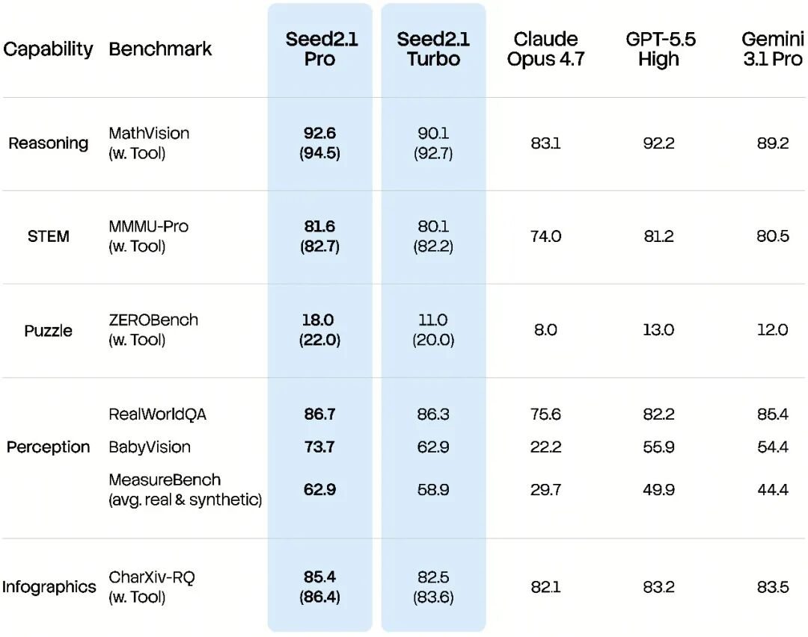

In the official table, Seed2.1 Pro scores 92.6 on MathVision, or 94.5 with tools; 81.6 on MMMU-Pro, or 82.7 with tools; 85.4 on CharXiv-RQ, or 86.4 with tools; and 78.3 on MMLongBench-128K.

These capabilities matter for agents because real materials are not pure text. PDFs, screenshots, charts, floor plans, process diagrams, videos, meeting recordings, design mockups, and scanned reports all carry task-critical information. If the model misreads those inputs, the plan, code, and report that follow will be built on wrong evidence.

Video understanding follows the same logic. The official table lists Seed2.1 Pro at 89.2 on VideoMME, 79.5 on TOMATO, 70.7 on Minerva, and 80.7 on OVOBench.

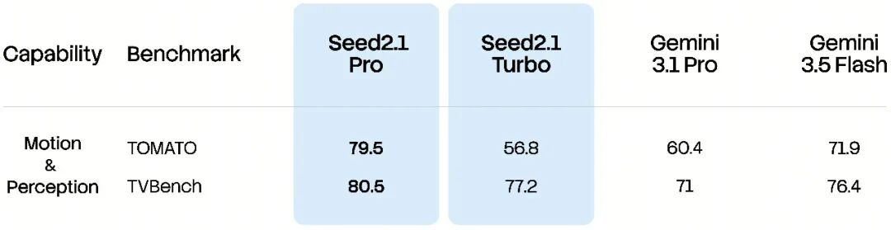

These capabilities will enter more productivity scenarios: meeting review, long-video search, film and drama editing, workflow replay, monitoring analysis, and teaching-content extraction. Multimodality is no longer just image captioning. It is the input layer for agents.

## Seed for Seed: Models Join Model Development

One of the most interesting parts of the release is Seed for Seed.

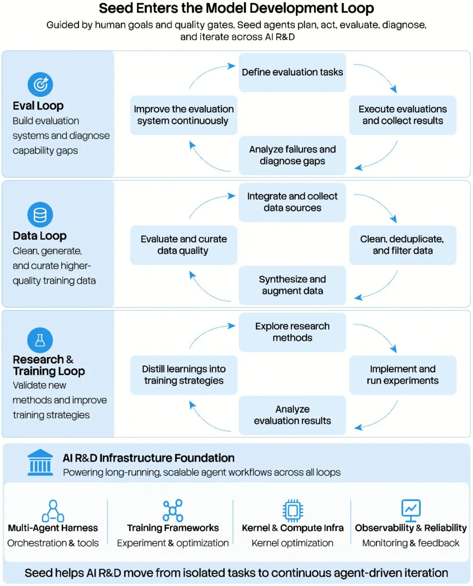

ByteDance says Seed2.1 participates as an agent in evaluation-system construction, capability diagnosis, SFT data synthesis, RL training-framework optimization, and turning new research-paper methods into code and experiments. Some tasks run for hours, more than ten hours, or even tens of days. Multiple agents can divide work across execution, evaluation, diagnosis, and optimization.

That points to a deeper trend: the model is not only a product capability. It is becoming part of the model-development workflow.

If that loop works, model development starts to look more self-bootstrapping:

1. models help build evaluations;
2. models analyze their own weaknesses;
3. models synthesize or clean training data;
4. models modify training and evaluation code;
5. models run experiments and read results;
6. human researchers choose directions and validate quality.

This does not remove researchers. It changes their leverage. Humans spend less time pushing every experimental detail by hand and more time setting goals, checking evidence, constraining risk, and judging whether results are meaningful.

## What Product Teams Should Take From This

The lesson from Seed2.1 is not “switch models immediately.” It is that productivity-agent evaluation needs to change.

Teams used to choose models with three rough categories: QA ability, coding benchmarks, and price/latency. That is no longer enough. The real evaluation target is the task chain:

- given a set of materials, can it read them correctly?
- given a goal, can it plan?
- given a tool environment, can it choose the right action?
- given a repository, can it make runnable changes?
- given a failed result, can it diagnose and repair?
- given a long-running task, can it stay on track?
- given privacy and permission boundaries, can it stay within them?

That also means application-level agents cannot stop at a model dropdown. They need task state, tool permissions, a file system, audit logs, replayable traces, cost control, failure recovery, and human acceptance.

If Seed2.1 is used only as a chat model, its value will be underestimated. The real test is whether it reduces rework and human takeover when placed inside TRAE, office tasks, Volcano APIs, and internal research workflows.

## Risks and Open Questions

First, official benchmarks need external reproduction. This is especially true for GDPval, SeedClawBench, CreativeWork, MSQA, Seed for Seed, and other internal or newer evaluations. Task samples, scoring rules, and third-party replications would make the claims much stronger.

Second, agent delivery depends on the harness. Model scores are not product experience. File permissions, browser environment, code executor, MCP tools, recovery logic, logs, and UI all affect final quality.

Third, cost and latency need real testing. Long-horizon work, video understanding, repository-level changes, and multi-tool execution usually increase token, compute, and waiting costs. The Pro/Turbo split makes clear that quality and efficiency still trade off.

Fourth, enterprise adoption is not only about capability. Data retention, permission isolation, auditability, regions, private deployment, log visibility, and training-use terms will decide whether the model can enter core workflows.

Fifth, evaluation is fragmenting. Teams should not let one leaderboard drive decisions. They need their own regression suite built from real tickets, real repositories, real materials, and real acceptance criteria.

## Conclusion

Seed2.1’s core signal is simple: **AI productivity models are moving from answering to delivering.**

That path is harder than single-turn chat because it asks the model to maintain task state across complex inputs, tools, repositories, GUIs, videos, and long contexts. It is also closer to what enterprises and professionals actually pay for: less manual switching, less rework, and more stable deliverables.

For developers and product teams, the most important part of Seed2.1 is not one score. It is the way ByteDance places agents, coding, computer use, multimodality, and model-development automation on the same productivity map.

The next model race will increasingly ask:

- who can keep working through longer workflows?
- who can combine tool calls and GUI actions reliably?
- who can turn vision, video, and documents into executable task state?
- who can deliver runnable changes inside real repositories?
- who can make models participate in their own research loop?

Seed2.1 still needs more third-party validation, but the direction is clear. The next phase of AI productivity will not be judged only by how well a model talks. It will be judged by how much work the user still has to redo after the model says it is done.

## Media Archive

The following images are from the original WeChat article and have been saved locally to avoid external link rot:

- 
- 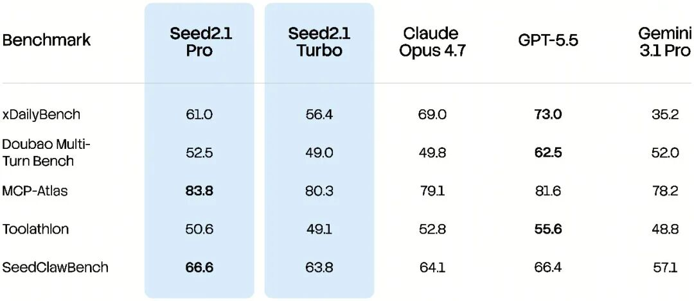
- 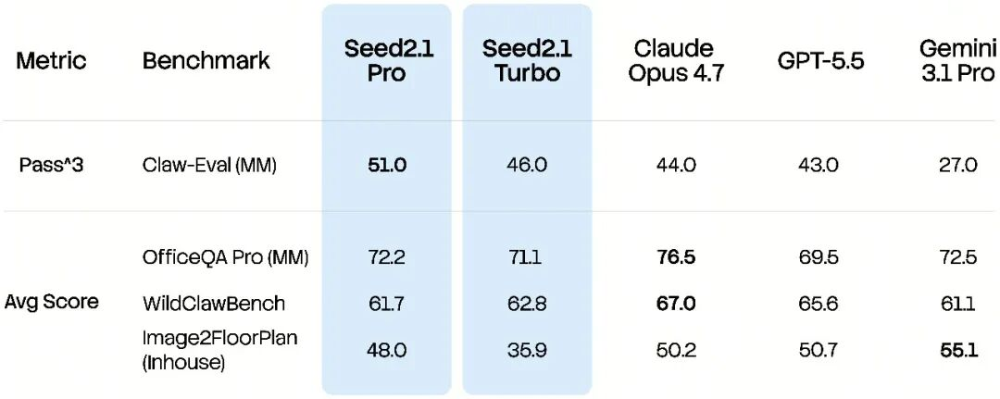
- 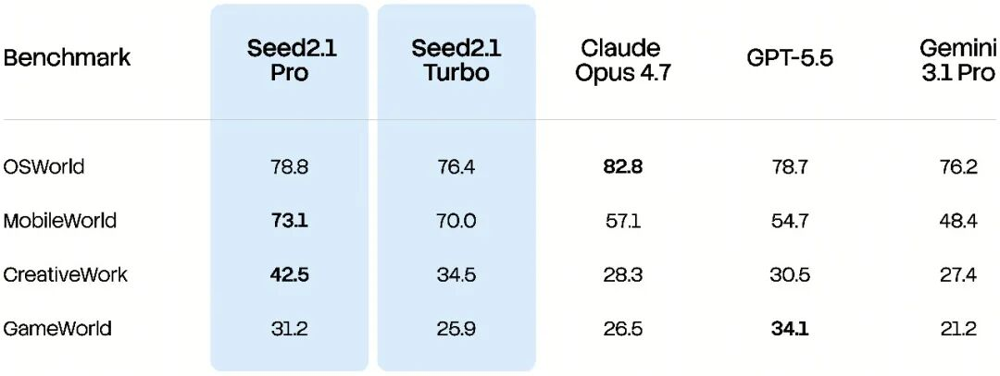
- 
- 
- 
- 
- 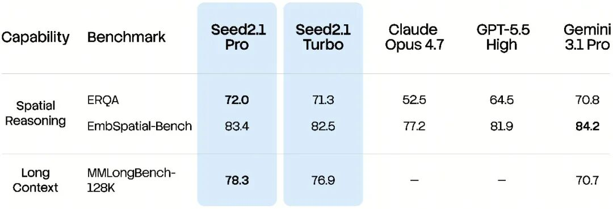
- 
- 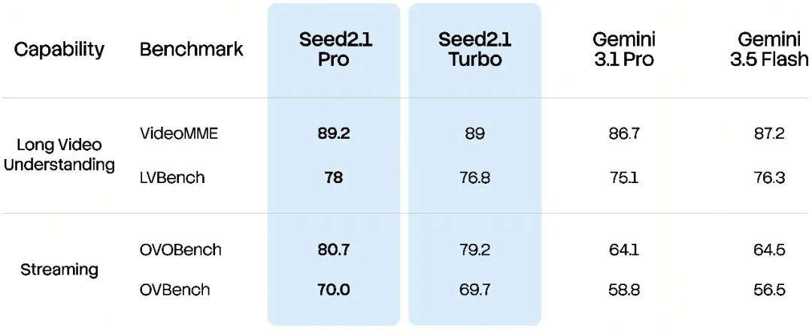
- 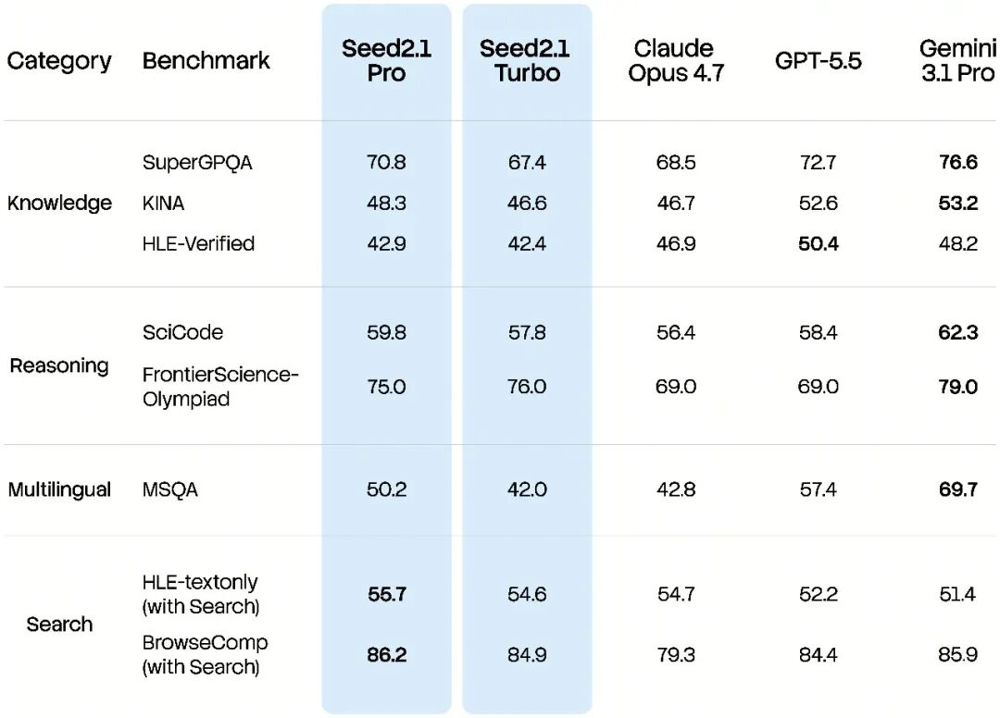
- 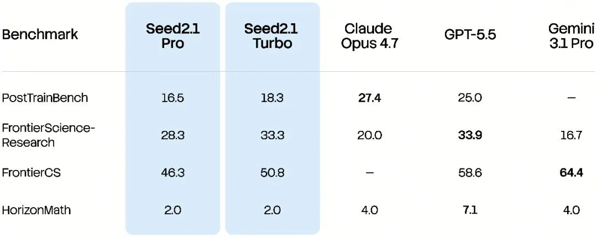
- 
