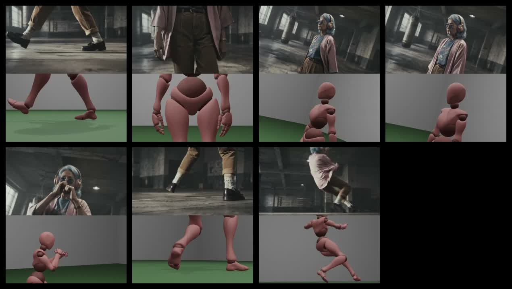
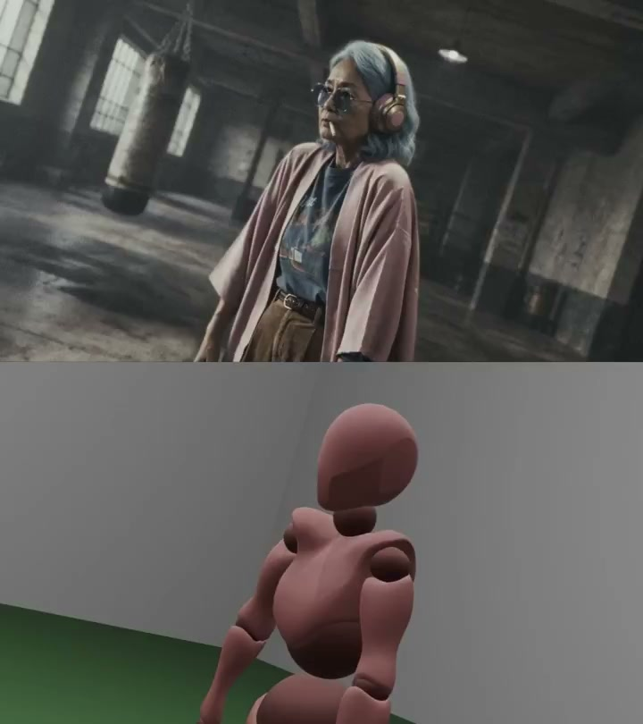
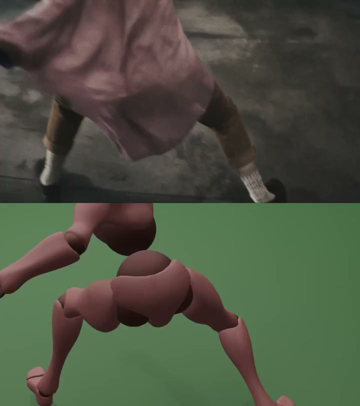

# AIWarper Seedance Ref Video 工作流拆解：AI 视频动作控制，正在从写 Prompt 变成制作动作参考

A.I.Warper 在 X 上发布了一条 Seedance ref video 工作流教程，主题很具体：用参考视频驱动动画动作。主帖发布于 2026-06-24 18:18:59 UTC，对墨尔本时间是 2026-06-25 04:18:59。

这条短视频的价值不在于成片有多炫，而在于它把 AI 视频控制拆成了一个更可执行的生产动作：上半屏是目标人物/镜头，下半屏是简化 3D 人偶动作参考。模型不是只读一句“让角色跳起来”，而是被喂入一个可观察的动作轨迹。

## 一句话概括

**这个工作流说明，AI 视频的动作控制正在从“用文字描述动作”，走向“先制作一个可读的动作参考，再让视频模型迁移动作、姿态和节奏”。**

这听起来像一个小技巧，但它其实代表 AI 视频工作流的一次重心变化：Prompt 不再承担所有控制职责。文字负责意图和风格，参考图负责身份和构图，参考视频负责运动。

## 这条 X 帖到底展示了什么

主帖文本很短：它说这是一个用 Seedance reference videos 驱动动画的 workflow tutorial，并提醒这类尝试可能更频繁触发 moderation。

视频本身更关键。画面是上下分屏：

- 上半屏：一个风格化角色在室内空间里行走、转身、做拳击防守姿态、跳跃；
- 下半屏：一个低细节 3D 人偶在简化场景里做相同或近似的运动；
- 两者在时间上同步，显示参考视频更像动作蓝图，而不是最终视觉风格来源。

这个设计的关键是“降低参考源的视觉负担”。3D 人偶不需要好看，也不需要材质精细。它只需要把姿态、重心、方向、镜头相对关系和动作节奏表达清楚。

## 为什么 reference video 比 Prompt 更适合控制动作

很多 AI 视频失败，不是因为提示词不够优美，而是因为动作本身太难用语言稳定编码。

比如“角色向前走两步后转身，再举手做防守姿态”，文字可以描述，但模型需要自己补全大量细节：

1. 左右脚如何交替；
2. 重心如何转移；
3. 头、肩、手臂和腰部如何配合；
4. 镜头是否跟随；
5. 动作速度如何分布；
6. 角色是否保持体积和身份一致。

这些信息在视频里天然存在。参考视频把动作从抽象语言变成时序信号。模型不需要凭空想象“跳跃是什么”，而是可以从参考里读取起跳、腾空、转体、落地的节奏。

这就是为什么 ref video 工作流更像动画制作里的 previs 或 blocking。它不是最终画面，而是告诉模型：这个镜头里身体应该怎么动。

## 参考视频的真正作用：把运动拆出去

Seedance 2.0 官方页面强调，它支持 text、image、audio、video 输入，并支持把 images、audios、videos 作为 references，用于控制 performance、lighting、shadow 和 camera movement。

AIWarper 这条教程把这句话落到一个更具体的创作动作上：**把运动控制从文字 prompt 中拆出来，交给一个简化视频参考。**

一个更稳定的工作流可以拆成四层：

| 控制层 | 最适合的输入 | 作用 |
|---|---|---|
| 身份/造型 | 角色图、关键帧、风格参考 | 锁定人物、服装、材质、脸部和美术方向 |
| 空间/构图 | 起始帧、场景图、镜头草图 | 约束位置、景别、场景关系 |
| 动作/节奏 | 参考视频、3D blocking、真人动捕草稿 | 约束姿态变化、步态、跳跃、镜头运动 |
| 意图/边界 | 文字 prompt | 解释动作目的、镜头情绪、风格限制和不要做什么 |

过去很多创作者把这四件事都塞进 prompt。结果就是 prompt 越写越长，模型却仍然可能误解动作。ref video 的意义是把最难写清楚的“时序运动”换成模型更容易读取的视觉证据。

## 为什么 3D 人偶是好参考源

这条视频里最聪明的地方，是参考层并没有用复杂真人素材，而是用了低细节 3D 人偶。

3D 人偶有几个优势：

- **动作干净**：身体关节、朝向和重心更容易读；
- **风格中立**：不会把真人脸、服装、IP 或背景纹理带进最终画面；
- **可重复调参**：动作不对可以回到 Blender、Cascadeur、Mixamo、Unreal 或其他 3D 工具里重摆；
- **镜头可控**：可以输出固定机位、移动机位、俯仰角和焦段变化；
- **版权风险较低**：比直接拿电影片段、明星素材或游戏镜头做 reference 更稳。

这其实是 AI 视频创作里越来越重要的原则：**参考源不一定要漂亮，但要干净、可读、可控。**

对于动作参考来说，干净比精美重要。一个漂亮但信息混乱的视频，可能会把模型带偏；一个朴素但动作明确的人偶视频，反而更适合作为控制输入。

## 可复用 SOP：怎么做这种 ref video workflow

如果把 AIWarper 的演示抽象成 SOP，可以是这样：

1. 先确定镜头目标：角色要走、转身、挥手、跳跃还是攻击；
2. 用 3D 人偶或简单动捕素材做 blocking；
3. 把参考视频剪短，只保留一个清晰动作；
4. 减少视觉噪声：简单背景、清晰轮廓、明确肢体；
5. 输出与目标镜头相近的构图和机位；
6. 在 Seedance 中上传角色/风格参考和动作参考；
7. Prompt 只补充身份、场景、情绪、镜头意图和限制；
8. 出片后检查动作、身份、画面稳定性和 moderation 状态；
9. 如果动作偏了，先改参考视频，而不是先把 prompt 写长。

这最后一点很重要。很多 AI 视频工作流的问题，是创作者把所有失败都归因于 prompt。实际上，动作失败时，最应该优先检查的是参考源：动作是否太复杂、镜头是否太晃、人物是否太小、动作是否被遮挡、是否混入了模型不该继承的纹理和背景。

## Moderation 是这条工作流的硬边界

AIWarper 在主帖里明确提醒，使用这类参考视频时可能更常撞到 moderation。更早一条相关帖还说，Seedance ref videos 对“干净”的输入效果更好，但如果系统把输入推断成 violence，就可能被拒。

这说明 reference video 工作流有一个现实限制：视频参考不仅传递动作，也会被安全系统理解为内容证据。

一个拳击防守姿态、跳跃、追逐、摔倒或武打 blocking，本来可能只是动作测试，但模型和审核系统可能把它识别成暴力、危险或敏感行为。越是动作明确的参考，越可能被 moderation 系统当成需要判断的对象。

因此，创作者需要把安全边界设计进 SOP：

- 避免使用真实暴力、武器、血迹、伤害后果作为参考；
- 用抽象人偶、运动训练、舞蹈或体育动作替代敏感语义；
- Prompt 中明确非伤害、非写实暴力、非现实人物；
- 保留多个安全版本的 reference video；
- 把“被拒概率”纳入生产排期。

这里不是简单抱怨限制。对于商业创作来说，moderation 是生产系统的一部分。一个工作流如果经常被拒，就算偶尔效果好，也会影响交付稳定性。

## 对 AI 视频产品的启发

这条短教程对 AI 视频产品有几个直接启发。

第一，产品应该把 reference video 当成一等输入，而不是藏在高级选项里。动作控制是 AI 视频的核心痛点，应该有专门的上传、裁剪、预览和权重控制。

第二，工具需要区分参考类型。角色 reference、场景 reference、动作 reference、镜头 reference、音频 reference 不应该都混在一个“上传素材”入口里。创作者需要告诉模型：这段视频只学动作，不学脸；这张图只学服装，不学构图；这个音频只学节奏，不学内容。

第三，产品需要给出 moderation 反馈。只说“blocked”对创作者没有帮助。更好的体验是指出问题来自哪类输入：文字、参考图、参考视频、人物相似度、动作语义，还是组合后的风险。

第四，AI 视频工具会越来越接近导演工作台。未来的控制界面可能包括 3D blocking、时间线、参考轨道、镜头轨道、角色锁定、动作权重和审核预检，而不是一个大文本框。

## 对创作者的启发

这条工作流最适合以下场景：

- 角色走位；
- 武术/舞蹈/运动的非敏感动作测试；
- 镜头运动预演；
- 多镜头动画短片；
- 游戏动作或虚拟角色宣传片；
- 需要保持同一动作节奏的风格化重绘。

不适合的场景也要说清楚：

- 动作含义高度敏感；
- 参考视频里有真实人物肖像或受版权保护素材；
- 参考源太复杂，背景和动作混在一起；
- 需要非常精确的物理接触；
- 项目无法承受多次 moderation 失败。

换句话说，这不是万能按钮。它更像一种“动作控制层”。当动作是主要变量时，它很强；当 legal、safety、identity、physics 都同时高风险时，它会变得不稳定。

## 结论

AIWarper 这条 Seedance ref video 教程的核心价值，是把 AI 视频制作从 prompt craft 推向了 production craft。

Prompt 仍然重要，但它不应该负责所有事情。更可靠的方式是把视频生成拆成多个可控输入：角色图锁身份，场景图锁空间，3D blocking 锁动作，文字锁意图，最后用模型合成风格化成片。

这和传统动画、电影预演、游戏过场动画的逻辑很接近：先把动作和镜头设计清楚，再做最终画面。

未来 AI 视频创作者的能力差异，可能不会只体现在谁会写更漂亮的提示词，而会体现在谁能更快制作干净的 reference assets：动作参考、镜头参考、构图参考、角色参考和安全版本。

Seedance ref video 的真正启发是：**当模型开始能读视频参考，创作者就不只是 prompt writer，而会重新变成导演、动画师和 pipeline designer。**
