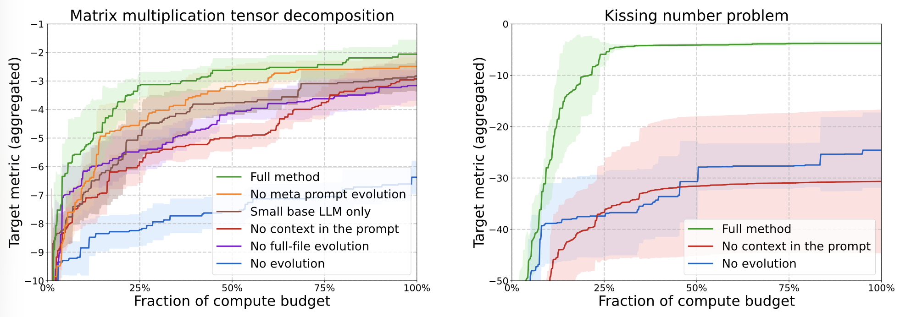

# Lilian Weng Harness Engineering 拆解：Agent 的下一层竞争，不是 Prompt，而是可进化的 Harness

> **TL;DR:** Lilian Weng 这篇《Harness Engineering for Self-Improvement》最值得抓住的不是“又一个 agent 综述”，而是一个更硬的判断：当 agent 的上下文、工具、文件系统、子任务、验证器和权限都由代码组织起来，harness 本身就变成了可优化对象。你给的 `Evolutionary Search` 小节尤其关键，因为它把 Promptbreeder、GEPA、AlphaEvolve、ShinkaEvolve、Darwin Gödel Machine 串成一条线：未来的 agent 改进不只靠人手写提示词，而是让模型在可评测的沙盒里修改自己的工作流代码。

- **Source:** [Lilian Weng, “Harness Engineering for Self-Improvement”](https://lilianweng.github.io/posts/2026-07-04-harness/)
- **Anchor:** [Evolutionary Search](https://lilianweng.github.io/posts/2026-07-04-harness/#evolutionary-search)
- **Published:** 2026-07-04
- **Topic:** harness engineering / recursive self-improvement / evolutionary search / coding agents
- **Tags:** Lilian Weng / Harness Engineering / Agent / Evolutionary Search / AlphaEvolve / Self-Harness / DGM

## 一句话概括

**Agent 的下一层能力差异，正在从“模型会不会想”转向“外部系统能不能把想、做、记、测、改组织成一个可搜索的程序”。**

这句话听起来像工程管理问题，但它其实正好落在 recursive self-improvement 的近端版本上。模型直接改自己的权重很难、很危险、也很慢；但模型改自己的 harness，也就是改它如何使用上下文、工具、文件、子 agent、验证器和回滚机制，已经是今天能落地的工程问题。

Lilian Weng 的文章把这件事整理得很清楚：harness 不再只是 `LLM + tools + memory` 的薄壳，而是一个决定 agent 如何观察、行动、保存状态、评估结果和继续迭代的运行时。它接近一个小型操作系统：把复杂内部机制封装起来，对模型暴露相对简单的接口。

## 为什么 evolutionary search 是这篇里最关键的小节

用户给的链接直接指到 `#evolutionary-search`，这个锚点很准。

因为前面几节讨论的是 harness 的组成：workflow automation、file system memory、sub-agent、context engineering、workflow design、self-harness。到了 evolutionary search，问题变了：

> 既然 harness 是代码，能不能把 harness 当作候选程序群体来进化？

这一步很重要。传统 prompt engineering 的优化对象通常是自然语言模板；workflow engineering 的优化对象是流程图；self-harness 的优化对象是有限可编辑的配置或代码片段；而 evolutionary search 把候选方案放进一个更大的搜索空间：程序、提示词、元提示词、评测器、上下文结构、工具调用策略，都可以在某种边界内被生成、评估、筛选和保留。

换句话说，agent 不只是执行任务，它开始搜索“如何更好地执行任务”的程序。

## 从 Promptbreeder 到 AlphaEvolve：优化对象越来越接近程序

这条线可以这样看：

| 方法 | 优化对象 | 关键变化 |
|---|---|---|
| Promptbreeder | 任务 prompt 和 mutation prompt | 连“如何改 prompt 的 prompt”也一起进化 |
| GEPA | prompt + 轨迹反思 | 用失败和成功轨迹生成自然语言更新 |
| AlphaEvolve | 候选程序 + diff + evaluator | 用 coding agent 生成代码改动并自动评测 |
| ShinkaEvolve | 候选程序群体 + novelty / sampling 策略 | 提高采样效率，避免全体变成同一种解法 |
| Darwin Gödel Machine | agent harness codebase | 允许 agent 修改自己的 harness 仓库 |

前两类仍然更像 prompt 优化。AlphaEvolve 往后，优化对象明显变成可执行程序。Lilian 文中提到，AlphaEvolve 维护候选程序池，让冻结的 LLM 生成 diff，再通过 evaluator 评估 child program，把成功候选留下来。它还会让 meta-prompt 随着指令和上下文一起演化。

这个结构对 agent 产品很有启发：如果你的 agent 行为可以被表示成代码，且有足够快、足够客观的评测器，那么它就不一定只能靠工程师手动调优。它可以进入“生成候选 -> 运行 -> 评分 -> 保留 -> 再变异”的循环。

原文里的 AlphaEvolve 消融图也提醒了一点：进化循环不是单一技巧。上下文放什么、meta-prompt 是否演化、是否允许 full-file evolution、使用多强的 LLM，都会影响搜索效果。换到 harness 场景，这意味着“让 agent 自己改 harness”不是一个按钮，而是一整套搜索系统设计。

## AlphaEvolve 的真正启发：别让模型自由改世界，要让它改可评测的块

AlphaEvolve 里一个非常工程化的细节是，待改进区域会被显式标记，例如用 `EVOLVE-BLOCK` 这类边界限定可编辑代码。这个设计比“让模型随便改 repo”可靠得多。

对 agent harness 来说，这个原则可以直接复用：

- 可编辑：context 压缩策略、工具选择策略、retry 规则、子任务拆分模板、日志摘要格式；
- 不可编辑：权限边界、审计系统、生产凭证、真实用户数据、评测集答案、沙盒逃逸相关代码；
- 必须回归测试：已有通过任务、held-out 任务、成本上限、工具调用上限、安全策略；
- 必须记录：每次候选修改的 parent、diff、score、失败原因、回滚状态。

这也是“可进化 harness”和“危险自修改系统”的分界线。前者修改的是受控搜索空间；后者把系统边界也交给优化循环。

## Meta-Harness 和 Self-Harness：更像真正的 agent 产品路线图

Lilian 在 evolutionary search 之前还讨论了 Meta-Harness 和 Self-Harness。它们对产品落地更贴近，因为它们不是单纯追求某个算法题最优，而是在问：一个 agent 失败之后，能不能自动定位失败模式，并提出有限、可验证的 harness 修改？

Self-Harness 的三段循环非常值得借鉴：

1. weakness mining：从执行轨迹和 verifier 结果中挖失败模式；
2. harness proposal：只针对可编辑表面提出 bounded edits；
3. proposal validation：用 held-in 和 held-out 分割做回归验证，通过才合并。

这比“让模型反思一下自己哪里错了”严谨很多。因为它把反思落到结构化证据里：失败不是一句“我应该更小心”，而是被聚类成可重复出现、能被验证器观察到、能被窄修改修复的机制问题。

对 coding agent 来说，可能的失败模式包括：

- 总是忘记跑特定测试；
- 长任务中上下文摘要丢失关键约束；
- 遇到 flaky test 时过早宣布成功；
- 文件搜索范围太窄，漏掉调用链；
- 子 agent 输出没有落盘，主线程恢复后无法复盘；
- 修改权限过宽，把与任务无关的文件也改了。

这些都不是单条 prompt 能稳定解决的问题。它们需要 harness 层的日志、状态、权限、工具协议和验证流程一起改。

## DGM：固定模型也能靠 harness 进化提升

Darwin Gödel Machine 是这条线里最直接触碰“自我修改”的例子。Lilian 的概括是：DGM 面向一个可编辑的 harness-code repository，让 LLM-based coding agent 修改自己的 harness。循环大致是：

1. 从一个 coding agent 开始；
2. 按性能和已有子代数量选择 parent；
3. 让 parent 读自己的 benchmark log，并修改自身 harness 代码；
4. 评估新 agent；
5. 只有高分候选进入 pool。

最值得注意的是，这不是“换一个更强模型”。Lilian 文中提到，DGM 在固定 base LLM 的前提下实验，例如 Claude 3.5 Sonnet，并通过进化出来的 agent 在 SWE-bench Verified 和 Polyglot 上获得明显提升。这里的信号很重要：模型能力是一层，harness 能把同一个模型释放到不同程度。

这也解释了为什么 Claude Code、Codex、Cursor、OpenCode 这类产品即使用相近模型，体验仍会拉开。差异不只在模型，而在模型之外的运行时。

## 但 evolutionary harness 只适合“可评测”的地方

这类方法最容易奏效的地方有一个共同点：候选答案可以被自动评分。

例如：

- 代码修复：测试通过率、benchmark 分数、静态检查；
- GPU kernel：正确性和速度；
- 算法竞赛：输出正确性、复杂度；
- 调度优化：成本、延迟、吞吐；
- 数据处理：可复现指标和约束。

它不太适合直接优化“研究品味”“产品体验”“长期可维护性”这类慢反馈、模糊反馈和高度依赖人类判断的目标。Lilian 在 Future Challenges 里也强调了 evaluator 模糊、diversity collapse、reward hacking、长期成功目标、human oversight 等问题。

这给产品设计一个很实际的边界：不要幻想所有 agent 行为都能自动进化。应该先把能客观评测的局部放进进化循环，把模糊和高风险决策留给外部评审、人类审核或更慢的治理流程。

## 一个可落地的 harness evolution 架构

如果要把这篇文章变成工程方案，我会把系统切成五层：

| 层 | 职责 | 能否被进化 |
|---|---|---|
| Task sandbox | 运行任务、隔离文件、限制网络和凭证 | 否 |
| Evaluator | 测试、评分、回归、成本和安全检查 | 只能人工或受控更新 |
| Harness editable surface | context、workflow、tool policy、subagent policy、logging | 是 |
| Candidate archive | parent、diff、score、trace、失败原因、回滚记录 | 是，作为搜索记忆 |
| Governance layer | 权限、审计、发布门禁、人类确认 | 否 |

这里最容易犯的错误，是让 evaluator 和 permission control 也被同一个优化循环修改。那样系统会自然学会“让自己更容易得高分”，而不是更可靠地完成任务。

更稳的设计是：harness 可以进化，但裁判和边界要在环外。

## 对我们理解 Agent 的意义

Lilian 这篇文章把过去几个月很多零散讨论压到一个统一框架里：context engineering、loop engineering、workflow design、self-improving agents、coding-agent benchmarks、evolutionary program search，其实都在围绕同一个问题旋转：

**模型之外的系统，如何成为智能的一部分？**

过去我们经常把 harness 当作产品包装层：好一点的 UI、更多工具、更长上下文、更方便的文件系统。现在需要换个看法。Harness 是 agent 的外部认知器官：它决定模型看见什么、记住什么、能做什么、怎么验证、如何从失败中更新。

这也是为什么“Prompt 会不会死”这个问题本身有点偏。Prompt 的重要性会下降，但目标、约束、上下文、验证、权限和状态管理不会消失。它们只是从一段自然语言，迁移到更结构化、更可执行、更可评测的 harness 里。

## 结论

`Evolutionary Search` 小节真正给出的信号是：agent 的优化对象正在升级。

从 prompt，到 context，到 workflow，到 harness code，再到 optimizer code，优化对象越往后，越接近一个完整的软件系统。模型不再只是被调用的函数，而是参与改进调用它的系统。

但这条路不能靠浪漫的“自我改进”叙事推进。它需要很朴素的工程边界：可编辑区域、自动评测、held-out 回归、候选档案、权限隔离、人工门禁。没有这些，进化搜索很容易变成 reward hacking；有了这些，它可能成为下一代 agent 产品最重要的调参方式。

这篇文章最有价值的提醒是：真正的 agent 竞争，可能不是谁的 prompt 更漂亮，而是谁能把 harness 做成一个能学习、能验证、能回滚、能持续进化的运行时。
