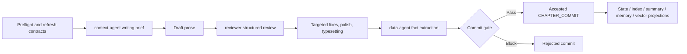

# webnovel-writer Deep Dive: Long-Form AI Writing Needs a Story Commit System, Not Just Better Prose

> **TL;DR:** `lingfengQAQ/webnovel-writer` is a Claude Code plugin for writing long-form Chinese web novels. Its most consequential idea is not a collection of viral prompts. It turns the master outline, volume and chapter plans, review, fact extraction, long-term memory, and retrieval into a recoverable commit pipeline. Story System contracts constrain a chapter before drafting. After drafting, the chapter becomes an accepted `CHAPTER_COMMIT` only if review, outline fulfillment, and entity disambiguation all pass. State, index, summaries, memory, and vector search are projections derived from that commit. The project moves AI writing from one-shot generation toward a local production system with a source of truth, gates, accounting, and failure recovery.

- **Source:** [lingfengQAQ/webnovel-writer](https://github.com/lingfengQAQ/webnovel-writer)
- **Release:** [v6.2.1](https://github.com/lingfengQAQ/webnovel-writer/releases/tag/v6.2.1)
- **Architecture:** [Architecture Overview](https://github.com/lingfengQAQ/webnovel-writer/blob/master/docs/architecture/overview.md)
- **Published:** 2026-07-07
- **Accessed:** 2026-07-13
- **License:** GPL-3.0
- **Tags:** webnovel-writer / Claude Code / AI writing / web novel / Story System / long-term memory / agent skills

## One-Sentence Take

**webnovel-writer is not primarily solving whether a model can write 2,000 words. It is solving whether the system still knows what happened by chapter 500 and which facts have actually become canon.**

Generating one chapter is easy for a large language model. A serial novel continuously accumulates character state, world rules, timelines, foreshadowing, promises, relationships, and improvised details. Feeding the entire manuscript back into every prompt is expensive and noisy, and it still does not guarantee attention to the critical constraint. Vector retrieval can find semantically similar passages while missing a canon fact that must be obeyed.

webnovel-writer separates three kinds of information:

1. **pre-writing contracts:** what must happen, what must not happen, and where the chapter begins and ends;
2. **post-writing facts:** what the final chapter actually established and changed;
3. **read projections:** state, indexes, summaries, memory, and vector chunks prepared for later writing and queries.

The model resembles event sourcing in software. The prose remains the work, but the system does not treat the latest model output as trustworthy state. A chapter passes gates before its facts enter the story ledger.

## A Claude Code Writing Plugin, Not a Chatbot

The current release is v6.2.1. It requires Python 3.10+ and installs through the Claude Code Marketplace. Eight commands divide the author's workflow:

| Command | Responsibility |
|---|---|
| `/webnovel-init` | staged setup for project files, settings, and master outline |
| `/webnovel-plan` | incremental volume plans, chapter plans, timelines, and contracts |
| `/webnovel-write` | context, draft, review, polish, commit, and backup |
| `/webnovel-review` | structured review of existing chapters |
| `/webnovel-query` | characters, foreshadowing, pacing, relationships, and runtime state |
| `/webnovel-learn` | save reusable techniques into project memory |
| `/webnovel-dashboard` | launch the read-only dashboard |
| `/webnovel-doctor` | inspect files, databases, RAG, dependencies, and runtime health |

Four specialized agents handle narrower model-judgment tasks. `context-agent` prepares the writing brief, `reviewer` detects factual and continuity problems, `data-agent` extracts structured facts from the accepted prose, and `deconstruction-agent` turns reference works into transferable techniques.

The split matters. Skills own orchestration, gates, and tool permissions. Agents own bounded judgment tasks. The main flow is forbidden from pretending that a review happened or casually manufacturing the JSON owned by `data-agent`. Artifact ownership and write permissions are explicit.

## What Actually Happens When It Writes a Chapter

The default `/webnovel-write` command is a six-stage pipeline, not one prompt:



### 1. Turn the chapter outline into a runtime contract

Before drafting, the system checks the project root, unresolved placeholders, and Story System health. It refreshes runtime contracts for the target chapter, including:

- chapter goal, time anchor, span, and countdown;
- chapter-begin node `CBN`, progression nodes `CPNs`, and chapter-end node `CEN`;
- required nodes and forbidden zones;
- out-of-character warnings, style constraints, and anti-patterns;
- the open question that must remain at the end.

Planning is incremental. `/webnovel-plan` normally handles 10 chapters per batch, drops to 8 for complex material, and can rise to 12 for simpler sequences. It requires one chapter's `CEN` to connect to the next chapter's `CBN`. Timeline conflicts block execution instead of being silently rationalized by the model.

### 2. Give the model only the context this chapter needs

`context-agent` does not dump every project file into the model. It assembles a five-part brief in a fixed order: hard constraints, structural nodes, forbidden zones, style guidance, and dynamic references.

The context adapter selectively loads:

- Story System contracts and the latest commit;
- the current chapter outline;
- short summaries of the previous two chapters;
- protagonist state and project progress;
- up to five active world rules;
- up to three urgent open loops;
- the relevant genre profile excerpt rather than the full handbook.

This addresses a common misconception about long-form AI writing: **the model does not need to reread the entire novel for every chapter. It needs a task-specific context pack derived from trusted state.**

### 3. Use review as a gate, not a score

After drafting, an independent `reviewer` returns structured issue JSON. The default flow runs one review pass. Blocking issues that can be fixed without changing the plot receive targeted repairs; issues that cannot be resolved safely return to the author for a decision. Non-blocking issues feed the polishing step.

There is no vague “82 points, therefore good enough” threshold. What controls the commit is an explicit blocker such as a canon violation, timeline conflict, missing required node, or continuity break. The review pipeline then standardizes the result, generates a report, and stores metrics in SQLite.

### 4. Translate literary prose into story facts

After polishing, `data-agent` produces three commit artifacts:

- `fulfillment_result`: planned, covered, missed, and extra nodes;
- `disambiguation_result`: unresolved identity questions around new or overlapping entities;
- `extraction_result`: accepted events, state deltas, entity deltas, scenes, and chapter summary.

Events are structured. The current router recognizes character-state and relationship changes, world-rule revelations and violations, power breakthroughs, open-loop creation and closure, promise creation and payoff, and artifact acquisition.

This layer translates “what happened in the story” from prose into records that can be queried, validated, and projected.

## CHAPTER_COMMIT Is the Core Object

The acceptance rule in the commit service is deliberately plain:

```python
rejected = (
    review.blocking_count > 0
    or bool(fulfillment.missed_nodes)
    or bool(disambiguation.pending)
)
status = "rejected" if rejected else "accepted"
```

A chapter becomes accepted only when all three conditions hold:

1. there are no blocking review issues;
2. no required outline nodes are missing;
3. no entity disambiguation remains pending.

The commit stores contract references, an outline-fulfillment snapshot, review and extraction results, and the status of five projection types. Accepted commits also write per-chapter event JSON and mirror those events into SQLite. Rejected commits do not spread unconfirmed facts into memory and vector retrieval.

This is the project's strongest design decision: **generating prose and updating canon are separate operations.** The model can make a mistake without that mistake becoming a persistent premise merely because a file was saved.

## Why `state.json` Is Not the Story's Source of Truth

The project treats `.story-system/` and accepted `CHAPTER_COMMIT` records as truth. These files are projections or read models:

- `.webnovel/state.json`: compatibility state and current progress;
- `.webnovel/index.db`: entities, relationships, events, and review metrics;
- `.webnovel/summaries/`: chapter summaries;
- `.webnovel/memory_scratchpad.json`: active rules, open loops, and promises;
- the vector store: searchable summaries, events, entity changes, and scene chunks.

The projection router chooses views by event type. Character-state changes go to state, memory, and vectors. Relationship changes go to index and vectors. Open-loop events go to memory. A summary projection runs only when summary text exists.

The split has two advantages. A broken read model can be rebuilt: projection failure reruns the projection rather than rewriting the chapter. Different consumers also get different views. The writing brief needs urgent open loops; the dashboard needs aggregate statistics; query commands need entity relations; RAG needs retrievable chunks. None must share one enormous JSON file as both database and canon.

## RAG Supplements Canon; It Does Not Judge It

webnovel-writer supports `vector`, `bm25`, `hybrid`, and entity-aware `graph_hybrid` retrieval, with reciprocal rank fusion and reranking before Top-K selection. The default configuration example uses ModelScope-hosted `Qwen/Qwen3-Embedding-8B` and Jina's `jina-reranker-v3`; any provider with a compatible interface can replace them.

Without an embedding key, the system falls back to BM25 instead of blocking basic writing. That is a sensible degradation path, but the modes are not equivalent. BM25 depends more heavily on lexical overlap and will be weaker when the same fact is phrased differently.

More importantly, retrieved content is dynamic reference material. It cannot override chapter contracts. World rules, time anchors, and forbidden zones come from Story System; similar historical passages can recover context or suggest technique.

The general agent-design rule is valuable: **retrieval discovers candidate context, while contracts define the facts that must be obeyed.**

## Failure Recovery Determines Whether the Workflow Is Usable

v6.2.0 strengthened resumability. Repeating the same chapter first checks trustworthy checkpoints and attempts to continue from the failed stage. It avoids regenerating prose, review, or fact artifacts that already passed. A projection failure retries only that projection; a missing commit retries the commit stage.

v6.2.1 fixed a less glamorous but very real Windows failure. When VS Code, antivirus software, or a sync drive briefly holds `state.json` or `memory_scratchpad.json`, atomic `os.replace` can raise `WinError 5`. The shared JSON writer now retries 10 times with exponential backoff from 20ms to 500ms, covering roughly 2.6 seconds. Persistent failure still raises an error while preserving the original file.

The release is small, but its priority is revealing. A long-form writing system is not a one-generation demo. It is a daily workflow that must recover when chapter 487 fails without losing the story state. Durable writes and resumable execution are closer to production value than another style button.

The upstream v6.2.1 notes report `774 passed`. On the July 13, 2026 source snapshot, I independently ran `compileall`, version-sync validation, release-note validation, and plugin-package validation; all passed. Pytest was not installed in the local research environment, so I did not independently rerun the 774-test suite.

## Who It Fits, and Who It Does Not

webnovel-writer is a strong fit for:

- authors already using Claude Code who are comfortable managing a novel as local files and structured state;
- serial projects spanning hundreds of chapters, with settings, foreshadowing, timelines, and character state to track;
- authors who want human authority over canon rather than automatic state mutation;
- developers studying how skills, agents, gates, artifact ownership, and event projections fit together.

It is a weaker fit for:

- users who want a browser page that generates one short article immediately;
- authors unwilling to work with directories, commands, and a Claude Code plugin environment;
- teams requiring real-time collaboration, inline editorial comments, and cloud permissions;
- anyone expecting installation alone to produce a reliable million-character novel without outlines, settings, or editorial judgment.

The 37 built-in Chinese web-novel genre templates lower setup cost but do not replace creative decisions. The repository claims support for serial projects at roughly two million Chinese characters. That should be read as a design target and project claim, not an independently benchmarked quality guarantee.

## Remaining Boundaries

First, this is a Claude Code plugin rather than a standalone desktop writing app. Authors must accept a workflow built around Markdown, JSON, SQLite, and commands.

Second, semantic retrieval and reranking depend on external services and API keys. BM25 keeps the core flow available but does not promise equal recall.

Third, anti-AI polishing, genre templates, and writing guides are prompt- and rule-based quality controls. They can reduce cliches and drift; they do not prove professional prose quality.

Fourth, the documentation has mild version drift. The root README lists the current eight skills, while the packaged README still says seven and omits `doctor`. The source tree contains eight skills and four agents, so current code should win when details conflict.

Fifth, a public v7 redesign RFC is already under discussion. Story System boundaries are still evolving. v6.2.1 is the released system; future RFC ideas should not be presented as shipped features.

## Five Lessons for Agent Developers

1. **Define truth before memory.** Without an accepted-fact boundary, a vector database only propagates errors more efficiently.
2. **Separate generation from commit.** Model output is a proposal; validated artifacts update state.
3. **Treat read models as rebuildable projections.** State, search, dashboards, and summaries can optimize for their own consumers without becoming canon.
4. **Recover from trusted checkpoints.** Replaying a long workflow from the beginning adds cost, drift, and overwrite risk.
5. **Return only genuine decisions to the user.** Recover technical failures automatically; ask the author about creative direction, fact conflicts, and blockers.

These principles extend beyond fiction. Research agents, coding agents, legal workflows, and long-running project systems share the same problem: models generate many candidate statements, but only a subset should become facts that future operations trust.

## Conclusion

The most interesting part of webnovel-writer is not its prompt count or whether it occasionally produces a beautiful paragraph.

It models long-form creation as state evolution. The chapter outline is a pre-writing contract. The draft is a candidate implementation. Review and fulfillment are gates. `CHAPTER_COMMIT` is accepted fact. State, summaries, memory, and vectors are rebuildable read views.

That turns model forgetting from a problem waiting for a larger context window into one that can be managed through system design.

**Long-form AI writing does not need an infallible brain. It needs a story operating system that knows what happened, what remains unconfirmed, and where to resume after failure.**
