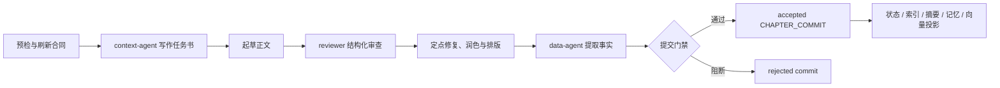

# webnovel-writer 深度拆解：AI 长篇写作真正缺的不是文笔，而是一套故事提交系统

> **TL;DR:** `lingfengQAQ/webnovel-writer` 是一个运行在 Claude Code 中的中文长篇网文创作插件。它最有价值的设计不是某套“爆款提示词”，而是把总纲、卷纲、章纲、审查、事实抽取、长期记忆和检索组织成一条可恢复的提交链：写前由 Story System 合同约束本章，写后只有通过审查、章纲履约和实体消歧的章节才能成为 `CHAPTER_COMMIT`；状态、索引、摘要、记忆和向量库都是由 commit 派生的投影。它把 AI 写作从一次性生成，推进成了一个有真源、有门禁、有记账、有失败恢复的本地生产系统。

- **Source:** [lingfengQAQ/webnovel-writer](https://github.com/lingfengQAQ/webnovel-writer)
- **Release:** [v6.2.1](https://github.com/lingfengQAQ/webnovel-writer/releases/tag/v6.2.1)
- **Architecture:** [Architecture Overview](https://github.com/lingfengQAQ/webnovel-writer/blob/master/docs/architecture/overview.md)
- **Published:** 2026-07-07
- **Accessed:** 2026-07-13
- **License:** GPL-3.0
- **Tags:** webnovel-writer / Claude Code / AI writing / web novel / Story System / long-term memory / agent skills

## 一句话判断

**webnovel-writer 真正解决的不是“模型能不能写 2000 字”，而是“连载到第 500 章时，系统还知不知道前面发生过什么，以及哪些事实已经成为正史”。**

大模型写一章并不难。难的是长篇连载会不断积累角色状态、世界规则、时间线、伏笔、承诺、关系变化和临时设定。把几十万字原文全部塞回上下文，成本高、噪音大，也无法保证模型注意到真正关键的约束；只做向量检索，又可能召回相似段落，却漏掉必须遵守的正史。

webnovel-writer 的办法是先区分三种东西：

1. **写前合同**：什么必须发生，什么不能发生，本章从哪里开始、在哪里结束；
2. **写后事实**：这一章真正写出了哪些事件，角色和世界发生了什么变化；
3. **读取投影**：为了下一次写作和查询，把事实整理成状态、索引、摘要、记忆和向量片段。

这与软件系统中的 event sourcing 很像。章节正文仍是作品，但系统不再把“最近一次模型输出”直接当成可信状态；它要求章节先通过门禁，再把接受的事实写入故事账本。

## 它不是聊天机器人，而是 Claude Code 写作插件

项目当前版本为 v6.2.1，采用 Python 3.10+，通过 Claude Code Marketplace 安装。插件把作者常见工作拆成 8 个命令入口：

| 命令 | 负责什么 |
|---|---|
| `/webnovel-init` | 分阶段问答，创建项目、设定和总纲 |
| `/webnovel-plan` | 增量生成卷纲、章纲、时间线和合同 |
| `/webnovel-write` | 上下文、起草、审查、润色、提交、备份 |
| `/webnovel-review` | 对既有章节做结构化审查 |
| `/webnovel-query` | 查询角色、伏笔、节奏、关系和运行状态 |
| `/webnovel-learn` | 把可复用技法写入项目长期记忆 |
| `/webnovel-dashboard` | 启动只读 Dashboard |
| `/webnovel-doctor` | 检查文件、数据库、RAG、依赖和运行状态 |

底层则由 4 个专职 Agent 分工：`context-agent` 生成写作任务书，`reviewer` 找事实和连续性问题，`data-agent` 从成稿提取结构化事实，`deconstruction-agent` 拆解参考作品并提炼可迁移技法。

这一区分很重要。Skill 负责流程、门禁和工具权限，Agent 负责需要模型判断的窄任务。主流程不能口头假装“已经审查”，也不能替 `data-agent` 随手补一份 JSON。谁生成什么 artifact、谁可以写哪些文件，在 Skill 中都有明确所有权。

## 写一章，实际要经过什么

`/webnovel-write` 的默认流程不是一句 prompt，而是一条六阶段流水线：



### 1. 先把章纲变成运行时合同

写作开始前，系统会检查项目根、占位符和 Story System 健康度，并为目标章节刷新运行时合同。合同至少包括：

- 本章目标、时间锚点、跨度和倒计时；
- 开场节点 `CBN`、过程节点 `CPNs`、结尾节点 `CEN`；
- 必须覆盖的节点与禁止进入的区域；
- 角色 OOC 警戒、风格约束和反模式；
- 本章结束时必须保留的开放问题。

规划也不是一次性重写整部小说。`/webnovel-plan` 默认分批处理章节，通常每批 10 章，复杂时 8 章、简单时 12 章，并要求相邻章节的 `CEN` 与下一章 `CBN` 能接上。时间线冲突会阻断流程，而不是让模型自行圆过去。

### 2. context-agent 只给当前章节准备必要上下文

`context-agent` 不会把项目所有文件全文塞进模型。它会根据当前章合同组织一份五段式任务书：硬性约束、结构节点、禁区、风格指引、动态参考。

系统的上下文适配器还会选择性加载：

- Story System 合同与最新 commit；
- 当前章纲；
- 最近两章的短摘要；
- 主角当前状态和创作进度；
- 最多 5 条活跃世界规则；
- 最多 3 条紧急伏笔；
- 当前题材的局部画像，而不是整份题材手册。

这回答了长篇 AI 写作最常见的误区：**模型不需要每次重读整本书，它需要一份由可信状态生成、针对当前任务裁剪过的上下文包。**

### 3. reviewer 不是打分，而是守门

正文起草后，独立 `reviewer` 返回结构化问题 JSON。默认流程只审查一轮：能局部修复的 blocking issue 由主流程定点修复，无法安全修复的交给作者裁决；非阻断问题进入润色阶段。

这里没有“总分 82，所以勉强通过”的模糊逻辑。真正影响提交的是明确的阻断项，例如违反设定、时间线冲突、关键节点缺失或连续性断裂。审查结果随后由 review pipeline 标准化并写入报告和 SQLite 指标。

### 4. data-agent 把文学文本翻译成故事事实

润色完成后，`data-agent` 生成三类提交 artifact：

- `fulfillment_result`：计划节点、已覆盖节点、遗漏节点和额外节点；
- `disambiguation_result`：新实体或同名实体是否还有待消歧项；
- `extraction_result`：接受事件、状态变化、实体变化、场景和章节摘要。

事件不是任意字符串。当前路由能够识别角色状态变化、关系变化、世界规则揭示或打破、境界突破、伏笔开启或关闭、承诺创建或兑现、物品获得等事件类型。

这一层把“小说里发生了什么”从自然语言变成了可以查询、校验和继续投影的结构化记录。

## CHAPTER_COMMIT：整套系统最关键的对象

提交服务的判定非常直接：

```python
rejected = (
    review.blocking_count > 0
    or bool(fulfillment.missed_nodes)
    or bool(disambiguation.pending)
)
status = "rejected" if rejected else "accepted"
```

只有同时满足下面三项，一章才会成为 accepted commit：

1. 没有 blocking review issue；
2. 没有遗漏章纲要求的节点；
3. 没有尚未解决的实体消歧。

commit 自身会保存合同引用、章纲履约快照、审查结果、事实提取结果和五类投影状态。accepted commit 还会把事件写入按章节保存的 JSON 事件文件，并镜像到 SQLite；rejected commit 不会把未经确认的事实扩散到记忆和向量库。

这就是项目最成熟的一处设计：**生成正文和更新正史被拆成了两个动作。** 模型可以写错，但错误不会因为“文件已经保存”就自动污染后续章节。

## 为什么 `state.json` 不是故事真源

项目明确把 `.story-system/` 和 accepted `CHAPTER_COMMIT` 视为真源，而把以下文件视为 projection / read model：

- `.webnovel/state.json`：兼容状态和当前进度；
- `.webnovel/index.db`：实体、关系、事件与审查指标；
- `.webnovel/summaries/`：章节摘要；
- `.webnovel/memory_scratchpad.json`：活跃规则、伏笔和承诺；
- 向量库：用于语义召回的摘要、事件、实体变化和场景片段。

投影路由会根据事件类型决定更新哪些读取模型。例如角色状态变化进入 state、memory 和 vector；关系变化进入 index 和 vector；伏笔事件进入 memory；章节摘要存在时才更新 summary。

这样做有两个好处。

第一，读取模型坏了可以重建。投影失败只补跑失败投影，不必重新让模型写一章。第二，不同消费端可以读取不同视图：写作任务需要紧急伏笔，Dashboard 需要统计，查询命令需要实体关系，RAG 需要可检索片段，但它们不必争夺同一个巨大 JSON。

## RAG 是补充检索，不是正史裁判

webnovel-writer 支持 `vector`、`bm25`、`hybrid` 和叠加实体图谱的 `graph_hybrid` 检索，并通过 RRF 融合和 reranker 选择 Top-K。默认配置示例使用 ModelScope 托管的 `Qwen/Qwen3-Embedding-8B` 和 Jina 的 `jina-reranker-v3`；只要接口兼容 OpenAI 格式，也可以替换供应商。

没有 Embedding Key 时，系统会回退到 BM25，不阻断基本写作。这是合理的降级路径，但不能把两者效果视为等价：BM25 更依赖词面重合，跨措辞召回会弱一些。

更关键的是，RAG 检索到的内容只作为动态参考，不能覆盖章纲合同。世界观硬规则、时间锚点和本章禁区来自 Story System；相似段落只负责补充写法或找回相关历史。

这是一条值得其他 Agent 系统借鉴的原则：**检索负责发现候选上下文，合同负责定义必须服从的事实。**

## 失败恢复，才是长流程能不能用的分水岭

v6.2.0 专门强化了断点续跑：重复执行同一章时，系统先检查可信 checkpoint，尽量从失败步骤继续，不重写已经通过的正文、审查或事实 artifact。投影失败只重跑投影，commit 未生成才重跑提交。

v6.2.1 则修复了一个很实际的 Windows 问题：VSCode、杀毒软件或同步盘短暂占用 `state.json`、`memory_scratchpad.json` 等文件时，原子的 `os.replace` 可能触发 `WinError 5`。现在系统会按 20ms 到 500ms 指数退避重试 10 次，约覆盖 2.6 秒；持续失败时仍抛错，并保留原文件。

这次版本看起来只是小修，却暴露了项目的真实关注点。长篇写作系统不是 demo 里的单次生成，而是作者每天反复运行、可能在第 487 章失败后仍要找回状态的工作流。可靠写入和可恢复执行，比再加一个“文风按钮”更接近生产价值。

上游 v6.2.1 发布说明报告全量测试为 `774 passed`。我在 2026-07-13 的源码快照上完成了 `compileall`、版本同步检查、发布说明校验和插件包校验，均通过；本地环境未安装 pytest，因此没有独立复跑那 774 项测试。

## 适合谁，不适合谁

webnovel-writer 最适合：

- 已经使用 Claude Code，并愿意让小说以本地文件和结构化状态管理的作者；
- 计划写数百章，需要跟踪设定、伏笔、时间线和角色状态的连载项目；
- 希望保留人工裁决权，而不是让模型自动覆盖正史的人；
- 想研究 Skill、Agent、门禁、artifact ownership 和事件投影如何组合的开发者。

它不太适合：

- 只想打开网页立即生成一篇短文的用户；
- 不愿接触文件目录、命令和 Claude Code 插件环境的作者；
- 需要多人在线协作、编辑器内联批注和云端权限系统的团队；
- 期待安装后无需准备设定、章纲和人工判断就能稳定产出百万字成书的人。

内置 37 个中文网文题材模板可以降低初始化成本，但模板不能替代创作决策。系统也声称支持 200 万字量级连载，这应理解为项目的设计目标与仓库主张，而不是经过独立公开 benchmark 证明的质量承诺。

## 仍然存在的边界

第一，它是 Claude Code 插件，不是独立桌面写作软件。作者需要接受 Markdown、JSON、SQLite 和命令式工作流。

第二，向量检索和 rerank 依赖外部服务与 API Key。BM25 fallback 保证可用性，但无法保证同等召回质量。

第三，“Anti-AI”润色、题材模板和写作指南仍然是基于提示与规则的质量控制。它们可以减少套话和风格漂移，不能证明文本天然达到职业作者水平。

第四，仓库文档存在轻微版本漂移：根 README 列出当前 8 个 Skill，而插件包 README 仍写 7 个并遗漏 `doctor`。代码结构本身包含 8 个 Skill 和 4 个 Agent，但阅读细节时应以当前源码为准。

第五，v7 重构 RFC 已经公开讨论，说明 Story System 的边界还在演进。v6.2.1 是当前稳定发布，不应把 RFC 中的未来设计当成已经交付的能力。

## 对 Agent 开发者更有价值的五条经验

1. **先定义真源，再谈记忆。** 没有 accepted fact 的边界，向量库只会更高效地传播错误。
2. **生成与提交分离。** 模型输出是 proposal，经过验证的 artifact 才能更新系统状态。
3. **把 read model 当成可重建投影。** 状态、搜索、Dashboard 和摘要可以各自优化，不必承担正史职责。
4. **失败从可信断点恢复。** 长流程重跑全部步骤会带来成本、漂移和误覆盖。
5. **用户只处理真正需要裁决的分歧。** 技术错误自动恢复，创作方向、事实取舍和 blocking issue 才交还作者。

这些原则并不限于小说。研究 Agent、代码 Agent、法务工作流和长期项目管理都面对同一个问题：模型会生成很多候选信息，但只有一部分应该成为后续系统相信的事实。

## 结论

webnovel-writer 最值得看的地方，不是它有多少 prompt，也不是它能否偶尔写出漂亮段落。

它把长篇创作重新定义成一套状态演进过程：章纲是写前合同，正文是候选实现，审查和履约是门禁，`CHAPTER_COMMIT` 是被接受的事实，状态、摘要、记忆和向量库是可重建的读取视图。

这使“模型遗忘”从一个只能期待更长上下文窗口解决的问题，变成一个可以工程化管理的问题。

**AI 长篇写作真正需要的，不是一颗永不遗忘的大脑，而是一套知道什么已经发生、什么仍待确认、失败后从哪里继续的故事操作系统。**
