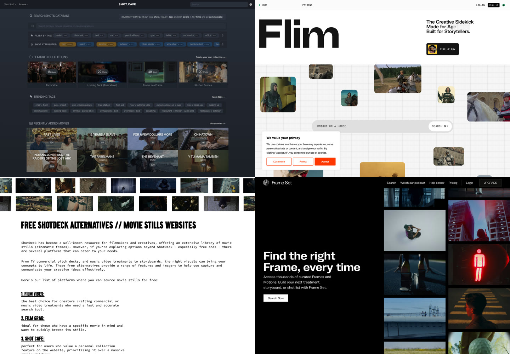

# Cinematic Reference Stack: How ShotDeck, Shot.Cafe, Flim, Film Vibes, and Frame Set Turn Image Hunting Into AI Video Pre-Production

> **TL;DR:** These five sites are more than a bundle of movie-still databases. Together, they form a practical visual research stack: Shot.Cafe is the free exploration layer, ShotDeck is the professional precision-search layer, Flim is the natural-language and AI workflow layer, Film Vibes adds motion and commercial/music-video references, and Frame Set expands one good frame into treatments, storyboards, and shot lists. In the AI video era, their value is turning “I want this feeling” into a searchable, comparable, reusable reference pack.

- **Source:** user-provided list / [ShotDeck](https://shotdeck.com/) / [Shot.Cafe](https://shot.cafe/) / [Flim pricing](https://flim.ai/pricing) / [Film Vibes alternatives guide](https://filmvibes.io/blog/free-shotdeck-alternatives) / [Frame Set](https://site.frameset.app/)
- **Accessed:** 2026-07-08
- **Topic:** cinematography reference workflow / AI video pre-production / shot research stack
- **Tags:** ShotDeck / Shot.Cafe / Flim.ai / Film Vibes / Frame Set / AI video / shot reference / storyboard / moodboard



## One-Sentence Take

**Cinematic reference libraries are moving from “finding nice images” to “turning visual intent into executable shot language.”**

That is why these tools matter more in the AI video era. In the past, film stills were mainly used to align directors, cinematographers, art departments, clients, and agencies. Now they also act as visual constraints for generation models.

A prompt can say: “a person looking into a mirror at a bathroom sink, cold lighting, tense, close shot.” But that is still thin. A stronger pre-production process breaks the idea into cinematic decisions:

- Is the subject facing the mirror, or are we seeing the reflection over the shoulder?
- Is the camera frontal, profile, behind the subject, or using the mirror as a frame-within-frame?
- Is the light fluorescent, window light, mirror practicals, or a single overhead source?
- Is the space a home bathroom, a motel, a hospital, or a public restroom?
- Is the emotion exhaustion, self-reflection, dread, breakdown, or clean commercial polish?
- Is the palette cold green-blue, warm tungsten, gray desaturation, or neon reflection?

Reference libraries give samples for those choices. The goal is not to copy a frame. The goal is to build a shared visual coordinate system.

## Five Tools, Five Jobs

| Tool | Best For | Workflow Layer |
|---|---|---|
| [ShotDeck](https://shotdeck.com/) | professional film still search, detailed tags, team decks | precision search |
| [Shot.Cafe](https://shot.cafe/) | free exploration, tags, colors, RGB Parade | low-cost discovery |
| [Flim](https://flim.ai/) | natural-language search, stills/video cuts, AI tools, boards | semantic and generative bridge |
| [Film Vibes](https://filmvibes.io/) | commercials, music videos, GIFs, motion parameters | motion reference |
| [Frame Set](https://site.frameset.app/) | similar frames, treatments, storyboards, shot lists | expansion and organization |

The point is not to crown a single winner. Each tool answers a different production question.

### 1. ShotDeck: When You Already Know Which Film-Language Variables Matter

ShotDeck positions itself as one of the world’s largest searchable high-definition movie image libraries. Its public site emphasizes filmmakers, cinematographers, designers, ad creatives, film students, and visual artists. Its core strength is not generic image search but deep tagging: ShotDeck says every image is hand-tagged across areas such as crew, genre, cameras, lenses, framing, lighting, color, composition, locations, and emotion.

That makes ShotDeck strongest once the broad idea is already clear. You are not just searching `mirror`; you are narrowing toward:

- medium close-up;
- cold bathroom;
- reflection composition;
- low-key lighting;
- psychological-thriller tone;
- a specific period, director, cinematographer, genre, or lens feel.

That is the value of a professional reference library: it turns taste into search conditions. ShotDeck’s public pricing page currently lists monthly access at $12.95/month, yearly access at $99.95 billed yearly, and a two-week free trial.

### 2. Shot.Cafe: Free, Fast, and Great for Tag and Color Exploration

Shot.Cafe is lighter and easier to use as a first stop. Its homepage currently lists 24,321 total shots, 109,941 tags, 834 colors, 187 films, and 23 commercials. Its navigation includes movies, commercials, directors, cinematographers, production designers, years, genres, tags, colors, aspect ratios, and a shot stream.

It is especially useful because it lowers the cost of exploration. For the “person at a sink looking into a mirror” example, you can start with tags such as `mirror`, `bathroom`, `reflection`, or `frame in a frame`. The current homepage shows `mirror 191` and `bathroom 191`, which is exactly the kind of entry point a creator needs.

Shot.Cafe also exposes `Show RGB Parade`, which is more useful than it may sound. Many AI video failures look like prompt failures but are actually color-specification failures. A color histogram or parade can help you describe palette, contrast, and grade more concretely.

### 3. Flim: When You Want to Describe the Image Instead of Guessing the Tag

Flim is closer to an AI-era visual search and creative workflow platform. Its pricing page says Basic includes access to +1.5M stills, while Pro includes over 410K video cuts, AI tools, boards, Smart Suggestions, and Magic Boards.

That means Flim is not just a still-search site. It fits queries like:

```text
person at sink looking in mirror
woman alone in bathroom under fluorescent light
man staring at reflection in a motel bathroom
uneasy bathroom mirror scene, cold green color
```

This natural-language entry point matters. The biggest obstacle in film-reference search is often not a lack of taste, but not knowing which database terms to use. Flim lets creators type the idea first, then learn better keywords and visual patterns from the returned results.

### 4. Film Vibes: When the Reference Needs Motion, Not Just a Still

Film Vibes publicly frames itself around commercial treatments, music-video treatments, and storyboards. Its guide describes AI-powered search with filters such as prompt, time of day, shot angle, and camera movement. It also emphasizes GIFs and the ability to capture stills from shots.

That makes it useful for motion references. Many AI video failures are not single-frame failures. They are movement failures: unclear head turns, bad push-ins, awkward camera movement, unstable spatial relationships, or the wrong performance rhythm.

For the bathroom-mirror example, Film Vibes can answer motion questions:

- Does the character slowly raise their eyes, or suddenly look up?
- Is the camera static, handheld, pushing in, or tracking sideways?
- Is the space polished like a commercial, tense like a thriller, or rhythmic like a music video?
- Does the reference come from film, ads, or music videos? That choice changes pacing and movement language.

### 5. Frame Set: When One Good Frame Needs to Become a Sequence

Frame Set is valuable for expansion and organization. Its site says creators can search hundreds of thousands of Frames and Motions for commercial treatments, shot lists, and storyboards. It also offers similarity search, letting users find related frames from a single image.

This matters because real projects rarely need one reference image. They need a set: establishing shot, medium shot, close-up, insert, movement cue, transition, emotional peak, and color progression.

If Shot.Cafe and Flim help you find possible starting points, Frame Set helps with the next questions:

- Is there a similar composition with a different palette?
- Is there the same mood in a different location?
- Are there film, commercial, and music-video versions of the same visual idea?
- Can the references be organized into a treatment or storyboard sequence?

## A Practical Workflow: “Person at a Sink Looking Into a Mirror”

Suppose the target AI video shot is:

```text
A person stands at a bathroom sink and looks into a mirror. The bathroom is quiet, the light is cold and fluorescent, the character looks exhausted, and the scene has a subtle psychological-thriller tension. The camera slowly pushes in. The reflection is clearer than the physical body.
```

The wrong move is to immediately write one giant prompt. A better move is to do reference research first.

### Step 1: Start Free with Shot.Cafe

Search `mirror`, then inspect related tags such as `bathroom`, `reflection`, `frame in a frame`, and `fluorescent light`. At this stage, the goal is not to pick the final image. It is to map the visual territory.

The output should be a small research table:

| Observation | Notes |
|---|---|
| Composition | over-the-shoulder mirror / frontal reflection / side sink view |
| Space | home bathroom / motel bathroom / public restroom |
| Light | overhead fluorescent / mirror practical / cold window light |
| Color | green-blue cold cast / desaturated gray / dirty tungsten |
| Emotion | exhausted / introspective / tense / pre-breakdown |

### Step 2: Narrow Precisely in ShotDeck

If the project needs more rigorous film-language control, move into ShotDeck. Do not search only for scene words. Stack the cinematography variables: framing, lighting, color, genre, lens, location, and emotional tone.

This is where “make it more oppressive” can become a professional visual brief: low-key lighting, cold practical source, a boxed-in reflection, minimal background information, and the mirror image as the dominant visual subject.

### Step 3: Use Flim for Natural-Language Expansion

Then use Flim with phrases such as:

```text
person at sink looking in mirror
```

Iterate from the results:

```text
person staring at bathroom mirror under fluorescent light
uneasy motel bathroom mirror scene
reflection in mirror, cold green lighting, psychological thriller
```

The value here is discovery. The best result often comes not from the first query, but from the new vocabulary you learn after seeing the first page of references.

### Step 4: Add Motion with Film Vibes

If the final output is video rather than a poster, look for movement references: eye raise, slow push-in, body lean, hand on sink, water turning on, reflection shift.

Film Vibes can help translate still research into motion language:

- camera slowly pushes in;
- subject raises eyes toward mirror;
- subtle handheld tension;
- reflection remains centered while the body is slightly off-axis;
- fluorescent light flickers gently.

### Step 5: Expand and Organize in Frame Set

Finally, take the closest frame and use similar search to find variants: same composition, different color; same mood, different space; same movement, different format.

Then organize the reference board:

| Shot Function | Reference Need |
|---|---|
| Establishing | bathroom layout and sink position |
| Main shot | body-reflection relationship |
| Insert | water, hand, light, dirty mirror surface |
| Motion | push-in, eye raise, gaze shift |
| Color | cool green, gray-blue, desaturated skin |
| Negative reference | no glossy commercial bathroom, no jump scare |

That is the kind of pre-production pack AI video actually needs.

## From References to Prompt: Abstract Rules, Do Not Copy Frames

There is an important boundary here: film stills are references, not assets to reproduce. The healthier workflow is to abstract transferable rules.

A reference pack can become a prompt structure like this:

```text
Subject:
  a tired person standing at a bathroom sink, looking into a mirror

Composition:
  over-the-shoulder mirror composition, reflection centered, real body slightly off-axis

Lighting:
  cold fluorescent practical light above the mirror, low ambient fill, subtle green-blue cast

Camera:
  slow push-in, eye-level lens, restrained handheld micro-movement

Mood:
  quiet psychological tension, introspective, not overt horror

Color:
  desaturated gray tiles, cool green highlights, muted skin tones

Negative:
  no glossy commercial bathroom, no jump scare, no exaggerated facial expression
```

That is the bridge between reference libraries and generation models. The library supplies samples, the creator extracts rules, and the model executes those rules.

## Product Implication for AI Video Tools

Seen together, these five sites suggest a clear product direction: AI video tools cannot stop at the generate button. They need a stronger pre-production research layer.

A future creative tool may combine:

- natural-language reference search;
- cinematography-aware filters;
- color, composition, lighting, and motion clustering;
- automatic moodboards, shot lists, and prompt packs;
- direct handoff from reference pack to video model.

That is why film-reference databases are not niche archives. They are becoming upstream infrastructure for AI video production. As generation gets cheaper, the scarce skill is not merely producing a clip. It is knowing what the clip should be.

## Conclusion

The best way to use these five tools is as a repeatable workflow:

1. Start with Shot.Cafe for low-cost exploration.
2. Use ShotDeck for professional precision.
3. Use Flim for natural-language and semantic expansion.
4. Use Film Vibes for motion and commercial/music-video context.
5. Use Frame Set for similar-frame expansion and project organization.

The end result is not a pile of pretty screenshots. It is an executable visual brief: a shared language between director, cinematographer, client, and model.

