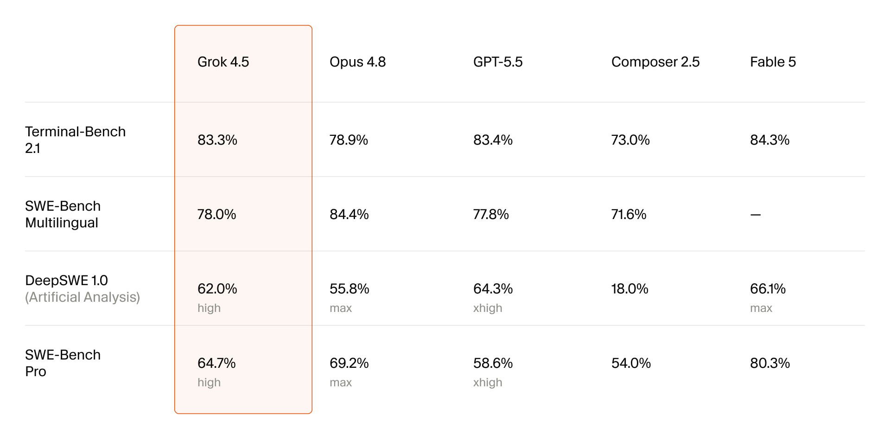

# Cursor x SpaceXAI Grok 4.5: AI IDE Competition Is Moving from Calling Models to Training Them

> **TL;DR:** On July 8, 2026, Cursor announced that it had partnered with SpaceXAI to train Grok 4.5, calling it Cursor’s strongest model and the first one it built for more than software engineering. The fuller Cursor blog explains that Grok 4.5 is a mixture-of-experts model trained jointly with SpaceXAI, using trillions of tokens of Cursor data that capture user interactions with codebases, software tools, and agent environments. The real signal is not any single benchmark number. It is that AI IDEs are moving from “integrating Claude/OpenAI/Google models” toward training models from their own product data and workflow traces.

- **Source X post:** [Cursor on X](https://x.com/cursor_ai/status/2074915744999969059)
- **Canonical post:** [Introducing Grok 4.5 - Cursor](https://cursor.com/blog/grok-4-5)
- **SpaceXAI post:** [Introducing Grok 4.5 - SpaceXAI](https://x.ai/news/grok-4-5)
- **Accessed:** 2026-07-10
- **Tags:** Cursor / SpaceXAI / Grok 4.5 / AI coding / agentic coding / model training / AI IDE

## One-Sentence Take

**The important part of Grok 4.5 is not that Cursor added another model. It is that Cursor is turning IDE usage data into model-training advantage.**

Cursor’s X post is short: it partnered with SpaceXAI to train Grok 4.5, its most powerful model yet, and its first model built for more than software engineering. The real detail is in the official blog: Grok 4.5 is a mixture-of-experts model jointly trained by Cursor and SpaceXAI, with training that includes large amounts of Cursor data capturing how developers interact with codebases, tools, and agents.

That pushes AI coding competition one layer deeper.

Until now, products like Cursor, Claude Code, Codex, Windsurf, and OpenCode have largely competed on harness quality: repo context, tool calls, patches, tests, review, and long-running task management. The base model came from an external provider; the IDE built product experience around it.

Grok 4.5 points to a different path: **the AI IDE itself becomes a source of model-training data and task environments.**

## From Composer 2.5 to Grok 4.5: Cursor Is Not Only Building a Coding Specialist

Cursor’s blog makes an important comparison: Composer 2.5 was trained as a coding specialist, while Grok 4.5 uses a deliberately broader data mix, including high-quality STEM tasks, research papers, and broader knowledge work.

That explains the X post’s line that this is the first model Cursor has built for more than software engineering.

The ambition is not only better code edits. It is a model that can handle longer, messier, computer-based tasks:

- software engineering;
- data science;
- finance;
- legal work;
- other work that requires tools, investigation, error recovery, and verification.

This matches the broader trend in agent products: coding agents are expanding into computer-work agents. Code is the first entry point because it is frequent, valuable, and easier to verify. The larger target is a model that can act across files, terminals, browsers, spreadsheets, documents, and slide decks.

## Why Cursor Data Matters

Cursor says Grok 4.5 training included trillions of tokens of Cursor data capturing user interactions with codebases and software tools. That sentence is the core of the release.

Ordinary code pretraining teaches a model what code looks like. Cursor data can teach more:

1. **how developers ask for work:** real users are vague, incremental, and frequently change scope;
2. **how agents explore repos:** which files they inspect, what commands they run, and how they read errors;
3. **how changes get verified:** tests, lint, type checks, app runs, and diffs;
4. **how humans correct agents:** which outputs are accepted and which require retry;
5. **how toolchains fail:** dependency problems, flaky tests, permissions, missing context, wrong paths.

This data is closer to the software-engineering process than raw GitHub code. If a model learns from those trajectories, it learns not only functions and APIs, but the behavior distribution of developers and agents completing work together.

That is where AI IDE moats may change. The future advantage may not be who can stuff more tokens into context. It may be who can turn real task loops into training signals: observe, plan, edit, run, fail, recover, verify.

## RL Environments: Using Agents to Build Agent Training Tasks

Cursor also says it used reinforcement learning on difficult problems in realistic environments across software engineering and broader knowledge work. These environments teach the model to investigate problems, use tools, recover from mistakes, and verify results.

The environment-construction process is especially interesting. Engineers specify a problem and its verification method, then large groups of agents construct, test, and refine the environment. Cursor says some of these environments would have taken large engineering teams months to build manually.

This matters more than the leaderboard. It describes a training flywheel:

1. the product generates real task traces;
2. the team abstracts verifiable tasks;
3. agents help generate and test training environments;
4. the new model runs RL in those environments;
5. the new model enters the product and produces better traces;
6. those traces feed the next training cycle.

That is the most powerful loop in agent products. More users create more real failure modes. More failure modes produce more specific environments. Better environments produce models that fit the workflow more tightly.

## How to Read the Benchmarks

Cursor’s image lists several engineering benchmarks:

| Benchmark | Grok 4.5 | Signal |
|---|---:|---|
| Terminal-Bench 2.1 | 83.3% | close to GPT-5.5 at 83.4% and Fable 5 at 84.3% |
| SWE-Bench Multilingual | 78.0% | below Opus 4.8 at 84.4%, above GPT-5.5 at 77.8% |
| DeepSWE 1.0 | 62.0% | below GPT-5.5 at 64.3% and Fable 5 at 66.1%, above Opus 4.8 at 55.8% |
| SWE-Bench Pro | 64.7% | below Fable 5 at 80.3% and Opus 4.8 at 69.2%, above GPT-5.5 at 58.6% |

The numbers suggest Grok 4.5 is a strong engineering model, but not first in every dimension. Fable 5 remains clearly ahead on SWE-Bench Pro in this chart.

The footnotes are more important.

First, Cursor says SWE-Bench Pro and Terminal-Bench use self-reported third-party model scores, and the GPT-5.5 score on SWE-Bench Multilingual comes from Cursor’s internal run. So this is not a single fully independent evaluation with one harness and one budget.

Second, Cursor explicitly excludes CursorBench. The reason: an earlier snapshot of the Cursor codebase was accidentally included in Grok 4.5 training, giving the model an advantage on CursorBench. Cursor says the impact is unclear, the data has been removed for future models, and CursorBench is being updated.

That footnote actually makes the release more credible. It puts benchmark contamination on the page instead of pretending it does not exist. For teams making production model decisions, that is more useful than a clean “we are number one” story.

## Why Training Contamination Matters

The CursorBench exclusion deserves attention.

When an AI IDE trains its own models, it naturally faces a hard problem: the more closely product data reflects real work, the closer it may be to private evals, internal code, historical bugs, and product-specific tasks. The more deeply a model learns the product environment, the harder it is to guarantee that no benchmark has been seen.

This is not unique to Cursor. Any company training agents from product data must answer:

- did internal code enter training?
- is user data permitted for training?
- are benchmarks contaminated?
- are test tasks too similar to product traces?
- did the model learn shortcuts in a specific harness?

Future AI IDE evaluation should ask more than “what is the score?”

1. How are evals isolated from training data?
2. Is there independent reproduction?
3. Are harness, budget, context, and tool permissions disclosed?
4. Are excluded benchmarks and reasons reported?
5. Are there cross-product, cross-repo, cross-language transfer tests?

Grok 4.5’s CursorBench caveat is a useful industry example: when models are trained from product data, benchmark governance becomes part of product trust.

## Pricing and Availability: Not Only an Internal Cursor Model

Cursor says Grok 4.5 is available across desktop, web, iOS, CLI, and SDK, with individual and team plans including model usage and double usage for the first week. The base model is priced at $2 per million input tokens and $6 per million output tokens; the fast variant is $4 per million input tokens and $18 per million output tokens.

SpaceXAI’s launch page says Grok 4.5 is available in Grok Build, in Cursor on all plans, and from the SpaceXAI console. It also notes that EU availability is expected in mid-July and is not yet live at launch.

So this is not just an internal model for Cursor IDE. It is a jointly trained Cursor-SpaceXAI model distributed across products:

- Cursor for coding and agentic coding;
- Grok Build for broader computer work;
- SpaceXAI console for developers;
- pricing and token efficiency positioned against OpenAI, Anthropic, and Google.

If this model works, AI IDE companies become more than model customers. They become model co-developers, data partners, evaluation partners, and distribution channels.

## What It Means for AI IDE Competition

For Cursor, the strategic value is straightforward: less dependence on any single external model provider.

AI IDEs have a structural risk. If Claude, GPT, Gemini, or another model jumps ahead, product experience shifts with it. If the model provider launches its own coding agent, the IDE faces competition from upstream.

With Grok 4.5, Cursor gains three forms of leverage:

1. **training-data leverage:** real IDE interactions can improve the model;
2. **task-definition leverage:** Cursor can build RL environments and acceptance tasks that match its product;
3. **model-portfolio leverage:** Composer 2.5 remains a smaller coding specialist, while Grok 4.5 becomes the larger general agent and knowledge-work model.

This will pressure other AI coding products to clarify their model strategy. UX and harness design still matter, but if competitors can feed product usage back into training, simply switching model providers may become a thinner advantage.

## How Teams Should Try It

For engineering teams, I would not make Grok 4.5 the only default model just because of the announcement chart. A better approach is to add it to model routing:

| Scenario | Should You Test Grok 4.5? |
|---|---|
| long repo edits, terminal work, tool-heavy tasks | yes |
| multilingual SWE tasks | yes, compare with Opus/GPT/Fable |
| office documents, spreadsheets, research-style computer tasks | worth exploring |
| high-risk security or code-review work | check safeguards and organization policy |
| tasks where SWE-Bench Pro strength matters most | still run Fable/Opus-style models in parallel |
| sensitive internal code | confirm Cursor/SpaceXAI data-use, privacy, and enterprise settings |

The right evaluation is simple: test on your own real work. Take the same bugfix, migration, test repair, documentation update, or spreadsheet-modeling task and run Grok 4.5, Composer 2.5, Claude, and GPT side by side. Track:

- completion rate;
- human interventions;
- failed test attempts;
- output tokens and elapsed time;
- code-style fit;
- tool-failure recovery;
- whether a reviewer would merge the result.

Those workflow metrics matter more than a one-point leaderboard difference.

## Conclusion

Cursor and SpaceXAI jointly training Grok 4.5 is a clear escalation in AI IDE competition.

Cursor is no longer only building an interface on top of other models. It is turning user interactions, tool traces, codebase behavior, RL environment construction, and evaluation design into part of the model itself.

That has two consequences:

- the upside: models can become more grounded in real engineering and computer-work loops, with better tool use, error recovery, and verification;
- the risk: training-data boundaries, eval contamination, user-data governance, and benchmark transparency become more important.

So the number to remember is not 83.3% or 64.7%. The real signal is this:

**AI coding products are moving from model callers to model co-trainers.**

The next AI IDE moat may not be the editor experience alone. It may be the closed loop among product data, training environments, benchmark governance, and model routing.
