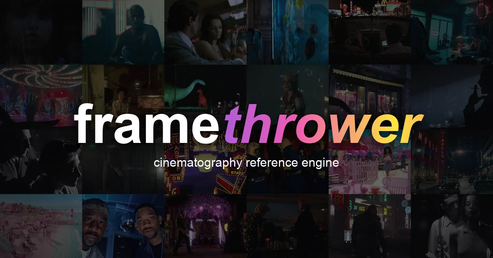
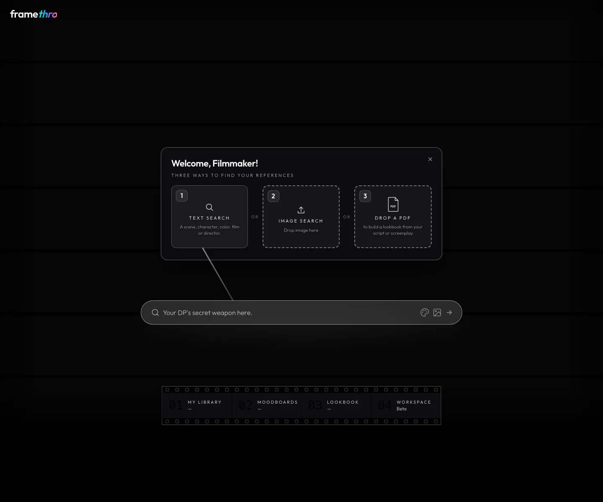

# FrameThrower Deep Dive: Cinematography Search Is Moving from Image Hunting to Shot-Language Databases

> **TL;DR:** FrameThrower turns film-frame reference into a search engine for directors, cinematographers, and visual creators. Its value is not merely “searching movie stills.” It connects mood, lens, lighting, shot size, angle, time, era, depth of field, rating, year, color picking, image upload, and PDF-to-lookbook workflows into one reference system. The `storm` query is useful because it shows the real problem: creators do not just need one storm image. They need a way to translate a vague visual intention into searchable, saveable, project-ready shot language.

- **Source:** [FrameThrower search route](https://framethrower.ai/search?q=storm) / [FrameThrower home](https://framethrower.ai/)
- **Accessed:** 2026-07-08
- **Topic:** cinematography reference engine / film still search / AI video reference workflow
- **Tags:** FrameThrower / film reference / cinematography / moodboard / lookbook / AI video / creator workflow

## One-line Takeaway

**FrameThrower is betting that visual-reference search should not stop at “find similar images.” It should become an entry point into shot language, style constraints, and production-ready reference organization.**

That may sound like a niche filmmaking tool. In the AI video era, it points to a much larger workflow shift: creators increasingly need to turn “I want this kind of feeling” into executable visual evidence. Prompts express intent; reference systems provide real examples of light, camera, color, framing, and genre.

The user-provided URL was `https://framethrower.ai/search?q=storm`. When accessed publicly, the page enters the FrameThrower app shell with `next=/search`. It did not expose a verifiable ranked list of `storm` results in the public render; it showed the search entry and onboarding state. So this article is grounded only in the public page text, metadata, rendered screenshot, and visible product capabilities. It does not pretend to have seen a full storm-result ranking.

## 1. `storm` is a good test query because it is not a normal keyword

If `storm` is treated as a keyword, a search engine may return rain, clouds, lightning, waves, windows, umbrellas, disaster scenes, war scenes, or even a title or character name. But filmmakers usually do not want “images containing the word storm.” They want a shot state.

For example:

- a heavy sky before a storm breaks;
- a figure silhouetted in rain at night;
- an interior briefly lit by lightning;
- a wide moving shot at sea;
- raindrops and neon reflections on a car window;
- visual chaos caused by war, grief, escape, or natural disaster.

These are not one semantic category. They sit across lighting, weather, camera angle, shot size, genre, color palette, time of day, lens character, and emotional tone.

That is where FrameThrower becomes interesting. It does not position `storm` as a standalone tag. It places search inside a cinematography-reference language. The public page exposes filters such as Genre, Shot, Angle, Time, Light, Era, DoF, Lens, Rating, and Year. The search bar also includes a Color picker and a Smart search toggle. This is not generic image retrieval. It is film-frame retrieval.

## 2. The thing it wants to replace is not Google Images, but chaotic 3 AM reference hunting

The page states the pain point directly: `Stop scrolling Google Images at 3 AM.`

That line is sharp because it names a real reference-workflow problem. Google Images, Pinterest, stock sites, and social feeds do not fail because there are too few images. They fail because there are too many images with too little cinematographic context.

You may find one image that feels right, but it will not reliably tell you:

- what the shot size is;
- where the light comes from;
- whether the lens reads as wide or long;
- whether the moment is dawn, night, or practical interior light;
- what genre, period, and narrative context produced the image;
- whether there are more frames from the same film, director, or visual logic.

FrameThrower positions itself as a cinematography reference engine. Its public metadata says users can search a film-stills database from 5,000+ movies by mood, lens, lighting, shot size, or plain language. That phrasing matters because it shifts reference search from “image similarity” to “shot-language similarity.”

For directors, cinematographers, production designers, and AI video creators, the second version is more useful. They do not merely need a pretty image. They need visual decisions that can be explained, reused, and communicated.

## 3. The three home-screen entry points map to three creative intents

The rendered onboarding modal says “Three ways to find your references” and lists three entry points:

| Entry point | Surface function | What it means for creators |
|---|---|---|
| Text Search | scene, character, color, film, director | Translate written intent into film-frame examples |
| Image Search | drop image here | Reverse-search from a visual clue when language is insufficient |
| Drop a PDF | build a lookbook from script/screenplay | Move from a script into systematic visual development |

Together, these show that FrameThrower is not trying to be only a search box.

Text search means “I have an image in my head.” Image search means “I have a reference but cannot describe it precisely.” PDF-to-lookbook means “I have a project text and need visual development.” That covers three stages: ideation, visual reverse lookup, and project-level organization.

The PDF lookbook entry is especially important. Traditional lookbooks are often hand-built by directors, production designers, or cinematographers: read the script, break scenes down, collect references, assemble boards, annotate them, and share with the team. By placing PDF upload next to the search entry, FrameThrower suggests it wants to productize the path from text to visual reference pack.

## 4. Moodboards, Lookbook, Workspace: search is only step one

The filmstrip-style navigation visible at the bottom shows four modules:

- My Library;
- Moodboards;
- Lookbook;
- Workspace Beta.

This tells us more about the product direction than the search bar alone. A pure search tool only needs to return results. A production tool needs to carry results into project state.

In real creative work, a reference image usually goes through this lifecycle:

1. Search: find candidate frames.
2. Filter: narrow them by shot, light, color, mood, or lens.
3. Save: keep them in a personal library.
4. Group: organize by character, location, scene, tone, or sequence.
5. Output: turn them into a pitch deck, lookbook, shot reference, or AI video context.
6. Collaborate: share with cinematography, art, edit, clients, or model pipelines.

FrameThrower puts Library, Moodboards, Lookbook, and Workspace in primary navigation because search results should not stop at “viewed.” They need to become organized production assets.

That is the biggest difference from generic image search: generic search solves discovery; creation tools solve memory, organization, and reuse.

## 5. For AI video, references fill the gaps that prompts cannot reliably cover

AI video creators often blame every failure on prompts: not long enough, not specific enough, not cinematic enough. Tools like FrameThrower are a useful reminder that many control problems should not be solved with prose alone.

Suppose you want to generate a `storm` scene. A prompt might say:

> a lonely figure running through a stormy night, blue lightning, wet streets, cinematic lighting

That still leaves many decisions open:

- Is it a close-up, wide shot, or tracking shot?
- Is rain background atmosphere or a foreground occlusion layer?
- Does the light come from lightning, street lamps, car headlights, or an interior window?
- Is the palette cold blue, dirty green, sodium orange, or black-and-white high contrast?
- Is the character oppressed by the storm or actively moving into it?
- Should it feel like a disaster film, noir, war film, or romance?

Reference frames answer these questions faster than prose. FrameThrower’s filters, color picker, smart search, image search, and film-still database together can clarify visual intent before generation.

A better AI video workflow might look like this:

| Stage | Tool action | Output |
|---|---|---|
| Intent | Explore with `storm`, `rain at night`, `lightning interior`, and related phrasing | Candidate visual directions |
| Narrowing | Filter by light, shot, angle, lens, year, genre, and color | A tighter set of reference frames |
| Organization | Place selected frames into a moodboard or lookbook | Scene-level or project-level visual pack |
| Translation | Extract shot, light, color, movement, and mood from the references | Prompt plus reference pack |
| Generation | Feed that context into a video model or a QCut-like pipeline | More stable generated shots |

In other words, FrameThrower is not only “finding images for people to look at.” It can become a systematic reference-research layer before AI video generation.

## 6. The shared competitive problem with ShotDeck, Flim, Frame Set, and similar tools

Film-stills databases are not new. ShotDeck, Flim, Frame Set, FilmGrab, SHOT.CAFE, and related tools or communities have existed for years. The real competitive question is not “who has screenshots?” It is “who helps creators turn frames into decisions fastest?”

One way to break the market down:

| Layer | User question | Product capability |
|---|---|---|
| Asset layer | Where can I find film frames? | Large stills database |
| Annotation layer | What is in these frames? | Shot size, lighting, color, genre, people, objects |
| Semantic layer | How do I find a feeling? | Natural language and smart search |
| Project layer | How do I use results in a project? | Library, moodboard, lookbook, workspace |
| Generation layer | How does this enter AI video? | Reference packs, prompt translation, workflow integration |

The direction visible on FrameThrower’s public page is movement from the asset and semantic layers into the project layer. Whether it can build a durable advantage at the generation layer will depend on future export, collaboration, API, prompt-pack, or model-integration capabilities.

But the trajectory is already clear: film-reference libraries are becoming a pre-production layer for visual generation, not just movie-screenshot websites.

## 7. The boundary: film stills are references, not raw material to copy

This kind of tool is valuable, but it comes with a hard boundary: film stills come from existing works. They are appropriate for study, analysis, visual research, communication, and moodboards. They should not be treated as production assets to copy directly.

That is especially important in AI video workflows:

- do not recreate specific film frames shot-for-shot in commercial output;
- do not treat actor likenesses, character designs, or identifiable IP as reusable generation targets;
- do not reduce a director, cinematographer, or film to a copyable style preset;
- keep source notes, usage boundaries, and client communication records in commercial projects;
- translate references into more abstract lighting, composition, color, and camera principles.

The best use of FrameThrower is not “copy this still.” It is to understand why a still works: light direction, aspect ratio, shot size, lens feel, color relationship, subject placement, and narrative function.

## 8. Implications for QCut and AI video toolchains

Placed inside an AI video product stack, FrameThrower points to a clear need: generation tools need a reference-research layer.

For QCut or a similar AI video workbench, several patterns are worth borrowing:

1. **Make reference search a project entry point**  
   Users do not always start with a prompt. Often they start by collecting frames, then derive a shot plan from them.

2. **Structure cinematography fields**  
   Shot size, angle, lens, lighting, time, color, genre, and mood should become searchable, exportable fields that can enter generation context.

3. **Turn moodboards into generation context**  
   A moodboard is not only a presentation board. It can become model context, style constraint, shot grouping, and acceptance criteria.

4. **Support script-to-lookbook workflows**  
   PDF/script-to-lookbook is a natural production entry point: break scenes into visual directions, then move into storyboard, references, and generation.

5. **Separate inspiration from execution**  
   Reference libraries should inspire and constrain. Generation systems should translate them into abstract rules rather than imitate specific film frames.

These features would make AI video tools feel more like director workbenches and less like isolated generation text boxes.

## 9. Conclusion: searching film frames is becoming a way to search executable shot state

FrameThrower’s most interesting contribution is not that it helps you type `storm` and find stormy pictures. It is that it places a vague visual intention like “storm” inside a film-language system: lighting, shot, time, era, lens, color, mood, library, moodboard, lookbook, and workspace.

That is exactly what AI video creation increasingly needs. Models can generate images and clips, but creators still need to define what is worth generating. That definition should not depend only on one prompt, and it should not depend on random image scrolling.

A more stable AI video workflow will likely be:

**find visual evidence in a film-reference library, organize it into a moodboard or lookbook, then translate it into shot plans, reference packs, and model prompts.**

FrameThrower matters because it lives before the generator. It is a visual research layer. For people trying to actually make films, that layer can be more useful than adding twenty more adjectives to a prompt.
