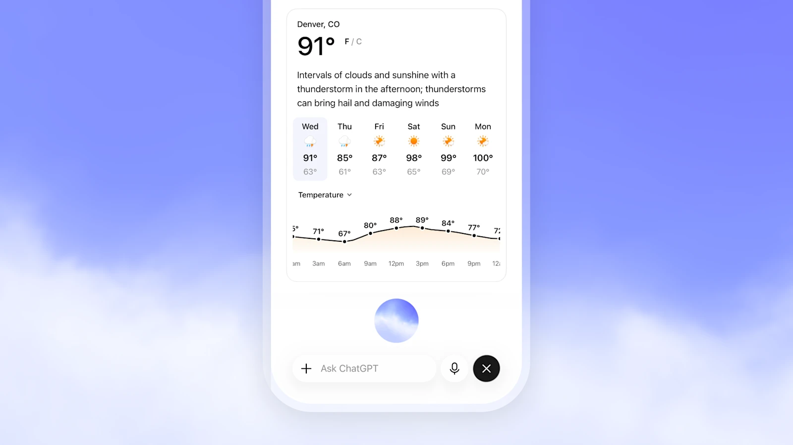

# OpenAI GPT-Live Deep Dive: Voice Agents Are Moving from Low Latency to Continuous Interaction and Background Delegation

> **TL;DR:** OpenAI launched GPT-Live-1 and GPT-Live-1 mini on July 8, 2026, and began using them to power ChatGPT Voice. The important change is not simply lower voice latency. GPT-Live introduces a two-layer runtime: a full-duplex foreground model continuously decides whether to speak, listen, wait, yield, or invoke a tool, while harder search and reasoning work is delegated to GPT-5.5 in the background. Voice agents are becoming interaction control layers that manage conversational rhythm, asynchronous work, and streaming safety at the same time.

- **Source:** [Introducing GPT-Live - OpenAI](https://openai.com/index/introducing-gpt-live/)
- **System card:** [GPT-Live System Card](https://deploymentsafety.openai.com/gpt-live)
- **Product details:** [ChatGPT Voice - OpenAI Help Center](https://help.openai.com/en/articles/20001274)
- **Published:** 2026-07-08
- **Accessed:** 2026-07-10
- **Tags:** OpenAI / GPT-Live / ChatGPT Voice / voice agent / full duplex / speech-to-speech / agent runtime

## One-Sentence Take

**GPT-Live matters because it splits voice interaction and complex task execution into two time scales that can run in parallel.**

GPT-Live-1 handles millisecond-to-second interaction in the foreground: noticing that a user is still thinking, accepting an interruption, offering a small listening cue, or deciding to stay quiet. GPT-5.5 handles second-to-minute work in the background: web search, deeper reasoning, and more involved agentic tasks.

The voice model no longer has to optimize two conflicting goals inside one loop: respond immediately and think deeply. It can preserve conversational flow first, then bring stronger intelligence back asynchronously.

## Three Generations of Voice Systems

OpenAI frames GPT-Live against two earlier architectures:

| Architecture | Processing model | Main limitation |
|---|---|---|
| Cascaded voice | speech to text → language model → text to speech | information can be lost between models; responses are slow and stilted |
| Turn-based audio model | one model processes and generates audio but waits for the user's turn to end | pauses are easily mistaken for completion; conversation still alternates rigidly |
| GPT-Live | continuously receives audio, generates output, and revisits interaction decisions | more natural, but orchestration, state, and safety become harder |

The first two systems both treat “whose turn is it?” as a boundary condition. A cascade waits for transcription. A turn-based audio model such as Advanced Voice Mode is faster, but it still relies heavily on silence to infer that the user has finished.

Human conversation is not a sequence of cleanly submitted messages. People pause, restart sentences, overlap, acknowledge one another with fragments, and sometimes explicitly say, “Let me finish before you answer.” A system that treats every silence as a submit button will feel impatient even when its model latency is excellent.

GPT-Live reframes the problem: **at this moment, should the system speak, keep listening, pause, yield, or invoke a tool?** OpenAI says the model can make these interaction decisions many times per second. This is no longer ordinary turn detection. It is a continuous interaction policy.

## Full Duplex Is Really About Simultaneity

Full duplex is often reduced to one visible feature: the user can interrupt the AI. Interruption is only the simplest consequence.

The deeper change is that input and output no longer exclude one another. GPT-Live continues processing incoming audio while it speaks, which lets it:

1. stop or redirect when the user talks over it;
2. distinguish a thinking pause from the end of a turn;
3. signal attention without taking control of the conversation;
4. adapt to pace and timing;
5. decide when to invoke tools inside a continuous audio stream;
6. support more natural live translation.

This behaves more like a real-time scheduler than a chat box with a voice attached. The model must maintain state about who is speaking, who wants to speak, what tasks are underway, whether a background result has arrived, and whether now is an appropriate moment to surface it.

That changes voice-agent metrics. Time to first audio still matters, but teams also need interruption false-positive rate, stop latency after a barge-in, tolerance for long pauses, recovery from overlapping speech, robustness to background noise, and the quality of re-entry when asynchronous work completes.

## The More Important Design: Decoupling Interaction from Reasoning

GPT-Live's second architectural change may be more strategically important than full duplex.

When a request needs web search, deeper reasoning, or more agentic work, GPT-Live delegates it to another frontier model. At launch, GPT-Live-1 Instant and mini use GPT-5.5 Instant in the background, while Medium and High use GPT-5.5 Thinking with corresponding reasoning effort.

The foreground model does not need to go silent while that task runs. It can continue the conversation, clarify the request, and potentially manage multiple pieces of work. When the result is ready, it brings it back into the dialogue.

The separation is clean:

```text
Continuous audio input
    ↓
GPT-Live: listen, speak, pause, yield, route tools
    ├── Simple request: answer directly
    └── Complex request: delegate to GPT-5.5 / search / agent
                              ↓
                       Background result
                              ↓
GPT-Live delivers it at an appropriate conversational moment
```

GPT-Live becomes the interaction control plane; the frontier model becomes the task-execution plane. OpenAI can upgrade the model behind delegation without replacing the entire real-time interaction model, and the launch post explicitly says that the underlying frontier model will be updated over time.

For product teams, this is more flexible than binding everything to a single general model. The foreground can be trained for latency, prosody, interruptions, and listening behavior. The background can be optimized for search, code, knowledge work, and long-running tasks. A delegation contract connects them without forcing both workloads into the same latency budget.

## Voice Is No Longer an Audio-Only Interface

OpenAI is also bringing visual cards for weather, stocks, sports, maps, and other results into Voice. Search, memory, images, and file uploads remain available, while GPT-Live can speak and display structured information at the same time.



The official example reveals an important product principle: complex answers should not be forced into narration. Forecast curves, fixture lists, maps, and comparison tables are easier to scan than to hear. Voice can explain and navigate them while the screen carries the dense information.

A mature voice-agent interface is therefore likely to coordinate three channels:

- audio for rhythm, social presence, and hands-free control;
- text for precise records and review;
- visual components for dense, scannable, actionable information.

Voice does not need to replace the screen. It can become a persistent control layer above it.

## Evaluation: Naturalness Is More Than WER and Latency

OpenAI added matched 5–10 minute human evaluations for overall preference, turn-taking, interruptions, conversational flow, and naturalness. The company reports that GPT-Live-1 and mini are strongly preferred to Advanced Voice Mode.

Capability evaluations include:

- GPQA for expert-level scientific reasoning;
- BrowseComp for difficult information retrieval and agentic web search;
- an internal variant of τ³-Voice Telecom for realistic multi-turn support tasks.

The launch page provides qualitative statements such as “substantially outperforms” and “strong gains,” but it does not publish full values, confidence intervals, or cost budgets for these charts. Those claims should not be turned into a reproducible absolute ranking.

There is another important caveat: GPT-Live's intelligence results include background delegation. The system card says evaluations reflect the deployed setup with delegation enabled. These scores therefore measure the voice runtime, not only the foreground GPT-Live model.

That is a valid product evaluation, but it is not a clean single-model comparison. Teams should separately report foreground interaction quality, background-model capability, tool success, and end-to-end task completion.

## Streaming Safety Must Act Before the Sentence Ends

A text system can sometimes check a completed answer before showing it. Real-time voice does not have that luxury. Spoken content cannot be retracted after it reaches the user.

GPT-Live therefore adds streaming safeguards. Inputs and generated outputs are checked as the conversation unfolds. The system can steer the response while it is being spoken, play a spoken safety message, display written support resources, or end the call in higher-risk cases.

OpenAI added audio-native evaluations for areas including self-harm, psychosis and mania, emotional reliance, violence, and sexual content. It tested both authorized real-world audio and synthetic spoken prompts. The system card also discloses two small, non-statistically-significant regressions on adversarial production prompts: GPT-Live-1 moved from 0.88 to 0.82 on emotional reliance, while mini moved from 0.97 to 0.95 on sexual content.

That detail matters. Voice safety is not only about prohibited content. It also involves tone, dependency, real-time escalation, and harmful interruptions. GPT-Live uses predefined voices and includes safeguards against imitating a real person's voice.

The system card further notes that GPT-Live itself launches without broad independent tool access or code execution. More complex work inherits part of its risk profile and safeguards from the model receiving the delegated task. Safety is layered too: the foreground manages live audio, the background governs task capability, and the system layer monitors and interrupts.

## Availability and Limitations

GPT-Live is rolling out to ChatGPT consumer plans on web, iOS, and Android:

| User or scenario | Launch status |
|---|---|
| Go, Plus, Pro | GPT-Live-1 becomes the default |
| Free | GPT-Live-1 mini becomes the default |
| Business, Enterprise, Edu | Live is not available at launch |
| API | planned “soon”; notification signup only |
| Video and screen sharing | not supported in Live at launch; remain available in Advanced Voice Mode |
| connected apps, plugins, custom GPTs, Codex | not supported by Live at launch |
| ChatGPT desktop app, Temporary Chats | Live is not available at launch |

OpenAI says more than 150 million people use Voice and Dictation each week, but GPT-Live is still a gradual rollout. Availability depends on region, plan, and app version.

Language quality is uneven as well. OpenAI says it optimized the system for popular ChatGPT languages, while acknowledging that some languages may have non-native accents or fluency gaps. Live is also designed primarily for one-on-one conversation, not several people speaking at once.

For privacy, audio clips from Live and Advanced Voice are stored with the chat transcript for 30 days. OpenAI says it does not train on those audio clips unless the user actively opts in to sharing them for model improvement. Whether transcripts and other files can be used depends on plan and data-control settings.

## What Developers Should Take From It

The GPT-Live API is not publicly available yet, so the launch post is not an API specification. OpenAI has not published pricing, event schemas, latency targets, context length, concurrency limits, or a delegation interface.

It does, however, expose a reusable system design:

1. **Do not force one model to serve every time scale.** Low-latency interaction and deep work need separate budgets.
2. **Upgrade turn detection into an interaction policy.** The system must choose when to listen, speak, wait, yield, and invoke tools.
3. **Make background work legible.** Users should know whether the agent is searching, reasoning, or waiting.
4. **Treat result delivery as a timing decision.** Completion does not mean the agent should interrupt immediately.
5. **Support streaming safety interventions.** Reviewing only after audio generation is too late.
6. **Evaluate long conversations.** A five-second demo will not expose interruption errors, drift, or dependency risks.
7. **Keep a visual output channel.** Dense information should not be converted entirely into speech.

The hard engineering work moves from ASR and TTS accuracy toward orchestration: synchronizing audio streams, tool calls, background models, UI cards, memory, and safety state; recovering from network jitter; preventing two completed tasks from talking over one another; and allowing the user to cancel or redirect work at any moment.

## Conclusion

GPT-Live is more than a smoother Advanced Voice Mode. It redraws the responsibilities inside a voice agent.

GPT-Live-1 handles the present moment: continuously listening, speaking naturally, understanding pauses, accepting interruptions, and maintaining flow. GPT-5.5 and other agents handle the background: search, reasoning, and longer tasks. Visual UI carries information that should not be read aloud, while streaming safeguards intervene before unsafe speech finishes.

The architecture works because it recognizes that natural interaction and frontier intelligence are different optimization problems.

The next voice-agent competition may not be only about the most human voice or the lowest latency. It may be about who can best manage three things: **real-time rapport, background work, and the timing of return.**

When those layers work together, Voice stops being an input method and becomes a primary interface for agents.
