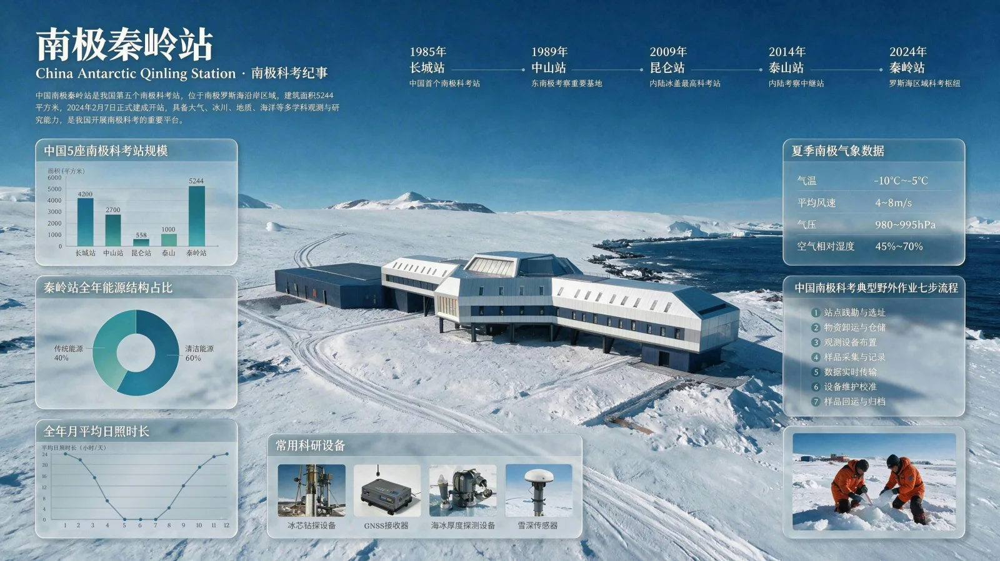
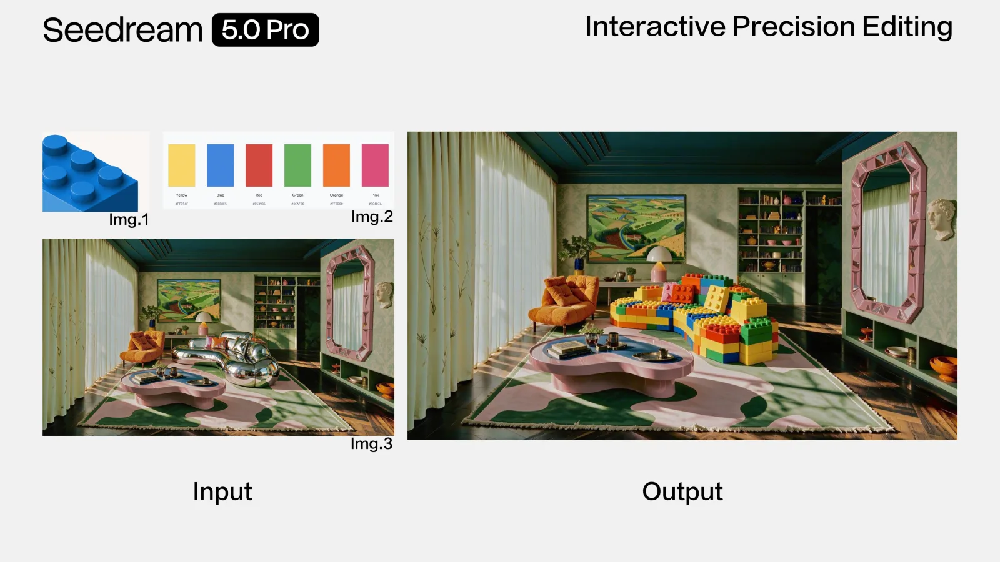
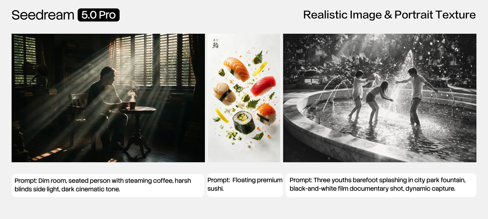
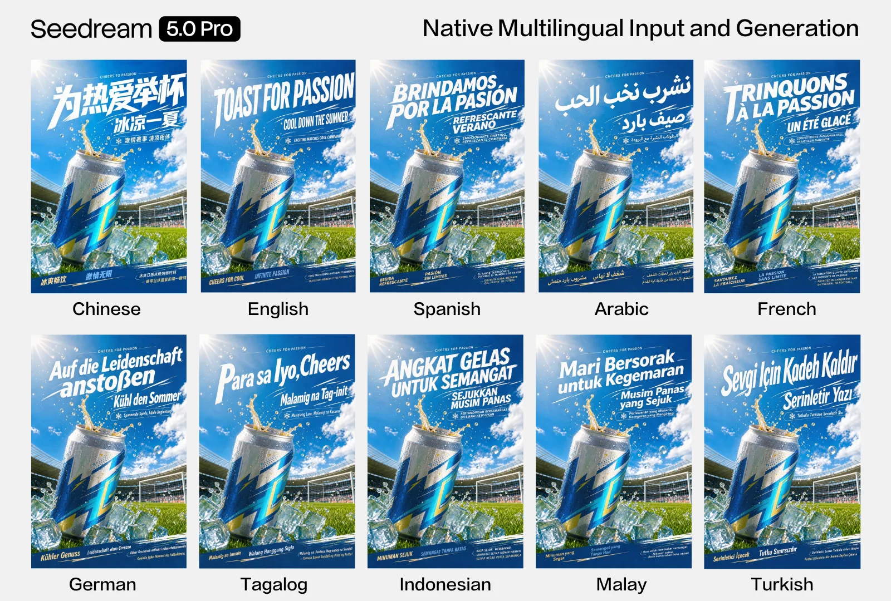

# Seedream 5.0 Pro 深度拆解：图像模型正在从出图工具变成设计生产接口

> **TL;DR:** ByteDance Seed 在 2026-07-08 发布 Seedream 5.0 Pro，把它定位为面向专业生产的多模态图像创作模型。官方强调四类能力：高密度信息图、交互式精确编辑、摄影/人像质感、原生多语言输入与生成。真正值得看的不是“画面更漂亮”，而是它把图像模型推向了一个更具体的产品方向：模型要能理解版式、文字、局部区域、材质、图层和本地化语境，才能进入设计、营销、教育、广告和内容生产的日常工作流。

- **Product page:** [Seedream 5.0 Pro](https://seed.bytedance.com/en/seedream5_0_pro)
- **Tech blog:** [Beyond Generation, It Understands Design | Introducing Seedream 5.0 Pro](https://seed.bytedance.com/en/blog/beyond-generation-it-understands-design-introducing-seedream-5-0-pro)
- **Previous context:** [Seedream 4.5](https://seed.bytedance.com/en/seedream4_5), [Seedream 5.0 Lite](https://seed.bytedance.com/en/seedream5_0_lite)
- **Accessed:** 2026-07-10
- **Tags:** Seedream 5.0 Pro / ByteDance Seed / AI image generation / image editing / design workflow / multilingual rendering

## 一句话判断

**Seedream 5.0 Pro 的关键词不是“生成”，而是“可生产”。**

很多图像模型的展示页都会强调审美、写实、风格多样性。但在真实生产环境里，漂亮只是一张入场券。设计师、市场团队、教育内容团队和电商团队更关心另一组问题：

- 复杂信息能不能被组织成可读版式？
- 局部改动能不能准确落在指定区域？
- 文字能不能稳定渲染，尤其是多语言文字？
- 多张参考图能不能融合到同一张图里？
- 生成结果能不能继续编辑，而不是每次从头重抽？

ByteDance Seed 的官方 blog 直接把这个问题说出来：视觉吸引力只是起点，真实生产更看重模型能否满足复杂、专业的创意需求，缩短创作者意图和最终画面之间的距离。

这也是 Seedream 5.0 Pro 和一般“文生图升级”的区别。它不是只把 prompt alignment、画质、审美再往上推一层，而是把图像模型放进更接近设计软件的语境里：版面、区域、图层、局部修改、材质替换、文本排版、本地化。

## 四个核心能力，其实对应四类生产瓶颈

官方把 Seedream 5.0 Pro 的突破概括成四项：

| 官方能力 | 生产里的真实问题 |
|---|---|
| Complex information visualization | 一张图里有大量文字、图表、层级和概念关系，模型不能只会“画氛围” |
| Interactive precision editing | 设计修改通常是局部的，不能每次都重绘整张图 |
| Realistic imagery and portrait textures | 广告、商品、人像、建筑和素材合成需要可信光影与材质 |
| Native multilingual input and generation | 全球化素材不是翻译一句 prompt，而是文字、排版、文化语境一起适配 |

这四项共同指向一个变化：图像模型正在从“单次生成器”变成“视觉工作台的一层智能接口”。

早期 AI 图像工具常见的工作方式是：写 prompt，抽多张，挑一张，用 Photoshop 或 Figma 手修。Seedream 5.0 Pro 的方向则更接近：用模型直接承接一部分设计指令，把“生成”和“修改”放在同一个循环里。

## 高密度信息图：它测试的是文字、结构和空间规划

官方展示的“南极秦岭站”信息图很能说明问题。它不是单纯生成一张极地建筑图，而是在同一画面里放入时间线、柱状图、饼图、月照时长曲线、气象数据、野外作业流程、科研设备和现场采样照片。

这类任务的难点不只是“画得像”。模型必须同时处理：

1. **信息分区**：主视觉、图表、说明文字、流程列表不能互相挤压；
2. **文字渲染**：标题、标签、图例、数字需要可读；
3. **视觉层级**：读者要先看到主题，再看到证据和细节；
4. **概念映射**：时间线、能源结构、科研流程要与主题相关；
5. **版式一致性**：整个画面要像一张经过设计的信息海报，而不是拼贴。

这解释了为什么高密度信息图正在成为图像模型的重要测试场。它把语言理解、空间布局、文字生成、图表常识和视觉设计压在同一个输出里。只会生成美图的模型，很容易在这里露馅：文字错、图表乱、信息层级塌、内容看似丰富但无法阅读。

当然，官方也承认 Seedream 5.0 Pro 在更细粒度文字渲染上仍有提升空间。这个 caveat 很重要。信息图不是艺术海报，文字和数据一旦错，视觉再漂亮也不能直接用于严肃场景。

## 交互式精确编辑：从 prompt 变成“区域控制”

Seedream 5.0 Pro 最值得关注的能力是 interactive precision editing。官方说它理解空间位置和区域语义，支持点选、套索、草图、颜色/材质替换、图层分离和多图融合。

这背后有一个很实际的设计痛点：自然语言擅长描述“我要什么”，但不擅长精确描述“改哪里”。

比如“把沙发换成某种材质和颜色”听起来简单，实际要同时锁定：

- 哪个对象是沙发；
- 哪些像素属于沙发，哪些属于背景；
- 材质从哪里参考；
- 颜色如何匹配；
- 透视、阴影、遮挡和环境光如何保持一致。

上图展示的是使用一个材质参考、一个色板和一张室内图，让模型修改沙发。这里真正有价值的不是它能不能把沙发变好看，而是它把多种控制信号合并成一次局部修改：参考图、色板、目标对象、环境一致性。

这让图像模型更像设计软件里的“智能操作”。设计师不需要把整张图重新生成十次，只要锁定区域，给出材质、颜色、风格或图层要求，然后进入小步迭代。

## 设计生产需要的是“可逆”和“可拆”

官方 blog 还提到 Seedream 5.0 Pro 支持 layer separation：通过文字描述把完整图像拆成独立图层，包括文本、主体、背景和环境装饰；被主体遮挡的背景区域也会被补全，图层保留透明度，可以拖拽、缩放、替换核心主体。

这对生产工作流很关键。

传统文生图的问题是输出太“扁平”。一张图很好看，但如果客户说“把鹦鹉换成孔雀，背景别动，文字保留”，模型往往需要重新生成。重新生成会带来不可控变化：构图变了、颜色变了、文字坏了、人物也变了。

图层分离解决的是另一个问题：**生成结果能否进入后续设计工具链。**

如果模型能把图像拆成可编辑资产，那么它就不只是出图器，而是资产生成器。它可以服务于：

- 海报设计的主体替换；
- 电商 Banner 的背景和商品分层；
- 游戏概念图的前景/中景/背景拆分；
- 社媒素材的多尺寸改版；
- 品牌模板里的文字和装饰元素替换。

这也是为什么“图层”比“高清”更接近生产价值。高清只是看起来能用；图层化才意味着后续能改。

## 摄影质感：不只是写实，而是多素材合成的一致性

官方把 Seedream 5.0 Pro 的写实能力描述为对真实世界光影、材质和皮肤纹理的理解。展示里有穿过百叶窗的强侧光、寿司广告里的悬浮食材、黑白胶片质感的喷水场景、玻璃反射和建筑空间等。

对设计生产来说，写实能力的核心不是“这张图像照片”。更重要的是一致性：

- 光源方向是否一致；
- 材质反射是否合理；
- 皮肤、玻璃、金属、布料是否有不同质感；
- 多张参考图合成后，人物是否像在同一个场景里；
- 动态摄影效果是否符合相机运动规律。

这些能力会直接影响广告、电商、短剧概念图、游戏角色、建筑可视化和社媒物料。尤其是多图合成场景，一张图里的不同对象如果光影不一致，用户很快会觉得“AI 味”很重。

所以 Seedream 5.0 Pro 的写实升级，真正应该放进“合成一致性”里看，而不只是和其他模型比单张美图。

## 多语言生成：全球化素材的难点是排版，不只是翻译

官方称 Seedream 5.0 Pro 支持十余种常用语言的直接输入与高质量生成，包括法语、德语、俄语、日语、韩语、西班牙语和阿拉伯语。展示图里，同一个饮料广告模板被生成成中文、英文、西班牙语、阿拉伯语、法语、德语、他加禄语、印尼语、马来语和土耳其语版本。

这件事的难点不是把 “Toast for Passion” 翻成其他语言。真正难的是：

- 阿拉伯语从右到左；
- 西班牙语有重音符号；
- 德语词更长，容易破坏标题版式；
- 不同市场的广告语长度不同；
- 字体风格、大小、倾斜、行距需要随语言变化；
- 底部小字也要尽量保持清晰。

如果图像模型能在模板级别处理多语言文字，它就能进入更真实的营销生产：同一套品牌素材，多市场本地化、多尺寸输出、多渠道适配。

这也是我认为 Seedream 5.0 Pro 最有商业意义的能力之一。全球化内容团队最不缺“单张好图”，缺的是低成本生成一组可用变体，并且每个变体都不需要大量人工修字。

## 和 Seedream 4.5 / 5.0 Lite 的关系

Seedream 4.5 官方页已经强调过参考图一致性、多图编辑、版式和密集文字渲染。Seedream 5.0 Lite 则强调统一多模态图像生成、deep thinking、online search，以及理解、推理和生成能力升级。

Seedream 5.0 Pro 更像是把这些方向收束到“专业生产”上：

- 不是只强调能生成，而是强调复杂信息可视化；
- 不是只强调能编辑，而是强调空间标注、局部控制和图层；
- 不是只强调写实，而是强调可用于商业广告和人像质感；
- 不是只强调多语言 prompt，而是强调多语言文字在图像里的排版与渲染。

换句话说，Lite 更像面向广泛创作和实时信息生成的通用入口，Pro 更像面向设计、营销、教育、电商和专业内容团队的生产入口。

## 它会改变创作者工作流的哪一段

我会把 Seedream 5.0 Pro 放到三个环节里看。

第一是**前期概念探索**。设计师可以更快生成信息图、网页 Hero、广告 KV、故事板、视觉拼贴和本地化版本，把抽象方向变成可讨论的视觉草案。

第二是**中期局部迭代**。区域标注、材质替换、颜色控制、草图驱动和多图融合，会减少“整图重抽”的次数。它的价值不是一步到位，而是让用户能以更小步长修改图像。

第三是**后期资产交付**。如果图层分离足够稳定，模型输出就能进入 Figma、Photoshop、剪辑软件或广告素材管理系统，而不是停留在一张 JPEG。

这三段连起来，Seedream 5.0 Pro 才真正像一个 production model。它不只是“更会画”，而是更接近“懂得设计生产的约束”。

## 还需要谨慎的地方

官方自己提到，Seedream 5.0 Pro 在更细粒度文字渲染和像素级编辑一致性上仍有提升空间。对专业使用者来说，这两点恰好是验收重点。

我会建议团队在引入这类模型时重点测试：

1. **文字准确率**：标题、小字、数字、单位、多语言字符是否稳定；
2. **局部编辑保持**：只改目标区域时，其他区域是否漂移；
3. **图层可用性**：分离出的图层边缘、透明度和补全背景是否可继续编辑；
4. **品牌一致性**：同一品牌色、字体感、商品外观是否在多次生成中保持；
5. **数据可信度**：信息图里的数值、图表和事实不能只靠模型生成，需要外部校验；
6. **版权与素材来源**：参考图、多图融合和人像合成要有授权边界。

尤其是信息图和教育内容，不能因为模型会排版就默认内容正确。图像模型生成的是视觉表达，不是事实校验系统。

## 结论

Seedream 5.0 Pro 的发布说明了一个清晰趋势：图像模型的竞争正在从“谁更会画”转向“谁更能进入生产链”。

它的核心不只是高画质，而是四个更具体的生产能力：

- 把复杂信息组织成可读版式；
- 把修改限制在用户指定区域；
- 把多素材合成成光影一致的画面；
- 把同一视觉模板扩展到多语言市场。

这类能力如果稳定，就会改变设计师和内容团队使用 AI 的方式。AI 不再只是灵感图机器，而是成为视觉资产工作流里的一个可调用接口：能生成、能编辑、能分层、能本地化，也能被后续工具继续接管。

真正的分水岭不是 Seedream 5.0 Pro 能否生成一张惊艳样图，而是它在日常、重复、细碎、要求不跑偏的生产任务里，能否减少返工。那才是图像模型从 demo 进入生产的关键。
