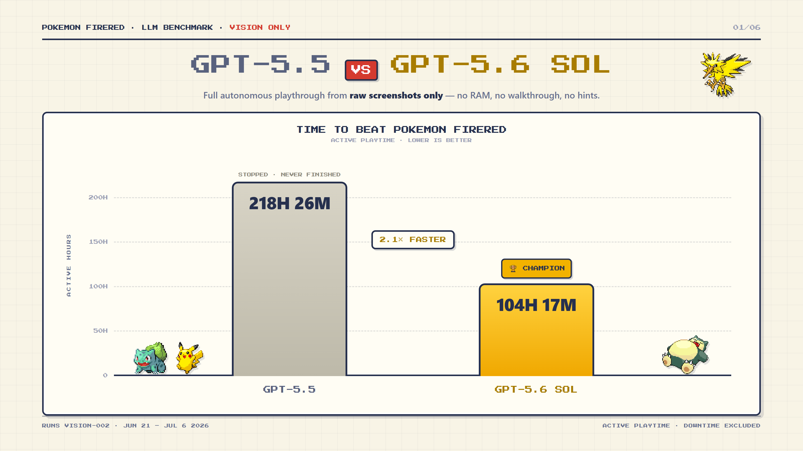
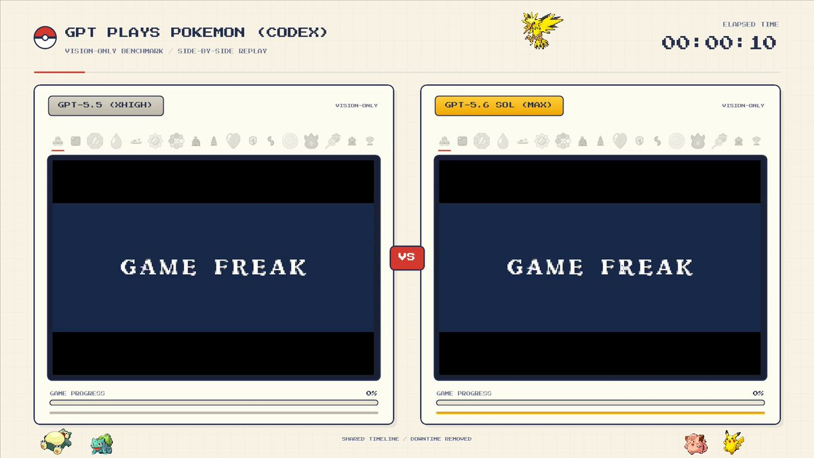

# GPT-5.6 Sol Beats Pokémon FireRed: What a Vision-Only Long-Horizon Agent Test Really Measures

> **TL;DR:** Clad3815 compared GPT-5.6 Sol and GPT-5.5 on the “GPT Plays Pokémon FireRed” benchmark under vision-only conditions: raw game screenshots only, with no RAM, walkthroughs, or hints. The reported result is that GPT-5.6 Sol became Champion after 104h17m of active playtime, while GPT-5.5 stopped after 218h26m without finishing. The interesting part is not that a model can play Pokémon. It is that the test compresses visual grounding, long-term memory, route planning, error recovery, menu operation, and sparse rewards into a long-horizon agent setting that people can understand.

- **Source:** [Clad3815 on X](https://x.com/Clad3815/status/2075268438025453666)
- **Comparison video:** [side-by-side 218h vs 104h run](https://x.com/Clad3815/status/2075268454890766706)
- **Harness reference:** [Clad3815/gpt-play-pokemon-firered](https://github.com/Clad3815/gpt-play-pokemon-firered)
- **Model context:** [OpenAI GPT-5.6 release](https://openai.com/index/gpt-5-6/)
- **Accessed:** 2026-07-10
- **Tags:** GPT-5.6 Sol / Pokémon FireRed / vision-only agent / long-horizon benchmark / computer use / agent harness

## One-Sentence Take

**This benchmark is not really about whether a model knows Pokémon. It is about whether a model can keep making good small decisions in a long, low-bandwidth, delayed-feedback visual environment.**

Clad3815’s post is concise: GPT-5.6 Sol vs GPT-5.5 on the “GPT Plays Pokémon FireRed” benchmark, vision-only edition. The chart states the condition: full autonomous playthrough from raw screenshots only; no RAM, no walkthrough, no hints.

The result is striking:

| Model | Condition | Result |
|---|---|---|
| GPT-5.5 | vision-only | 218h26m, stopped / never finished |
| GPT-5.6 Sol | vision-only | 104h17m, became Champion |

A reply links a 24-minute side-by-side compressed video, described as 218 hours vs 104 hours. The chart also notes that the measure is active playtime, excluding downtime, and labels the run as `VISION-002`, spanning June 21 to July 6, 2026.

This is not an official OpenAI benchmark and not a peer-reviewed evaluation. It is still useful because it tests behavior that many clean leaderboards miss: imperfect vision, distant goals, sparse local rewards, compounding mistakes, and self-maintained state.

## Why Pokémon FireRed Is a Useful Long-Horizon Agent Test

Pokémon FireRed looks like a nostalgia toy. For agents, it is surprisingly unforgiving.

The model must keep solving several problems:

- **visual reading:** maps, character direction, NPCs, menus, battle screens, text boxes;
- **state memory:** location, current goal, team state, items, badges, explored areas;
- **navigation:** towns, caves, buildings, mazes, and Victory Road;
- **menu operation:** items, moves, Pokémon switching, healing, purchases;
- **battle strategy:** types, HP, moves, PP, switching, preparation after loss;
- **error recovery:** wrong routes, loops, losses, forgotten goals, menu traps.

This resembles many web and desktop-agent tasks. A software agent must read the screen, click controls, understand forms, handle popups, remember context, and recover from layout changes. Pokémon puts those same patterns into a deterministic but very long world.

Its success criterion is also easy to understand: did the model become Champion?

## Why Vision-Only Matters

Clad3815’s earlier open-source `gpt-play-pokemon-firered` repository shows a fuller harness: mGBA runs the game; a Lua script exposes a socket bridge; a Python FastAPI bridge reads game memory and sends inputs; a Node.js agent loop manages decisions; and a dashboard displays logs, minimaps, inventory, team, and objectives.

That kind of harness is powerful and reasonable. It prevents the model from being destroyed by every pixel-level ambiguity and lets it focus more on route and strategy.

The chart for this run emphasizes a different condition: raw screenshots only, no RAM, no walkthrough, no hints. That shifts the problem from “can a model advance through a carefully engineered state machine?” to “can a model build a stable world model from screen pixels alone?”

That is much closer to real computer use. Real software rarely gives agents a perfect JSON state. It gives screens, buttons, text, occlusion, layout drift, error popups, and fragments of context.

## Why 104 Hours Is Still Progress

104h17m sounds slow. Human players do not need that long. But for an agent benchmark, the important question is not speedrunning. It is whether the model crosses long-term failure points.

In the chart, GPT-5.5 stops after 218h26m without finishing. GPT-5.6 Sol not only runs faster; it finishes. That gap likely comes from several improvements compounding:

1. **more stable screen understanding:** fewer misreads of menus, maps, NPCs, and text boxes;
2. **better goal persistence:** less drift from main objectives into irrelevant exploration;
3. **stronger error recovery:** trying a different plan after getting stuck;
4. **fewer local loops:** less repeated wandering in the same area;
5. **better action commitment:** actually pushing the boulder, buying items, healing, or switching when needed.

This lines up with OpenAI’s own GPT-5.6 positioning. The official release emphasizes agentic workflows, computer use, tool coordination, long-running work, higher reasoning effort, and multi-agent ultra mode. The Pokémon run is not official proof, but it offers a concrete side signal: in a long visual action loop, the model appears more persistent and recoverable.

## Do Not Overread the Result

The caveats matter.

First, this is a community self-reported benchmark. We have the chart, post, comparison video, open-source harness reference, and Reddit reposts, but not a fully controlled third-party protocol. Serious comparison would require fuller disclosure of prompts, sampling parameters, intervention rules, restarts, logging, and context windows.

Second, Pokémon FireRed is heavily represented online. The model was not given a live walkthrough, but it likely has pretraining exposure to routes, mechanics, maps, and strategy discussions. This tests visual action in a familiar world, not zero-shot generalization to a completely novel environment.

Third, vision-only does not mean no harness. The system still provides screenshots, executes button inputs, controls the loop, stores history, and may maintain logs or notes. A proper comparison must specify exactly what history the model sees, whether it can write notes, how much context it retains, and whether summaries are automatic.

Fourth, game benchmarks are engaging but biased. They emphasize navigation, menus, exploration, and persistence. They do not directly measure code editing, office automation, research analysis, or web task performance.

So the right reading is: this is a strong agent signal, not a complete ranking.

## What It Suggests for Agent Products

The post points toward a broader evaluation trend: future agent tests will care more about sustained action, not just one-shot answers.

A good long-horizon agent test should cover:

| Capability | In Pokémon | In Real Software |
|---|---|---|
| visual grounding | screens, maps, menus | webpages, UI, documents, spreadsheets |
| state maintenance | goal, location, team, items | project goals, files, permissions, context |
| action loop | buttons, battles, movement | clicks, edits, commands, submissions |
| error recovery | wrong routes, losses, loops | failed tests, changed pages, permission errors |
| sparse reward | badges and final Champion state | task completion after many steps |

This is why the harness remains central to agent products. The model matters, but whether it can keep doing useful work depends on how the surrounding system organizes observation, memory, action, validation, rollback, and logs.

Pokémon FireRed makes the problem visible. A model does not win because a single prompt is clever. It wins because across thousands of loops, it makes fewer small mistakes.

## How to Make This a More Rigorous Benchmark

To turn this from a compelling community demo into a stricter evaluation, I would look for five things:

1. **fixed protocol:** exactly what screenshots, history, notes, and system prompts are available;
2. **public run logs:** actions, screenshot hashes, model outputs, failures, and recoveries;
3. **multiple seeds and games:** FireRed, Crystal, Emerald, Blue, repeated runs;
4. **sub-metrics:** loops, stuck time, menu errors, battle losses, route backtracking;
5. **harness ablations:** raw vision, vision + notes, vision + minimap, vision + RAM state.

That would tell us more than a single completion number. Agent failures often come from tiny repeated behaviors: seeing one door wrong, forgetting one item, walking the same route again, or naming the right action without executing it.

## Conclusion

The value of Clad3815’s post is not that GPT-5.6 Sol can play Pokémon. It is the long-horizon agent signal:

**When the model only sees the screen, with no RAM, walkthrough, or hints, it can still keep advancing through a complex game world to the end.**

That is closer to real computer-use difficulty than many static multimodal benchmarks. Real software work is not a screenshot question. It is hundreds or thousands of observations, decisions, actions, corrections, and continuations.

If this result holds under more public and reproducible conditions, it suggests GPT-5.6 Sol’s progress is not just “smarter on single tasks.” It is closer to “less likely to fall apart in a long visual environment.” That is exactly the capability next-generation computer-use agents need.
