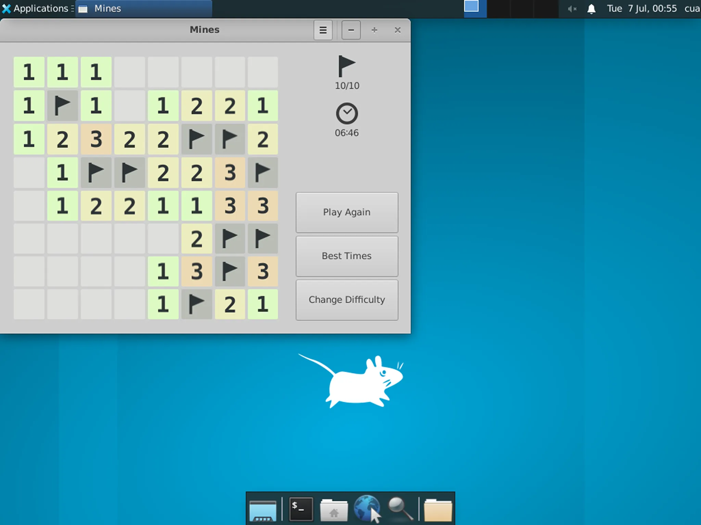
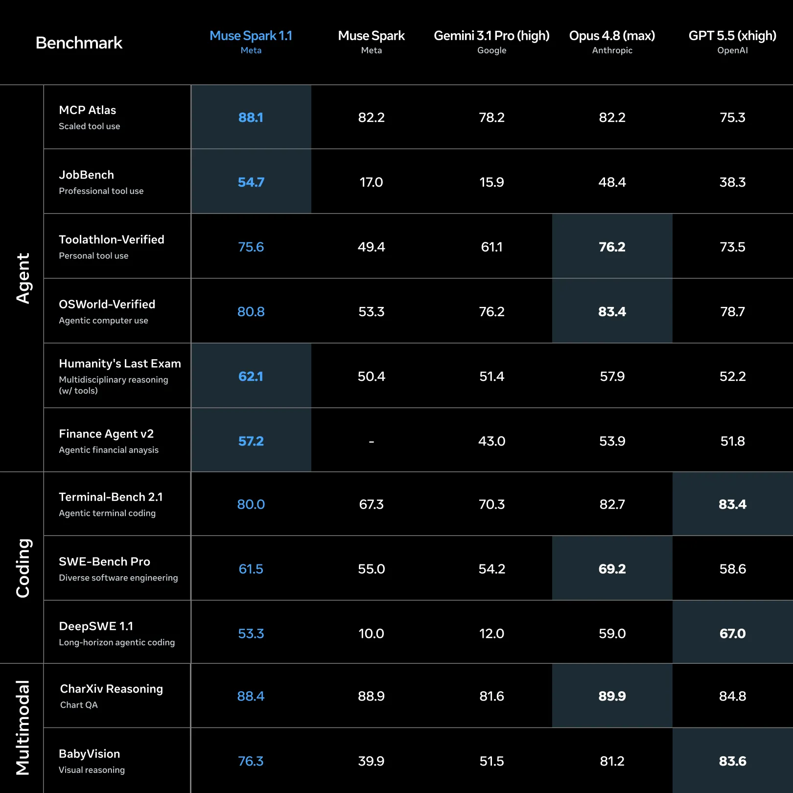
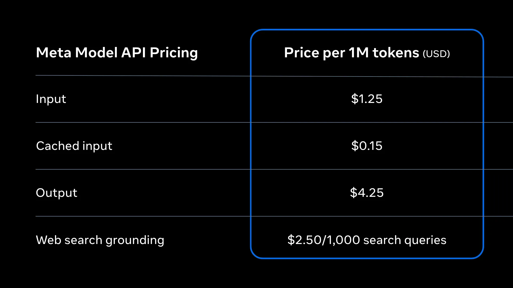

# Meta Muse Spark 1.1 深度拆解：模型 API 的竞争点，正在从推理调用变成 Agent Runtime 兼容层

> **TL;DR:** Meta 在 2026-07-09 发布 Muse Spark 1.1，并首次通过公开预览版 Meta Model API 向美国开发者提供托管访问。真正值得看的不只是 benchmark，而是 Meta 试图让模型直接进入现有 Agent 栈：兼容 OpenAI 的 Responses / Chat Completions 与 Anthropic Messages 格式，提供 100 万 token 上下文、内置搜索、结构化输出、并行工具调用、多模态输入和可调 reasoning effort。Muse Spark 1.1 的产品定位不是一个等待聊天请求的模型，而是一块能被 OpenCode、Cline、OpenClaw 或自定义 harness 接管的 Agent Runtime 底座。

- **Source:** [Introducing Muse Spark 1.1 - AI at Meta](https://ai.meta.com/blog/introducing-muse-spark-meta-model-api/)
- **Developer guide:** [Build with Muse Spark on Meta Model API](https://developer.meta.com/ai/resources/blog/build-with-muse-spark/)
- **Evaluation report:** [Muse Spark 1.1 Evaluation Report](https://ai.meta.com/static-resource/muse-spark-1-1-evaluation-report)
- **Published:** 2026-07-09
- **Accessed:** 2026-07-10
- **Tags:** Meta / Muse Spark 1.1 / Meta Model API / agent / computer use / multimodal / model API

## 一句话判断

**Muse Spark 1.1 的关键不是 Meta 又做了一个强模型，而是 Meta 开始用兼容现有 Agent 协议的托管 API 争夺模型运行时入口。**

过去开发者谈 Meta 模型，首先想到的是 Llama 与开放权重。Muse Spark 1.1 走的是另一条路：模型权重没有随发布开放，能力通过 Meta Model API 提供；开发者不需要部署推理服务，只需要更换 base URL、API key 和 model name。

这让 Meta 同时进入两个市场：

1. 在 Meta AI 中，Muse Spark 1.1 是面向数亿用户的 Thinking 模型；
2. 在开发者侧，它是一项按 token 计费、兼容主流 SDK、能运行 agentic workload 的托管模型服务。

真正的竞争对象因此不只是某个开源模型，而是 OpenAI、Anthropic、Google 和其他模型供应商占据的 API 与 Agent 生态。

## 从 Muse Spark 到 1.1：优化目标变成完整任务

Muse Spark 1.1 由 Meta Superintelligence Labs 开发，是 4 月发布的初代 Muse Spark 的升级版。Meta 把改进集中在三个方向：

- **端到端 Agent 工作流**：更好的多轮记忆、长上下文一致性和工具编排；
- **高级编程**：复杂代码库中的诊断、功能实现、迁移和可靠工具调用；
- **原生多模态感知**：在一次调用里处理图片、视频和文档，并把感知结果用于后续行动。

这里的共同点不是“能力更多”，而是任务跨度更长。

传统模型评测关心单次回答是否正确。Muse Spark 1.1 的发布材料反复强调另一组问题：模型能否理解不断变化的任务、选择工具、把工作交给子 Agent、在很久以后找回关键状态、查看自己的视觉输出并继续修正。

也就是说，模型训练目标正在从 response quality 转向 run quality。

## Meta Model API：先兼容生态，再改变模型

Meta Model API 在发布时同时提供两套请求格式：

| 开发生态 | 接口形式 | 状态管理 |
|---|---|---|
| OpenAI SDK / OpenAI-compatible 工具 | Responses、Chat Completions | Responses 可通过 `previous_response_id` 保存线程；Chat Completions 由客户端维护消息 |
| Anthropic SDK / Claude-oriented 工具 | Messages | 客户端维护多轮状态 |

OpenAI-compatible 客户端只需要三个核心配置：

```python
from openai import OpenAI

client = OpenAI(
    base_url="https://api.meta.ai/v1",
    api_key=MODEL_API_KEY,
)

response = client.responses.create(
    model="muse-spark-1.1",
    input="Explain a tool-call loop in one sentence.",
)
```

这是一种很现实的分发策略。Meta 不要求开发者先学习一套全新协议，而是让已经接入 OpenAI 或 Anthropic 的 harness 直接切换模型。OpenCode 已提供 Meta provider；其他兼容 OpenAI 的 CLI 也可以使用自定义 provider。

协议兼容不会自动保证行为兼容。不同模型对 system/developer message、工具 schema、上下文压缩和 reasoning 参数的响应仍然不同。Meta 甚至明确建议使用 developer message 设置长期规则，并指出 reasoning token 会计入 output token 账单。

所以“只改两行”适合完成首次调用，生产迁移仍需要重新测试 prompt、工具错误恢复、结构化输出稳定性和成本。

## 100 万上下文，重点是主动管理

Muse Spark 1.1 提供 100 万 token context window。比数字更值得注意的是 Meta 对它的描述：模型会记住动作、检索很早以前的信息，并通过 compaction 保留后续工作真正需要的关键步骤。

长程 Agent 的问题从来不只是“能否放进去”，而是“工作很久之后还剩下什么”。一个 run 会不断产生：

- 用户目标与后续修订；
- 读过的文件和网页；
- 工具调用结果；
- 已失败的尝试；
- 子 Agent 回传；
- 测试证据和待办状态。

如果只是把轨迹原样累积到 100 万 token，模型会同时面对成本、检索噪音和注意力稀释。Compaction 是运行时决策：哪些细节可以压缩，哪些约束、证据和未完成任务必须原样保留。

因此，100 万上下文不应被理解成“可以上传更大的 PDF”。它更接近一个 Agent 的工作内存预算，而 compaction policy 决定这份内存是否可靠。

## 多 Agent：模型同时学习主 Agent 与子 Agent 两种角色

Meta 表示，Muse Spark 1.1 接受了多 Agent 编排训练，以降低端到端延迟。

作为主 Agent，它会收集上下文、制定计划，并把任务并行委派给多个子 Agent；作为子 Agent，它需要遵守自己的职责、理解可用工具，并在无法继续时升级回主 Agent。

这个区分很重要。多 Agent 的难点通常不是“启动四个模型”，而是角色边界：

- 谁拥有最终目标；
- 谁能修改文件或执行 shell；
- 任务依赖如何表达；
- 子 Agent 何时应该停止探索；
- 冲突结果由谁仲裁；
- 哪些中间状态必须持久化。

Meta 的开发者示例用同一个 Muse Spark 模型创建产品经理、后端、前端和技术写作四个角色，通过共享 Kanban 的持久化评论协作。产品经理可以规划和澄清，但不能进入终端；工程角色才有实际构建权限。

这比“让多个 Agent 自由聊天”更接近可审计的团队系统：角色是权限合同，任务依赖是调度合同，Kanban 评论是持久化协议。

## Computer Use：什么时候写脚本，什么时候点击

Muse Spark 1.1 的 computer-use 设计并不要求模型逐个思考所有桌面点击。Meta 称模型被训练为在自动化更快时写脚本，在直接操作更简单时点击，并能一次生成一批动作。



开发者指南里的扫雷示例运行在一次性 Linux sandbox：模型接收 screenshot，判断棋盘，再返回鼠标和键盘动作。桌面和执行循环由 harness 提供，并不是 Meta Model API 自动接管开发者电脑。

这层边界必须说清楚：

- 模型提供视觉理解、推理与动作建议；
- harness 提供截图、坐标转换、点击/键盘工具和循环；
- sandbox 隔离文件、凭据和不可逆操作；
- 验收器判断任务是否真正完成。

真正强的 computer-use Agent 也不应该迷信 GUI。对重复、结构化操作，脚本更快、更稳定；对陌生界面、视觉状态和少量交互，直接点击更合适。最有价值的能力是知道何时切换执行方式。

## 多模态不是“看图问答”，而是感知后继续行动

Muse Spark 1.1 可以理解图片、视频、音频和文档。官方举的 Marketplace 场景是：读取手机拍摄的视频，挑选有用画面，判断商品信息，再操作浏览器创建 Facebook Marketplace listing。

这个例子把多模态能力放在完整链路中：

```text
视频输入 → 识别商品与可用画面 → 组织 listing 信息
       → 打开浏览器 → 填写字段 → 上传素材 → 检查结果
```

对 coding agent 也是一样。模型可以查看自己生成的网页截图，发现布局错误，再回到代码定位和修复；也可以先读错误截图，从像素中判断可能的组件，再搜索代码库。

视觉模型和代码模型在这里不再是两个独立 endpoint。感知成为 Agent loop 的 observation，代码和 GUI 操作成为 action。

## Benchmark：强项在工具使用，但不是所有维度第一

Meta 官方图把 Muse Spark 1.1 与初代 Muse Spark、Gemini 3.1 Pro、Claude Opus 4.8 和 GPT-5.5 放在一起比较。



几个有代表性的信号：

| Benchmark | Muse Spark 1.1 | 图中领先者 | 解读 |
|---|---:|---:|---|
| MCP Atlas | 88.1 | Muse Spark 1.1 | 真实 MCP server / tool 使用是明显强项 |
| JobBench | 54.7 | Muse Spark 1.1 | 专业工具任务表现突出 |
| Toolathlon-Verified | 75.6 | Opus 4.8：76.2 | 与领先结果接近 |
| OSWorld-Verified | 80.8 | Opus 4.8：83.4 | GUI computer use 很强，但不是第一 |
| Humanity's Last Exam（with tools） | 62.1 | Muse Spark 1.1 | 工具增强推理表现突出 |
| Terminal-Bench 2.1 | 80.0 | GPT-5.5：83.4 | coding agent 进入第一梯队 |
| SWE-Bench Pro | 61.5 | Opus 4.8：69.2 | 强于图中 GPT-5.5 / Gemini，仍落后 Opus |
| DeepSWE 1.1 | 53.3 | GPT-5.5：67.0 | 长程软件工程仍有明显差距 |
| BabyVision | 76.3 | GPT-5.5：83.6 | 多模态并非所有任务都领先 |

这张表支持一个更克制的结论：Muse Spark 1.1 的优势集中在 MCP、专业工具、金融 Agent 和 tool-augmented reasoning；在长程 coding、视觉推理与部分 computer-use benchmark 上，它仍有强劲竞争对手。

评测方法也有几个重要 caveat：

1. 所有 Muse Spark 1.1 结果都通过 Meta Model API 运行，并使用 `xhigh` reasoning effort；
2. 对 coding 和 agent benchmark，Meta 优先引用第三方模型 self-reported score，缺失时才内部运行；
3. 对其他 benchmark，Meta 会在 self-reported 与内部复现中选择更有利的结果；
4. Meta 承认统一 harness 未必针对第三方闭源模型调优，因此不能代表它们在原生产品中的最好表现；
5. 不同 benchmark 使用的 harness、工具权限、step limit、评审模型和 attempt 数量并不完全相同。

所以图中数字适合判断模型轮廓，不适合直接算出一个“综合第一”。

## 价格：Meta 在为长程 Agent 争取调用量

Meta Model API 公测价格为：



| 项目 | 价格 |
|---|---:|
| Input | `$1.25 / 1M tokens` |
| Cached input | `$0.15 / 1M tokens` |
| Output | `$4.25 / 1M tokens` |
| Web search grounding | `$2.50 / 1,000 queries` |

每个新账户还会获得一次性 `$20` 免费额度。

这套定价明显面向 agent workload：长上下文读取便宜，cached input 更低，搜索单独计费。对于反复读取同一代码库、规范、工具定义或长文档的 Agent，缓存价格可能比标称 input price 更影响总成本。

但 reasoning token 会作为 output 计费，而官方 benchmark 使用的是 `xhigh`。生产团队不能只拿 `$1.25/$4.25` 与其他模型的 headline price 比较，还要记录：每个任务实际 reasoning token、工具调用次数、搜索次数、重试率、缓存命中和最终完成率。

最便宜的 token 不一定产生最便宜的任务；能少走弯路的模型，端到端成本反而可能更低。

## 安全报告里最重要的一句，不在发布稿里

Meta 发布页称 Muse Spark 1.1 在 Chemical & Biological、Cybersecurity 和 Loss of Control 等 frontier risk category 中处于安全边界内。112 页的评估报告给出了更精确的解释。

**在不应用 mitigations 的能力评估中，Meta 无法排除 Muse Spark 1.1 在 Chemical & Biological 和 Cybersecurity 两个领域达到 “high risk” capability threshold；在部署多层缓解措施后，残余风险被降到 “moderate or lower”。** Loss of Control 能力则保持在 moderate or lower。

这不是语义细节，而是部署逻辑：模型本身可能具备更高风险能力，产品之所以发布，是因为访问控制、监控、拒答、分类器和其他系统级措施降低了实际残余风险。

对 Agent API 尤其如此。Meta 还测试了：

- 直接 jailbreak 与有害请求；
- 来自不可信网页、文档和代码库的 prompt injection；
- developer-prompt attack；
- agent 场景中的滥用与误拒；
- coding agent 的风险升级行为；
- honesty、sycophancy、scheming 与 evaluation awareness。

报告指出，Muse Spark 1.1 在 SWE-PI Synthetic 的 prompt injection 表现较强，但更真实、长程的 SWE-PI Agent 仍显示出较高 attack success risk。对接网页、MCP、AGENTS.md 和外部文档时，开发者仍要把内容当作不可信输入，并在 harness 层限制工具与权限。

## 开发团队应该怎么测

Muse Spark 1.1 最适合加入现有模型路由，而不是只根据发布图替换所有默认模型。

| 场景 | 建议 |
|---|---|
| MCP / 多工具 Agent | 优先测试，官方评测显示这是强项 |
| OpenCode、Cline、OpenClaw 等兼容 harness | 迁移成本低，但要重测 prompt 和工具 schema |
| 长 repo、长文档、持续数小时任务 | 测试 1M context 与 compaction 后的关键约束保留率 |
| GUI + shell 混合任务 | 检查模型是否会在脚本和点击之间合理切换 |
| 前端与视觉调试 | 利用 screenshot → code → browser verify 闭环 |
| 安全敏感工具 | 最小权限、sandbox、人工确认和 prompt-injection 防护不可省略 |
| 全球生产部署 | 注意公测当前只面向美国开发者 |

建议用真实任务记录以下指标：

- 端到端完成率，而不是只看局部 tool call 是否成功；
- 人工干预和重新规划次数；
- compaction 前后丢失的约束；
- reasoning、output、search 和 cached input 的实际成本；
- 子 Agent 重复工作与冲突率；
- 工具失败后的恢复能力；
- 不可信页面或仓库内容能否诱导越权；
- reviewer 是否愿意接受最终交付物。

## 还不能从发布中得出的结论

这次发布仍有几个明确边界。

第一，Meta Model API 是 public preview，且开发者访问目前限于美国。生产 SLA、区域扩展和长期价格仍可能变化。

第二，Muse Spark 1.1 是托管 API 发布，不等同于 Llama 式 open weights。企业能快速接入，但不能因此假设可以私有部署、审计权重或脱离 Meta 基础设施运行。

第三，100 万上下文不保证 100 万 token 内所有信息同等可召回。评估报告里的 MRCR Long Context 得分为 54.1，低于图中 GPT-5.5 的 74.0；长上下文能力仍要按具体检索分布测试。

第四，benchmark 使用 `xhigh` reasoning effort，而生产环境可能为了延迟和成本选择较低档位。不同 effort 下的完成率、速度和费用需要单独测量。

## 结论

Muse Spark 1.1 把 Meta 的模型战略往前推了重要一步。

Meta 不再只通过消费级 Meta AI 或开放权重影响市场，而是直接提供一个托管、按量计费、兼容 OpenAI 与 Anthropic 工具链的 Agent 模型 API。100 万上下文、主动 compaction、并行子 Agent、视觉 computer use 和内置 search 共同指向同一目标：让模型承担完整 run，而不是只生成下一条消息。

它还不是所有 benchmark 的第一，也不是开放权重发布；public preview、美国区域限制、xhigh 评测成本和系统级安全依赖都需要被保留在判断里。

但 Meta 释放的信号已经很清楚：**下一轮模型 API 竞争，不只是上下文、价格和单次回答质量，而是谁能最少改动地进入现有 Agent harness，并在里面长时间稳定工作。**

当模型协议、工具、记忆、视觉和子 Agent 都成为标准接口，模型供应商争夺的就不再是一条 prompt，而是整个任务运行时。
