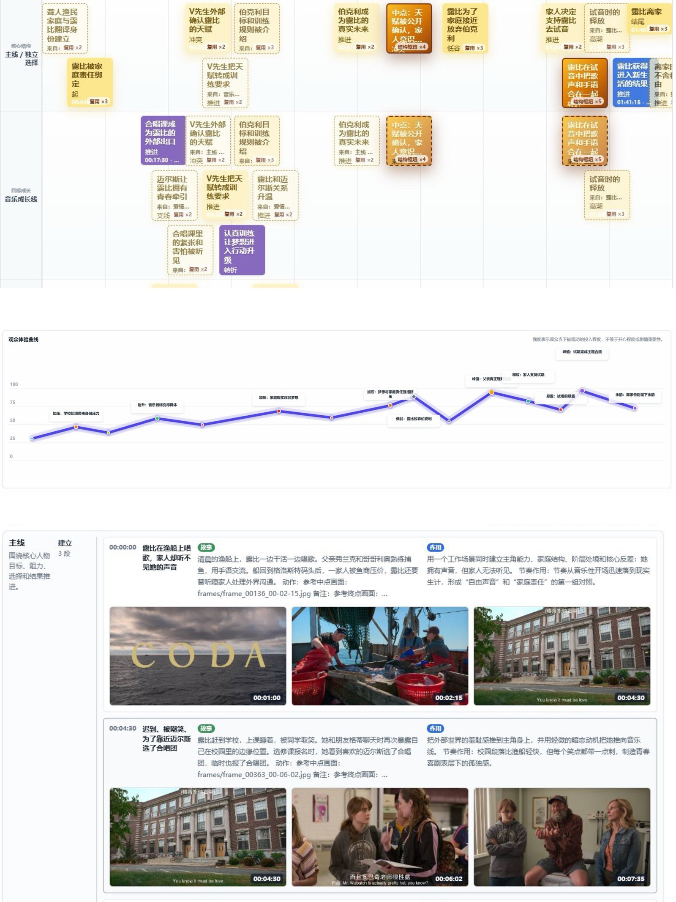

# Quriosity-agent/lapian-notes Deep Dive: The Hard Part Is Turning AI Film Analysis Into a Local-First Creator Tool

> **TL;DR:** `Quriosity-agent/lapian-notes` is not just a repo for “AI summarizes a movie.” It is a local-first creator-tool pattern: the browser handles interaction, IndexedDB and localStorage hold local state, Vite dev-server plugins provide local transcoding and subtitle support, and AI is treated as an external analyzer that receives a ZIP evidence package and returns JSON. The most interesting recent work is not a new model feature, but the push from developer source code toward a double-clickable workflow for ordinary users.

- **Source:** [Quriosity-agent/lapian-notes](https://github.com/Quriosity-agent/lapian-notes)
- **Accessed:** 2026-07-09
- **Repo facts:** public repo / MIT License / React 19 + TypeScript + Vite / default branch `main`
- **Verification:** local clone built successfully with `npm ci && npm run build` on 2026-07-09
- **Tags:** Lapian Notes / film breakdown / AI film study / local-first / creator tools / Vite / TypeScript



## One-Sentence Take

**This is not an “AI movie summary” demo. It is an engineering project that organizes video, subtitles, frame extraction, AI output, and human refinement into a local workbench.**

I already wrote a product-level analysis of Lapian Notes focused on how viewing becomes editable structure. This article looks at the `Quriosity-agent/lapian-notes` repository itself. The interesting part is not stars or launch noise. It is the decision to turn something that could easily become a cloud SaaS into a personal creator tool.

The film is not uploaded to the project’s own server. Notes are stored in browser localStorage. Frame images are cached in IndexedDB. Projects can be exported as self-contained ZIP files. AI is not bound to one API provider; it is integrated through a protocol: export analysis package, send it to any AI system, import the returned JSON.

That product judgment matters. For film study, screenwriting research, and private creative material, users often need a workbench they can control, not another black-box summarizer.

## Repo Status: More Than Developer Source Code

GitHub metadata shows that this public repo was created on 2026-07-09 UTC, uses `main` as the default branch, and is MIT licensed. Its language mix is mostly TypeScript, with CSS, PowerShell, Shell, Batchfile, and small amounts of HTML/JavaScript.

That language mix already says something: the project is not only building a web UI. It is also solving “how does a non-developer run this?”

Recent commits make that clear:

| Change Area | Why It Matters |
|---|---|
| Windows one-click startup | `run.bat` calls `setup.ps1`, preparing a portable Node runtime when needed |
| macOS one-click startup | `run.command` detects arm64/x64, installs dependencies, starts Vite, and opens the browser |
| Line-ending control | `.gitattributes` prevents cross-platform script breakage |
| Subtitle duration validation | mismatched subtitles are rejected instead of silently used |

This is heavier than telling users to run `npm install`. For creator tools, the first product barrier is often not the core feature. It is startup. Most users do not care about Vite, Node, npm registries, PowerShell policy, Gatekeeper, Chinese paths, or line endings. If any of those breaks, the tool is unusable.

## The Core Architecture: AI as a Replaceable Analyzer

The README describes a straightforward workflow:

1. import a film;
2. locally transcode, extract frames, read or search subtitles;
3. generate an AI analysis package;
4. send the ZIP to ChatGPT or another AI system;
5. import the JSON returned by the AI;
6. get story lanes, a structure tree, an audience-emotion curve, and editable segment notes.

The crucial part is steps three to five. `src/lib/framePackage.ts` defines the protocol: package `frames/`, `subtitles.srt`, `subtitles.json`, `project.json`, `prompt.md`, and `schema.json` into a ZIP. The AI is not asked to casually discuss the film. It is asked to return JSON matching a schema that the app can import.

This pushes AI out of the center and turns it into a replaceable module. Users can use ChatGPT, another multimodal model, a future local model, or an API wrapper. The application owns the evidence package format, importer, timeline model, and editing interface.

The benefits are concrete:

- no required API key;
- no default upload to a fixed cloud service;
- AI output can be previewed, imported, appended, replaced, or used to fill empty fields;
- human refinement remains part of the workflow.

The tradeoff is also clear: the flow is less seamless than a one-click cloud analyzer. Users must manually send the ZIP to AI and bring the JSON back. For film study, that is a reasonable tradeoff because evidence and revision matter.

## The Data Model Is More Important Than the Interface

`src/types.ts` is one of the most revealing files in the repo. It does not define only `summary` and `notes`. It turns film breakdown into a structured object graph:

- `Project`: film identity, frames, subtitles, segments, story lines, macro analysis, audience curve;
- `Frame`: time-stamped visual evidence;
- `Subtitle`: structured dialogue timeline;
- `Segment`: range, type, narrative order, function, beats, screenplay draft, creative intent, techniques, audience experience;
- `StoryLine`: AI- or human-defined narrative lanes;
- `AudienceCurvePoint`: intensity, emotion type, rhythm role;
- `ScreenplayBlock`: scene, action, dialogue, subtitle, note.

That says the goal is not to generate a review. The goal is to make a film editable as data. A review is output; the structure is the asset.

For creators, that difference matters. You can inspect how a subplot unfolds, how audience intensity rises, how a segment works, what frames and subtitles support it, and then export a selected segment for deeper AI analysis at the scene-and-shot level. The model turns film study from subjective impression into a repeatable training loop.

## Local-First Is Implemented in Three Layers

The README says the film and note data are not uploaded to a server. The code backs that up through three layers.

The first layer is browser-local state. `src/lib/autosave.ts` stores compact project data in localStorage. `src/lib/frameStore.ts` caches frame blobs in IndexedDB. After refresh, notes and frames can be restored, although browser security still requires the user to reselect the original video file.

The second layer is a self-contained project package. `exportProjectPackage` writes `project.json`, `analysis.md`, `manifest.json`, and frame images into a ZIP for backup or migration.

The third layer is local Vite server plugins. Browser-restricted tasks such as subtitle search, RMVB/AVI/HEVC transcoding, Range-supported video streaming, and ffmpeg subtitle extraction are handled by local Node endpoints.

This is a practical local-first hybrid architecture:

| Layer | Role | Reason |
|---|---|---|
| React browser UI | timeline, editor, imports, exports, visualization | fast interaction, low install burden |
| localStorage / IndexedDB | note state and frame cache | data stays on the user’s machine |
| Vite server plugins | subtitle search, ffmpeg transcoding, Range video serving | browser permissions are not enough |
| external AI | reads ZIP, returns JSON | model choice stays with the user |

It is not a packaged desktop app yet, but it already behaves like one: local files, local cache, local service, browser UI.

## One-Click Startup Is Product Work, Not Script Chores

The most important recent repo work is cross-platform one-click startup.

`run.command` does several concrete things:

- prefers system Node when available;
- downloads a portable Node runtime by CPU architecture when needed;
- installs dependencies through a China-friendly registry and writes logs to disk;
- starts Vite directly through Node;
- waits for `localhost:5173` to become ready;
- opens the browser automatically;
- prints useful logs on failure.

`run.bat` stays minimal and delegates the real work to `setup.ps1`. Recent commit messages also mention practical issues such as Chinese paths, npm shims, and PowerShell stderr behavior.

These details are easy for engineers to dismiss, but they decide whether a GitHub repo can become a real user tool. For the target audience, “Download ZIP, unzip, double click” is usability. `npm install` is only developer usability.

## Subtitle Duration Validation Is a Strong AI Product Detail

One recent change rejects network subtitles when their timeline does not match the film duration. That is a small but important AI-product decision.

For a normal video player, wrong subtitles are annoying. For AI analysis, wrong subtitles poison the evidence chain. The model may treat dialogue from another version, another cut, or another film as fact, then propagate that error into segment titles, character relationships, information release, and creative intent.

The product principle is:

**In evidence-based AI workflows, wrong evidence is more dangerous than missing evidence.**

If there are no subtitles, the tool can tell AI to analyze only frames and warn that accuracy may drop. Wrong subtitles create a false sense of certainty. This is exactly the kind of failure AI tools should avoid.

## Verified: The Source Builds

I cloned the repo locally and ran:

```bash
npm ci
npm run build
```

Dependency installation succeeded, `npm audit` reported 0 vulnerabilities, and Vite built the app into `dist/index.html`, CSS, and JS bundles. This does not prove every runtime path works on every machine; subtitle search, transcoding, ffmpeg, and video formats still depend on local conditions. It does confirm that the TypeScript/Vite build chain is currently healthy.

## Boundaries and Risks

The project’s boundaries are worth keeping explicit.

First, it is not an end-to-end video-understanding model. The actual analysis is done by the AI system the user chooses. Lapian Notes prepares evidence, defines the schema, imports results, and supports editing/export.

Second, local-first does not mean absolute privacy. The tool does not upload films and notes to its own server by default, but once the user sends the ZIP to an external AI service, privacy depends on that service. Unreleased films, client material, copyrighted footage, and private study datasets still require care.

Third, automatic subtitle search uses public subtitle sources. The README already warns that subtitle copyright belongs to the original authors and should not be used commercially. The UI should continue making this boundary clear.

Fourth, Vite dev server is still a local development/runtime shape. The README notes that static builds degrade automatic transcoding and subtitle search to manual flows. If this becomes a broader consumer tool, Electron, Tauri, or a clearer local runtime package may become necessary.

## What This Suggests for Creator Tools

`Quriosity-agent/lapian-notes` points to a useful direction for AI creator tools: do not rush to make everything cloud-first, model-first, and chat-first.

Many creative workflows need:

- traceable evidence;
- editable structure;
- reversible AI output;
- local data ownership;
- replaceable models;
- portable exports;
- startup that works for non-developers.

Film breakdown is a perfect example. It needs AI for large amounts of visual and subtitle material, but AI should not replace human judgment. A good workbench lets the model create the first structured pass, then lets the human refine it with frames, subtitles, timecodes, and segment functions in view.

## Conclusion

This repo is worth writing about because it turns “AI analyzes a movie” into concrete engineering: local frame extraction, subtitle handling, an AI ZIP protocol, JSON import, narrative-lane data modeling, audience curves, IndexedDB frame caching, and cross-platform launch scripts.

None of those pieces sounds as flashy as “the model understands cinema.” But real creator tools are made of exactly these unglamorous parts. The model creates a draft; the harness organizes evidence, structure, verification, and revision.

The best part of `lapian-notes` is that it puts AI back into a controlled workflow: let AI help you study a film, without handing the learning process over to AI.

