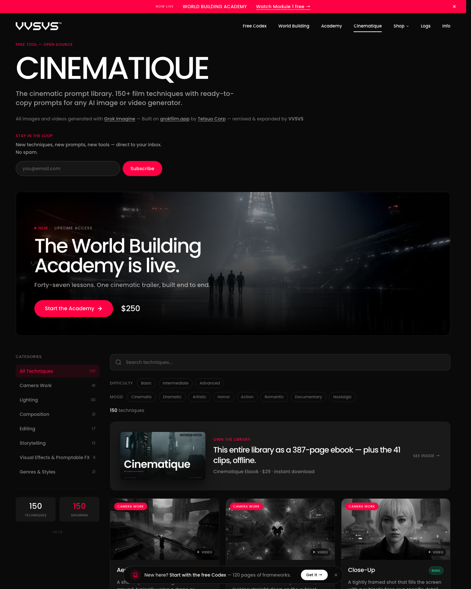
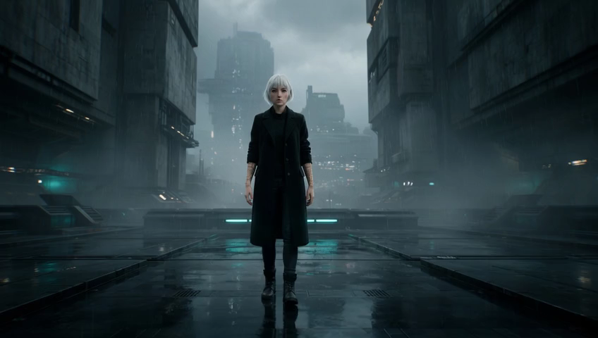
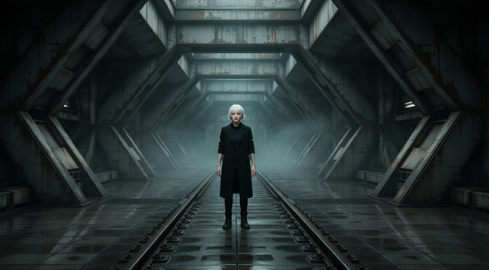

# Cinematique 深度拆解：把电影术语编译成可执行 Prompt 的 150 项镜头语法库

> **TL;DR:** [Cinematique](https://vvsvs.pro/cinematique) 不是电影截图搜索引擎，也不是视频生成模型。它是一套免费的电影语言翻译层：把 aerial shot、dolly、deep focus、dissolve、mise-en-scène 等 150 项电影与摄影技术，整理成可搜索、可复制的生成式 AI Prompt。每个深度条目不仅给模板，还解释什么时候用、如何描述物理机制、哪些写法容易失败。它真正解决的不是“缺一条神奇 Prompt”，而是创作者不知道该用什么镜头术语表达意图。局限同样清楚：模板不能保证模型遵守镜头物理，也不管理分镜、角色连续性或成片验收；页面虽自称 open source，公开页面目前没有给出可核验的代码仓库或许可证链接。

- **官网:** [Cinematique](https://vvsvs.pro/cinematique)
- **作者:** Ivan Flugelman / VVSVS；页面注明基于 Tetsuo Corp 的 [grokfilm.app](https://grokfilm.app/) 改编并扩展
- **页面版本:** `v0.1.0`
- **最近更新:** 2026-07-16，依据官网 sitemap；抽查的单项指南也标注 Reviewed 16 July 2026
- **价格:** 网页库免费；官网另售 29 美元的 387 页离线电子书，含 41 个参考片段和 8 个书中独占 Scene Recipes



## 1. 它填的是“电影语言到模型语言”之间的空白

AI 图像和视频工具已经很会生成“电影感”，但“电影感”往往只是一个没有约束力的形容词。用户输入 `cinematic`、`epic`、`dynamic`，模型可以给出好看的画面，却未必知道镜头应当如何移动、观众的视线落在哪里、空间关系怎样改变，以及这个决定为什么服务叙事。

Cinematique 的做法更具体：先把创作意图映射到一种已知的电影技术，再把技术拆成模型能够执行的视觉条件。Dolly Shot 不只写“平滑推进”，还要求说明移动方向、速度、主体锁定和前中后景的视差；Handheld Shot 不只写“手持感”，还区分呼吸漂移、突然动作造成的冲击、运动模糊与重新找回主体。

官网把自己的原则写成一句很准确的话：**“Direct the shot. Not the adjective.”** 这也是这套库最有价值的产品判断。模型通常无法执行抽象品味，却可以尝试执行位置、方向、时长、景深、光源和画面层次。

## 2. 150 项技术不是一锅 Prompt，而是一套分类系统

当前界面显示 150 个条目，七类数量正好相加为 150：

| 分类 | 数量 | 主要解决的问题 |
|---|---:|---|
| Camera Work | 41 | 景别、机位、相机运动与主体关系 |
| Lighting | 30 | 光源方向、硬软、色温、时段与气氛 |
| Composition | 21 | 视线组织、空间层次、平衡与画面结构 |
| Editing | 17 | 转场、时间压缩、并行叙事与节奏 |
| Storytelling | 12 | 叙事视角、信息释放和戏剧组织 |
| Visual Effects & Promptable FX | 8 | 可直接描述给生成模型的视觉效果 |
| Genres & Styles | 21 | 类型片约定、媒介质感与风格方向 |

用户还能按 Basic、Intermediate、Advanced 三档难度和 Cinematic、Dramatic、Artistic、Horror、Action、Romantic、Documentary、Nostalgic 八种情绪过滤。搜索框会在条目名称和说明中匹配：实际输入 `dolly` 时，页面返回 Dolly Shot、Head-On Shot、Steadicam 和 Vertigo Effect 四项，因为后三者的解释也涉及 dolly 机制。

这意味着 Cinematique 的信息架构更接近一个小型知识库，而不是按热度排列的 Prompt feed。创作者可以从“我想制造不安”进入，也可以从“我要让背景产生视差”进入，最后落到可复制的技术条目。

## 3. 每个条目的核心资产是决策结构

抽查 Dolly Shot、Handheld Shot、Leading Lines、Dissolve 和 One-er 等页面后，可以看到稳定的内容模板：

1. **定义与电影史参照:** 说明技术是什么，并用导演、摄影师和具体影片建立语境。
2. **Prompt template:** 提供带 `[Subject]` 占位符的英文模板，可替换后复制。
3. **When to use:** 解释它适合什么叙事意图，也说明什么时候不该用。
4. **Directing the AI:** 把术语继续展开为路径、速度、构图、光线或连续性要求。
5. **Common mistakes:** 列出三个常见失败方式，帮助用户减少冲突指令。
6. **Fundamental 与 related techniques:** 把单项技巧重新连接到构图、剪辑、节奏等上层原则及相邻术语。
7. **Reference desk:** 链接 StudioBinder、BFI 等外部资料，为技术解释提供进一步阅读入口。

普通 Prompt 库通常只保存最终字符串，用户很难判断哪些词是关键约束。Cinematique 同时保存“为什么选它”和“怎样让它失效”。这让内容更容易迁移到新模型：模板会过时，镜头机制、使用条件和失败模式更耐用。

## 4. Dolly Shot 展示了好 Prompt 的五层结构



Dolly Shot 页面给出的关键不是某个摄影机品牌，而是空间关系。把条目拆开，可以得到五层：

| 层次 | 要回答的问题 | Dolly 示例中的作用 |
|---|---|---|
| 叙事意图 | 为什么要移动 | 逼近威胁、强化发现，或拉远制造疏离 |
| 物理机制 | 相机怎么动 | 整台相机向前、向后或横向移动，不是数字变焦 |
| 主体关系 | 镜头跟谁保持关系 | 锁定主体，控制其在画面中的大小与位置 |
| 空间证据 | 怎样让移动可见 | 设置前景遮挡、中景人物和可读背景，产生视差 |
| 视觉完成度 | 用什么质感收束 | 焦段、光线、色彩与媒介质感 |

这套拆法可以迁移到任何技术。Leading Lines 的重点是线条必须指向有意义的视觉终点；Dissolve 的重点是两个画面的形状、亮度或语义在重叠期间形成关系；One-er 的重点则是把门、转弯、演员穿越、焦点变化和光线过渡写成一条连续路线。



## 5. 同一角色反复出现，反而形成了视觉单元测试

Cinematique 的参考图像与视频由 xAI 的 Grok Imagine 生成。可见样例大量使用同一位白发人物和相近的工业科幻环境。视觉多样性因此有限，但对教学有一个意外的好处：主体和世界大致固定后，用户更容易观察 close-up、dolly、leading lines 或 aerial shot 改变了什么。

这很像给镜头术语做视觉单元测试：输入世界保持相近，只替换一项摄影决策，再比较输出。比起每张示例都换角色、画风和场景，这种控制变量更能说明技术差异。


但它不能证明模板在所有模型、题材和工作流中都同样有效。官网称文字模板 technology-agnostic，这表示它没有绑定某个专有参数格式；视觉证据仍主要来自 Grok Imagine。Midjourney、Runway、Sora 或其他模型对焦段、机位和剪辑术语的服从程度，需要用户自己测试。

## 6. 一条更实用的使用工作流

不要把 Cinematique 当成“复制后直接出片”的按钮。它更适合放在视觉前期和 Prompt 设计之间：

### Step 1：先写镜头的戏剧任务

用一句话说明观众此刻应该感到什么、知道什么。例如：“角色终于意识到走廊尽头有人，威胁感逐步增加。”先有任务，再选技术。

### Step 2：从分类或情绪找到候选技术

可以比较 Dolly In、Slow Zoom、Handheld 或 Rack Focus，而不是立即堆叠全部。每个镜头优先保留一个主导决策。

### Step 3：读取 Deep Dive，而不是只复制卡片

重点看 When to use、Directing the AI 和 Common mistakes。它们能告诉你需要补哪些空间证据，以及哪些要求彼此冲突。

### Step 4：把模板改写成项目规格

一个更稳定的结构是：

```text
[戏剧任务] + [主导镜头技术] + [相机路径/速度]
+ [主体动作与画面位置] + [前中后景或光线证据]
+ [必须保持的角色/道具/方向连续性] + [禁止的错误变化]
```

删掉与项目无关的摄影机、胶片和色彩词。模板里的设备名称是风格提示，不是生成模型真的在使用那台相机。

### Step 5：用小样比较机制是否出现

一次只改一项，至少比较 3 至 5 个结果。Dolly 要检查是否产生视差而非单纯放大；handheld 要检查抖动是否跟随动作；leading lines 要检查线条是否真的指向主体。

### Step 6：把通过的结果写进 shot spec

记录 prompt、模型版本、种子、参考图、时长、宽高比、首尾帧和验收条件。Cinematique 帮你找到术语，但连续性和可复现性仍需要项目自己的镜头表管理。

## 7. 它与电影参考库解决不同问题

仓库此前分析过 [ShotDeck、Shot.Cafe、Flim、Film Vibes 和 Frame Set](../2026-07-08/2026-07-08-cinematic-reference-stack-ai-video-preproduction.md)，也单独拆解过 [FrameThrower](../2026-07-08/2026-07-08-framethrower-cinematography-search-engine.md)。Cinematique 不应替代它们：

| 工具层 | 输入 | 输出 | 最适合的阶段 |
|---|---|---|---|
| ShotDeck / FilmGrab 类电影库 | 影片、导演、颜色、构图或场景 | 真实电影静帧 | 研究成熟作品与建立 taste reference |
| FrameThrower / Flim 类检索 | 自然语言、标签、相似图 | 可筛选的镜头参考集合 | 扩展 moodboard 与视觉方向 |
| Cinematique | 技术、难度、情绪或关键词 | 定义、Prompt、用法、错误模式 | 把视觉意图写成模型指令 |
| 生成模型 | Prompt、参考图、视频或控制信号 | 新图像与视频 | 制作与迭代 |
| Shot list / continuity 系统 | 已选镜头与项目状态 | 可复现的镜头规格 | 序列组织、交付和复盘 |

更完整的流程是：先从真实电影中确认审美和构图，再用 Cinematique 命名镜头机制，把机制写入生成 Prompt，最后把成功结果与参数存入 shot list。只用真实电影截图，模型不知道该执行什么；只用 Prompt 模板，创作者又容易失去对成熟作品的观察基准。

## 8. 免费库也是一条设计得很清楚的产品漏斗

Cinematique 的免费层几乎没有使用摩擦：无需注册即可浏览、筛选、复制，FAQ 也明确允许模板用于商业项目。它同时把深度需求引向三种付费产品：29 美元电子书解决离线拥有和系统阅读，World Building Codex 扩展到世界一致性，250 美元 Academy 教完整预告片工作流。

这个漏斗与内容结构一致：免费站点卖“一个镜头怎么拍”，电子书卖可拥有的完整参考，课程卖从单镜头到成片的方法。对创作者工具来说，这是一个值得借鉴的切分，因为它没有先锁住最基础的术语查询。

“open source”则需要谨慎表述。官网标题与 FAQ 都使用该词，并说明项目源自 grokfilm.app 后由 VVSVS 扩展；但截至本文核对时，Cinematique 页面、站点导航和搜索结果没有提供代码仓库或开源许可证。因此可以确认 Prompt 模板免费商用，也可以确认网页公开访问；无法仅凭当前页面确认软件源码的许可证、再分发范围或贡献流程。

## 9. 它还缺什么

Cinematique 已经是一套好用的术语层，但离完整 AI 导演工作台还有明显距离：

1. **没有项目状态。** 它不保存角色、场景、道具、屏幕方向和镜头之间的依赖。
2. **没有模型适配。** 同一模板不会根据 Midjourney、Runway、Sora 的能力自动改写。
3. **没有结果评测。** 页面展示示例，但没有跨模型成功率、失败率或可复现实验。
4. **没有序列编排。** Editing 和 Storytelling 是独立知识条目，不等于可运行的时间线或分镜板。
5. **没有 prompt provenance。** 用户复制并修改后，站点不记录版本、模型、种子和生成结果。
6. **电影史陈述仍需核对。** 单项页面提供外部阅读链接，但它是创作指南，不是学术电影史数据库。

如果未来把这些空白补上，Cinematique 可以从 Prompt library 进化为 shot compiler：输入叙事任务和项目 bible，输出针对模型能力优化的镜头规格，并在生成后检查视差、景别、运动方向和连续性是否成立。当前版本已经把最重要的第一步做对了：先让用户说清楚自己在导演什么。

## 结论

Cinematique 的价值不在 150 条可以复制的长字符串，而在它把电影工艺恢复成一组可选择、可解释、可检查的决策。它要求用户从 `cinematic` 这样的空泛形容词，走向“相机怎样移动、空间怎样变化、视线被引向哪里、这个决定服务什么情绪”。

对于刚进入 AI 视频的人，它是一份免费的电影术语入口；对于已经有镜头经验的人，它是一套快速起草 Prompt 的结构化索引；对于工具开发者，它展示了一种很有前景的中间层：把传统创作知识编译成模型可尝试执行的条件。

最合理的用法是把它接在电影参考研究之后、生成模型之前，再用 shot list 和人工验收补上连续性。这样，Cinematique 不负责替你导演，而是让你的导演意图第一次写得足够具体。

## Sources

1. [Cinematique main library](https://vvsvs.pro/cinematique)
2. [Dolly Shot guide](https://vvsvs.pro/cinematique/dolly-shot)
3. [Handheld Shot guide](https://vvsvs.pro/cinematique/handheld-shot)
4. [Leading Lines guide](https://vvsvs.pro/cinematique/leading-lines)
5. [One-er guide](https://vvsvs.pro/cinematique/one-er)
6. [VVSVS site summary](https://vvsvs.pro/llms.txt)
7. [VVSVS sitemap](https://vvsvs.pro/sitemap.xml)
