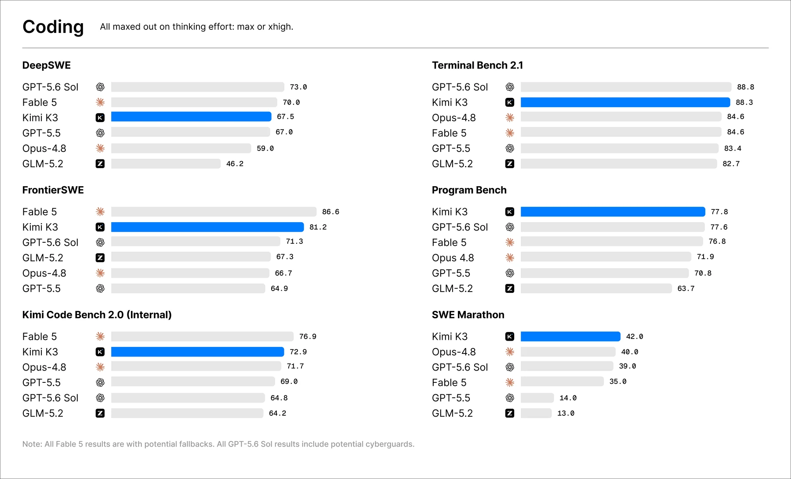
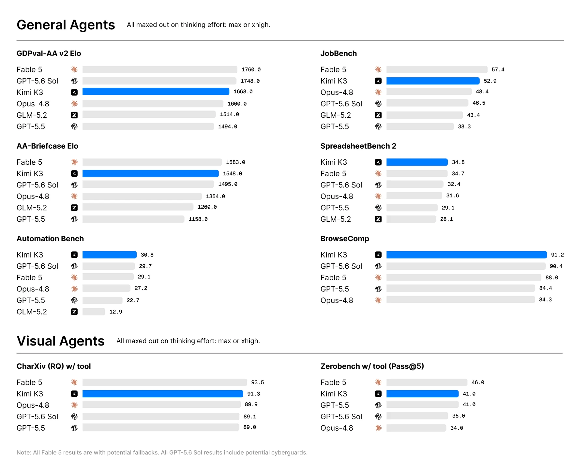
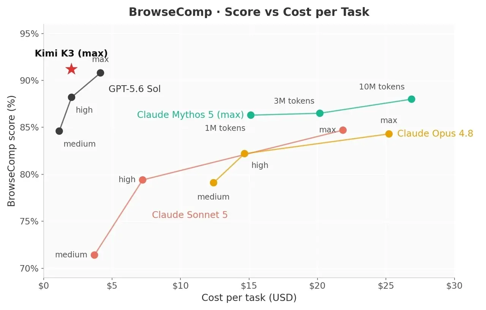
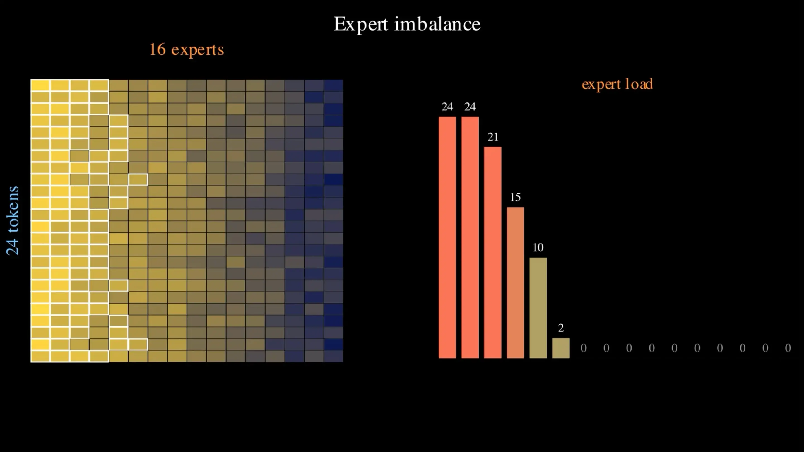
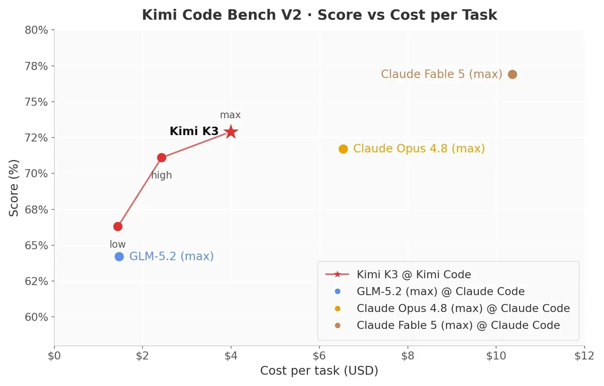
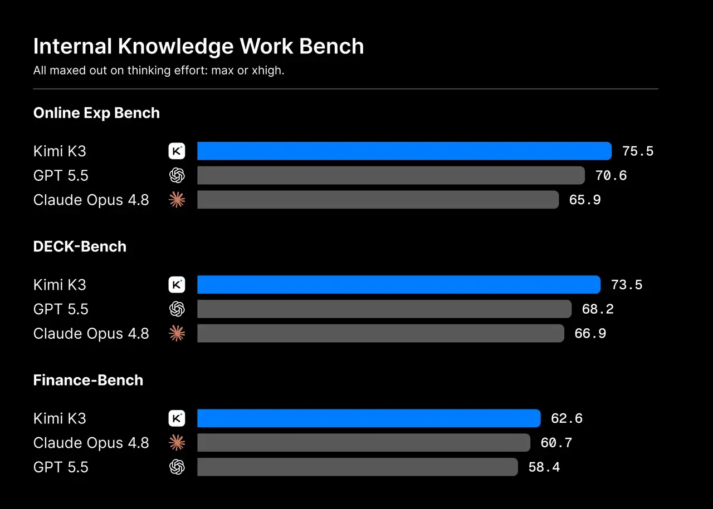

# Kimi K3 Deep Dive: The Real Variable in an Open 3T Model Is Agent Runtime Cost and Control

> **TL;DR:** The most important part of Kimi K3 is not the headline number, 2.8T parameters. It is that Moonshot is putting open weights, a 1M-token context window, native vision, Kimi Code, Kimi Work, the Kimi API, and automatic caching into one long-horizon agent runtime. Moonshot still says the overall user experience trails Claude Fable 5 and GPT-5.6 Sol; the full weights are promised by July 27, 2026; and the technical report is still pending. Even so, K3 moves the open-model conversation from “can it answer hard questions?” toward “can it run repositories, documents, spreadsheets, visual feedback, and toolchains for hours?”

> **Update (2026-07-27):** The full weights and technical report are now public. See the [Kimi K3 open-weight release audit](../2026-07-27/2026-07-27-kimi-k3-open-weight-release-agent-state-infrastructure-en.md) for deployment and license analysis. This article preserves the launch-day product and runtime assessment.

- **Source:** [Kimi K3: Open Frontier Intelligence](https://www.kimi.com/blog/kimi-k3)
- **API docs:** [Kimi K3 Quickstart](https://platform.kimi.ai/docs/guide/kimi-k3-quickstart)
- **Model list:** [Kimi API Model List](https://platform.kimi.ai/docs/models)
- **Pricing:** [Flagship Model Kimi K3 Pricing](https://platform.kimi.ai/docs/pricing/chat-k3)
- **Published:** 2026-07-17
- **Tags:** Kimi K3 / Moonshot AI / open weight / 3T model / agent runtime / long context / coding agent / Kimi Code / Kimi Work

## 1. K3 is not only a bigger model; it is a long-horizon agent runtime bet

Moonshot describes Kimi K3 as an open 3T-class model with 2.8T parameters, native vision, and a 1M-token context window. The scale matters: it pushes open-weight models closer to closed frontier systems. But reading K3 only as “the largest open model” misses the more practical shift. Moonshot is not just publishing a checkpoint; K3 is available through Kimi.com, Kimi Work, Kimi Code, and the Kimi API.

That makes the launch less like a chat-model release and more like a runtime rollout:

1. **Kimi Code** carries long engineering tasks, where the model must read large repositories, use terminals, inspect logs, run tests, and iterate from screenshots.
2. **Kimi Work** carries knowledge work, where PDFs, web pages, spreadsheets, charts, slides, and interactive visualizations become one project surface.
3. **Kimi API** gives developers the `kimi-k3` model, always-on thinking mode, and `reasoning_effort="max"` as the only supported effort level at launch.
4. **1M context plus automatic caching** turns long context into a cost-management problem. Developers keep a repeated prefix stable and the API automatically attempts cache hits, without explicit cache IDs.

So the real K3 question is not whether it is a few points smarter than a closed model on one benchmark. It is whether an open-weight model can carry enough context, tool use, visual feedback, and cost predictability to be useful inside real agent workflows.

## 2. The public benchmarks should be read by harness, not just by leaderboard position

Moonshot’s charts show strong Kimi K3 results across coding, general-agent, visual-agent, and knowledge-work evaluations. The coding section is especially telling: the launch page emphasizes long-horizon coding, GPU kernel optimization, a MiniTriton compiler, game development, chip design, and research coding rather than only short programming tasks.

But these numbers should not be read as “all models were run bare on the same task.” The footnotes matter. Moonshot says all K3 results use max reasoning effort, and different benchmarks use different agentic harnesses, including KimiCode, Claude Code, and Codex. Terminal-Bench, SWE Marathon, FrontierSWE, KCB 2.0, OfficeQA Pro, and SpreadsheetBench 2 all depend on tool wrappers and execution environments.

That makes the results more like comparisons of “model plus tool runtime plus context policy plus defaults” than pure model intelligence. For builders, that is actually the useful layer. Nobody deploys an agent into empty air; it runs inside a CLI, IDE, CI system, browser, document stack, and internal tools. K3 needs to be evaluated at that combined layer.

The BrowseComp note is another good example. Moonshot says it uses a Claude-model-card-style context compaction strategy triggered at 300K tokens; with a 1M-token context window and no context management, Kimi K3 reportedly reaches 90.4. The interesting variable is not only the search score. It is the tradeoff between long context, compaction, and agent-state fidelity.

## 3. The architecture story is about serviceability, not just parameter count

K3’s architecture keywords include Kimi Delta Attention, Attention Residuals, Stable LatentMoE, Gated MLA, SiTU, Per-Head Muon, and Quantile Balancing. Moonshot’s high-level claim is that KDA and AttnRes improve information flow across long sequences and deep networks, while Stable LatentMoE activates 16 of 896 experts. Combined with training and data changes, Moonshot reports roughly 2.5x better overall scaling efficiency than Kimi K2.

Until the technical report arrives, this should be treated as a release claim rather than settled evidence. Still, the direction is clear: K3 is not just a parameter-scaling story. It is an attempt to make a very large MoE trainable, inferable, cacheable, and serviceable.

This is where open weights are often misunderstood. A 2.8T-parameter open model does not mean ordinary teams can comfortably self-host it on a few GPUs. Moonshot’s docs recommend deploying K3 on supernode configurations with 64 or more accelerators. The company also says KDA creates new challenges for conventional prefix caching and that it will contribute an implementation to vLLM. Openness is the first layer; production serving is the hard layer.

## 4. The cost curve is closer to the production problem than the parameter count

The official Kimi API pricing is $0.30 per MTok for cache-hit input, $3.00 per MTok for cache-miss input, and $15.00 per MTok for output. The docs say K3’s 1M-token context uses flat pay-as-you-go pricing rather than context-length tiers; for coding workloads, Moonshot says the official API reaches a cache hit rate above 90%.

That pricing has a specific implication. K3 is not a cheap small-model route; its output price sits in frontier-model budget territory. But if long repositories, long documents, and long tasks reliably hit the cache after the first load, the effective pattern becomes “expensive first read, cheaper iterations.”

For agent products, that is the real economic unit. Long-horizon agent cost is not one prompt. It is the total session: read the repository, plan, edit code, run tests, inspect screenshots, fix bugs, and write up the result. K3 is trying to show that 1M context, automatic caching, and the Kimi Code harness can turn large-context work from “reread the world every turn” into “maintain reusable working memory.”

## 5. Kimi Work signals that knowledge work is becoming an interactive project, not report generation

The launch page’s Kimi Work cases are easy to overlook beside the benchmark charts: a 42-year AI ASIC industry research website, a fusion-industry report, GWTC-5 gravitational-wave analysis, infographic-style presentations, Widgets, and Dashboard.

These examples show Moonshot defining knowledge work as a broader output surface. The deliverable is not just a Markdown report. It can be an interactive website, visualization, editable chart, persistent widget, or topic-level dashboard.

That is the same story as native vision, long context, and tool calling. The hard part of knowledge-work agents is not writing a polished summary. It is maintaining project state: where evidence came from, how charts were generated, whether data is traceable, which components a later user edit should update, and how a dashboard keeps refreshing. K3’s product packaging puts that state-management layer in the foreground.

## 6. The launch limitations belong in your `AGENTS.md`

K3’s official limitations are concrete enough that builders should translate several of them directly into system prompts and harness constraints.

First, K3 is sensitive to thinking history. The docs tell developers to pass the complete assistant message returned by the API into the next request for multi-turn conversations and tool calls, not only `content`. Moonshot also warns that if a harness fails to return historical thinking content correctly, or if an ongoing session is switched from another model to K3, generation quality may become unstable.

Second, K3 may be too proactive. Moonshot says training emphasized long-horizon and challenging tasks, so the model may make unexpected decisions when it encounters small issues or ambiguous user intent. If your product needs the agent to stay within strict boundaries, those boundaries should be explicit in the system prompt or `AGENTS.md`.

Third, the API has practical constraints: `reasoning_effort` supports only `max` at launch; `max_completion_tokens` defaults to 131072 and can be set up to 1048576; temperature, top_p, n, presence_penalty, and frequency_penalty are fixed; vision input does not support public image URLs and requires base64 or `ms://<file-id>`; and web search is being updated, so Moonshot does not recommend it for production in the near term.

These are not minor footnotes. They determine whether K3 can fit into an existing agent product: how history is stored, how tool messages are replayed, how model switching works, whether ambiguous tasks can continue automatically, how visual inputs are uploaded, and whether search should be externalized.

## 7. The right judgment: wait for the weights, wait for the report, then run your own tasks

Moonshot includes two important sober notes in the launch: full model weights are promised by July 27, 2026, and architecture, training, and evaluation details will come with the Kimi K3 technical report. The company also says K3 still has a noticeable user-experience gap versus Claude Fable 5 and GPT-5.6 Sol.

So K3 is not settled yet. The useful evaluation has three layers:

1. **Weight layer:** wait for the full weights, license, inference-framework support, quantization path, and vLLM KDA cache implementation.
2. **Runtime layer:** run the same long tasks through Kimi Code, Claude Code, OpenHands, or your own harness, and separate model ability from tool-system ability.
3. **Economics layer:** calculate real sessions, including cache hits, output length, failed retries, human intervention, and GPU or cloud API cost.

Kimi K3’s significance is not that open models have definitively beaten closed frontier models. It is that an open model is now close enough to compete at the agent-workflow layer: coding, vision, long context, tool use, desktop work surfaces, and all the serving complexity that comes with them.

If K2.5’s story was “open models can become multimodal agents,” K3’s story is “open models are starting to compete as long-horizon agent systems.” The next question is not who wins a few benchmark points on a release page. It is which model stack can run real work for ten hours while keeping cost, boundaries, and errors visible.
