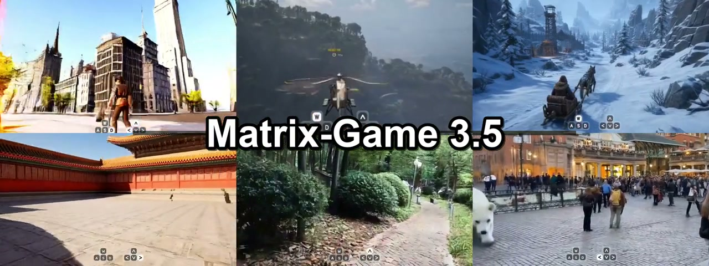
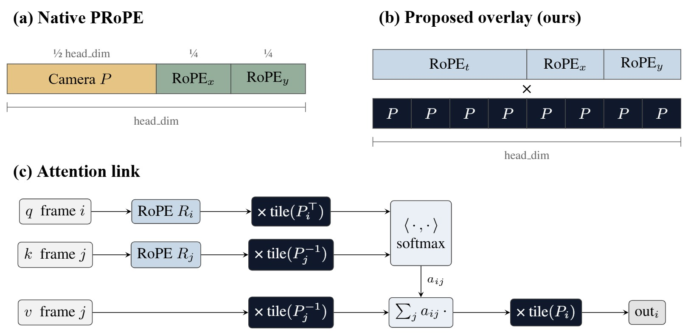
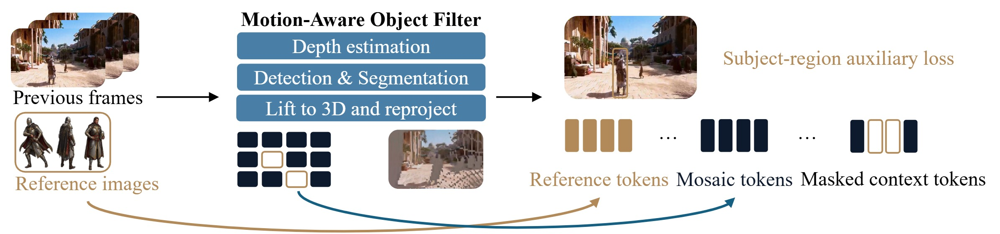
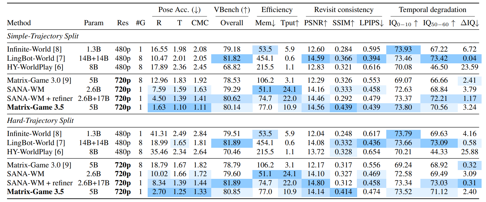

# Matrix-Game 3.5 Deep Dive: Long-Horizon World Memory Is Becoming Reprojectable 3D Patches

> **TL;DR:** Matrix-Game 3.5 does more than extend video generation. It changes what it means for a world model to remember. Depth, camera intrinsics, and camera poses lift static patches from prior frames into 3D, then reproject them into the current view. Dynamic protagonists take a separate path through multiview reference tokens. Combined with Warped PRoPE and Flow Matching plus Self-Rollout DMD distillation, the paper reports a 5B model running at 720p and up to 20 FPS on one H200. One release caveat matters: the downloadable models are roughly 20GB of bidirectional base weights, with 25-step offline inference over a precomputed camera trajectory. The README says the distilled real-time autoregressive models are coming soon. What can be reproduced today is the geometry-aware base system, not the full real-time demo stack.

- **Project:** [Matrix-Game 3.5](https://matrix-game-v3-5.github.io/)
- **Technical report:** [Matrix-Game 3.5 PDF](https://matrix-game-v3-5.github.io/paper/Matrix-Game-3.5.pdf)
- **Code:** [Riemann-Dynamics/Matrix-Game-3.5](https://github.com/Riemann-Dynamics/Matrix-Game-3.5)
- **Models:** [Matrix-Game-3.5-Base](https://huggingface.co/RiemannDynamics/Matrix-Game-3.5-Base)
- **Released:** 2026-07-18
- **Accessed:** 2026-07-20

*A frame from the official teaser, showing first-person and third-person generation across several environments.*

## The one-sentence take

**Matrix-Game 3.5 moves long-term world memory from “ask the generator to recall old frames” toward “calculate where old observations belong in the new camera, then generate only what remains unseen or unreliable.”**

That is a practical shift. A video model may learn spatial priors, yet still struggle to preserve a particular window, intersection, or character through a minute of autoregressive generation. Context is finite, and every generated error becomes input to the next step. Small mistakes compound into structural drift.

Matrix-Game 3.5 no longer asks a Transformer hidden state to carry the entire burden. Explicit reprojection handles the static content best described by geometry. Semantic reference tokens handle dynamic subjects that should not be frozen into world coordinates. The generator merges visible memory and synthesizes missing regions.

## 1. From 3.0 to 3.5: memory needs an address

Matrix-Game 3.0 already emphasized streaming generation, long-horizon memory, and camera control. Version 3.5 asks a more specific question: when the camera loops back to an old location, how does the model know where an old pixel belongs in the new view?

Retrieving historical frames alone leaves three hard problems:

1. **The viewpoint changed.** A wall seen from the front undergoes perspective deformation when revisited from the side.
2. **Visibility changed.** A surface visible before may now be occluded, while the new view may expose an area that was never observed.
3. **Dynamic objects are not background.** Reprojecting a person together with the street can create ghosts, duplicates, or a character apparently stuck to the environment.

The 3.5 answer is a parameter-free geometry-aware memory system. Warped PRoPE makes attention camera-aware, Patch Memory transports static observations to the target view, and reference tokens preserve dynamic-subject identity.

## 2. Warped PRoPE puts camera projection inside positional encoding

Conventional spatiotemporal RoPE describes time and 2D token locations. Camera control is often introduced through an additional branch, control network, or pose condition. But temporal proximity and looking at the same location in the world are different relationships.

Warped PRoPE overlays the full world-to-image projection matrix across every attention-head channel instead of reserving a partial channel block for camera pose. At a high level, the method:

- constructs projection matrices from camera intrinsics and extrinsics;
- applies the target projection transpose on the query side;
- applies the inverse source projection on keys and values;
- carries relative time, image position, and camera geometry through the same attention softmax.

No learned camera branch is added, and the Wan2.2-TI2V-5B backbone does not need to be redesigned. Camera geometry becomes part of attention itself.

*Native PRoPE versus Warped PRoPE. The proposed design tiles camera projection over the full head dimension and applies it directly to Q/K/V attention. Source: official technical report.*

The important outcome is not merely that the network receives camera numbers. Tokens from different frames carry a geometric coordinate transformation when their relevance is calculated. That is a better structural match for camera translation, rotation, and revisiting an old scene.

## 3. Patch Memory: reproject first, generate second

Patch Memory is the center of the system. Its pipeline can be reduced to five operations:

1. estimate depth for historical generated frames;
2. use depth, intrinsics, and pose to back-project 2D pixels or patches into metric 3D;
3. project those 3D observations into the next target camera;
4. apply a z-buffer so the nearest visible surface wins;
5. feed the resulting mosaic memory to the generator, which fills holes, occlusions, and unreliable regions.

This is not a complete editable 3D mesh. It is a view-indexed memory of historical appearance. Matrix-Game 3.5 still produces video rather than rendering from an explicit scene graph. But unlike a fully latent memory, it assigns the problem of “where should the past appear?” to camera geometry.

That explains the intended revisit behavior. When the camera returns, the model does not need to redraw an entire building from a distant hidden state. It first receives old textures, edges, and local details aligned to the current view, then generates what the memory cannot cover.

## 4. Static and dynamic memory must be separated

Reprojecting every historical pixel immediately fails when people, vehicles, or animals move.

Matrix-Game 3.5 uses a motion-aware object filter to exclude dynamic regions from static mosaic memory. Static content follows the “depth -> lift to 3D -> reproject” path. A protagonist is represented separately by up to four multiview reference crops encoded as sequence-level reference tokens, with a subject-region auxiliary loss helping preserve identity and appearance.

*Static environments enter Mosaic/Patch Memory; dynamic subjects become reference tokens. Motion filtering reduces ghosts and identity leakage. Source: official technical report.*

This is more than an implementation detail. It establishes a useful world-model rule:

- static scenes can be tied to world coordinates;
- dynamic subjects need identity consistency but should not be pinned to old coordinates;
- newly exposed areas should be generated rather than presented as remembered facts.

The current method still does not maintain a complete persistent state for dynamic entities. The paper lists offscreen state evolution and persistent dynamic entities as future work. Reference tokens are identity and appearance anchors, not a character-state machine.

## 5. Distilling a 25-step base model into a 3-step causal generator

The project starts from a Wan2.2-TI2V-5B backbone, trains a bidirectional diffusion base model, and then distills it into a causal autoregressive few-step generator.

### Stage one: Flow Matching in perceptual feature space

Instead of relying only on pixels or latent-space supervision, perceptual causal adaptation operates in the feature space of a frozen InternVideo2-1B. It jointly teaches autoregressive continuation and few-step denoising, producing a stronger initialization for distillation.

### Stage two: Self-Rollout DMD

Teacher forcing exposes a model to real history during training, but deployment feeds it its own generated history. Those distributions diverge over time. Self-Rollout DMD trains the student on its own autoregressive trajectories. A curriculum progressively introduces classifier-free guidance, camera control, and memory conditioning.

The final paper system uses three denoising steps per chunk. With INT8 DiT, `torch.compile`, optimized memory retrieval, and a 75%-pruned MG-LightVAE, the report gives this upper-bound configuration:

| Item | Reported paper configuration |
|---|---|
| Model | 5B |
| Output | 1280 x 704, described as 720p |
| Causal denoising | 3 steps per chunk |
| Hardware | One NVIDIA H200 |
| Speed | Up to 20 FPS |

The qualifier is essential: this is the paper system, not the current public base checkpoint running at its defaults.

## 6. The data engine adds geometry before training

The project page says the data spans Unreal simulation, open-world games, and internet video. The technical report does not provide a verifiable total number of hours or clips. More revealing than scale is the conversion of ordinary video into geometry-aware training data:

- VGGT-Omega and the metric branch of Depth Anything 3 estimate poses, depth, and intrinsics;
- long videos are chunked and aligned with Sim(3) transformations;
- a vision-language model produces window-level semantic descriptions;
- detection, tracking, masks, and DINO features select diverse views of dynamic subjects;
- reconstruction, camera, image/depth, and task-suitability filters remove weak examples.

Internet video does not arrive with clean 6-DoF camera trajectories, metric depth, or protagonist references. It must first be geometrized and structured before it can train Patch Memory.

## 7. What the benchmark actually supports

The paper evaluates one-minute Simple and Hard camera trajectories with camera-pose accuracy, VBench, efficiency, revisit consistency, and quality degradation between the first and final ten seconds.

*Matrix-Game 3.5 quantitative results. The highlighted cells do not mean 3.5 leads every metric; pose, visual quality, efficiency, and revisit columns need to be read separately. Source: official technical report.*

Camera control is the clearest win:

| Split | Rotation error R ↓ | Translation error T ↓ | CMC ↓ | Revisit SSIM ↑ |
|---|---:|---:|---:|---:|
| Simple | 1.63 | 1.10 | 1.11 | 0.439 |
| Hard | 2.70 | 1.25 | 1.33 | 0.414 |

Matrix-Game 3.5 leads the table's camera-pose metrics. Compared with SANA-WM + refiner, Simple rotation error drops from 4.50 to 1.63, while Hard drops from 8.34 to 2.70. Revisit SSIM is also highest, aligning with the purpose of geometry-aware memory.

It does not lead every category:

- Simple VBench is 80.14 versus LingBot-World's 81.82;
- Hard VBench is 80.85 versus 81.89;
- revisit LPIPS is not the best result;
- offline throughput on eight H100s is 10.9 videos/hour versus SANA-WM's 24.1;
- peak memory is 77GB, not the lowest figure in the table.

The paper also notes that same-pose pixel metrics penalize valid dynamic change. A character moving differently can reduce PSNR or LPIPS without indicating broken scene geometry. The benchmark therefore supports a focused claim: camera following and static-scene revisits improve. It does not demonstrate across-the-board superiority in quality and efficiency.

## 8. What is open today, and what is not

This is where the polished demos are easiest to misread.

### Public now

- an Apache-2.0 code repository;
- two 5B bidirectional base models, `first-person.safetensors` and `third-person.safetensors`;
- about 20GB of weights in the Hugging Face repository;
- a DiffSynth-based inference pipeline;
- Mosaic Memory reprojection code;
- vendored Depth Anything 3;
- first-person and third-person samples.

Base inference takes an anchor image, text prompt, and precomputed camera-trajectory `.npz`. Third-person generation optionally accepts zero to four protagonist reference images. By default, one block produces 80 frames, consumes 84 camera poses, and uses 25 denoising steps. Official requirements are Linux, at least 64GB system memory, and an NVIDIA GPU with at least 40GB VRAM; 704 x 1280 inference peaks near 40GB.

### Not public yet

- the paper's distilled real-time autoregressive checkpoint;
- a complete keyboard-driven real-time runtime;
- an end-to-end reproduction of the H200, INT8, three-step demo configuration.

The README is explicit: `The distilled real-time autoregressive models will be released soon.`

The accurate release description is therefore: **Matrix-Game 3.5 has opened its geometry-aware base model, weights, and offline trajectory inference. The distilled real-time system remains a reported result and project demo pending release.**

## 9. It is not a game engine, and collision is external

The project page includes collision-avoidance demos, but the report's appendix says the model control signal does not reason about collision. An external progressive 3D occupancy map accumulates depth and camera pose into voxels, then adjusts the planned camera trajectory.

That is a useful hybrid system, but it is not evidence that the generative model learned physical collision.

Matrix-Game 3.5 also does not currently provide:

- editable meshes, materials, or a scene hierarchy;
- navmeshes, rigid bodies, colliders, or game logic;
- reliable object permanence and dynamic-entity state;
- a general action model mapping arbitrary player actions to state changes;
- a queryable and verifiable 3D world state.

Its output is continuous video conditioned on a camera path, text, and memory. “Interactive world model” is reasonable terminology, but treating it as Unity, Unreal, or a production-ready game system goes beyond the evidence.

## 10. What it means for creators and developers

Matrix-Game 3.5 is currently best suited to three kinds of exploration:

1. **Long-take previs.** Test first- or third-person camera movement, spatial revisits, and scene continuity from an anchor image and camera path.
2. **World-model research.** Study how explicit geometric memory interacts with a diffusion transformer, especially static/dynamic separation and autoregressive distillation.
3. **Hybrid interactive prototypes.** Let conventional 3D occupancy, path planning, and control impose constraints while a generative model unfolds the visual world.

It is not yet a good fit for low-memory consumer hardware, deterministic physical simulation, object-level game editing, or product planning that treats “20 FPS” as a property of the downloadable checkpoint.

## Conclusion: memory needs a coordinate system

The central Matrix-Game 3.5 idea is straightforward: a persistent world cannot be only an ever-growing sequence of old frames. Static observations need locations in 3D space. Dynamic subjects need a separate identity memory. Newly visible regions must remain explicitly unknown until the generator fills them.

Warped PRoPE puts camera geometry into attention. Patch Memory transports historical appearance into the current view. Reference tokens keep dynamic characters out of the static map. Self-Rollout DMD tries to make the resulting system fast enough while training it on its own generated history.

The release also demonstrates why paper methods, project demos, and downloadable products must be separated. The method is public, and the base model is testable. The real-time distilled version has not shipped. Once it does, the meaningful test will not be whether a teaser moves, but whether ordinary developers can reproduce camera following, scene revisits, character identity, and 20 FPS through more than a minute of continuous interaction.

Until then, Matrix-Game 3.5 has already established a useful direction: **a world model must remember not only what happened, but where it happened.**
