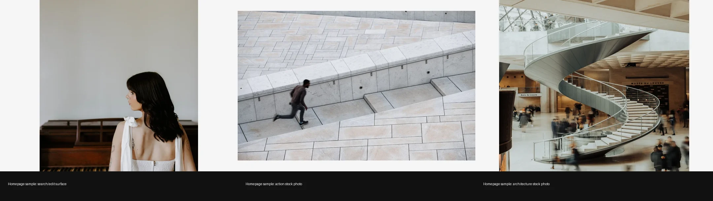

# Pexels 深度拆解：免费图库正在从素材搜索变成创作供应链和 API 基础设施

> **TL;DR:** Pexels 表面上是一个“免费图库”，但它现在更像一层创作供应链：一边是首页的免费照片/视频搜索、热门主题、挑战、排行榜、创作者上传和编辑入口；另一边是可嵌入产品的 Image & Video API、28 种语言搜索、团队精选内容、API 速率限制、归因规则和许可证边界。对 AI 图像、AI 视频、QCut 这类创作工具来说，Pexels 的价值不是“随便拿图”，而是把真实世界视觉素材、创作者生态、合法使用边界和产品级分发接口放进同一套工作流。

- **Source:** [Pexels homepage](https://www.pexels.com/) / [Pexels License](https://www.pexels.com/license/) / [Pexels API](https://www.pexels.com/api/) / [API Documentation](https://www.pexels.com/api/documentation/)
- **Accessed:** 2026-07-18
- **Topic:** free stock media / creative workflow / image and video API / licensing / AI media pre-production
- **Tags:** Pexels / 免费图库 / Stock Media / Image API / Video API / Licensing / AI 创作 / QCut

## 一句话概括

**Pexels 的核心价值不只是“免费素材”，而是把素材发现、创作者供给、即时编辑、许可证规则和 API 分发接成了一个可被创作工具调用的视觉基础设施。**

这点在 AI 创作时代更重要。很多产品把素材库当成一个图片抽屉：需要背景、人物、质感、营销配图时搜一下、下载一下。但 Pexels 当前的产品形态已经不止于此。

首页给用户的是搜索、趋势、挑战、排行榜、视频、上传和编辑入口；API 页面给开发者的是照片/视频搜索、精选内容、集合、授权、速率限制、归因和多语言搜索；许可证页面则定义了哪些使用是免费的，哪些边界不能踩。

如果把它放进 AI 视频或内容生产系统里看，Pexels 更像一个“真实世界视觉素材层”，而不是一个普通图库标签。

## 1. 首页不是单纯图库，而是创作入口

Pexels 首页当前的主文案是：`The best free stock photos, royalty free images & videos shared by creators.` 这句话同时出现了三个关键词：

- free stock photos；
- royalty free images & videos；
- shared by creators。

也就是说，Pexels 的供应不是纯平台采购，也不是纯 AI 生成，而是一个创作者上传、平台分发、用户搜索下载的生态。

首页导航也说明它在做的不只是搜索框：

- Discover Photos；
- Leaderboard；
- Challenges；
- Winners Wall；
- The Level Up；
- Free Videos；
- Pexels Blog；
- Upload / Join。

这套结构有两个方向。对用户来说，它是“找素材”；对供给侧创作者来说，它是“被发现、参加挑战、获得曝光、进入排行榜”。图库平台如果只做下载，很容易陷入 SEO 流量站；Pexels 还在维护一个创作者循环。

## 2. 热门搜索和挑战，让素材库保持“当下感”

Pexels 首页列出 Popular 和 Trending 搜索词。访问时可见的 popular 包括 wallpaper、background、flowers、landscape、sunset、beach、mountain、texture 等；trending 则包括 world cup、wedding、graduation、vacation、pool、sunflower、lavender field、garden、strawberry、rose、tropical、barbecue、ice cream、lemonade 等。

这些词看起来像 SEO 关键词，但对创作产品很有价值，因为它们代表素材需求的实时分布。

比如：

- `wedding` 和 `graduation` 是季节性/事件性需求；
- `beach`、`vacation`、`pool` 是夏季营销需求；
- `wallpaper`、`background`、`texture` 是长期设计素材需求；
- `world cup` 是热点事件需求。

首页还显示两个当前挑战入口：`Weddings and Love Stories` 和 `Summer Vibes on Video`。这说明 Pexels 不只是被动收录用户上传，而是在主动引导创作者围绕主题补充素材。

对 AI 创作工具来说，这种趋势层很值得关注。未来的素材供应不一定只靠静态分类，还会越来越依赖“当下什么主题需要更多高质量素材”。

## 3. 首页上的编辑动作，说明下载不是终点

Pexels 首页的图片卡片旁边可见一组编辑动作：

- Adjust Colors；
- Retouch；
- Add Text；
- Remove Background；
- Convert to GIF；
- Edit。

这些动作非常关键。它们把 Pexels 从“找图下载”推向“素材进入创作”的下一步。

传统图库的结束动作是 Download。现代创作平台的结束动作不一定是下载，而是进入编辑器：调色、修图、加字、抠图、转动图、放进设计模板、做成社媒素材或短视频封面。

Pexels 已经是 Canva 生态的一部分。Canva 官方在 2019 年宣布收购 Pexels 和 Pixabay，目标之一就是让更多免费图像和视频进入设计工具。现在看，Pexels 首页上的编辑入口正好体现了这个方向：素材不是被下载到本地后才开始创作，而是从搜索结果直接进入编辑动作。

这对 QCut 或 AI 视频工具也有启发：素材库如果只给 URL，是不够的。更有价值的是把素材直接接到生成、剪辑、抠图、调色、封面、字幕和模板工作流里。

## 4. 许可证的真实含义：免费不等于无边界

Pexels license 页面写得很清楚：照片和视频可以免费下载和使用；归因不是必须，但感谢署名；用户可以修改素材。

但页面也列出几个重要限制：

- 不能让可识别人物以负面或冒犯方式出现；
- 不能未修改就出售照片或视频副本，例如海报、印刷品或实体商品；
- 不能暗示图片中的人或品牌为你的产品背书；
- 不能把 Pexels 素材重新分发或出售到其他 stock photo / wallpaper 平台；
- 不能把照片或视频用作商标、设计标志、商号、公司名或服务标志的一部分。

这些边界对 AI 创作尤其重要。很多人看到“free”就会理解成“随便训练、随便重售、随便改成商业主视觉”。这不是稳妥用法。

更安全的理解是：

| 场景 | 更稳妥的做法 |
|---|---|
| 原型 / moodboard | 可以用于快速探索和沟通，但保留来源 |
| 商业设计 | 检查人物、品牌、场景是否会产生背书或冒犯风险 |
| AI 图像参考 | 抽取构图、色彩、材质、光线，不直接复刻人物或品牌 |
| 模板/商品 | 不要把未显著改动的素材当作可售核心内容 |
| 平台产品 | 不要把 Pexels 内容重新包装成另一个图库/壁纸平台 |

这也是 Pexels 作为“基础设施”必须有许可证层的原因。素材越容易进入工具链，越需要明确边界。

## 5. API 页面暴露的不是素材，而是分发能力

Pexels 的 Image & Video API 页面把它的另一面展示出来：它不仅服务终端用户，也服务产品开发者。

API 页面强调几个能力：

- 让用户在你的 app 或网站里访问 Pexels 的照片和视频库；
- 免费接入；
- 高流量平台可以联系 Pexels 解锁 unlimited free requests 和 custom builds；
- 内容由 curation team 选择和标注，保证质量、新鲜度和可搜索性；
- 支持 28 种语言搜索；
- 投稿者来自 170 个国家；
- 搜索算法经过 100M+ 用户使用验证；
- 每月处理超过 15B requests；
- uptime 超过 99.99%。

这些数据说明，Pexels API 不是一个简单图片代理。它是一个大规模搜索和分发系统。

对工具产品来说，这层 API 价值很明显：用户不需要离开编辑器去找图，工具也不需要自己维护全球摄影师供给、审核、标签、多语言搜索和下载管线。

## 6. API 规则：默认限额、归因和反复制

API documentation 里有几个产品团队必须注意的点。

第一，API 需要 Authorization header。任何有 Pexels 账号的人都可以申请 API key。

第二，默认速率限制是：

- 200 requests / hour；
- 20,000 requests / month。

文档还说明，成功请求会返回 `X-Ratelimit-Limit`、`X-Ratelimit-Remaining` 和 `X-Ratelimit-Reset` 这类 header，产品应该自己跟踪用量。每页结果最多 80 条。

第三，API 使用要求突出展示 Pexels 链接，并尽可能给摄影师署名。API 页面 FAQ 也说，如果产品能提供并展示可接受的 Pexels 和贡献者归因，限制可以免费提高。

第四，文档明确禁止复制或复刻 Pexels 的核心功能，尤其不支持壁纸类应用。

这意味着开发者不能把 Pexels API 当成“免费搭一个新图库”的后端。更合理的用法是把 Pexels 嵌入一个有明确增量价值的创作、教育、设计、写作、营销或视频工作流里。

## 7. 对 AI 视频 / QCut 的启发

如果把 Pexels 放进 QCut 或 AI 视频创作平台，它可以承担几个角色：

1. **真实世界参考库**  
   给创作者快速找到人物、场景、道具、材质、光线、空间和生活方式参考。

2. **原型素材层**  
   在正式拍摄或生成前，用 Pexels 图像和视频搭 moodboard、样片、节奏板、封面和营销草图。

3. **编辑器内素材搜索**  
   通过 API 让用户在工具内搜索照片/视频，不打断创作流程。

4. **趋势感知层**  
   利用热门搜索、挑战和分类，理解当前素材需求和主题热点。

5. **合规边界提醒**  
   在导入素材时提示归因、人物/品牌背书、未修改转售、图库再分发等风险。

6. **AI 参考而非训练捷径**  
   用作视觉参考、构图参考和临时素材，而不是绕过版权、肖像、品牌和平台条款的训练数据入口。

真正有用的产品设计，不是简单加一个 “Search Pexels” 按钮，而是把 Pexels 搜索结果带入可操作对象：

- 作为 moodboard item；
- 作为 timeline placeholder；
- 作为 color / texture reference；
- 作为 prompt evidence；
- 作为 storyboard panel；
- 作为可追踪来源的素材节点。

## 8. 和 AI 生成素材的关系：不是替代，而是互补

AI 图像和视频模型越来越强后，很多人会问：还需要 Pexels 这类图库吗？

答案不是简单的“需要”或“不需要”。两者解决的问题不同。

| 需求 | Pexels 更强 | AI 生成更强 |
|---|---|---|
| 真实世界质感 | 真实拍摄、人类摄影判断、生活细节 | 可能有合成感，需要反复筛 |
| 精确指定画面 | 取决于库存是否存在 | 可以按需求生成 |
| 法律边界 | 有明确平台许可证，但仍需遵守限制 | 取决于模型、提示、输出和用途 |
| 快速原型 | 搜索即用，成本低 | 生成可定制，但需要等待和筛选 |
| 品牌一致性 | 需要筛选和编辑 | 可按品牌风格生成 |
| 多样性与当下热点 | 依赖创作者供给和平台趋势 | 依赖模型知识和提示设计 |

更合理的工作流是混合式：用 Pexels 找真实参考、搭 moodboard、补素材；用 AI 生成补缺口、统一风格、做变体；最后由设计/视频工具把两者组织进可追踪项目。

## 9. 风险：素材太容易拿，反而更需要流程

Pexels 最大的优势是低摩擦：搜索、下载、编辑、API 都很快。但低摩擦也会带来几个风险：

- 团队忘记记录素材来源；
- 把“免费”误解成“没有限制”；
- 在广告或产品图里造成隐含背书；
- 使用包含可识别人物或品牌的素材时没有做语境判断；
- 把 Pexels 内容二次包装成图库、壁纸或素材售卖；
- AI 工作流里混入了不可追踪的外部素材，后期难以审计。

因此，如果一个团队要把 Pexels 接入内部创作工具，最好把合规信息做成产品状态，而不是靠使用者记忆：

- 保存 photo/video URL；
- 保存 photographer name 和 profile URL；
- 保存 download/source time；
- 标记是否包含人物、品牌、地点；
- 标记是否进入商业导出；
- 导出时自动生成 attribution 或来源记录。

这才是素材 API 真正进入生产系统时需要补上的层。

## 10. 结论：Pexels 是创作基础设施，不只是免费图片站

Pexels 最值得关注的地方，不是“免费图库”这四个字，而是它已经同时具备四层能力：

1. 真实素材供给：照片、视频、创作者上传；
2. 需求组织：搜索、热门词、挑战、排行榜；
3. 创作入口：调色、修图、加字、抠图、GIF、编辑；
4. 开发者分发：Image & Video API、搜索、精选、集合、多语言、速率限制和归因规则。

对 AI 创作产品来说，这类平台的意义正在变得更大。生成模型负责创造新画面，Pexels 这类素材网络负责提供真实世界参照、临时生产素材、趋势信号和合法使用边界。

未来更成熟的创作工具，不会把素材库、AI 生成、剪辑、设计和合规分开处理。它们会把每一个素材都变成一个带来源、许可证、用途、编辑记录和生成上下文的项目节点。

Pexels 正好位于这个节点的上游：它不是终点，而是创作供应链的入口。
