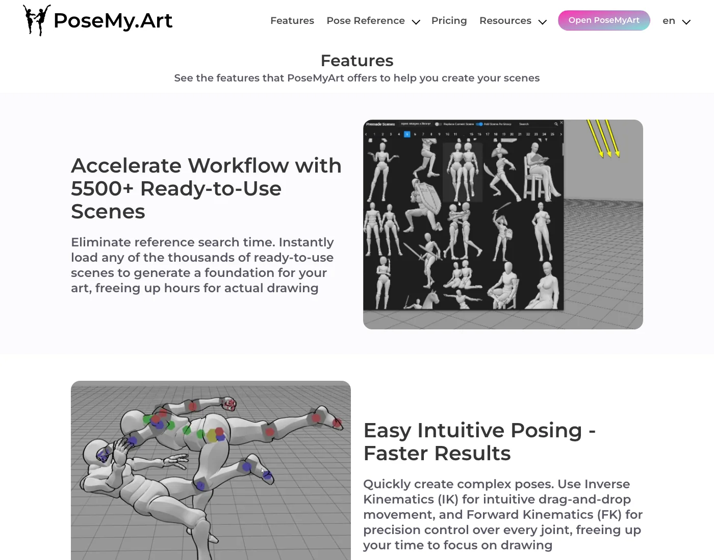
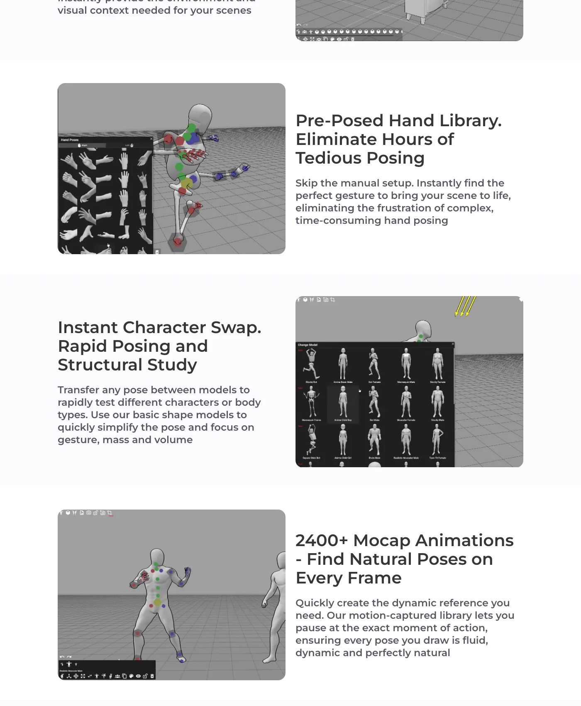
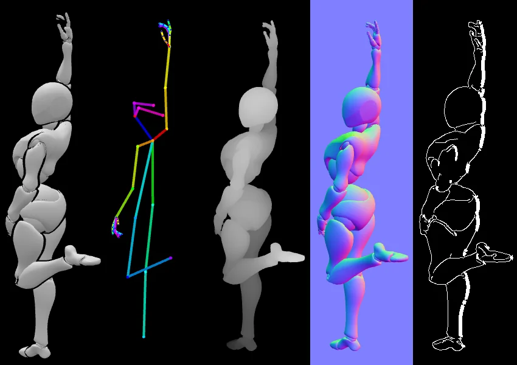

# PoseMy.Art Deep Dive: AI Creative Workflows Need Exportable Reference State, Not Just Pose Libraries

> **TL;DR:** PoseMy.Art looks like a free online 3D pose-reference tool, but the interesting part is not only that it has many poses. It brings 5,500+ ready-to-use scenes, 6,300+ premade poses, IK/FK joint control, a hand-pose library, character swapping, 2,400+ mocap animations, camera/FOV control, lighting, background reference planes, OBJ import/export, and OpenPose / Depth / Canny / Normals / Regular image export into one browser workflow. For AI image and video work, that matters because the body, camera, light, depth, edges, and pose can become checkable reference state before a model call.

- **Source:** [PoseMy.Art Features](https://posemy.art/features/)
- **Accessed:** 2026-07-18
- **Topic:** pose reference / 3D posing / OpenPose / creator workflow / AI image and video pre-production
- **Tags:** PoseMy.Art / pose reference / OpenPose / Depth / Canny / Normals / AI image / AI video / creator workflow

## One-line Takeaway

**PoseMy.Art is not valuable because it generates final artwork. It is valuable because it turns pose, scene, camera, lighting, and export conditions into a lightweight, reusable reference-state layer.**

That matters a lot for AI creation. Many image and video failures do not happen because the model cannot understand “a person jumping.” They happen because the model is not given enough structure: where the weight sits, how the hands are shaped, how extreme the camera angle is, where the light comes from, how the figure fits the background perspective, and what the depth or edge structure should be.

The PoseMy.Art features page is not a technical whitepaper, but it lays out the workflow clearly: find an action with premade poses or mocap, refine it with IK/FK, camera, light, models, and props, then export it as a regular image, OpenPose, depth, canny, normals, or OBJ.

That is more than a pose website. It is a small pre-production console for AI-assisted visual work.

## 1. 5,500+ scenes and 6,300+ poses solve the “no starting point” problem

PoseMy.Art highlights two numbers near the top:

- 5,500+ ready-to-use scenes;
- 6,300+ premade poses.

The point is not inventory for its own sake. The point is reducing the slowest first step: getting from an idea to a usable reference.

Artists, comic creators, storyboarders, and AI image creators often share the same problem. They can describe the action, but they need something more concrete:

- torso tilt;
- pelvis-to-shoulder relationship;
- whether an arm blocks the face;
- front-foot and back-foot weight;
- contact points between multiple characters;
- whether props are needed to support the action.

A large library of scenes and poses lets users begin from an approximate state instead of a blank canvas. It does not force the user to become a 3D animator before making progress.

This is close to the logic behind reference video and 3D blocking in AI video workflows: the reference source does not have to be beautiful. It has to be clean, explicit, and editable.

## 2. IK/FK moves the workflow from “placing models” to controlling body structure

PoseMy.Art explicitly mentions two control modes:

- Inverse Kinematics (IK) for drag-and-drop movement;
- Forward Kinematics (FK) for precise joint control.

That means the tool is not only a static template library. Users can keep editing the body structure after loading a pose.

For drawing, IK is speed. You move a hand, foot, head, or torso while the system helps preserve the overall skeleton relationship. FK is precision. Some details still need joint-by-joint adjustment: wrist angle, shoulder rotation, knee direction, spine curve, or finger shape.

For AI workflows, the distinction also matters. A prompt can say “the character reaches forward,” but the model will invent the arm path. IK/FK lets the creator define the action structure first, then export that structure as OpenPose, a regular reference image, or depth/normal/edge conditions.

In short, PoseMy.Art turns “describe the body” into “edit the body.”

## 3. Hand poses and character swap address the details that usually break

Two features on the page are easy to underestimate:

- Pre-Posed Hand Library;
- Instant Character Swap.

Hands are one of the most common failure points in both drawing and AI generation. Many pose tools can establish a full-body silhouette, but meaningful hands are expensive: fist, open hand, pointing, holding an object, touching the face, gripping a weapon, or forming a gesture all require many small joints to line up.

A hand-pose library turns that from “pose every finger manually” into “select, then refine.” That is practical for comics, illustration, and AI image workflows because hands often carry emotion and narrative action.

Character swap solves a different problem. The same pose behaves differently on different body types. Weight, proportion, and visual mass change when a pose is transferred. PoseMy.Art says users can transfer a pose between models and use basic shape models to focus on gesture, mass, and volume.

That is the right direction. For art study, simplified volumes are often more useful than detailed anatomy. For AI workflows, simple forms can reduce the chance that surface detail distracts from pose, mass, and body structure.

## 4. 2,400+ mocap animations extend reference from pose points to time slices

PoseMy.Art also offers 2,400+ motion-captured animations and says users can pause at the exact moment of action.

That is fundamentally different from a static pose library. A pose library gives you a result. Mocap lets you search along the motion path.

Take a punch. It is not one pose. It is a sequence:

1. weight preparation;
2. torso rotation;
3. shoulder leading the arm;
4. arm acceleration;
5. contact or stop;
6. follow-through and recovery.

If you only use the final position, the image can feel stiff. Mocap helps creators select a more dynamic moment inside the action.

For AI video and animation reference, this is especially useful. Many models can create a beautiful still, but the in-between body mechanics may feel wrong. A pausable mocap library helps creators find credible key poses before moving into image generation, storyboarding, or video control.

## 5. Camera, FOV, lighting, and background references make pose part of a scene

Another important signal is that PoseMy.Art does not treat the pose as a white-background mannequin. It includes:

- full camera control;
- Field of View (FOV);
- directional lighting;
- a background/reference image as a controllable 3D plane;
- props and environmental context.

This reflects a basic truth: a pose only fully exists once it is inside a shot.

The same action changes completely under eye-level, high-angle, low-angle, wide-close, or long-lens framing. FOV changes perspective exaggeration. Lighting defines volume and shadow. A background plane helps check whether the figure actually belongs in the space.

For AI image and video generation, these facts are more reliable than adjectives such as “beautiful cinematic pose.” The model needs shot conditions:

| Control object | Helps drawing by | Helps generation by |
|---|---|---|
| Camera / FOV | Fixing perspective and exaggeration | Constraining viewpoint |
| Directional light | Clarifying form, shadow, and volume | Giving light-direction evidence |
| Background plane | Aligning figure and environment perspective | Reducing figure/scene drift |
| Props | Explaining contact, support, and action purpose | Anchoring the action semantically |

That is why a pose tool should not be only a body library. The useful version is scene-aware.

## 6. The strongest AI signal: OpenPose / Depth / Canny / Normals export

The most important line on the features page is the export list:

- Open Pose;
- Depth;
- Canny;
- Normals;
- Regular images.

This moves PoseMy.Art from “reference image for humans” into “control conditions for models.”

OpenPose, Depth, Canny, and Normals describe different layers of visual structure:

| Export format | Represents | Useful for constraining |
|---|---|---|
| Regular image | Full visual reference | Composition, silhouette, pose feel |
| OpenPose | Skeleton keypoints | Body action, hand pose, character stance |
| Depth | Distance from camera | Spatial layering, occlusion, volume |
| Normals | Surface orientation | Form turns, volume, light interpretation |
| Canny | Edges | Contour, composition, structural lines |

These formats fit the same conditioning vocabulary used by ControlNet-style AI image pipelines. PoseMy.Art therefore produces not just a screenshot, but a set of structural signals that downstream models can read separately.

That is useful in practice. The same scene can export OpenPose to control body action, Depth to control space, Canny to control contour, and a Regular image for human review. Compared with writing “dynamic pose, correct anatomy, dramatic angle” in a prompt, structural conditions are easier to verify and reuse.

## 7. OBJ import/export connects it to 3D production too

The page also mentions two 3D asset workflows:

- exporting the posed figure and scene as OBJ;
- importing custom `.OBJ` assets.

That means PoseMy.Art is not only a drawing-reference tool. It can participate in sculpting, modeling, previs, or more complex 3D workflows.

There is an important boundary here. The page says OBJ export is for quickly creating a starting base and adds: “For base only. Commercial use requires significant alteration.” In other words, it is useful as starting structure, not as final commercial asset replacement.

That boundary matters. Reference tools help creators establish structure faster. They do not replace original modeling, character design, or rights review.

## 8. Implications for QCut and AI video toolchains

Placed inside an AI video or QCut-like stack, PoseMy.Art suggests a clear design pattern: **generation tools need an editable reference-state editor before the model call.**

A more mature AI video workflow could look like this:

1. use a premade pose or mocap clip to find the action starting point;
2. refine body and hands with IK/FK;
3. swap characters to test body type and proportion;
4. set camera/FOV for the shot relationship;
5. add light, background, and props for scene context;
6. export OpenPose, Depth, Canny, Normals, and a regular image;
7. feed those conditions into image/video generation, storyboarding, character consistency, or QA.

That is more reliable than simply writing a longer prompt. Prompts are good for intent, style, and constraints. Tools like PoseMy.Art are better at visual structure and spatial evidence.

The product lesson is not one specific feature. It is the object model:

- pose is an object;
- camera is an object;
- light is an object;
- prop is an object;
- background reference is an object;
- export conditions are objects;
- scene state can be saved, modified, exported, and passed to a model.

Future AI creation tools will lose a lot of control if they only store prompt history. The stronger architecture is to store full reference state.

## 9. Risks and limits: reference state is not final quality

PoseMy.Art’s direction is practical, but it is not a universal production system.

Several limits are worth keeping in mind:

- a 3D mannequin is not a finished character design;
- premade poses and mocap may need editing or they can feel templated;
- a hand-pose library saves time, but complex grips, contact, and occlusion still need review;
- OBJ export is a base, and commercial use requires significant alteration;
- OpenPose / Depth / Canny / Normals are control conditions, not guarantees that a downstream model will obey them perfectly;
- a browser tool is good for lightweight reference work, but not necessarily large multi-character production management.

These limits do not weaken the product’s value. They define its role: pre-production structure tool, not final renderer, final model library, or automatic finished-art button.

## 10. Conclusion: PoseMy.Art matters because reference state is exportable

The most interesting thing about PoseMy.Art is not the raw count of 5,500+ scenes or 6,300+ poses. The stronger product signal is that it puts pose, hands, body type, mocap, props, camera, lighting, background, OBJ, and AI-friendly export formats into one lightweight workflow.

That shows where AI creation control is moving. Creators are no longer only writing “a character in a dynamic pose.” They are first building a checkable scene state: where the skeleton is, how depth works, what the edges look like, where surfaces face, how exaggerated the camera is, and where the light comes from.

Once those states can be exported, PoseMy.Art stops being only a drawing-reference website. It becomes a small structure editor inside the AI image and AI video pre-production stack.

A more stable creative workflow will likely be:

**use the prompt for intent, the reference tool for structure, exported conditions for model control, and human review for iteration.**

PoseMy.Art is useful precisely because it sits at that point in the chain.
