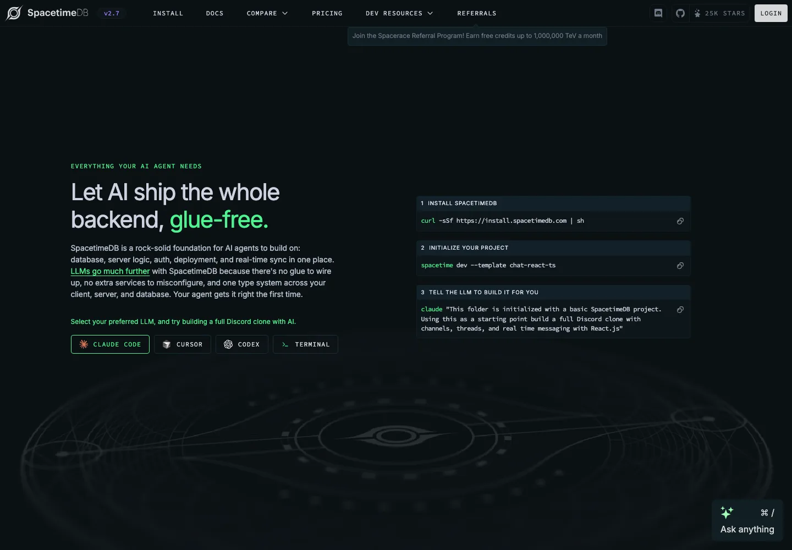
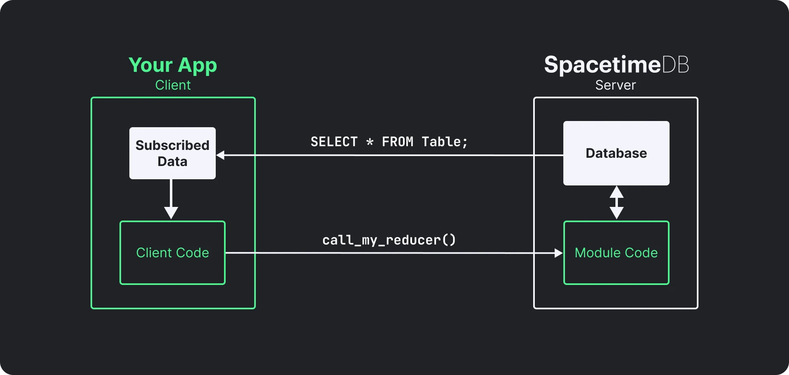
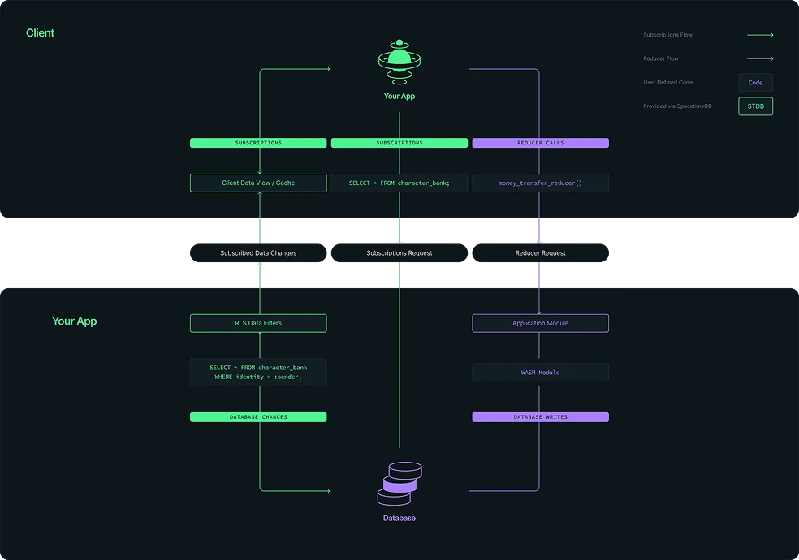
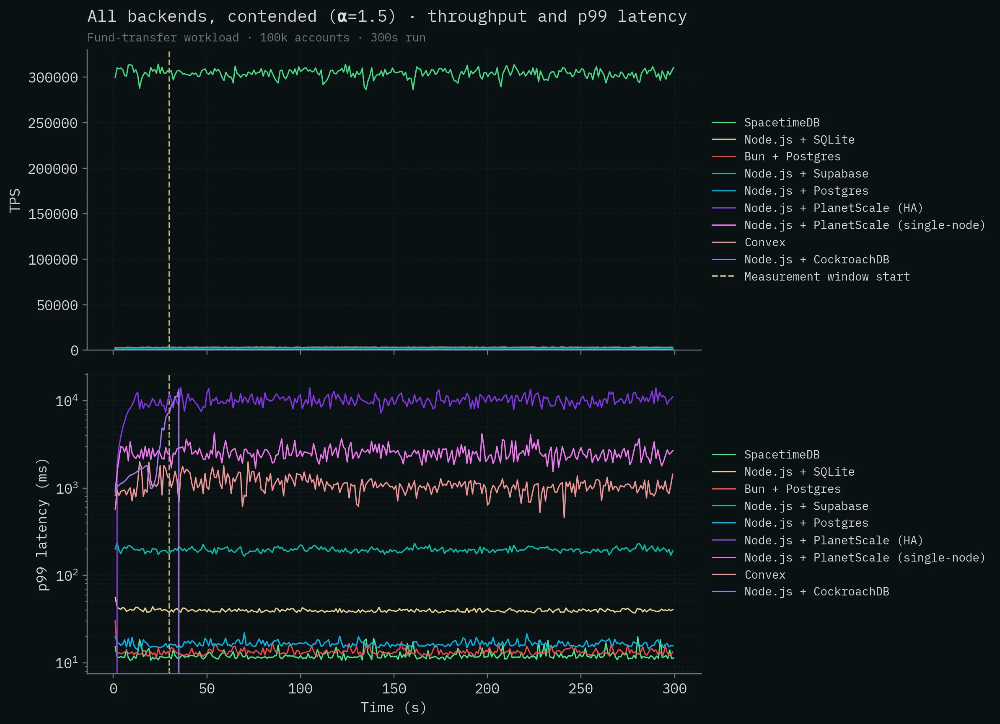

# SpacetimeDB 2.7 深度拆解：把数据库、后端与实时同步折叠成一个 Agent 运行时

> **TL;DR:** SpacetimeDB 不是“带实时订阅的 PostgreSQL”，而是把关系数据库、事务型业务逻辑、RPC、权限、状态同步和客户端缓存合并成一个应用运行时。客户端订阅自己需要的行，在本地缓存读取；所有写入通过运行在数据库里的 reducer 完成。它特别适合高频共享状态、多人游戏、协作应用和希望让 AI agent 少拼接基础设施的团队，但代价是新的编程模型、内存容量边界、平台耦合，以及 BSL 1.1 而非普通开源许可证。

- **Source:** [SpacetimeDB](https://spacetimedb.com/)
- **Version anchor:** [SpacetimeDB v2.7.0, released July 22, 2026](https://github.com/clockworklabs/SpacetimeDB/releases/tag/v2.7.0-hotfix3)
- **Accessed:** 2026-07-30
- **Topic:** relational database / application server / realtime sync / agent backend
- **Tags:** SpacetimeDB / Database / Backend Runtime / Realtime / AI Agent / Rust / TypeScript / Game Server

## 一句话概括

**SpacetimeDB 的真正产品不是一款更快的数据库，而是一种“数据库就是后端”的应用架构。**

传统应用通常被拆成：

`客户端 -> API / 游戏服务器 -> ORM -> 数据库 -> 缓存 / 消息队列 -> WebSocket 同步`

SpacetimeDB 试图把中间层折叠成：

`客户端 SDK -> SpacetimeDB 模块 + 数据库`

开发者把表结构和业务逻辑写成 module，module 被编译为 WASM 或 JavaScript bundle，直接在数据库运行时中执行。客户端调用 reducer 写入数据，再订阅查询结果；服务端把相关变化增量推送到客户端缓存。

这也是官网在 2.7 版本把主叙事改成 `Let AI ship the whole backend, glue-free` 的原因。对 agent 来说，最难的往往不是生成某个 endpoint，而是让数据库 schema、服务端类型、客户端类型、认证、部署和实时同步彼此一致。SpacetimeDB 试图用一个类型系统和一个部署单元消灭这些连接工作。

## 1. 它同时是数据库、应用服务器和同步引擎

[官方定义](https://spacetimedb.com/docs/intro/what-is-spacetimedb/)是：SpacetimeDB 是一个同时也是服务器的关系数据库。应用逻辑被上传到数据库，客户端不需要经过单独的 Web 或游戏服务器。

一个 SpacetimeDB 应用主要有四个对象：

| 对象 | 作用 | 传统栈中的近似物 |
|---|---|---|
| Table | 保存应用状态 | 关系数据库表 |
| Reducer | 修改状态的事务函数 | API endpoint + service method + transaction |
| Subscription | 声明客户端需要哪些行 | query + WebSocket topic + cache invalidation |
| Client SDK | 类型安全调用与本地缓存 | API client + state store + realtime client |

服务端 module 当前支持 Rust、C#、TypeScript 和 C++；客户端覆盖 Web / Node、Rust、C# / Unity，以及 C++ / Unreal。一个 database 在这个体系里不只是“数据容器”，而是一个可部署应用。

架构图里最关键的不是少画了几个方框，而是数据库和业务逻辑共享同一个运行时。传统服务每次事务都可能跨越网络、连接池和 ORM；SpacetimeDB 则把事务逻辑放到数据旁边执行。

## 2. Reducer 是 API，也是强制事务边界

[Reducer](https://spacetimedb.com/docs/functions/reducers/) 是 SpacetimeDB 的核心抽象。客户端不能任意更新表，只能调用 reducer；每次 reducer 调用自动成为一个事务。

这带来三个直接结果：

1. **原子性默认存在。** reducer 成功时全部提交，失败时全部回滚；
2. **权限逻辑和写入逻辑共处。** 可以用调用者 identity 判断能否执行；
3. **API schema 由代码生成。** 客户端使用生成的类型安全接口，不需要手写 REST contract。

它很像 stored procedure，但又不完全一样。传统 stored procedure 通常只是数据库内部能力，而 reducer 同时承担应用 RPC、鉴权入口、事务和变更广播。开发者写的不是“数据库旁边的一段 SQL”，而是整个后端命令面。

严格边界也意味着限制。Reducer 不能随意访问文件系统、系统调用或外部网络，因为这些副作用无法与事务一起可靠回滚；全局可变状态同样不能当成持久状态。持久状态必须进入 table。

这不是小差异。把现有 Node / Django / Rails 服务迁过来，不能只替换数据库驱动，而要重新划分业务逻辑：确定性事务逻辑进入 reducer，外部副作用进入其他执行路径。

## 3. Subscription 不只是 WebSocket，而是受约束的数据复制

客户端通过 subscription 指定自己需要的行。初次订阅时，服务端发送当前匹配结果；之后每个已提交事务只推送相关增量。SDK 将这些行维护在本地缓存中，UI 读取本地状态，不必每次重新请求服务端。

这比“数据库加 WebSocket”更完整。普通实时后端仍需要开发者解决：

- 哪次写入触发哪个频道；
- 消息和数据库提交是否一致；
- 客户端断线重连后如何补状态；
- 多个订阅重叠时怎样去重；
- UI 何时能看到完整事务后的状态。

[Subscription semantics](https://spacetimedb.com/docs/clients/subscriptions/semantics/) 明确规定事务更新的顺序和缓存一致性：客户端回调会在整批缓存更新后运行，重叠订阅的变化也会合并处理。换句话说，它实现的更接近“查询结果的持续复制”，而不是开发者手工广播事件。

代价是 subscription query 并非任意 SQL。它主要服务可持续维护的行集合，不适合复杂分析、任意聚合和重型批处理。官方也明确说 SpacetimeDB 优化目标是低延迟实时应用，而非 analytics。

## 4. 为什么这套架构对 AI Agent 特别有吸引力

官网的新 AI 定位不是凭空贴标签。Agent 生成后端时最容易出错的地方，恰好是传统技术栈的接缝：

- migration 改了，ORM type 没改；
- API response 改了，前端 type 没改；
- 写入成功了，缓存没有失效；
- WebSocket 推了事件，但客户端状态顺序错了；
- 鉴权写在 endpoint，另一个入口漏掉；
- 本地环境、容器和云部署行为不一致。

SpacetimeDB 把 schema、业务函数和客户端绑定放在一个生成链路里。Agent 可以读取一个 module，就知道有哪些表、哪些 reducer、哪些订阅数据和哪些类型；2.7 版本还为 standalone database 增加了 [MCP endpoint](https://github.com/clockworklabs/SpacetimeDB/releases/tag/v2.7.0-hotfix3)，可暴露健康检查、schema、SQL、reducer 调用等能力。

这会降低 agent 的上下文复杂度，但不会自动消除产品风险。模型仍然可能：

- 订阅过多数据，导致带宽和内存成本失控；
- 把 row-level security 写错；
- 在 reducer 里遗漏权限判断；
- 设计出无法平滑迁移的 schema；
- 在 procedure 的事务重试中重复外部副作用；
- 把官方 benchmark 当成自身 workload 的容量规划。

所以 SpacetimeDB 更像给 agent 提供一个较小、较一致的后端状态空间，而不是让后端工程消失。

## 5. 外部 API 怎么办：Procedure 是必要的逃生口

早期“所有逻辑都在数据库内”最明显的问题，是如何调用支付、邮件、模型 API 和 webhook。当前 2.7 文档提供了 [procedure](https://spacetimedb.com/docs/functions/procedures/)：

- procedure 可以发起 HTTP 请求；
- 它不像 reducer 那样自动包在事务里；
- 需要显式使用 `withTx` 访问事务；
- 持有事务时不能同时等待 HTTP；
- 事务闭包可能重试，因此必须保持确定性。

这是一种合理但需要纪律的设计：先在短事务里读出任务，释放事务，调用外部服务，再用另一个短事务写回结果。它避免网络等待长期占用数据库事务，却把幂等、重试和补偿重新交还给开发者。

目前文档仍把 C#、Rust 和 C++ 的 procedure 标为不稳定能力。对于重度依赖第三方 npm 包、长任务队列、复杂后台作业和大量 SaaS integration 的产品，成熟 Node 后端或 Convex 一类平台仍可能更省力。

## 6. 30 万 TPS 该怎么读

SpacetimeDB 官网强调 100 到 1000 倍性能。[2026 年 5 月更新的官方 benchmark](https://spacetimedb.com/blog/benchmarking) 报告，在争用型资金转账 workload 中，TypeScript module 达到 `303,920 ± 4,712 TPS`。

这个结果值得关注，但必须带着测试定义一起读：

- 它比较的是完整后端路径，不是孤立数据库引擎 microbenchmark；
- workload 有 10 万账户，并用 `α=1.5` 的 power-law 制造热点争用；
- 正式测量 300 秒，前面有 30 秒 warm-up；
- SpacetimeDB 的优势来自业务逻辑与数据共置，减少持锁期间的网络往返；
- 当前复测使用可公开复现的单节点 standalone；最初云端版本曾使用五节点复制集群；
- 这是厂商自己设计并运行的 benchmark。

更重要的是，官方承认第一版测试中的 SQLite connector 有 bug，更新语句没有真正执行，之后修复并重跑。愿意公开修正是好事，但也说明这些数字不能脱离代码、数据分布和部署拓扑直接外推。

正确结论不是“SpacetimeDB 永远比 Postgres 快 1000 倍”，而是：**当 workload 包含高争用、短事务和频繁客户端同步时，把业务逻辑移到数据旁边，确实可能消除传统三层架构中的主要延迟。**

## 7. BitCraft 证明了上限，但还没有证明普适性

SpacetimeDB 最强的生产案例是 Clockwork Labs 自己的 MMORPG [BitCraft Online](https://bitcraftonline.com/)。官方称聊天、物品、地形、玩家位置等整个后端运行在一个 module 中，并向数千名玩家实时同步状态。

这说明它不是只能做 todo demo。多人在线游戏恰好拥有 SpacetimeDB 最擅长的 workload：

- 大量共享状态；
- 高频小事务；
- 低延迟状态分发；
- 清晰的服务端权威逻辑；
- Unity / Unreal 客户端；
- 需要避免每个玩法系统各造一套网络协议。

但 BitCraft 也是开发商和数据库厂商同源的旗舰项目。它证明团队愿意用自己的系统承担真实负载，却不能替代更多独立团队、更多行业和更长时间尺度的验证。

## 8. Maincloud 的计费不是按请求，而是按“能量”

[Maincloud 定价](https://spacetimedb.com/pricing) 使用 TeV credit 作为综合计量单位。它将扫描与写入字节、索引 seek、CPU 指令、网络下行和存储等消耗折算为“能量”：

| 计划 | 月费 | 每月包含 | 适合 |
|---|---:|---:|---|
| Free | $0 | 2,500 TeV | 原型、个人项目、低流量应用 |
| Pro | $25 | 100,000 TeV | 正式小型产品，需要复制和备份 |
| Team | $250 | 250,000 TeV | 团队协作、权限和专属节点需求 |
| Enterprise | 定制 | 定制 | 自托管、BYO cloud、定制 SLA |

官网把 Pro 的额度示例换算成约 1.2 亿次函数调用、500GB egress 或 40GB table storage，但这只是单项等价示例，不是这些资源可以同时用满。真实成本取决于查询扫描量、状态同步量和活跃数据规模。

由于 SpacetimeDB 把应用状态放在内存中，容量规划也不同于磁盘优先数据库。官方表示 Maincloud 机器可到 80 核、256GB RAM 以上，但单个数据库仍受物理节点能力约束。对超大冷数据、分析历史、数据仓库或需要任意横向分片的系统，这不是天然最佳选择。

## 9. 最大的非技术风险：它是 source-available，不是普通开源

SpacetimeDB 的 GitHub 仓库公开源码，但当前 [LICENSE.txt](https://github.com/clockworklabs/SpacetimeDB/blob/master/LICENSE.txt) 明确写着 BSL 1.1，并注明 `This License is not an Open Source license`。

截至本文访问时，仓库 master 的 2.7.1 许可参数包括：

- 可复制、修改、再分发和非生产使用；
- 额外授权允许在生产中使用不超过一个 SpacetimeDB instance；
- 不得把它用于向第三方提供 Database Service；
- 不符合条件的部署需要商业许可；
- 该版本的 change date 为 2031-07-26，之后转为带 linking exception 的 AGPL v3。

这不代表使用 SpacetimeDB 构建的每个应用都必须开源，但它确实会影响多实例自托管、托管服务、分发和长期基础设施策略。准备自托管生产环境的团队应直接审阅对应版本许可证，并向厂商确认计划，而不是只看 GitHub stars 和 Docker image。

另一个锁定来自编程模型。表、reducer、subscription、生成 SDK、identity 和部署方式形成一个整体。一旦采用，迁移回“Postgres + API + WebSocket”不是换连接字符串，而是重建应用边界。

## 10. 它适合什么，不适合什么

**优先考虑 SpacetimeDB：**

- 多人游戏、共享世界、实时协作工具；
- 高频短事务与大量状态同步；
- 希望客户端拥有类型安全本地缓存；
- Rust、C#、TypeScript 或 C++ 团队；
- 小团队或 agent-first 团队，希望减少后端拼装；
- 能接受以 module / reducer / subscription 重构应用。

**先做验证再决定：**

- 依赖大量第三方 SDK 和后台任务；
- 强分析、报表、全文检索、向量检索或数据仓库；
- 数据规模明显超过单节点内存边界；
- 需要成熟 PostgreSQL extension 生态；
- 需要自由的多实例自托管或数据库即服务；
- 已有稳定后端，只是想加一个 realtime 功能。

最好的试点不是迁移整个产品，而是选择一个真正具有共享状态的问题：多人房间、协作画布、实时任务板或游戏 lobby。用实际订阅规模、断线恢复、权限、外部 API、schema migration 和 TeV 消耗做压测，再决定是否扩大。

## 结论：它真正删除的是“状态接线层”

SpacetimeDB 最重要的创新不是 reducer 这个名字，也不是一张 30 万 TPS 图，而是把后端重新定义成一个状态运行时：

**表是状态，reducer 是事务命令，subscription 是持续查询，客户端缓存是状态副本。**

这个模型让数据库提交与客户端可见状态共享同一条管线，减少 API、ORM、缓存失效、消息广播和类型同步之间的重复工作。对多人游戏和实时协作，它是很有力量的抽象；对 AI agent，它也提供了比传统云拼装更小、更可理解的生成目标。

但“glue-free”不是“trade-off-free”。外部副作用、权限、容量、迁移、可观测性、计费和许可证依然存在，只是换了形状。

如果把 SpacetimeDB 当成更快的 Postgres，很容易误判；把它当成一种以关系数据为核心的应用服务器，才更接近它真正要建立的新类别。

## 核心资料

- [SpacetimeDB homepage](https://spacetimedb.com/)
- [What is SpacetimeDB?](https://spacetimedb.com/docs/intro/what-is-spacetimedb/)
- [Key architecture concepts](https://spacetimedb.com/docs/intro/key-architecture/)
- [Reducers](https://spacetimedb.com/docs/functions/reducers/)
- [Subscriptions](https://spacetimedb.com/docs/clients/subscriptions/)
- [Procedures](https://spacetimedb.com/docs/functions/procedures/)
- [Official performance benchmark](https://spacetimedb.com/blog/benchmarking)
- [Maincloud pricing](https://spacetimedb.com/pricing)
- [SpacetimeDB GitHub repository](https://github.com/clockworklabs/SpacetimeDB)
- [Business Source License](https://github.com/clockworklabs/SpacetimeDB/blob/master/LICENSE.txt)
