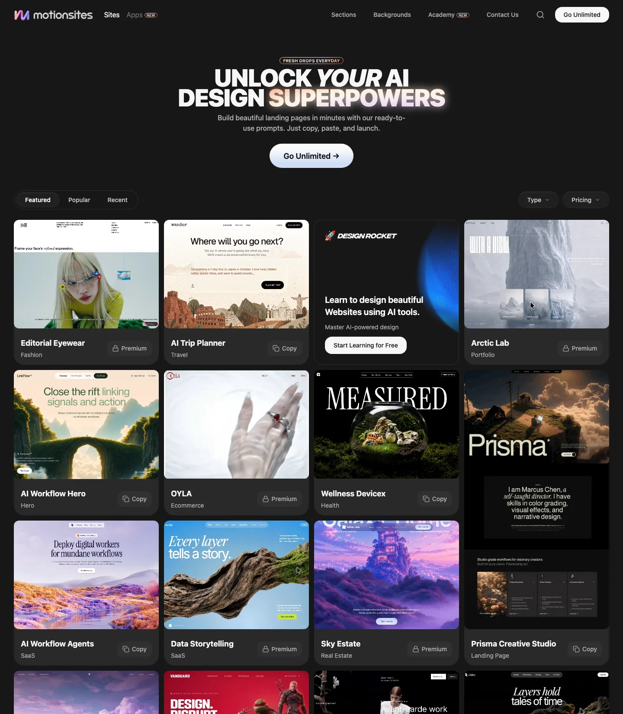
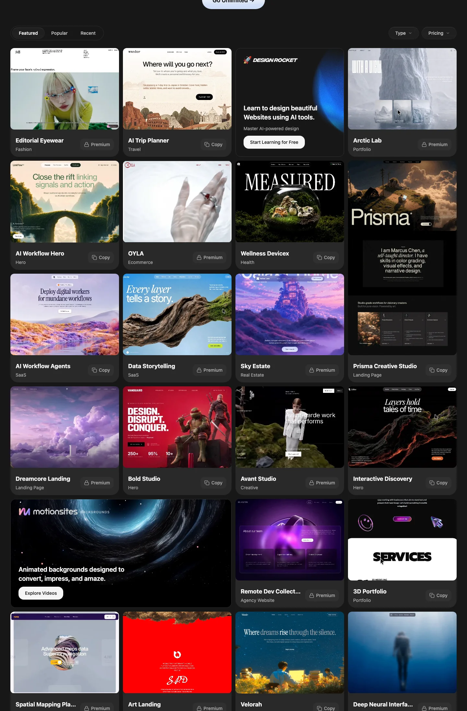

# MotionSites 深度拆解：AI 建站的下一层竞争，不是生成按钮，而是可复用的设计 Prompt 库

> **TL;DR:** MotionSites 不是一个完整的 AI 建站 IDE，而是一个面向 Lovable、Bolt、Cursor、Claude、v0、Replit 等 AI builder 的高级网站 Prompt / 设计样例库。它把 landing page、hero、SaaS、portfolio、ecommerce、agency、backgrounds、sections、mobile apps 等视觉方向做成可浏览、可筛选、可复制、部分付费解锁的 prompt 商品。对 AI 建站来说，真正有价值的信号是：当模型都能写代码以后，竞争会转向“谁能把审美、动效、结构、文案和组件关系预先整理成可复用设计规格”。

- **Source:** [MotionSites](https://motionsites.ai/)
- **Accessed:** 2026-07-25
- **Topic:** AI website prompts / design prompt marketplace / landing pages / builder workflow
- **Tags:** MotionSites / AI 建站 / Website Prompts / Lovable / Bolt / Cursor / Claude / v0 / Replit / Creator Workflow

## 一句话概括

**MotionSites 的产品判断是：AI 建站真正稀缺的不是“会生成页面的模型”，而是能把高级视觉网站拆成 prompt、结构和可复制设计规格的内容库。**

这和过去两年 AI 建站工具的主叙事不同。很多产品都在强调“输入一句话，生成网站”。MotionSites 站在更靠前的一层：如果用户已经有 Lovable、Bolt、Cursor、Claude、v0 或 Replit，那他缺的不是另一个聊天框，而是一套更好的起始设计。

所以 MotionSites 的首页文案很直接：`Unlock your AI design superpowers`，并解释为用 ready-to-use prompts 在几分钟内构建 landing pages，`Just copy, paste, and launch.` 它卖的不是托管，不是 CMS，不是代码编辑器，而是“可复制的高审美网站提示词”。

## 1. 它不是 builder，而是 builder 之前的设计规格层

MotionSites 的 metadata 写得很清楚：`Beautiful Website Prompts for Lovable, Bolt, Cursor, and Claude. Build Stunning 3d Websites With AI. Just copy, paste, and launch.`

这句话里最关键的不是 `AI`，而是工具链位置：

- Lovable；
- Bolt；
- Cursor；
- Claude；
- 站内 academy 文本还提到 v0、Replit、Claude Code 等 builder。

也就是说，MotionSites 并不试图替代这些生成工具。它把自己放在这些工具的上游：用户先在 MotionSites 找到设计方向，复制 prompt，再把它交给 AI builder 生成项目。

这是一种很现实的产品切位。因为今天的 AI builder 已经越来越会写 React、Tailwind、动画和组件，但它们仍然经常遇到两个问题：

1. 用户给的初始 brief 太空；
2. 模型生成出来的设计太模板化。

MotionSites 试图解决第二个问题：把“高级网页长什么样”先打包成可运行的 prompt 资产。

## 2. 首页像灵感站，但按钮是 Copy

从渲染页面看，MotionSites 第一屏不是传统 SaaS landing page，而是一个深色瀑布流 gallery。每个卡片都有网站截图、标题、分类和状态：

- `Copy`：可复制 prompt；
- `Premium`：需要付费解锁；
- 分类包括 Fashion、Travel、Hero、Ecommerce、SaaS、Real Estate、Portfolio、Landing Page、Creative、Agency Website、Artificial Intelligence 等。

顶部还有：

- Featured / Popular / Recent；
- Type filter；
- Pricing filter；
- Sections；
- Backgrounds；
- Academy；
- Apps（New）；
- Go Unlimited。

这让它看起来像 Dribbble、Awwwards、Mobbin 和 prompt marketplace 的混合体。但区别在于：普通灵感站给你看图，MotionSites 给你复制 prompt。

这个小变化很重要。AI 建站的工作流里，截图只是灵感；prompt 才是可执行规格。MotionSites 把“看见一个网站样式”往前推进成“复制一个能让 AI builder 生成类似结构的指令”。

## 3. Prompt 在这里不是一句话，而是设计规格

普通用户理解 prompt，往往是“一句话需求”：

> 做一个科技感 SaaS 官网。

但 MotionSites 的价值不可能来自这种短句。它真正卖的是更长、更具体的设计规格，通常会包含：

- 页面类型：hero、landing page、portfolio、ecommerce、agency site；
- 视觉风格：高级、3D、沉浸式、动效、暗色、极简、杂志感；
- 内容结构：导航、hero、CTA、features、pricing、footer；
- 动效要求：scroll animation、background animation、hover state；
- 技术栈暗示：React、Tailwind、组件化页面；
- 文案语气：适合某个行业或品牌；
- 布局和组件关系：大标题、卡片、网格、图像、按钮、渐变、3D 元素。

这其实是把 UI/UX designer、motion designer 和 front-end engineer 的一部分经验压缩成 prompt。

这也是 AI 建站下一阶段的关键：prompt 不再只是“需求输入”，而会变成一种 **可复用设计规格**。它像模板，但比模板更软；它像组件库，但更接近自然语言；它像设计系统，但没有完整 token 和代码约束。

## 4. 免费 / Premium / Unlimited：Prompt 也在被商品化

MotionSites 的卡片里有免费可复制项，也有 Premium 项。站内 bundle 字符串里还能看到几种付费层级：

- Go Unlimited；
- Power；
- Agency；
- Lifetime / annual / monthly access；
- features 文案里包括 unlimited website prompts、animated backgrounds、sections、future prompts、client work、priority support 等。

这说明 MotionSites 把 prompt 当成一种可以分级销售的数字资产。

这件事有点微妙。过去设计模板的商品化对象是：

- Figma template；
- Webflow template；
- Framer template；
- React / Tailwind template；
- UI kit；
- motion background pack。

MotionSites 商品化的是更抽象的一层：能让 AI builder 产出这些东西的 prompt。用户买的不是最终代码，也不一定是可直接部署的模板，而是更好的生成起点。

如果 AI builder 的能力继续提升，这类 prompt library 会越来越像“创作配方市场”：每个 prompt 不是成品，而是一条能反复生成、改写、迁移到不同工具的创作路线。

## 5. Sections / Backgrounds / Apps：从整站 Prompt 走向模块化 Prompt

MotionSites 顶部导航有几个特别值得看：

- Sites；
- Apps（New）；
- Sections；
- Backgrounds；
- Academy；

这说明它不是只做整站 landing page。它正在把 prompt 拆成不同颗粒度：

| 粒度 | 用户问题 | MotionSites 对应方向 |
|---|---|---|
| 整站 | 我要一个完整 landing page / portfolio / SaaS site | Sites |
| 移动产品 | 我要 web/mobile app UI 起点 | Apps |
| 页面模块 | 我要 hero、features、pricing、CTA、footer | Sections |
| 视觉资产 | 我要动效背景、3D 背景、沉浸式氛围 | Backgrounds |
| 学习流程 | 我想知道怎么把 prompt 用进 builder | Academy |

这比单纯“模板库”更有扩展性。因为 AI builder 生成时，用户经常不是从零开始建整站，而是需要某个局部：一个更强的 hero、一组 pricing cards、一个 scroll section、一个 animated background。

模块化 prompt 让用户可以把生成过程拆成局部迭代，而不是每次都让模型重写整站。

## 6. Academy 暴露的真实使用方式：复制、生成、再改

MotionSites 的 bundle 里可以看到 academy / tutorial 文案，说明典型流程是：

1. 浏览设计；
2. 点击 `Copy Full Prompt`；
3. 粘贴到 Claude Code、Cursor、Bolt、Lovable 或其他 AI website builder；
4. 让 builder 生成第一版；
5. 再要求 AI 保留设计风格并做内容、品牌、结构和技术调整。

这个流程很像“带参考图的 prompt engineering”，但对象变成了网页代码。

真正重要的是第五步。MotionSites 不应该被理解成“一键复制就完事”。一个 prompt 只是初始设计规格，用户仍然需要：

- 替换品牌和文案；
- 检查响应式布局；
- 检查可访问性；
- 检查动效性能；
- 接入真实数据和表单；
- 删除无关组件；
- 修复模型生成的代码问题；
- 确认最终代码和素材权利。

换句话说，它提高的是起步审美，不是自动完成产品交付。

## 7. 对 AI 建站工具的启发：Prompt 市场会补上“审美冷启动”

AI 建站工具的一个核心问题是冷启动。

用户说“帮我做一个 AI SaaS 官网”，模型可以生成，但往往会落到熟悉套路：

- 大渐变背景；
- 圆角卡片；
- 三个 feature；
- 一个 pricing；
- 一套差不多的 hero 文案；
- 缺少真正的视觉个性。

MotionSites 的价值，是给模型一个更强的起点。它把“高级网站样式”整理成可复制 prompt，使用户不用从空白 brief 开始。

这对 QCut / 创作工具链也有启发。AI 生成视频、网页、图片、音乐，本质上都会遇到“从零开始太空”的问题。解决方案通常不是让用户写更长自然语言，而是给他一组可执行起点：

- 参考片段；
- prompt recipe；
- shot template；
- motion preset；
- UI section；
- style pack；
- exportable project scaffold。

MotionSites 正是网站领域里的这个方向。

## 8. 风险：如果只复制 Prompt，网站会越来越像

这种产品也有明显风险。

第一，审美趋同。MotionSites 的 gallery 很漂亮，但如果大量用户复制同一批 prompt，再用同一批 AI builder 生成，网站可能迅速变得同质化。

第二，prompt 不等于设计系统。一个 prompt 可以生成惊艳页面，但不一定有：

- 真实 design tokens；
- 组件状态；
- accessibility spec；
- content model；
- analytics；
- SEO；
- CMS；
- 表单和后端；
- 维护策略。

第三，动效和 3D 可能变成噪声。MotionSites 强调 3D、motion、animated backgrounds，但商业网站最终要服务转化、阅读、速度和可用性。酷不是目的，清晰才是。

第四，权利和原创性需要注意。用户复制 prompt 生成的页面，仍然要检查生成代码、素材、品牌表达、第三方依赖和是否过度接近某个示例。

所以更稳妥的使用方式不是“照抄一个 prompt”，而是把它当成高级参考规格，然后进行品牌化和工程化改造。

## 9. 对创作者的实用 SOP

如果把 MotionSites 放进真实项目，可以这样用：

1. 先按行业或页面类型筛选：SaaS、portfolio、ecommerce、agency、hero、landing page；
2. 找 3 个视觉方向，不要只选一个；
3. 复制 prompt 到 AI builder，生成初版；
4. 要求模型解释页面结构和组件层级；
5. 把品牌色、真实文案、产品截图、目标用户和 CTA 改进去；
6. 要求模型压缩动效、检查移动端、检查可访问性；
7. 把生成结果拆成可维护组件；
8. 做 Lighthouse / 性能 / SEO / 表单 / analytics 检查；
9. 最后再决定是否部署。

这样用，MotionSites 是一个加速器。反过来，如果只复制一个高视觉 prompt 然后直接上线，它很容易变成漂亮但脆弱的 demo。

## 10. 结论：AI 建站会从模型竞争，进入 Prompt 资产竞争

MotionSites 的意义不在于它能不能取代 Lovable、Bolt、Cursor 或 Claude。它根本不是在同一层竞争。

它所在的位置更像：

**AI builder 负责生成，MotionSites 负责给生成提供高质量设计起点。**

当生成能力变得普遍以后，差异会转向上游：谁有更好的 prompt recipes、reference systems、design taste、interaction patterns、sections、backgrounds 和教育内容。MotionSites 把这些东西包装成一个可浏览、可复制、可付费解锁的 prompt gallery。

这说明 AI 建站正在从“能不能生成页面”，进入“能不能稳定生成有审美、有结构、有商业用途的页面”。

模型是引擎，prompt library 是起跑线。MotionSites 做的就是把这条起跑线商品化。
