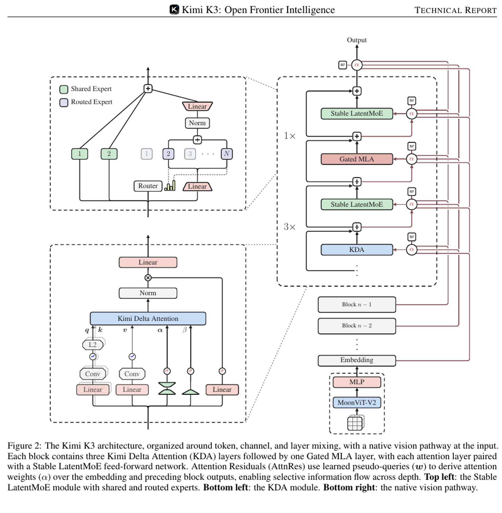
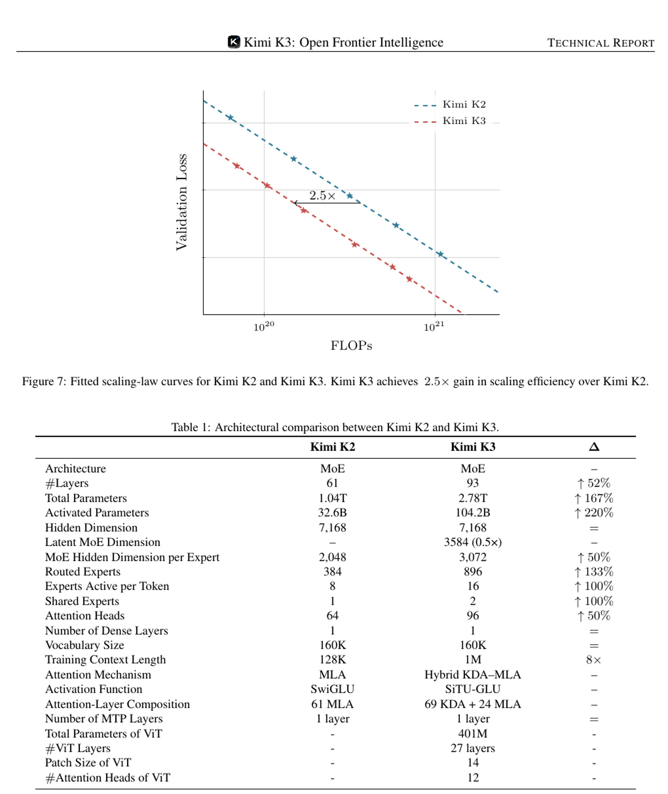
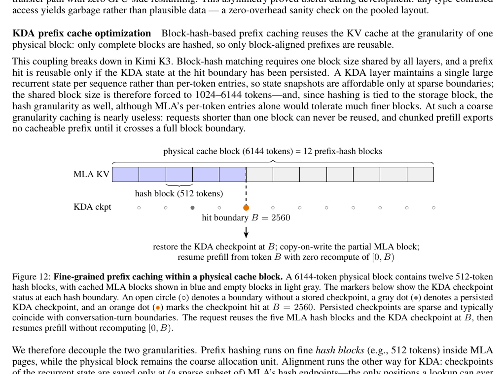
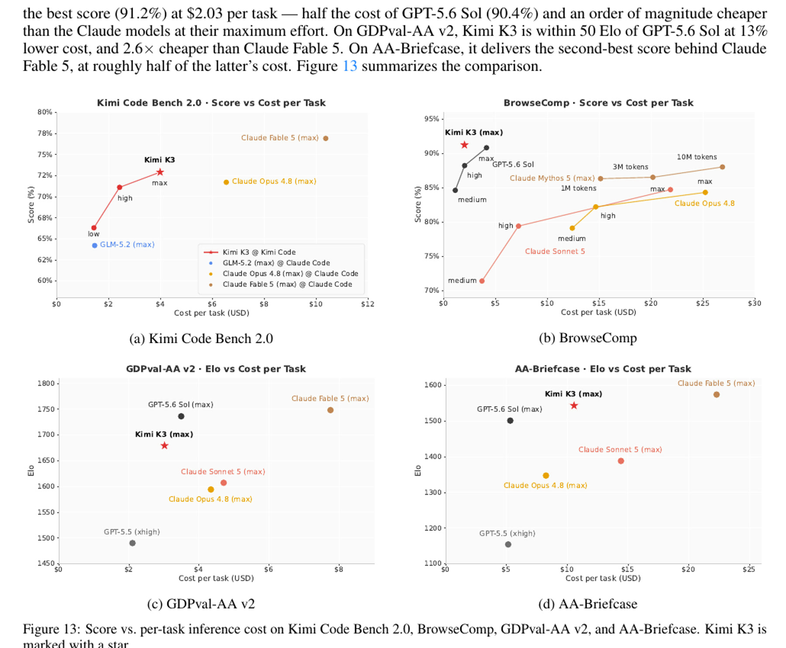

# Kimi K3 权重发布审计：1.56TB 开放之后，真正的门槛是 Agent 状态与集群系统

> **TL;DR:** Moonshot AI 已在 2026 年 7 月 27 日兑现 Kimi K3 的完整权重和技术报告。Hugging Face 仓库包含 96 个 safetensors 分片，API 显示总存储约 1.56TB；模型有 2.78T 总参数、104.2B 激活参数、1M token 上下文和原生视觉。真正的新信息不只是 KDA、AttnRes 和 16/896 experts，而是 K3 为百万 token Agent 训练和推理构建了一套状态系统：部分 rollout 跨迭代恢复、外置 KV cache、可暂停/分叉的 microVM、KDA 与 MLA 联合前缀缓存、会话亲和调度。代价同样明确：官方生产建议是 64 张以上加速器组成的 supernode，vLLM 最小参考配置也从 8 张 GB300 起；许可证是定制 Kimi K3 License，并非 Apache/MIT。K3 的权重已经开放，但它更像数据中心级开放基础设施，而不是个人工作站模型。

- **首发博客：** [Kimi K3: Open Frontier Intelligence](https://www.kimi.com/blog/kimi-k3)
- **技术报告：** [Kimi K3 Technical Report](https://github.com/MoonshotAI/Kimi-K3/blob/main/k3_tech_report.pdf)
- **项目仓库：** [MoonshotAI/Kimi-K3](https://github.com/MoonshotAI/Kimi-K3)
- **完整权重：** [moonshotai/Kimi-K3](https://huggingface.co/moonshotai/Kimi-K3)
- **API 文档：** [Kimi K3 Quickstart](https://platform.kimi.ai/docs/guide/kimi-k3-quickstart)
- **权重/报告发布：** 2026-07-27
- **访问时间：** 2026-07-28

## 一句话判断

**Kimi K3 最重要的开放发布结果，不是让 2.8T 模型变得“本地可跑”，而是让外界第一次能同时审计一个 3T 级多模态 Agent 模型的权重格式、架构、长程 RL 状态管理和生产 serving 设计。**

7 月 17 日首发时，K3 仍是一组 API、产品演示和官方 benchmark。Moonshot 当时承诺 7 月 27 日发布完整权重和技术报告。现在这两项都已落地，因此评估问题也发生了变化：不再是“它会不会真的开”，而是“开放到哪一层，以及谁有能力把它跑起来”。

## 1. 这次真正发布了什么

Hugging Face 模型仓库现在包含：

- 96 个 `safetensors` 权重分片；
- 模型配置、tokenizer 和 generation config；
- Kimi K3 / Kimi Linear 的自定义 Transformers 实现；
- 图像处理器和多模态预处理代码；
- 完整模型卡与评测说明；
- Kimi K3 License。

Hugging Face API 在访问时报告约 **1.561TB** 存储，以及 **2,779,931,837,184** 个参数。这里的文件体积已经包含原生 MXFP4 压缩；如果按 BF16 保存 2.78T 参数，规模还会大得多。

GitHub 仓库则主要包含 README、许可证、报告和图片，不是完整训练代码仓库。换句话说，当前公开层次是：**完整模型权重 + 推理所需远程代码 + 技术报告**，但没有开放预训练数据、完整训练流水线或可一键复现 2.8T 训练的工程栈。

这更准确地属于 open-weight，而不是“所有训练材料均开放”的完全开源。

## 2. 架构不是单纯扩大 MoE，而是同时扩展三条信息流

技术报告把 K3 的设计概括为三个维度：

| 维度 | 机制 | 解决的问题 |
|---|---|---|
| 序列 / token | 3 层 KDA + 1 层 Gated MLA 循环 | 用线性/递归状态处理长序列，同时保留周期性全局注意力 |
| 深度 / layer | Attention Residuals | 让当前层选择性读取早期 block，而不是把所有历史层压进单一 residual stream |
| 通道 / expert | Stable LatentMoE | 在低维 latent space 中扩大专家池，降低 16 个专家同时激活的通信与权重读取成本 |

*图：Kimi K3 架构。每个周期包含三层 KDA 和一层 Gated MLA；AttnRes 跨深度检索表示，Stable LatentMoE 负责稀疏通道混合，MoonViT-V2 提供原生视觉入口。来源：Kimi K3 Technical Report。*

具体规格是：

- 93 层，其中 69 层 KDA、24 层 Gated MLA；
- 2.78T 总参数，单 token 激活约 104.2B；
- 896 个 routed experts，每 token 选择 16 个；
- 另有 2 个 shared experts；
- hidden size 7,168，96 个 attention heads；
- 401M 参数、27 层的 MoonViT-V2；
- 最大上下文 1,048,576 tokens。

“只激活 16/896 experts”不能被理解为只需要承载 104B 权重。激活计算是稀疏的，但完整 2.78T 专家权重仍要分布在集群显存中；MoE 还需要持续做路由、all-to-all 通信和负载平衡。这也是模型文件只有约 1.56TB，部署却仍然是集群问题的原因。

## 3. 2.5 倍 scaling efficiency 不等于推理快 2.5 倍

报告称，KDA、AttnRes、Stable LatentMoE、数据和训练配方一起，让 K3 相比 K2 的 overall scaling efficiency 提升约 2.5 倍。这个数字来自 held-out OOD validation loss 的 scaling-law 拟合：达到同等验证损失所需的训练 FLOPs 更少。

*图：K2/K3 scaling-law 拟合和架构对照。2.5 倍指训练 scaling efficiency，不是解码吞吐或端到端 Agent 速度。来源：Kimi K3 Technical Report。*

这不是以下任何一个结论：

- K3 的 token generation 比 K2 快 2.5 倍；
- K3 的 API 成本天然下降 2.5 倍；
- K3 只需要 K2 的 40% 硬件；
- 每个 benchmark 都提高 2.5 倍。

报告也没有披露预训练总 token 数、总 FLOPs、GPU 数量或完整训练成本。已公开的是数据类别和训练方法：Web Text、Code、Mathematics、Knowledge 加大规模视觉语料；视觉数据包括 caption、图文交错文档、OCR、perception、video，以及 SVG、3D asset、网页、游戏、CAD 等“代码 + 渲染结果”数据。

## 4. 原生多模态和 1M 上下文，是训练出来的课程，不是配置项

K3 从训练开始就联合优化语言与视觉，而不是先训练语言模型、后接视觉 encoder 做对齐。图像和文本 token 进入同一个 next-token prediction 目标，MoonViT-V2 的视觉特征经过轻量 projector 进入共享 backbone。

长上下文也不是把 `max_position_embeddings` 改成 1M。报告描述了四阶段课程：

1. 预训练先从 8K 开始；
2. 再扩展到 64K；
3. cooldown 阶段进入 256K；
4. 最后训练到 1M。

KDA 使用 NoPE，通过递归 gate 和 decay 隐式编码位置，因此不需要做 RoPE rescaling。但这不代表模型会自动学会跨百万 token 找信息。团队还合成长程多模态任务，把关键信息分散到完整上下文各处，要求模型必须跨远距离检索才能完成。

更值得注意的是，技术报告没有把“1M context”当作普通文档摄入能力，而是用于 Agent 轨迹：多轮 reasoning、tool call、观察结果、代码、截图和环境状态共同积累。上下文在这里是运行时工作记忆预算。

## 5. 三个领域乘三个 effort，最后蒸馏回一个模型

K3 的 post-training 分三步：SFT、领域强化学习、Multi-Teacher On-Policy Distillation（MOPD）。

强化学习阶段分成三个领域：

- general tasks：知识、视觉、推理、事实性、搜索和知识工作；
- general agents：长程助手、deep research 和写作；
- coding agents：软件工程、代码经验、GPU kernel 和 web development。

每个领域再训练 `low`、`high`、`max` 三档 reasoning effort，共得到九个 expert policies。随后通过 MOPD，把九种领域/预算策略整合回一个模型。

这解释了 API 为什么现在支持三档 effort。首发时文档只有 `max`；权重发布后，`low`、`high`、`max` 已正式可用，默认仍是 `max`。这不是简单的“截短思维”，而是训练时就对 reasoning 和 tool-call token 预算做了约束和课程学习。

K3 还从 SFT 阶段开始进行量化感知训练：占绝大多数参数的 MoE expert weights 使用 MXFP4，activation 使用 MXFP8；attention、latent projection、shared experts 和 router 等非专家部分保持更高精度。官方权重因此不是事后粗暴压成 4-bit 的社区量化，而是部署格式参与了整个 post-training。

## 6. 百万 token Agent RL 的核心，是让模型和环境都能暂停

长程 Agent RL 很难用普通“生成完一批再更新”处理。一条轨迹可能包含数百或数千次工具调用，拖慢整批训练；如果跨迭代暂停，下一轮又需要恢复 KV cache 和工具环境。

K3 的答案是一套状态保存系统：

- partial rollout 不等待全部轨迹完成，先暂停长尾任务并在后续 iteration 恢复；
- active KV 留在 GPU，暂时不用的 prefix 写回 CPU DRAM 外置池；
- 训练权重和 optimizer state 在阶段切换时卸载到 NVMe，给 rollout cache 腾空间；
- AgentENV 使用 Firecracker microVM，支持 pause/resume、fork 和 snapshot；
- 增量 checkpoint 只保存脏页，报告给出的最低 checkpoint/resume 延迟分别是 133ms 和 49ms；
- 暂停的 sandbox 不占 CPU/内存，适合处理 Agent 大量等待推理的时间。

技术报告称，K3 训练与评估期间共创建了 **51,219,741 个 sandbox**，覆盖 **1,505,678 个 image**。这组数字最能说明“Agent 模型训练”已经不只是优化一个 loss，而是在运营一个大规模、可恢复、可隔离的计算环境系统。

## 7. 1M serving 的关键不是装进显存，而是不要重复 prefill

K3 混合了两种状态：MLA 的 KV cache 随 token 数线性增长，KDA 则为每个请求维护固定大小的递归 state。只有两种状态在同一前缀边界都可恢复，cache hit 才有效。

报告因此把粗粒度物理页和细粒度 prefix hash 分开。例如一个 6,144-token 物理 block 可以包含十二个 512-token hash blocks；KDA checkpoint 只在部分 hash 边界持久化。命中 2,560-token 边界时，系统恢复 KDA state、对 MLA 部分页 copy-on-write，然后直接从边界继续 prefill，不再重算前 2,560 tokens。

*图：KDA-aware prefix cache。KDA checkpoint 与 MLA KV 必须在同一边界命中，才能复用长前缀。来源：Kimi K3 Technical Report。*

生产调度也围绕 cache 设计：同一 session 优先送回持有其 prefix cache 的 cluster，同时预分配 secondary cluster 处理故障；短于 2K 和长至 1M 的请求使用不同资源预算，避免一批超长请求拖垮所有短请求的 TTFT。

这说明 1M context 的经济性主要取决于复用。报告给出的典型 coding request 可能携带 400K 历史前缀，却只新增 4K；cache hit 可以避免重新 prefill 400K，而 miss 的成本会高出多个数量级。

## 8. 开放权重不等于普通团队能自托管

当前公开部署文档给出的门槛很直接：

| 来源 | 参考部署起点 |
|---|---|
| Kimi 技术博客 | 建议 64 张或更多加速器组成的 supernode |
| vLLM recipe | 至少 8 x GB300；生产流量使用多节点 |
| SGLang cookbook | 8 x B300、8 x GB300、16 x B200/H200、32 x H100 等平台配方 |
| SGLang 大规模预设 | 16、32、64 GPU，按吞吐或并发容量优化 |

不同框架和上下文长度会改变最低配置，不能把表中某一行当作通用硬件保证。SGLang 的“低 HBM”示例甚至主动把 context 降到 65,536；部分 128K 配置也需要专门的 pipeline parallel 和 cache 精度选择。模型标称 1M，并不表示任意公开 recipe 都能在高并发下提供 1M。

因此，K3 的三种使用方式应该分开：

1. **官方 API / Kimi Code：** 适合绝大多数开发者，省去权重、通信、cache 和 scheduler 运维。
2. **推理合作方 / 大型云集群：** 可以控制数据、延迟、定制和单位经济，但要承担多节点 serving。
3. **研究性下载：** 可以审计权重和实现，但下载 1.56TB 只是最小门槛，不等于具备运行条件。

## 9. Harness 必须保存完整思维历史

K3 总是开启 thinking，并分别返回 `reasoning_content` 与最终 `content`。多轮对话和 tool call 时，官方要求把完整 assistant message 原样放回下一轮，包括：

- `reasoning_content`；
- `content`；
- `tool_calls`；
- 其他返回字段。

只保留可见答案会破坏模型训练时依赖的 preserved thinking history。官方还警告，不兼容的 harness 或在会话中途从其他模型切到 K3，可能导致生成质量高度不稳定。

这让 K3 的兼容性不只是 OpenAI-style endpoint 是否能连通。Agent 框架还要正确持久化完整 assistant state、工具调用结果和顺序。对数据库 schema、日志脱敏、context compaction、模型热切换和隐私策略来说，这都是产品级约束。

另一个官方限制是 excessive proactiveness：K3 为长程困难任务训练，遇到小问题或模糊意图时可能替用户做出意外决定。需要严格边界的应用，应该在 system prompt 或 `AGENTS.md` 中写明可修改范围、审批动作、停止条件和回滚规则。

## 10. 许可证开放，但不是无条件宽松许可

Kimi K3 License 允许使用、复制、修改、分发、再许可、销售、部署和微调，但有两个商业条件值得提前交给法务：

1. 如果企业及关联方经营 Model as a Service，连续 12 个月总收入超过 2,000 万美元，商业使用 K3 或衍生作品前需要与 Moonshot AI 另签协议。
2. 如果商业产品超过 1 亿 MAU，或月收入超过 2,000 万美元，界面需要显著展示 `Kimi K3`。

内部使用，以及通过 Moonshot 官方产品或认证推理合作方使用，有相应例外。

所以“full weights released”是事实，“没有任何商业限制”则不是。企业采用时应区分内部推理、嵌入式产品功能、模型 API 服务和大规模消费产品，它们在许可证中的待遇不同。

## 11. Benchmark 现在更完整，也更不能只看第一名

报告加入了截至 7 月 23 日的第三方结果：Artificial Analysis Intelligence Index v4.1 中 K3 为 57.1；Vals Index 为 74.7%；WebDev Arena 当时排名第一，Text Arena 第八，Agent Arena 第四。榜单会持续变化，且不同评测使用 Kimi Code、Claude Code、Codex 或其他 harness。

官方成本图显示，在其测量设置下，K3 的 BrowseComp 为 91.2%、每题 2.03 美元；Kimi Code Bench 2.0 则用约 38% 的成本取得比 Claude Fable 5 低 4 分的结果。

*图：四组任务的分数与单题推理成本。它适合观察“模型 + harness + 价格”的系统效率，不宜当作裸模型统一赛跑。来源：Kimi K3 Technical Report。*

这些数字支持 K3 接近成本效率前沿，但还不能证明自托管一定更便宜：图中使用 API 价格或内部运行成本，不包含下载、集群采购、网络、闲置容量、运维和故障恢复。对多数团队，官方 API 的 cache-hit input 价格可能比自建 16 至 64 GPU 集群更现实。

## 结论：K3 开放的是一个可审计的前沿系统，不是一张“本地运行”门票

Kimi K3 已经完成首发时最关键的承诺：完整权重和 47 页技术报告均已发布。外界现在可以检查它的 96 个权重分片、MXFP4 格式、KDA/MLA 混合结构、AttnRes、Stable LatentMoE、自定义 Transformers 代码和许可证。

技术报告带来的最大认识是，长程 Agent 的难点早已超出模型本身。百万 token 轨迹要求模型状态、KV cache、sandbox、tool environment、checkpoint、scheduler 和故障恢复一起被保存；生产 serving 还必须知道一个 session 的历史驻留在哪个 cluster，避免每次重新计算整个世界。

因此，K3 的开放性应该用三把尺子衡量：

- **研究开放度：** 完整权重和架构细节已公开，训练数据与完整训练代码未公开；
- **商业开放度：** 允许广泛使用，但受定制许可证的收入、MaaS 和品牌条款约束；
- **部署可达性：** vLLM/SGLang 已给出路径，但实际门槛是 1.56TB 权重和多节点高端 GPU 集群。

K3 不是人人都能在桌边启动的开放模型。它更像一套终于可以被外部审计、适配和托管的数据中心级 Agent 基础设施。真正值得关注的，也正是这一点。
