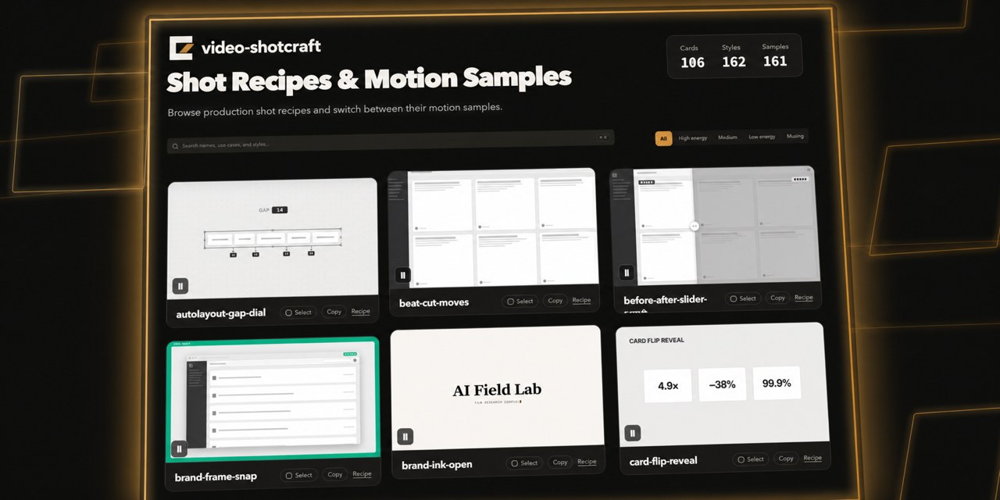
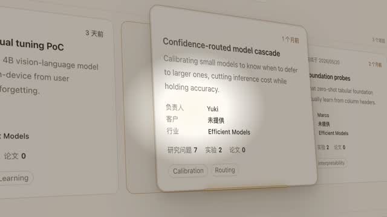
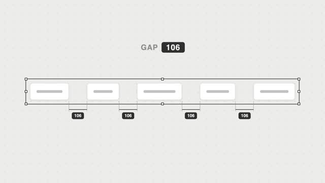

# video-shotcraft Deep Dive: AI Video Needs an Executable Shotcraft Library, Not Just a Generate Button

> **TL;DR:** `Vincentwei1021/video-shotcraft` is not another one-prompt video toy. It is an AI video-production skill for Claude Code and Codex. It breaks product promos into 104 shot recipe cards, 161 motion previews, Remotion demo source, real-page capture scripts, the Ink Press finished template, SFX / BGM assets, and a QA workflow. Its value is not replacing video models. Its value is giving agents an operable motion-design system they can read, execute, reuse, and verify.

- **Source:** [Vincentwei1021/video-shotcraft](https://github.com/Vincentwei1021/video-shotcraft)
- **Gallery:** [video-shotcraft Gallery](https://vincentwei1021.github.io/video-shotcraft/)
- **Snapshot inspected:** 2026-07-27, commit `0bb3ed9dd07780ebe0d6f8c9fc04c1b3025d5ae6`
- **Topic:** AI video production / agent skill / Remotion / product promo workflow
- **Tags:** video-shotcraft / Claude Code / Codex / Remotion / product video / shot cards / motion design



## One-line Takeaway

**video-shotcraft’s core bet is that the scarce part of AI product-video creation is not whether a model can generate footage. It is whether shot language, product captures, motion parameters, rhythm, sound, and review criteria can become a production system an agent can actually run.**

Most AI video discussion stays near the model layer: text-to-video, image-to-video, first/last frames, character consistency, duration, resolution. But product promos fail for more ordinary reasons:

- Which features should be shown?
- Which motion grammar fits each feature?
- How should page assets be captured without blurry text?
- How do 3D camera moves keep UI readable?
- Where do transitions and SFX land on the timeline?
- Where should the edit hold so the viewer understands?
- How does the agent QA the film before handing it to the user?

video-shotcraft works at this layer. It is not a single video model. It is an agent skill that gives Claude Code, Codex, or similar coding agents a concrete video-production process.

## 1. This is not “generate a video”; it is “make an agent produce a video”

The README positions the repo as a skill that turns Claude Code or Codex into a motion-design studio, using Remotion to make product promo, marketing, launch, or demo videos. The key words are **Remotion** and **agent skill**.

Remotion matters because the video is not a black-box output. It is React / TypeScript code. Shots, timelines, page captures, captions, SFX, transitions, and camera parameters can be expressed, inspected, reproduced, and edited.

The agent-skill layer matters because the knowledge is not scattered across tutorial prose. It is packaged as `SKILL.md`, `references/`, `template/`, `demos/`, and `assets/` for an agent to read. A user can say:

```text
Use video-shotcraft to create a promo for my desktop product.
```

Then the agent is not simply improvising. It chooses a mode, reads the pipeline, selects shot cards, captures real product screens, implements Remotion shots, adds sound, renders, extracts review frames, and performs final QA.

That is a different model from most AI video tools. A normal tool treats the video as a generated result. video-shotcraft treats the video as an auditable engineering project.

## 2. The repository structure shows a production package, not a prompt collection

In the 2026-07-27 source snapshot, the repo contains several layers of production assets:

| Module | Role |
|---|---|
| `SKILL.md` | Agent entry point; defines three full-promo modes plus single-shot usage |
| `references/pipeline.md` | Eight-stage workflow: product understanding, visual direction, shot mapping, storyboard, capture, implementation, sound, final review |
| `references/shots/` | 104 shot recipe cards across opening, typography, camera, data, interaction, transition, rhythm, effects, outro, and related categories |
| `demos/` | Remotion / TSX reference implementations for shot-card behavior |
| `gallery/` | Static searchable gallery for motion samples |
| `template/` | Ink Press, a complete 36.2-second, 1920x1080, 30fps, 10-shot promo template |
| `assets/lib/` | Reusable components such as PageCam, DigitRoll, FlashCut, and Caption |
| `assets/scripts/` | Page-capture and element-cutout scripts |
| `assets/audio/` | BGM and SFX assets, with SFX organized by scene/material category |

This is not “a few nice prompts.” It is closer to a compact film-language SDK: semantic shot recipes, executable code references, capture workflow, sound design, QA, and a complete template.

## 3. Shot cards are the project’s most important abstraction

AI video workflows often fail at the instruction layer. A user says:

> Make this part feel more premium and impactful.

But the agent needs executable information: duration, energy, entrance style, easing, spatial relation, known pitfalls, and exact reference source.

video-shotcraft’s shot cards fill that gap. `spotlight-hero-card` is not just “show the main card under a spotlight.” It is a product close-up grammar: isolate the hero card, push in, float, sweep light across it, return, and hold.



`autolayout-gap-dial` is not merely “show a UI parameter changing.” It turns parameter causality into a same-frame visual event: the gap value changes, layout blocks move with it, then the layout settles.



`paper-title-card` works as a breath in the edit. Its job is not spectacle; its job is to let a claim land before the next functional section begins.


These cards keep the agent from starting with an empty timeline. It can map a product feature to a motion grammar, then map that grammar to a Remotion implementation.

## 4. The key engineering choice: real page captures plus 2.5D PageCam

video-shotcraft repeatedly pushes agents toward real screenshots when the film is representing a real product page.

The reason is practical. Product videos often fail not because the big animation is weak, but because the page is fake, text is blurry, layout hierarchy is wrong, or the promo’s visual skin no longer matches the product. The pipeline asks the agent to capture three assets:

1. a 2x full-page screenshot;
2. transparent element cutouts;
3. a `layout.json` coordinate table.

Then PageCam performs 2.5D camera movement over those assets. Flying elements do not land at guessed positions; they land in real page slots. Camera moves are not simple bitmap scaling; they are controlled movements over page coordinates.

This matters because many AI videos look like promos without looking like the product. video-shotcraft’s method gives motion design a real product substrate, so the cinematic layer grows from the interface instead of covering it with an unrelated style.

## 5. Ink Press shows the goal is reproducible quality

The bundled Ink Press template is a complete promo project:

- 36.2 seconds;
- 1920x1080;
- 30fps;
- 1085 frames;
- 10 shots;
- paper / ink / amber visual direction;
- SFX-only version;
- components such as PageCam, PaperTitleCard, FlashCut, Caption, and DigitRoll.

The important part is that the template does not only include a finished sample. Its documentation breaks the film down shot by shot: frame ranges, scene files, content, matching shot cards, pinned SFX, caption timing, FlashCut points, and asset-replacement steps.

That turns the demo into a method. Users replace product screenshots, layout data, copy, and branding; they avoid casually changing the already-tuned easing, hold budgets, and SFX structure.

This is especially well suited to agents. Give the agent a runnable, verified film skeleton, then let it migrate the target product into that skeleton.

## 6. Sound is part of the timeline, not decoration

Many AI video tools leave sound until the end: render visuals, then place music underneath. video-shotcraft is designed differently.

It includes `music-beat-sync.md`, `sound-design.md`, and an organized audio library. The latest README describes the audio layout as:

- `bgm/`: 5 BGM options;
- `sfx/<category>/`: 149 SFX across 16 categories such as transition, impact, riser, camera, ui, text, paper, film, light, data, scifi, mech, glass, fluid, crowd, and counter.

The product judgment is right. Much of a product video’s perceived quality comes from the relationship between sound and frame timing. Riser, impact, sparkle, whoosh, camera hit, and UI tick are not seasoning. They are part of the shot action.

An agent that only writes Remotion TSX but cannot pin sound to motion will produce something closer to a silent UI demo. video-shotcraft includes sound because the deliverable is a promo, not a screen recording.

## 7. What it really gives agents is inspectability

`SKILL.md` contains many hard constraints:

- if the mode is unclear, run a minimal read-only product inspection first;
- guided creation pauses for stage confirmation, while autonomous creation records decisions and continues;
- shot-card usage requires resolving the gallery index, reading the full card, and reading the exact demo source;
- real product-page recreation should use real captures;
- strong-beat BGM requires rhythm analysis before storyboarding;
- each shot should be checked with `npx remotion still`;
- after revisions, render the whole film and extract review frames;
- avoid `Date.now()` and `Math.random()` so renders stay deterministic;
- perform final review against aesthetic criteria before delivery.

These rules can feel heavy, but they are exactly what agent workflows need. Without them, an agent can generate plausible animation code while no one knows whether the result is actually production-ready.

For AI video, the hard problem is not saying “make it cinematic.” The hard problem is decomposing “cinematic” into verifiable actions: text sharpness, hold duration, page coordinates, easing curves, sound hit frames, shot uniqueness, data masking, and review evidence.

## 8. Different from a traditional template library: templates are artifacts; ShotCraft is production grammar

Traditional video template libraries usually give users:

- an After Effects template;
- a Premiere template;
- a title animation pack;
- a transition pack;
- some audio assets.

Those are useful for human editors manually replacing footage. They are not necessarily built for coding agents, because agents need textual, structured, readable, executable instructions.

video-shotcraft splits the template idea into several agent-friendly layers:

- shot recipe cards for intent and motion grammar;
- demo TSX for exact implementation parameters;
- gallery previews for visual alignment;
- PageCam and capture scripts for real product assets;
- a pipeline for sequencing the work;
- a validated template for a complete film skeleton;
- sound-design rules that integrate audio;
- final-review criteria for self-checking.

So it is not just a template library. It is a production grammar library designed for agents.

## 9. Practical ways creators can use it

There are three sensible use cases.

First, when you need a deliverable product promo quickly, start with Ink Press. Do not begin with open-ended free creation. Replace screenshots, layout data, copy, and brand styling while preserving its verified shot structure, rhythm, and SFX logic.

Second, when the product already has a strong visual identity and needs custom direction, use autonomous or guided free creation. Have the agent inspect the product first: fonts, colors, spacing, radii, information density, and tone. Then choose shot cards. The film should not become a generic “premium promo skin” disconnected from the product.

Third, when you only need one stronger moment, choose a single gallery card: hero close-up, data readout, pricing transition, title card, outro launch, and so on. Then port the matching demo source into your Remotion project.

A safer SOP:

1. define the target: launch video, feature demo, homepage promo, or social cut;
2. choose template, autonomous creation, or guided creation;
3. freeze demo data and avoid customer, personal, internal, or secret information;
4. capture real pages plus layout data;
5. pick one main motion idea per core feature;
6. leave breathing room after each major action lands;
7. pin SFX to visible action instead of adding sound at the end;
8. render stills for each shot before rendering the full film;
9. extract review frames and check readability, rhythm, seams, information coverage, and data safety.

## 10. Risks and boundaries

The project has clear limits.

First, it depends on engineering execution. Remotion, Node, Chrome headless, ffmpeg, page capture, and audio tooling can all create environment problems. The README explicitly calls out headless Linux issues around concurrency, Chrome headless shell, and blocked browser downloads.

Second, shot cards are not automatic taste. They give an agent a strong starting point, but if the product positioning, page assets, copy, and feature order are unclear, the result can still be a pretty but inaccurate demo.

Third, the real-capture approach needs data governance. Customer data, personal data, internal content, secrets, and live states should be anonymized or replaced before capture.

Fourth, Remotion licensing needs to be checked for the team using it. The README also notes that Remotion has its own license terms, with different considerations for individuals, small teams, and companies.

Fifth, public gallery counts can change as the project updates. This article uses the 2026-07-27 local source snapshot and `gallery/api/library.json` as evidence: 104 cards and 161 styles / previews. Future versions may differ.

## 11. Conclusion: AI video is moving from model capability to production-system capability

The most interesting thing about video-shotcraft is that it does not treat “AI video” as a one-shot generation problem.

It breaks product-video work into an executable system:

- product understanding;
- visual token extraction;
- feature-to-shot mapping;
- shot cards;
- demo source;
- real asset capture;
- 2.5D camera movement;
- captions and title cards;
- pinned SFX;
- still-frame QA;
- full render;
- final review.

That is the layer creative tools need in the agent era. Models can write code and execute tasks, but they need experienced production knowledge compressed into readable rules, selectable shots, runnable templates, and reviewable checklists.

video-shotcraft’s value is not that it lets AI imagine a video for you. Its value is that it helps AI follow the craft of cinematic product-video production.

The generate button is only the entry point. The production system behind it determines the quality.
