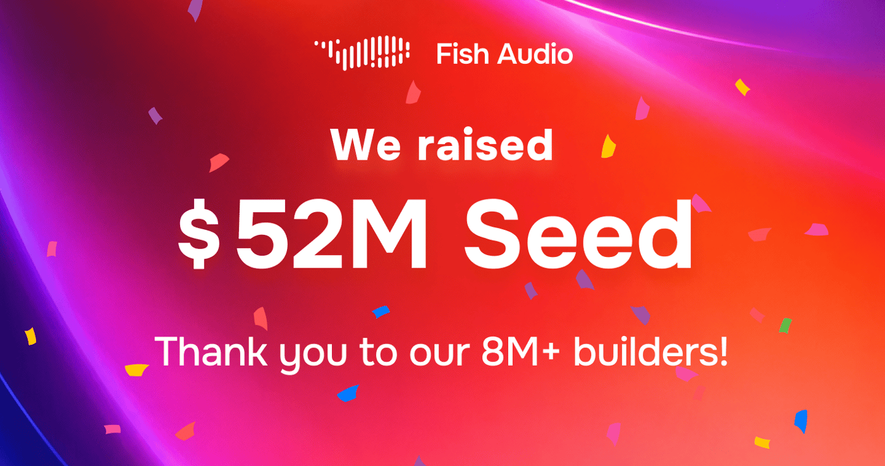
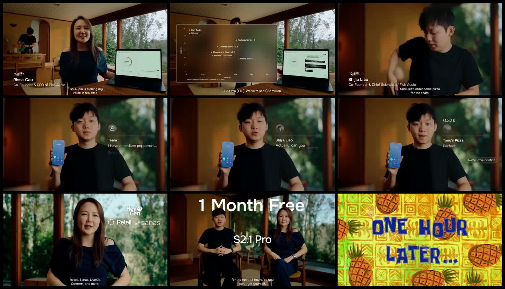
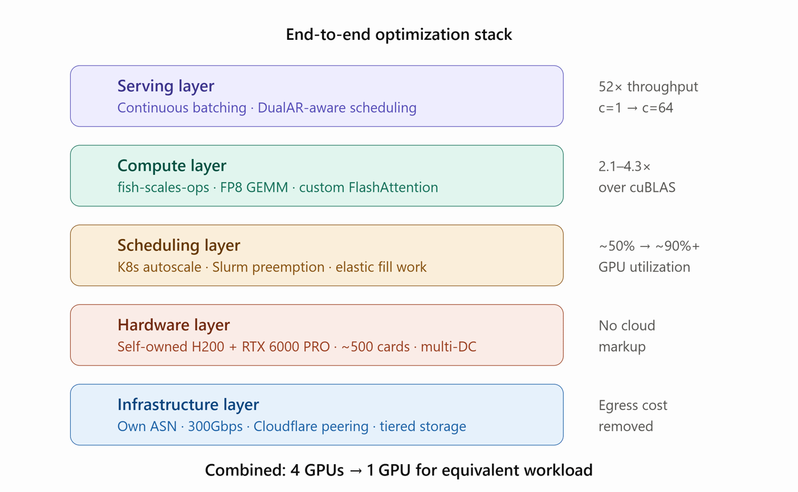
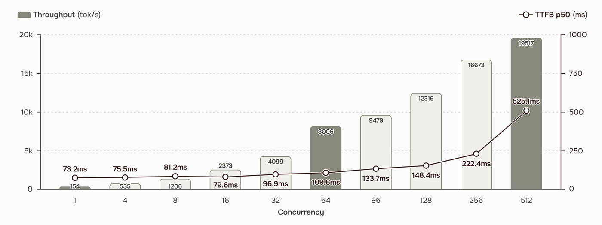
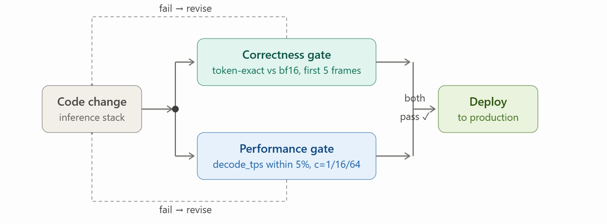

# Fish Audio S2.1 Pro Deep Dive: Behind the $52M Seed, TTS Is Becoming an Inference Infrastructure Business

> **TL;DR:** In a July 28, 2026 X post, Fish Audio announced both a $52 million seed round and the public launch of S2.1 Pro. The company reports a 22-person team, $21 million ARR, more than 8 million users, over 2 million community voice models, and roughly two-thirds of revenue from enterprise customers. Product claims include voice cloning from five seconds of audio, 83 languages, word-level control over emotion, intonation, and pacing, and roughly 70–90ms time to first audio. The more important story is how Fish Audio moved the price war into the inference stack. FP8 kernels, DualAR-aware continuous batching, mixed GPU scheduling, an owned 500-GPU fleet, networking, and storage allegedly reduce an equivalent workload from four H200s to one. The caveats matter: speed, quality, and competitor comparisons are primarily Fish Audio's own tests; "one-sixth the cost of ElevenLabs" is close only under a particular expressive-model and English-character comparison; the free API currently ends August 31, has no SLA, and may retain requests for model improvement. S2 has open weights. S2.1 Pro is a commercial API. Free is not the same as open source.

- **Launch post:** [Fish Audio on X](https://x.com/FishAudio/status/2082152596739862853)
- **Funding story:** [5 Models, 22 People, 1 Year](https://fish.audio/blog/fish-audio-52m-seed-funding/)
- **Inference engineering:** [How We Made Our Text-to-Speech API Free](https://fish.audio/blog/tts-inference-optimization-s2-pro-free/)
- **Free API:** [S2.1 Pro Free API](https://fish.audio/blog/s2-1-pro-free-api/)
- **Launch date:** July 28, 2026 for the X post; the funding story was published July 27
- **Access and pricing verification:** July 29, 2026

## The Short Verdict

**This is not simply a stronger-TTS announcement. Fish Audio is executing a vertically integrated strategy: win products with expressiveness, attack prices with inference efficiency, protect margins with owned infrastructure, and use funding to become the enterprise voice layer.**

*Fish Audio's official funding image combines the $52 million seed, more than 8 million builders, and the company's first anniversary. Source: Fish Audio.*

## 1. What Was Actually Announced?

The X post compresses three events into one:

1. Fish Audio raised a **$52 million seed round**.
2. S2.1 Pro received a formal public launch.
3. The company started a free-month campaign, migration discounts, and an enterprise cost guarantee.

Coreline Ventures and Capital Today led the round. Participants included 359 Capital, Play Time, HF0, 645 Ventures, Parable, Carya Venture Partners, and Alphalist Partners. The company did not disclose valuation or ownership terms.

"Public launch" should not be read as first availability on July 28. Fish Audio introduced the `s2.1-pro-free` API on June 23 and published its inference-engineering breakdown on July 23. July 28 is better understood as the formal market launch that tied funding, product maturity, and enterprise positioning together.

*Frames from the launch video show live voice cloning, a competitor chart, a voice-agent pizza-ordering demo, customer logos, and the free-month campaign. The frames preserve launch evidence; this article does not treat the demo audio as an independent quality evaluation. Source: Fish Audio X video.*

## 2. The $52 Million Is Funding a Voice Stack, Not One Training Run

Fish Audio reports unusually aggressive first-year metrics:

| Metric | Company disclosure |
|---|---:|
| Team | 22 people |
| Annual recurring revenue | $21M ARR |
| Platform users | 8M+ |
| Community voice models | 2M+ |
| Revenue mix | Enterprise contributes about two-thirds |
| Models shipped | Four TTS, one STT |

These figures have not been independently audited and should be treated as company disclosures. They still explain why the funding thesis extends well beyond hiring researchers.

Fish Audio says it now operates roughly 500 GPUs across several data centers, its own ASN and 300Gbps network, Cloudflare peering, and tiered NVMe, mixed, and self-hosted Ceph storage. Its next roadmap includes an Audio Understanding Language Model, speech-to-speech, developer tooling, API expansion, and a larger enterprise operation.

This is a capital-intensive bet. Once TTS enters production pipelines at HeyGen, LiveKit, Retell, Sanas, and OpenArt, model quality becomes table stakes. Long-term competition shifts toward latency, throughput, uptime, compliant deployment, and unit economics.

## 3. S2.1 Pro Moves from Reading Toward Performing

S2.1 Pro continues S2's central thesis: the system should not only pronounce the right words; users should control how those words are delivered.

Official capabilities include:

- one model covering 83 languages;
- natural-language controls inserted at word level;
- control over emotion, intonation, pacing, pauses, and paralinguistic events;
- instant and persistent voice clones;
- multi-speaker and multi-turn generation;
- standard API and real-time streaming endpoints;
- reusable speaker identity through `reference_id`.

The funding article describes more than 15,000 natural-language controls. The sensible interpretation is a compositional control vocabulary, not 15,000 individually certified buttons.

The "five-second clone" claim also needs separation. The launch demonstrates that the system can initiate a clone from roughly five seconds of reference audio. Fish Audio's own engineering guidance recommends at least about ten seconds of clean, mono, single-speaker audio, with one or two minutes improving fidelity. **Able to generate** and **ready for production** are different thresholds.

## 4. The Free API Story Is an Inference-Efficiency Story

Fish Audio's pricing explanation is direct. Autoregressive TTS executes many small matrix operations and repeatedly reads KV cache. At low concurrency, an expensive GPU may work in short 10–20 microsecond bursts while spending the rest of its time waiting on scheduling and memory.

Its response is a five-layer optimization program:

*Fish Audio's published end-to-end stack combines continuous batching, FP8 kernels, Kubernetes/Slurm scheduling, owned hardware, networking, and storage. All performance figures in the diagram are company measurements. Source: Fish Audio.*

### Serving Layer

Continuous batching, adapted from SGLang ideas, lets new requests enter the active decode batch as shorter jobs finish. S2.1 Pro's DualAR architecture also requires the scheduler to preserve coarse and fine codebooks plus the `previous_tokens` window. A shape or dtype error can leave throughput looking normal while speaker identity drifts.

### Compute Layer

The open-source `fish-scales-ops` targets the `M ≤ 128` decode shapes common in TTS. It includes block-scaled FP8 GEMM for H200/Hopper and MXFP8 plus FlashAttention for Blackwell-class RTX 5090 and RTX 6000 Pro hardware. Fish reports 2.1–4.3x gains over `torch.compile`-fused cuBLAS on relevant decode shapes.

### Scheduling Layer

Kubernetes serves inference, Slurm runs training, and preemptible data-cleaning jobs fill idle GPUs. Fish reports cluster utilization rising from roughly 50% to more than 90%.

### Hardware and Infrastructure

H200s handle high concurrency while RTX 5090/6000 Pro cards serve selected edge endpoints. Owned networking reduces cloud egress costs, and self-hosted storage avoids ongoing object-storage markup for large training corpora.

Fish combines these layers into one result: request volume that previously needed four H200s now runs on one. That 4x figure is an end-to-end result. It cannot be multiplied again by the 4.3x peak kernel claim.

## 5. 8,006 tok/s Does Not Mean One User Hears Speech 52x Faster

Fish Audio's H200 and bsgemm FP8 concurrency test reports:

| Concurrency | Aggregate throughput | TTFB p50 |
|---:|---:|---:|
| 1 | 154 tok/s | 73.2ms |
| 8 | 1,206 tok/s | 81.2ms |
| 32 | 4,099 tok/s | 96.9ms |
| 64 | 8,006 tok/s | 109.8ms |
| 512 | 19,517 tok/s | 525.1ms |

*As concurrency rises, aggregate throughput grows from 154 to 19,517 tok/s while p50 first-byte latency rises from roughly 73ms to 525ms. Source: Fish Audio internal H200 benchmark.*

The advertised 52x is **aggregate throughput scaling** from `c=1` to `c=64`, not a 52x speedup for one request. At `c=64`, p50 first-byte latency increases from 73.2ms to 109.8ms. That is a favorable trade for an API provider: far more customers per GPU for about 37ms of added latency.

Developers still need to separate:

- model token-generation speed;
- server-side TTFB or TTFA;
- user-perceived end-to-end latency, including connection setup, network travel, buffering, and playback.

Fish's materials also alternate between TTFB and TTFA. Its real-time endpoint moves prefill to connection establishment and starts the audio clock later. If providers choose different measurement boundaries, "2x faster" may not describe the same metric.

## 6. When "One-Sixth the Cost" Is Approximately True

At verification time, Fish Audio's paid `s2.1-pro` price was:

- **$15 per one million UTF-8 bytes**;
- approximately 180,000 English words or 12 hours of speech by Fish's estimate;
- $0 for `s2.1-pro-free`, subject to its time window and Fair Use Policy.

ElevenLabs' published API rates were:

- $0.05 per 1,000 characters for Flash/Turbo;
- $0.10 per 1,000 characters for Multilingual v2/v3.

For English text, one character is roughly one UTF-8 byte. Fish's $15 per million is therefore about **one-sixth to one-seventh** of ElevenLabs Multilingual/v3 at $100 per million characters. Against Flash/Turbo at $50 per million, Fish is closer to one-third.

Fish bills bytes while ElevenLabs bills characters. A common Chinese character occupies three UTF-8 bytes, so 1,000 Chinese characters cost roughly $0.045 at Fish, not $0.015. Against ElevenLabs' $0.10 per 1,000 characters, the ratio is then closer to 2.2x. Language, model tier, punctuation, subscription discounts, and enterprise contracts all change the result.

"One-sixth" is therefore not a universal billing law. It is a comparison between a particular expressive competitor model and an English-like byte-to-character ratio.

## 7. After Quantization, the Dangerous Failure Is Fast, Wrong Audio

FP8 reduces bandwidth and memory pressure, but a TTS quantization failure may not crash. Fish disclosed an MXFP8 stride bug where kernel speed remained normal while relative logit error reached roughly 53%, leading to repeated semantic tokens and degraded audio.

Every inference-stack change therefore faces two gates:

*The correctness gate requires the first five audio frames to match BF16 token-for-token on a fixed input. The performance gate allows no more than a 5% decode-throughput regression at concurrency 1, 16, and 64. Both must pass before deployment. Source: Fish Audio.*

This is a practical design with a clear boundary. Five-frame token-exact matching is good at catching systematic logit corruption. It does not, by itself, prove that long-form speaker consistency, emotional control, and multilingual pronunciation remain unchanged. Production teams still need long-horizon speaker-similarity tests, WER/CER, listening evaluations, and scenario-specific regression suites.

## 8. The Quality Benchmark Is Informative, but Not Independent

Fish Audio ran a production-traffic blind test from March 26 to April 5. Over ten days, it collected more than 71,000 paired groups, including 5,098 qualifying cross-provider comparisons. Users had to play both outputs at least twice, and the only downloaded version became the winner.

S2 Pro received a Bradley-Terry score of 3.07 and a 65.7% aggregate win rate. In 581 head-to-head pairs against ElevenLabs V3, Fish won 60% to 40%. This setup is more representative than a few curated samples because it uses production text, languages, and voices.

It was still designed, integrated, run, and analyzed by Fish Audio:

- API users were excluded;
- about 30% of participants were returning users familiar with Fish;
- providers supported different tags and therefore received different request subsets;
- some competitor sample counts were only in the hundreds;
- the test primarily evaluated S2 Pro, not an independent S2.1 Pro release benchmark.

"Most expressive" and competitor win rates should therefore be reported as company test results. Procurement teams should still evaluate their own languages, voices, text lengths, and network conditions.

## 9. The Boundaries of Free Matter More Than the Zero

`s2.1-pro-free` is currently free through **August 31, 2026**, with no hard character cap but subject to a Fair Use Policy. Fish Audio also states:

- no SLA;
- no latency guarantee;
- requests may be retained for model improvement;
- some commercial uses may be restricted;
- products above $1 million ARR should contact Fish Audio;
- production SLA, full commercial licensing, and zero-data-retention require paid or enterprise arrangements.

The launch post's free-month giveaway and "50% cost reduction or one year free" offer are respectively a social campaign and an enterprise sales promise, not permanent public API contract terms.

Voice cloning creates a separate rights problem. The ability to clone from five or ten seconds does not grant permission to copy any speaker. Teams should retain speaker consent, permitted uses, revocation mechanisms, and generation logs. Brand, support, medical, and financial applications also need disclosure, abuse detection, and identity verification built into the product.

## 10. Open-Source Boundary: S2, S2.1 Pro, and the Serving Stack Differ

Four things are easy to conflate:

| Component | Current access model |
|---|---|
| Fish Speech S2 | Code and model weights released |
| S2.1 Pro | Commercial Fish Audio API; free access does not mean open weights |
| `fish-scales-ops` | Open-source FP8 GEMM and FlashAttention kernels |
| Full production serving stack | Partially disclosed; additional components remain planned or candidates for release |

Teams that need local deployment, weight inspection, or private fine-tuning should assess the open-weight S2 path. Teams prioritizing minimal integration work, 83-language coverage, and Fish's latency optimization should assess the S2.1 Pro API. They share technical foundations, but licensing, governance, and operational responsibility are different.

## 11. How Teams Should Evaluate S2.1 Pro

Do not reproduce only the launch demo. Build a repeatable business test set:

1. **Identity:** Measure speaker similarity with 5-, 10-, and 60-second references.
2. **Expression:** Test whether word-level emotion, pacing, pauses, and emphasis obey instructions.
3. **Long-form:** Check speaker drift, omissions, and repetition at 5, 15, and 30 minutes.
4. **Languages:** Evaluate Chinese, English, Japanese, and code-switching separately.
5. **Latency:** Measure regional p50 and p95 first audio plus completion time with real networking and playback buffers.
6. **Throughput:** Benchmark production-shaped request lengths instead of importing H200 tok/s.
7. **Cost:** Recalculate the corpus in UTF-8 bytes and include retries, caching, and peak concurrency.
8. **Governance:** Confirm retention, voice consent, deletion, zero-retention, and SLA terms.

The free period is an excellent time to run this evaluation. It is not evidence that long-term production cost will remain zero.

## Conclusion: Voice Competition Is Moving Down Every Layer of the Cost Stack

The funding headline is large, but the more consequential part of Fish Audio's story is the company shape it reveals. Model research, an open foundation model, a commercial API, CUDA kernels, a scheduler, GPU clusters, networking, and enterprise compliance are being vertically integrated by one team.

S2.1 Pro's expressive control determines whether a voice fits characters, content, and agents. A 70–90ms first audio response determines whether dialogue feels natural. 8,006 tok/s determines how many concurrent users one H200 can serve. A $15-per-million-byte price determines whether customers migrate. Zero-data-retention, HIPAA options, and on-premises deployment determine whether enterprise procurement approves the product.

That is the real thesis behind the $52 million seed. As model quality converges, TTS is no longer only a contest over whose curated sample sounds most human. It is a contest over who can deliver controllable speech into every real interaction at the lowest complete-system cost.
