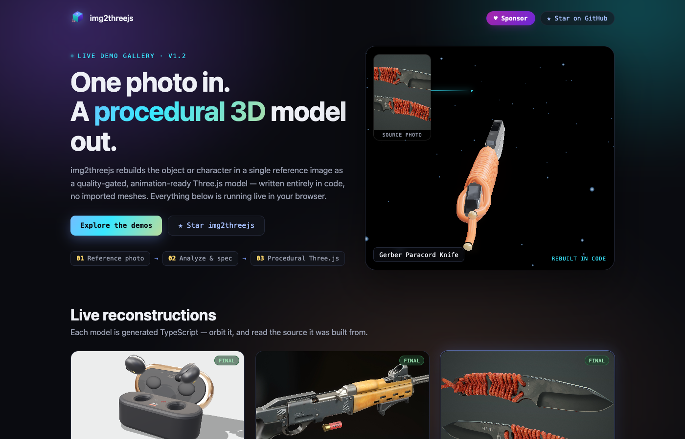
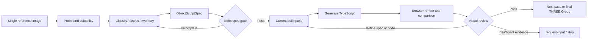
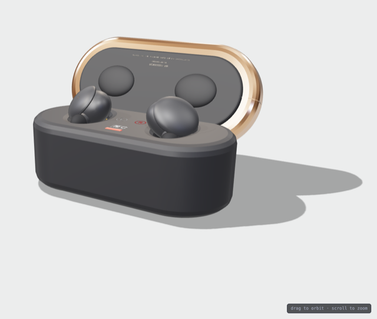
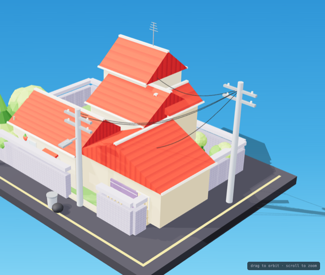

# img2threejs Deep Dive: Another Path from One Image to 3D Is Auditable Code

> **TL;DR:** `img2threejs` is not a 3D foundation model that directly predicts a mesh from an image. It is an Agent Skill for Claude Code, Codex, and OpenCode. It turns one reference image into an image probe, subject assessment, detail inventory, structured specification, staged TypeScript factory, and browser-rendered review evidence. The final artifact is a `THREE.Group` assembled from Three.js primitives, procedural materials, and generated geometry. Its most valuable idea is not inventing the hidden side of an object. It is turning 3D reconstruction into a reviewable, diffable, regression-tested process with explicit stopping conditions. The trade-off is equally clear: it depends on an agent's visual judgment, estimates roughly 80,000–180,000 tokens for a full object, and still has to infer everything a single image cannot reveal. Character output is stylized reconstruction, not an exact digital double.

- **Repository reviewed:** [donghaozhang/img2threejs](https://github.com/donghaozhang/img2threejs), a fork of the upstream project
- **Upstream:** [img2threejs/img2threejs](https://github.com/img2threejs/img2threejs)
- **Live showcase:** [img2threejs Showcase](https://img2threejs.github.io/img2threejs-showcase/)
- **Version:** v1.5.0
- **License:** Apache-2.0
- **Release date:** July 28, 2026
- **Access and code verification:** July 29, 2026

## The Short Verdict

**img2threejs behaves more like a 3D asset compiler than an image-to-3D model: the reference image is the input, the sculpt specification is an intermediate representation, TypeScript is the target code, and browser screenshots plus quality gates are the tests.**

That distinction defines its capabilities. Conventional image-to-3D systems usually optimize for quickly producing a mesh, NeRF, Gaussian Splat, or textured model. img2threejs optimizes for a different artifact: a Three.js asset that can live in Git, be read by an engineer, expose animation and interaction hooks, and accept local code edits later.



*The img2threejs live gallery. The objects are generated from TypeScript and rendered in the browser without downloaded OBJ, FBX, or GLB assets. Source: img2threejs Showcase.*

## 1. What Does It Actually Generate?

One object or character reference produces three main artifact classes:

1. An `ObjectSculptSpec` JSON file containing the component tree, materials, repetition systems, sockets, colliders, and pass review history.
2. A TypeScript factory such as `createObjectNameModel(spec, options)` that returns a `THREE.Group`.
3. Review evidence: a render, reference-versus-output comparison sheet, and score record for every build pass.

The final asset is therefore more than a static triangle mesh. `root.userData.sculptRuntime` exposes named nodes, pivots, sockets, colliders, and destruction groups. Moving pieces have to remain separate, and the specification records how child parts attach to parents. For game prototypes, interactive web experiences, product visualization, and procedural scenes, this is more useful than a model that looks right but has every part fused together.

Code output also provides three engineering benefits:

- it can be reviewed and diffed in Git;
- individual parts, materials, and animations remain normal editable code;
- repositories do not need to exchange large binary mesh files.

The same choice means it is not a universal DCC replacement. Its default output is not OBJ, FBX, or GLB. Blender, Unity, or Unreal workflows still need an export or integration layer.

## 2. The Pipeline Is Eight Locked Passes, Not One Prompt

The build order is:

`blockout → structural → form → material → surface → lighting → interaction → optimization`

Each step emits only the currently unlocked pass. The next one remains blocked until there is a real browser render, a side-by-side reference comparison, a passing visual score, and passing scores for every identity-defining feature.



After every review, the agent must choose exactly one action: `continue`, `refine-spec`, `refine-code`, `request-input`, or `stop`. This state machine turns "try again" into an explicit decision and makes failure a legitimate outcome. If the image cannot support the requested fidelity, the system can ask for more views or stop instead of extending an unbounded prompt loop.

## 3. Inventory the Details Before Writing Geometry

Since v1.1, `detailInventory` has been mandatory. Before code generation, the system enumerates:

- silhouette, proportions, and major volumes;
- bevels, fillets, seams, and panel boundaries;
- screws, rivets, openings, and connectors;
- engraved or painted linework, dirt, and wear;
- glossy, matte, metallic, and transparent regions;
- local features that carry the object's identity.

Every detail must map to a real component or material entry. A compound object represented by one root mesh fails the strict gate before code generation. This is the project's most reusable design lesson: **first verify that the specification describes the object, then judge whether the render resembles it.**



*The Sony WF-1000XM3 example. Earbuds, case body, lid, interior cavities, and trim are represented as recognizable structures rather than being faked by one texture. Source: img2threejs Showcase.*

Part-coverage and geometry-integrity checks then ask whether specified components were actually created, whether separate parts were accidentally fused, whether meshes have no owner, and whether texture is concealing absent structure. Multi-angle review catches the classic failure where an object looks plausible from the reference camera but is only a thin plane from the side.

These gates cannot prove that the original specification is complete. They can prove that structures already promised by the specification did not quietly disappear during implementation.

## 4. Divine Eye: Deterministic Checks First, VLM Last

Divine Eye, introduced in v1.3, is a multi-signal review layer. It separates visual checks into two classes.

**Hard gates:**

- IoU and frame occupancy;
- scale and proportion failures;
- critical geometry integrity.

**Soft signals:**

- proportions and symmetry;
- pHash, SSIM, and edge parity;
- blowout, flatness, and tonal parity;
- objectness;
- hue-zone consistency and specular color wash.

The VLM is consulted only after hard gates pass. It may rescue a soft signal close to the threshold, but it cannot overrule obvious geometric failure. The model cannot approve an asset simply because it "feels close" when the proportions, thickness, or component coverage are wrong.

This is also the real meaning of token efficiency here. The project does not eliminate model use. It moves PNG handling, JSON validation, pixel metrics, state synchronization, and comparison-sheet packaging into deterministic Python scripts, reserving agent tokens for visual judgment and code changes.

## 5. Token Budget: Gates Are a Throttle, Not a Free Lunch

The project's cost model estimates:

| Stage | Estimated model tokens |
|---|---:|
| Deterministic scripts combined | ~2k–5k |
| Assessment, inventory, and specification | ~15k–25k |
| Three.js factory authoring and editing | ~20k–45k |
| Five to eight render-review cycles | ~30k–70k |
| **Complete object** | **~80k–180k** |

One review cycle is estimated at roughly 5k–12k tokens. Character reconstruction rises to roughly 150k–350k. The repository explicitly labels these figures as engineering estimates anchored to one treasure-chest build, not an empirical benchmark across many subjects.

"Token efficient" should therefore be read as reducing wasted cycles:

- shallow specifications fail before rendering;
- each review uses one packaged comparison sheet;
- each iteration modifies only the current pass;
- content hashes and module caches avoid redundant generation;
- correction loops stop on repeated defects, oscillation, plateaus, or hard ceilings.

Visual review remains the expensive part. A strong specification up front is often worth more than any downstream micro-optimization.

## 6. The Limits and Surprises of Procedural Three.js

Procedural Three.js is not limited to stacking boxes. The generator includes extrude, lathe, tube, curve sweep, shapes with holes, lofted blades, `InstancedMesh`, and procedural material patterns. Complex subjects can be assembled from many named parts.



*The Doraemon house example shows that output is not limited to a single small prop. Buildings, roofs, walls, roads, utility poles, and cables form a multi-part scene that can be orbited in the browser. Source: img2threejs Showcase.*

The approach is particularly well suited to:

- hard-surface subjects with clear silhouettes and separable structures;
- low- to medium-complexity assets that must run live in a browser;
- prototypes that need pivots, sockets, colliders, and click interaction;
- long-lived models that need version control and parametric variants;
- projects that accept a stylized approximation rather than scan-grade geometry.

It is less suitable for:

- single-view tasks that demand exact hidden-side geometry;
- photoreal digital humans, hair, and high-frequency organic detail;
- DCC pipelines that require a standard mesh file as the primary deliverable;
- users who want one-click output and do not want to fund multiple agent review cycles.

## 7. Projection-First Does Not Let Texture Replace Structure

For complex paint, patterns, or gradients, the project includes a projection-first route: extract landmarks, estimate the reference camera, approximate de-lighting, and project the image onto parametric geometry. It reports confidence per region and asks for additional views when evidence is insufficient.

The CS2-specific route pushes this further. Identity and provenance pass through an intake contract; knives, pistols, and other families receive different component trees; patterns use projection first, while procedural finishes remain a disclosed approximation fallback. Review can strip maps from the blockout so an attractive texture cannot hide incorrect geometry.

This specialization is evidence that img2threejs is not one universal prompt that performs equally well on every category. Quality comes from accumulating domain knowledge, specification templates, and family-specific gates. Broader coverage also creates a larger maintenance burden.

## 8. Installation Is Simple; the Real Dependencies Live in the Host Agent

Repository scripts require Python 3.10+ and use only the standard library. Installation means placing the repository in an agent's skills directory. The upstream README uses this example:

```bash
git clone https://github.com/img2threejs/img2threejs.git ~/.claude/skills/img2threejs
```

The user then gives the agent an image and invokes the skill. Claude Code, Codex, and OpenCode can all consume the instructions, although the documented path and `/img2threejs` invocation are Claude Code-oriented. Other hosts need their own skill directory and trigger mechanism.

"Zero Python dependencies" does not mean the whole task has zero dependencies. A complete loop still needs:

- a multimodal agent that can inspect images;
- an environment that can run Python and write TypeScript;
- a host project with Three.js installed;
- browser preview and screenshot capability;
- enough context and vision-call budget.

## 9. Code Audit: Strong Engineering, Still a Fast-Moving Project

For this article, I ran the same command used by repository CI:

```bash
python3 -m unittest discover -s forge/tests
```

All **266 tests passed**. Coverage spans intake, specifications, code generation, pass orchestration, Divine Eye, multi-angle checks, the VLM gate, CS2 contracts, part coverage, geometry integrity, and cache-related behavior. v1.5.0 also added Python CI and automated releases.

Its maturity still needs a realistic reading:

- v1.0 through v1.5.0 arrived within roughly two weeks, so interfaces and specialized routes are changing quickly;
- an empirical token benchmark remains planned work;
- the README roadmap still labels the Character Update as "Next" despite the v1.5.0 release tag;
- the live gallery hero still says v1.2, lagging the core repository;
- upstream, historical owner, and current fork links show signs of an ongoing repository migration.

None of these issues invalidate the pipeline, but adopters should pin a version and include generated assets in their own regression tests rather than treating the skill as a stable SaaS API.

## Conclusion: It Turns AI 3D from an Output Problem into a Process Problem

img2threejs does not solve the information-theoretic limits of single-view 3D. Hidden surfaces remain hidden, complex humans remain difficult, and procedural geometry is not automatically equivalent to artist-authored topology.

It proposes a different engineering answer:

1. decompose the subject into a verifiable specification;
2. generate code in locked stages;
3. use deterministic metrics to reject obvious failures;
4. reserve visual models for similarity judgments that metrics cannot settle;
5. preserve screenshots, scores, and state for every correction;
6. deliver a readable, editable, animation-ready, version-controlled runtime asset.

If the goal is "a mesh in one minute," this process looks heavy. If the goal is to make agent-generated 3D assets participate in real software engineering, img2threejs's specifications, gates, visual regression loop, and stop conditions may matter more than any single polished demo.
