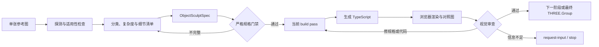

# img2threejs 深度拆解：单图转 3D 的另一条路线，是把模型写成可审查的代码

> **TL;DR：** `img2threejs` 不是一个从图片直接预测 mesh 的 3D 生成模型，而是一套给 Claude Code、Codex 和 OpenCode 使用的 Agent Skill。它把单张参考图依次转成图像探测、对象分类、细节清单、结构化规格、分阶段 TypeScript 工厂和浏览器渲染证据，最终返回一个由 Three.js primitives、程序化材质和生成几何组成的 `THREE.Group`。它最有价值的创新不在“凭空补出背面”，而在把 3D 重建改造成可审查、可 diff、可回归、可停止的代码流水线。代价也很明确：它依赖 Agent 的视觉判断，完整对象预计消耗约 8 万至 18 万 tokens；单图看不到的背面仍然只能推断，角色也更接近风格化重建，而非精确数字替身。

- **本文项目：** [donghaozhang/img2threejs](https://github.com/donghaozhang/img2threejs)（上游项目的 fork）
- **上游仓库：** [img2threejs/img2threejs](https://github.com/img2threejs/img2threejs)
- **在线展示：** [img2threejs Showcase](https://img2threejs.github.io/img2threejs-showcase/)
- **版本：** v1.5.0
- **许可证：** Apache-2.0
- **版本日期：** 2026-07-28
- **访问与代码核验时间：** 2026-07-29

## 一句话判断

**img2threejs 更像“3D 资产编译器”，而不是“图片转 3D 模型”：参考图是输入，规格是中间表示，TypeScript 是目标代码，浏览器截图和质量门禁则是测试。**

这个区别决定了它的能力边界。传统 image-to-3D 工具通常追求快速产出 mesh、NeRF、Gaussian Splatting 或纹理模型；img2threejs 追求的是另一个结果：一套可以进 Git、能被工程师阅读、可以绑定动画和交互、还能在后续迭代中局部修改的 Three.js 资产。


*图：img2threejs 在线展示站。页面中的对象由 TypeScript 在浏览器中实时生成和渲染，不依赖下载的 OBJ、FBX 或 GLB。来源：img2threejs Showcase。*

## 1. 它到底生成什么

输入是一张对象或角色参考图，主要输出有三类：

1. `ObjectSculptSpec` JSON：记录组件树、材质、重复结构、socket、碰撞体和每个阶段的审查历史。
2. TypeScript 工厂：形如 `createObjectNameModel(spec, options)`，返回一个 `THREE.Group`。
3. 审查证据：每个 build pass 的渲染、参考图对照表和评分结果。

这意味着最终资产不是一块静态三角网格。根节点的 `userData.sculptRuntime` 会暴露命名节点、pivot、socket、collider 和 destruction group；可动部件需要独立建模，连接关系也要写进规格。对游戏原型、互动网页、产品可视化和程序化场景来说，这比“看起来像，但所有零件已经焊死”的模型更实用。

代码输出还有三个工程优势：

- 可以在 Git 中 review 和 diff；
- 可以把某个零件、材质或动画作为普通代码继续修改；
- 不需要在仓库里传递大体积二进制 mesh。

但它也因此不是通用 DCC 替代品。当前默认产物不是 OBJ、FBX 或 GLB；想进入 Blender、Unity 或 Unreal，仍需要额外导出和适配。

## 2. 流水线不是一句 prompt，而是八个锁定阶段

完整构建顺序是：

`blockout → structural → form → material → surface → lighting → interaction → optimization`

每一阶段只生成当前解锁的内容。只有出现真实浏览器渲染、参考图与结果的 side-by-side comparison sheet、达到阈值的视觉评分，以及所有 identity-defining feature 单项过线，流水线才允许进入下一阶段。



Agent 每轮必须在五个动作中选择一个：`continue`、`refine-spec`、`refine-code`、`request-input` 或 `stop`。这套状态机的意义是把“继续试试”变成显式决策，也让失败成为合法结果。参考图无法支持要求的精度时，流程可以请求更多角度或停止，而不是无限补 prompt。

## 3. 先列细节，再写几何

v1.1 之后，`detailInventory` 成为强制产物。系统要先枚举：

- 外轮廓、比例和主要体块；
- 倒角、圆角、接缝与面板边界；
- 螺丝、铆钉、开孔和连接件；
- 刻线、涂装、污渍和磨损；
- 高光、哑光、金属和透明区域；
- 对身份识别最重要的局部特征。

每个细节都必须落到一个真实 component 或 material entry 上。复合对象如果只写了一个 root mesh，严格门禁会在 codegen 之前阻止它。这是项目里最值得借鉴的设计：**先验证规格有没有表达对象，再讨论渲染像不像。**


*图：Sony WF-1000XM3 示例。耳塞、盒体、盒盖、内腔和装饰边框被拆成可辨认的结构，而不是用一张贴图伪装全部细节。来源：img2threejs Showcase。*

项目还加入了 part coverage 和 geometry integrity 检查：规格里的部件是否真的被创建、多个部件有没有被错误合并、是否存在无归属 mesh，以及贴图是否正在掩盖缺失的结构。多角度审查则用来识别“正面像，侧面只是一张薄片”的假体积。

这些门禁不能证明规格本身绝对完整，但能保证“已经写进规格的结构”没有在实现时悄悄消失。

## 4. Divine Eye：确定性检查在前，VLM 在后

v1.3 引入的 Divine Eye 是一个多信号审查层。它把视觉判断拆成两类：

**硬门禁：**

- IoU / 主体占位；
- 尺度与比例异常；
- 关键几何完整性。

**软信号：**

- 比例与对称性；
- pHash、SSIM 和 edge parity；
- 过曝、平坦度和 tonal parity；
- objectness；
- 色相区域一致性和高光洗色风险。

VLM 只在硬门禁通过后才参与判断。它可以拯救接近阈值的软信号，却不能覆盖明显的几何失败。换句话说，模型不能因为“整体感觉不错”就批准一件比例错了、厚度没了或零件缺失的资产。

这也解释了所谓 token-efficient 的真实含义：不是少用模型，而是把 PNG 读写、JSON 验证、像素指标、状态同步和 comparison sheet 拼装交给 Python 标准库，只让 Agent 处理视觉判断与代码修改。

## 5. Token 预算：门禁是节流阀，不是免费午餐

项目给出的成本模型是：

| 环节 | 估算模型 tokens |
|---|---:|
| 确定性脚本总计 | 约 2k–5k |
| 评估、细节清单与规格 | 约 15k–25k |
| Three.js 工厂编写与修改 | 约 20k–45k |
| 5–8 次 render-review | 约 30k–70k |
| **完整对象合计** | **约 80k–180k** |

单次 review 预计约 5k–12k tokens；角色重建约 150k–350k。项目也明确说明，这些数字来自一个宝箱案例的工程估算，并非跨对象实测 benchmark。

因此“省 token”应该理解为减少无效回合：

- 浅规格在渲染前失败；
- 每轮只看一张对照图；
- 每次只修改当前 pass；
- 内容哈希和模块缓存避免重复生成；
- 修正循环在重复缺陷、振荡、平台期或上限处停止。

最贵的仍然是视觉回合。一个好的前置规格，往往比后面任何微优化更省成本。

## 6. 程序化路线的上限与惊喜

程序化 Three.js 并不等于只能拼几个方块。生成器已经支持 extrude、lathe、tube、curve sweep、带孔 shape、lofted blade、InstancedMesh 和程序化材质；复杂对象可以由大量命名部件组装。


*图：哆啦 A 梦住宅示例说明输出不局限于单个小道具。房体、屋顶、围墙、道路、电线杆和线缆构成了可在浏览器中旋转的多部件场景。来源：img2threejs Showcase。*

它尤其适合：

- 轮廓清晰、结构可拆的硬表面物体；
- 需要浏览器实时运行的低至中等复杂度资产；
- 需要 pivot、socket、碰撞体和点击交互的原型；
- 需要长期维护、版本控制和参数化变体的模型；
- 可以接受风格化近似，而不是扫描级几何的项目。

不太适合：

- 要求不可见背面也完全准确的单图任务；
- 写实人物数字替身、毛发和高频有机细节；
- 必须直接交付标准 mesh 文件的 DCC 流程；
- 只想“一次生成、立刻下载”、不愿承担多轮 Agent 成本的用户。

## 7. 投影优先并不等于贴图可以替代结构

对复杂涂装、图案或颜色渐变，项目提供 projection-first 路线：提取 landmark、估计参考相机、近似 de-light，再把参考图投影到参数化几何上。它会按区域报告置信度，信息不足时要求更多视角。

CS2 专用路线把这种策略推得更远：身份和来源先经过 intake contract，刀、手枪等不同 family 使用不同 component tree；图案优先投影，程序化 finish 只作为带有“近似”声明的 fallback。审查时还会去掉纹理看 blockout，防止一张漂亮贴图掩盖结构错误。

这种专项适配说明 img2threejs 不是一个对所有类别同样强的万能 prompt。它的质量来自不断增加对象知识、规格模板和 family-specific gate。覆盖面扩大时，维护成本也会同步增加。

## 8. 安装简单，真正的依赖在宿主 Agent

仓库脚本要求 Python 3.10+，并坚持只用标准库。安装本质是把仓库放进 Agent 的 skills 目录；上游 README 给出的示例是：

```bash
git clone https://github.com/img2threejs/img2threejs.git ~/.claude/skills/img2threejs
```

然后给 Agent 一张图并调用 skill。Claude Code、Codex 和 OpenCode 可以使用同一套说明，但 README 的路径和 `/img2threejs` 调用示例偏向 Claude Code，其他宿主需要改成各自的 skill 目录和触发方式。

“零 Python 依赖”也不等于整个任务零依赖。完整闭环仍需要：

- 能读取图片的多模态 Agent；
- 能运行 Python 和写 TypeScript 的环境；
- 一个安装了 Three.js 的宿主项目；
- 浏览器预览与截图能力；
- 足够的上下文和视觉调用预算。

## 9. 代码审计：工程化程度高，但仍是快速演进项目

本文按仓库 CI 的命令运行：

```bash
python3 -m unittest discover -s forge/tests
```

结果是 **266 个测试全部通过**。测试覆盖 intake、spec、codegen、pass orchestration、Divine Eye、multi-angle、VLM gate、CS2 contract、part coverage、geometry integrity、token/cache 相关行为等。v1.5.0 还加入了 Python CI 和自动 release。

但成熟度仍要客观看：

- 项目从 v1.0 到 v1.5.0 只经历约两周，接口和专项路线仍在快速变化；
- token 文档中的实测 benchmark 仍是计划项；
- README 的 roadmap 仍把 Character Update 写作“Next”，与已发布的 v1.5.0 标签存在文档节奏差；
- 在线 gallery 首屏仍显示 v1.2，展示站版本标识滞后于核心仓库；
- 上游仓库、历史作者账号和当前 fork 之间有多处链接迁移痕迹。

这些问题不会否定流水线本身，但提醒使用者锁定版本，并把生成结果纳入自己的回归测试，而不是把 skill 当作稳定 SaaS API。

## 结论：它把“AI 做 3D”从结果问题改成了过程问题

img2threejs 没有解决单图 3D 的信息论难题。看不到的部分依然看不到，复杂人物仍然难，程序化几何也无法自动等价于艺术家精修的拓扑。

它真正提出的是另一种工程答案：

1. 先把对象拆成可验证的规格；
2. 再按阶段生成代码；
3. 用确定性指标阻挡明显错误；
4. 让视觉模型只处理机器指标难以判断的相似度；
5. 为每次修正留下截图、分数和状态；
6. 最后交付一个可读、可改、可动画、可版本控制的运行时资产。

如果目标是“一分钟得到一个 mesh”，这条路线显得很重。如果目标是让 Agent 生成的 3D 资产能够进入真实软件工程，img2threejs 对规格、门禁、视觉回归和停止条件的设计，可能比某一次漂亮 demo 更值得研究。
