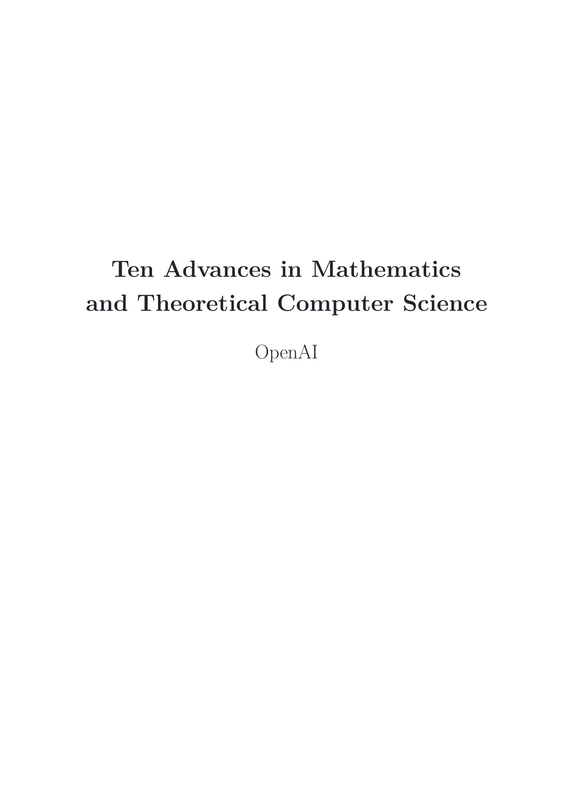
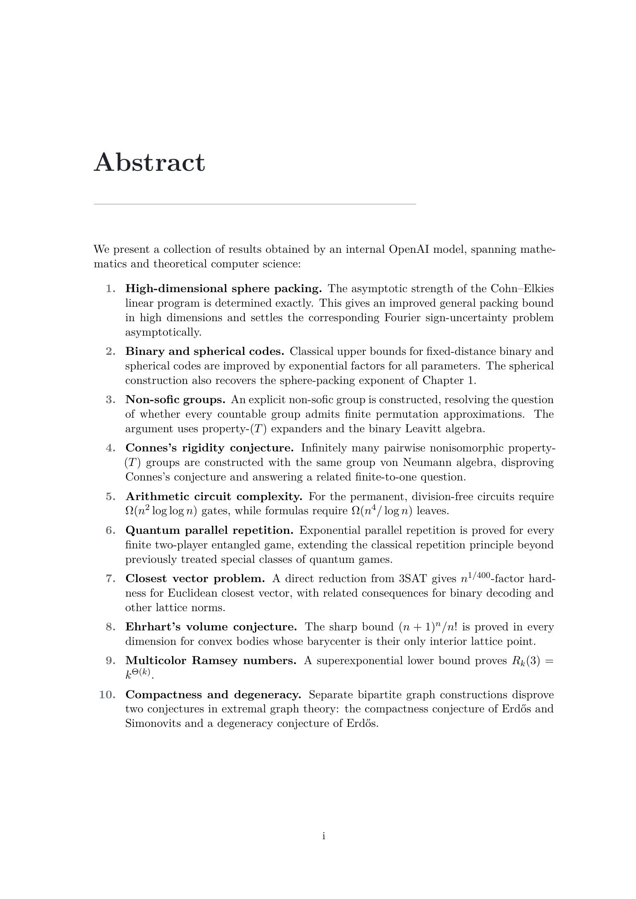

# OpenAI 十项数学与理论计算机科学进展：Astra 把 AI 数学从单点突破推向批量研究管线

> **TL;DR:** OpenAI 这次发布的重点不是“AI 又解了一道数学题”，而是一次更系统的能力信号：内部版 Astra 在十个长期开放的数学与理论计算机科学问题上产出新结果，覆盖高维几何、编码理论、群论、算子代数、量子复杂性、格密码、极值组合等方向。OpenAI 还同步给出论文合集、推理 walkthrough、Lean certificate，并明确讨论归属与数学共同体责任。真正值得关注的是：AI 数学研究正在从“单个惊喜结果”进入“可生成、可整理、可形式化、可交给专家审查的批量研究管线”。

- **Source:** [Ten advances in mathematics and theoretical computer science](https://openai.com/index/ten-advances-in-mathematics/)
- **Paper:** [Ten Advances in Mathematics and Theoretical Computer Science](https://cdn.openai.com/pdf/ten-proofs-oai.pdf)
- **Reasoning walkthroughs:** [How the Ideas Came Together](https://cdn.openai.com/pdf/reasoning-walkthroughs.pdf)
- **Published:** 2026-08-01
- **RSS summary:** OpenAI shares new results on long-standing open problems in mathematics and theoretical computer science, including advances in geometry, cryptography, and complexity.
- **Topic:** AI for mathematics / theoretical computer science / Lean formalization / research automation



## 一句话概括

**这次 OpenAI 的新意不只在十个结果本身，而在它展示了一条 AI 研究生产线：模型发现论证，人类整理成 manuscript，模型再形式化为 Lean certificate，最后把推理过程作为 walkthrough 交给共同体检查。**

这和 2026 年 5 月 OpenAI 公布的 Erdős unit-distance conjecture 反例不同。那次是一个极具象征意义的单点突破：一个长期相信的离散几何猜想被内部模型找到反例。

这次更像第二阶段：如果一个模型能在多个领域连续产出候选研究结果，那么问题就从“AI 是否偶然解决了一题”变成：

- 它能否稳定找到有价值的问题切口？
- 它能否跨领域调动工具？
- 它能否产出可验证的证明对象？
- 人类专家应该如何署名、审查、吸收和继续发展？
- 这类系统会改变数学研究的工作流吗？

OpenAI 的答案还不是“AI 替代数学家”。更准确的说法是：AI 正在进入数学研究的候选发现层，而数学共同体仍然决定这些结果如何被验证、解释、归档和继续推进。

## 1. 这次发布到底包含什么

OpenAI 页面说明：这些问题至少十年没有在主要结果上取得进展，多数开放时间更长；结果由内部版 **Astra**，也就是 OpenAI 下一代主要模型的内部版本取得。

OpenAI 同时给出几个关键材料：

| 材料 | 作用 |
|---|---|
| 官网文章 | 列出十个结果、说明模型来源、形式化和共同体责任 |
| 249 页论文合集 | 把十个结果整理成数学论文形式 |
| 62 页 reasoning walkthrough | 用高层叙事重建每个证明思路如何形成 |
| Lean certificate | 对每个论证进行形式化证明记录 |
| 责任声明 | 说明结果生成、人工准备、形式化、署名与共同体讨论之间的边界 |

这里的组合很重要。它不是一篇新闻稿孤立宣布“模型很强”，而是尽量把 AI 研究结果变成可读、可查、可形式化、可进入共同体讨论的对象。

## 2. 十个问题覆盖的不是同一个数学小区

OpenAI 给出的十个结果横跨多个领域：

| # | 方向 | 官方结果概括 |
|---|---|---|
| 1 | 高维球堆积 | 把 Cohn–Elkies 线性规划的渐近强度精确确定，并改进高维一般球堆积上界 |
| 2 | 二元码与球面码 | 对给定最小距离的二元码大小上界给出指数级改进，并给出球面码对应结果 |
| 3 | 非 sofic 群 | 构造非 sofic 群，回应群论中关于 countable groups 是否都有有限置换近似的核心问题 |
| 4 | Connes 刚性猜想 | 构造拥有相同群 von Neumann 代数但彼此非同构的 property-(T) 群，反驳长期猜想 |
| 5 | 算术电路复杂性 | 给 permanent 的算术电路与公式计算提供新的下界，包括 n^4/log n 量级的 formula 下界 |
| 6 | 量子 parallel repetition | 对一般双人量子博弈证明指数 parallel repetition 定理 |
| 7 | Closest Vector Problem | 给欧氏 CVP 提供多项式因子的近似困难性结果，关联后量子密码基础问题 |
| 8 | Ehrhart 体积猜想 | 在所有维度确定重心为唯一内部格点的凸体最大体积 |
| 9 | 多色 Ramsey 数 | 给多色三角 Ramsey 数提供 superexponential 下界，解决 Erdős problem 183 |
| 10 | 极值图论 | 反驳 Erdős–Simonovits compactness conjecture 和 Erdős 的 degeneracy conjecture |

这张表的价值不在于普通读者能立刻读懂每条技术细节，而在于它说明了一个事实：这不是同一套路在同一领域刷十个变体。

这些问题横跨 Fourier analysis、coding theory、operator algebras、quantum information、lattice problems、convex geometry、Ramsey theory、extremal combinatorics。对 AI 研究系统来说，这意味着模型不是只在某个特定符号环境里做局部搜索，而是在多个抽象语言之间迁移。



## 3. 真正重要的是“批量可验证结果”这个结构

单个数学突破当然重要，但它总有一个解释空间：也许问题特别适合模型，也许某条隐藏路径刚好被搜到，也许人类整理占了很大比重。

十个结果同时出现，意义就不同。它更像是在展示一种研究管线：

```text
长期开放问题
  → 内部模型寻找论证
  → 人类把论证准备成 manuscript
  → 模型形式化为 Lean certificate
  → 发布 reasoning walkthrough
  → 数学共同体审查、解释、吸收
```

OpenAI 还给出一个很微妙的数字：找到这些解法所需 token，如果按 Sol API 价格折算，大约是 2,000 美元。这个数字不应该被误读为“花 2,000 美元就能买十个数学突破”。它排除了模型训练、系统开发、问题筛选、专家审查、形式化工程、发布和共同体吸收成本。

但它仍然是一个重要信号：当模型能力足够强，候选证明搜索的边际推理成本可能变得非常低。未来真正稀缺的会转移到：

- 选择哪些问题值得攻；
- 如何设计可靠的验证面；
- 如何发现证明里的漏洞；
- 如何把结果转写为共同体能接受的形式；
- 如何管理归属、责任和研究伦理。

## 4. Lean certificate 改变了 AI 数学结果的讨论方式

这次发布里，Lean certificate 是一个关键动作。

AI 生成数学最怕的不是“不会写漂亮证明”，而是“写出看似合理但局部有洞的证明”。自然语言证明有时能骗过非专家，也可能让专家花很长时间定位问题。

形式化证明的意义是把审查面变硬。Lean 不会替代数学直觉，也不会告诉你这个定理是否重要，但它能把一部分“证明是否成立”的问题转成机器可检查对象。

这会改变 AI 数学系统的产品形态。未来可靠的 AI 数学工作流可能不是：

```text
模型输出一段证明文本
```

而是：

```text
模型提出路线
  → 生成候选证明
  → 拆成 lemma
  → 形式化为 Lean / Coq / Isabelle
  → 人类检查数学意义和领域语境
```

换句话说，形式化不是附属包装，而可能成为 AI 数学研究的交付标准。

## 5. Reasoning walkthrough 的价值：把结果从“证明文本”还原成“发现过程”

OpenAI 同步发布的 walkthrough 文档也值得看。它不是简单重印最终证明，而是尝试解释每个结果背后的思路形成过程：哪些想法先出现，哪些路线失败，哪次视角切换暴露了结构，关键 insight 如何汇入最终论证。

这对数学共同体很重要。一个证明即使正确，也可能很难被吸收。数学家需要知道：

- 这个方法为什么会想到；
- 它和已有技术的关系是什么；
- 哪些失败路径值得避免；
- 哪个中间概念可能迁移到别的问题；
- 这个结果是孤立巧合，还是暴露了新的方法族。

AI 研究结果如果只给最终 proof，很容易变成“黑箱定理”。walkthrough 的作用，是把黑箱尽量拆开，让人类能接住里面的想法。


## 6. 这次和 unit-distance 结果的关系：从一个反例到一组路线

OpenAI 在文章开头明确把这次发布接在 5 月的 unit-distance 结果之后。那次模型反驳 Erdős unit-distance conjecture，并已经引发后续数学与理论计算机科学研究。

unit-distance 结果的信号是：模型可能提出出乎共同体预期的新构造。

这次十项结果的信号是：这种能力可能不只是一次孤例，而是可以在多个严肃领域重复出现。

但两者也有共同边界：结果仍然需要共同体消化。OpenAI 可以提供 proof、certificate、walkthrough；数学共同体要做的是：

- 检查证明可靠性；
- 判断结果重要性；
- 找到和现有文献的精确关系；
- 简化或重写证明；
- 推广方法；
- 确认哪些问题真正被解决，哪些只是相关版本被推进。

这里的角色变化很清楚：AI 可能从“工具”升级为“候选发现者”，但人类仍然是数学意义的解释者和制度性验证者。

## 7. 责任声明比技术结果更值得长期关注

OpenAI 文章里有一节叫 “Responsibility to the mathematical community”。这不是公关段落，它触到一个未来几年会越来越尖锐的问题：AI 生成的数学结果，应该如何署名？

OpenAI 的立场是：如果证明完全由 AI 系统生成，却声称是人类作者完成，会误导系统贡献和人类智力工作的性质。OpenAI 说他们帮助准备 manuscript、形式化证明，并对正确性承担责任；数学论证本身则由系统生成。

这会逼迫学术界回答一组新问题：

- AI 系统能不能算作者？
- 公司能不能作为结果责任主体？
- 人类整理者、验证者、形式化工程师如何署名？
- 期刊和会议如何处理 AI-generated proof？
- 如果证明正确但无人类作者，同行评审该审谁？
- 如果证明错误，责任归谁？

这些问题不会因为这次发布而解决。但 OpenAI 选择把它们放到正文里，说明 AI 数学已经不再只是 benchmark 话题，而是进入学术制度话题。

## 8. 对 AI Agent 产品的启发

这次发布对做 agent 的人有很强的启发。真正的研究型 agent 不应该只追求“能回答问题”，而应该交付可验证 artifact。

抽象成产品架构，它需要几层：

| 层 | 数学场景 | 更一般的 agent 场景 |
|---|---|---|
| 问题选择 | 长期开放问题、明确目标 | 高价值任务、可评估目标 |
| 搜索 / 生成 | 候选证明、构造、反例 | 候选代码、设计、实验方案 |
| 结构化整理 | manuscript、lemma、walkthrough | PR、设计文档、运行手册 |
| 形式化验证 | Lean certificate | 测试、类型检查、仿真、审计 |
| 人类审查 | 专家判断重要性和语境 | reviewer 判断是否可用 |
| 共同体吸收 | 后续论文和推广 | 产品集成、文档化、运营流程 |

这比“让 agent 自己跑很久”成熟得多。长程 agent 真正需要的不是无限循环，而是一条能把候选产物转成可检查交付物的管线。

## 9. 需要保持冷静的几点

这次结果很强，但边界同样重要。

第一，Astra 是内部版本，不等于所有公开模型都已经具备同等数学研究能力。

第二，OpenAI 的页面和论文是官方发布材料，但这些结果进入数学共同体仍需要时间。形式化证明能增强可靠性，但领域重要性、写法、优先权、与已有工作的关系，仍要专家讨论。

第三，2,000 美元 token 成本不是完整成本。训练、基础设施、研究管理、专家审查和 formalization 都不在这个简单数字里。

第四，数学是 AI 研究自动化的理想试验田，因为它有清晰验证面。把同样能力迁移到生物、材料、医学或经济学，会遇到实验反馈、数据噪声、安全和现实世界约束。

第五，AI 发现结果不等于 AI 拥有数学共同体的判断力。好的数学不只是“证明为真”，还包括为什么重要、如何解释、和哪些问题相连。

## 10. 结论：AI 数学的下一步不是更会解题，而是更会进入共同体工作流

OpenAI 的 “Ten advances” 不是普通模型发布，也不是又一组 benchmark 分数。它展示的是一条更完整的研究生产链：

**发现候选结果 → 写成论文 → 形式化验证 → 解释思路 → 交给共同体审查。**

如果这条链成立，AI for Math 的重心会从“模型能不能做题”转向“模型产出的研究对象能不能被数学共同体可靠吸收”。

这也是对所有 AI agent 产品的提示：真正有价值的 agent 不是会说“我想到了一个答案”，而是能把答案做成可检查、可复现、可转交、可追责的 artifact。

数学只是最干净的验证场。软件、科学计算、视频制作、药物发现、硬件设计都会走向同一个问题：

**AI 生成不难，难的是让生成结果进入可靠工作流。**

OpenAI 这次发布的重要性，就在这里。
