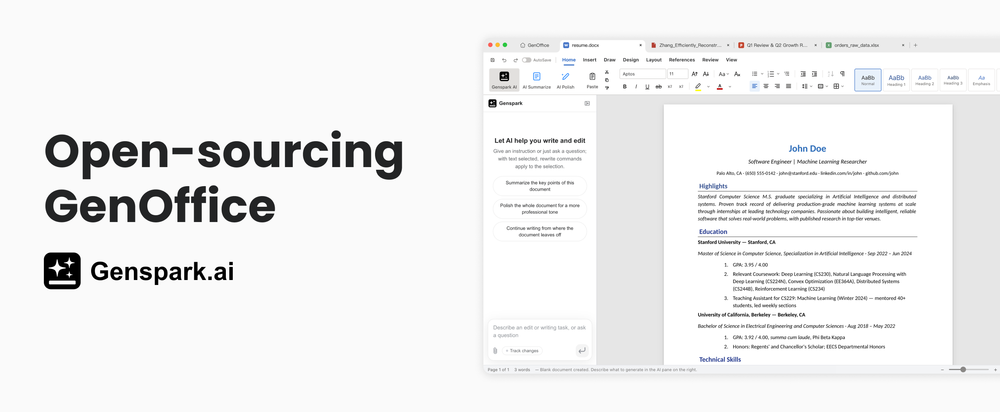
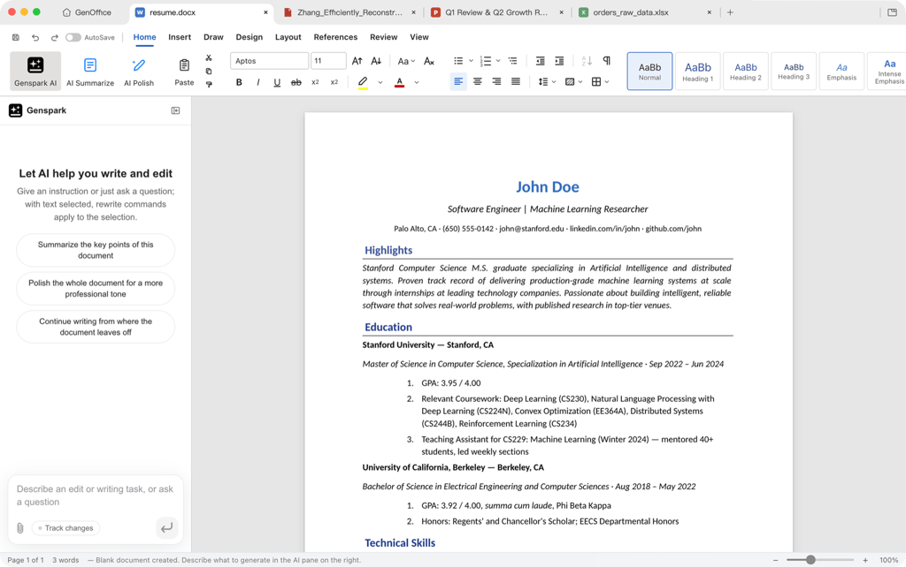
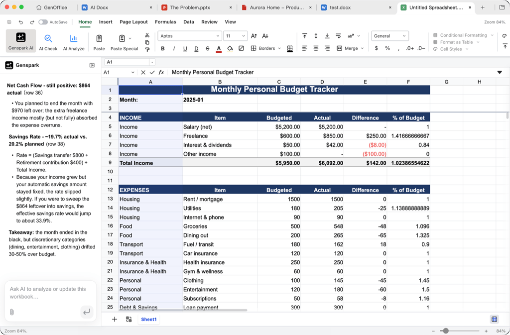
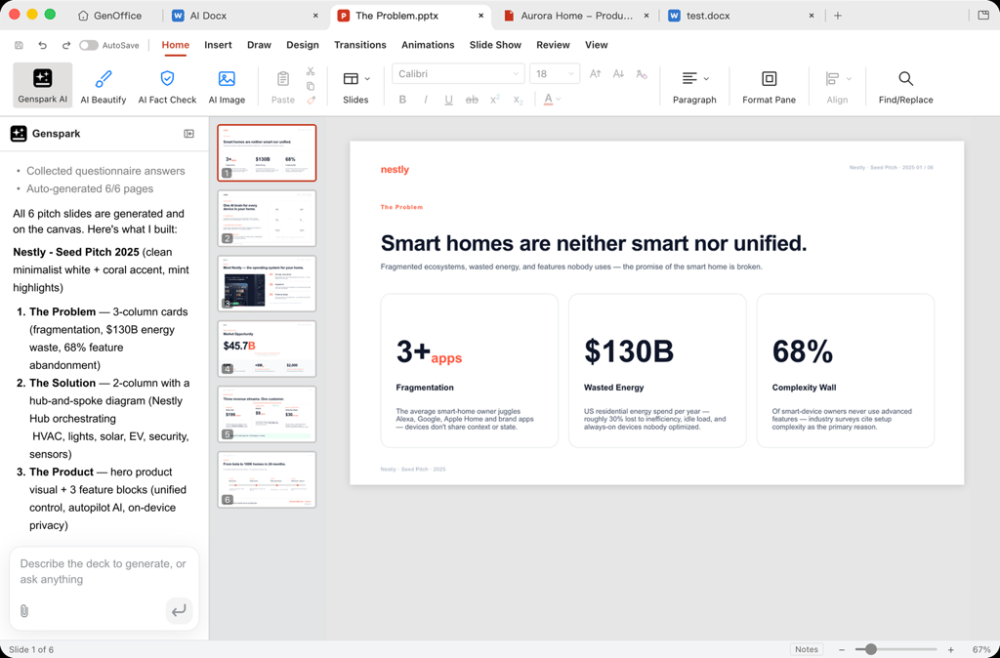
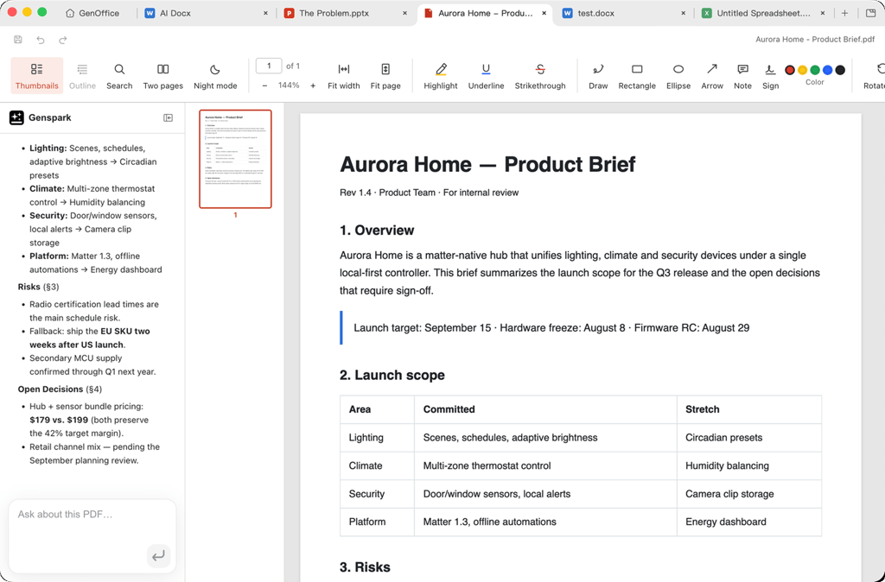

# GenOffice 深度拆解：Genspark 开源 AI Office，真正的竞争点是文件保真与 Agent 原生编辑

> **TL;DR:** Genspark 在 X 上宣布开源 GenOffice，并把它称为面向 PC / Mac 的 full-featured open-source AI Office。官方博客说 Alpha 由一名工程师、一周、约 10,000 美元 token 成本做出。真正值得关注的不是这个叙事本身，而是 GenOffice 的产品切位：它不是给 Office 加一个聊天侧边栏，而是把 `.docx`、`.xlsx`、`.pptx`、`.pdf` 四类真实办公文件做成本地 Electron 编辑器，并让 AI 在文档块、工作簿、幻灯片和 PDF 状态上执行可回滚、可审查的编辑。风险也明确：Alpha 阶段、兼容性仍需验证，AI 功能依赖 Genspark 账号和 credits，开源许可也有 `ee/` 企业目录例外。

- **X source:** [Genspark launch post](https://x.com/genspark_ai/status/2084221525327319363)
- **Canonical:** [GenOffice: The First Open-Source AI Office Suite](https://www.genspark.ai/blog/genoffice-open-source-ai-office)
- **Product page:** [GenOffice](https://www.genspark.ai/genoffice)
- **GitHub:** [genspark-ai/genoffice](https://github.com/genspark-ai/genoffice)
- **Published:** 2026-08-03
- **Topic:** AI office suite / open-source productivity software / file fidelity / agent-native editing



## 一句话概括

**GenOffice 的意义不是“又一个 AI 文档工具”，而是 Genspark 试图把 Office 套件本身变成 Agent 可操作的文件运行时。**

过去很多 AI Office 产品的形态很接近：在现有文档、表格、PPT、PDF 旁边放一个聊天框。用户问问题，AI 给建议；用户再复制、粘贴、调整格式。

GenOffice 的方向更激进。它开源的是一个桌面 Office 套件：Docs、Sheets、Slides、PDF 四个编辑器加一个 shell，支持 Mac 和 Windows，核心功能免费、无广告、无水印。AI 不是外置对话框，而是嵌在编辑器内部，对文档块、单元格、幻灯片和 PDF 内容直接操作。

这把问题从“AI 能不能帮我写一段话”升级为：

- AI 能不能安全地改一个真实 `.docx` 文件；
- 保存后 Word 打开会不会乱版；
- AI 改了哪些段落能不能看到 diff；
- 表格公式、图表、透视表、筛选器能不能保留；
- PPT 的母版、裁剪、图表、文本 shaping 能不能过 round trip；
- PDF 注释、表单、签名和页面操作能不能作为编辑状态处理。

这是 AI Office 真正难的地方。

## 1. X 帖子的传播点：免费、开源、Alpha、token 成本

Genspark 的 X 帖子主张很明确：开源 GenOffice，面向 PC 和 Mac，免费、无广告，并具备用户期待的编辑工具。帖子还给了一个强传播数字：GenOffice Alpha 由一名工程师在一周内完成，token 成本约 10,000 美元。

这个数字应该谨慎理解。它能说明 agent coding 的生产效率正在进入可见阶段，但不能直接等价为“10,000 美元就能复制 Microsoft Office”。原因很简单：

- 现有开源组件和生态基础已经存在；
- Genspark 自己有产品、模型路由、账号和工程基础设施；
- Alpha 不等于成熟办公套件；
- Office 文件格式兼容性需要长期回归测试；
- 用户迁移成本不取决于 demo，而取决于真实文件能否稳定打开、编辑、保存。

所以更准确的判断是：这个发布证明了 AI-assisted engineering 可以快速拼出一个可运行的 Office 套件 Alpha，但真正的产品门槛仍然在文件保真、兼容性、协作、性能、安全和生态。

## 2. GenOffice 不是单个 App，而是五个 Electron App 共用一层引擎

GitHub README 把结构讲得很清楚：GenOffice 是 macOS / Windows 上的 AI-native office suite，包含五个 Electron apps：

| App | 产品 | 关键能力 |
|---|---|---|
| `apps/docs` | GenOffice Docs | `.docx` 文字处理器，强调 byte-preserving round trip 和 paragraph patch |
| `apps/sheets` | GenOffice Sheets | `.xlsx` 表格，基于 Univer core 扩展，Rust sidecar 负责 xlsx import/export |
| `apps/slides` | GenOffice Slides | `.pptx` 演示文稿，内建 pptx parse/render/edit engine |
| `apps/pdf` | GenOffice PDF | 基于 pdf.js + pdf-lib 的 PDF 查看 / 编辑器 |
| `apps/shell` | GenOffice | 套件 shell，负责 home screen、tabs 和 auto-update |

这说明它不是一个网页 AI 工具，而是一个桌面文件编辑器集合。文件格式不是附属功能，而是核心系统边界。

更关键的是，每个 app 都嵌入同一个 AI panel。Docs 里做 block-granular AI editing、version snapshots 和 diffs；Sheets / Slides / PDF 里则是围绕当前文件状态运行的 tool-calling agent。

这才是“AI-native office”的核心：AI 不只是生成文本，而是能在具体文件对象和编辑命令上工作。

## 3. Docs 的重点不是写作，而是 `.docx` 保真

很多 AI 文档工具只解决写作，不解决 Word 文件格式。GenOffice Docs 把难点放在 `.docx` round trip：

```text
open docx
  -> archive original by hash
  -> parse word/document.xml top-level elements
  -> build block tree with docxIndex anchors and original XML slices
  -> edit dirty blocks in TipTap
save
  -> dirty blocks become OOXML fragments
  -> splice into original document.xml
  -> untouched blocks keep original bytes
  -> repack zip with other entries copied byte-for-byte
```

这个设计比“把 docx 转成 HTML，再导出一个新 docx”更稳。它的目标是：AI 或用户只改动 dirty paragraphs，其他部分保持原始字节不变，避免打开保存就破坏 Word 排版。

这对真实办公场景非常重要。企业用户不是在空白文档里玩生成，他们处理的是合同、简历、报告、招标书、批注、样式、页眉页脚、表格、公式、修订痕迹。一个 AI Office 如果不能保住这些结构，就只能做轻量内容生成器，不能替代真实编辑器。



## 4. Sheets 的技术重心：表格不是文本，而是状态机

GenOffice Sheets 的官方描述也很具体：UI 建在开源 Univer core 上，但有大量自研扩展；`.xlsx` import/export 通过 Rust sidecar，底层提到 calamine 和 IronCalc；图表用 Konva 渲染；并覆盖 pivot tables、slicers、conditional formatting、formula tracing 等能力。

这说明 Genspark 知道表格不是“二维文本”。表格是一个状态机：

- 单元格值；
- 公式依赖；
- 样式；
- 图表；
- 筛选；
- 数据透视表；
- 命名区域；
- 条件格式；
- 数据验证；
- 工作表结构；
- 导入导出兼容性。

AI 在 Sheets 里真正有价值的不是“解释这张表”，而是能以工具调用方式修改 workbook state：创建预算表、写公式、做 variance、生成 pivot summary，同时保留 Excel 文件结构。



## 5. Slides 的关键：AI 生成的是可编辑 deck，不是截图

Genspark 博客里给了 Slides 示例：用户要求做一个 Nestly pitch deck，GenOffice 不只是填六张空白页，而是选择视觉风格、写 Problem slide 文案，并放入三张数据卡。

这个方向的难点在于：PPT 不是图片。真正可用的 PPT 需要母版、文字 shaping、图表、裁剪、元素层级、对齐、主题、备注、导出兼容性。GitHub README 也明确说 Slides 使用 in-house pptx parse/render/edit engine，包含 masters、charts、cropping、ink 和 HarfBuzz text shaping。

这比“AI 生成一张漂亮 slide 图片”更难，但也更接近生产需求。企业要的是可继续编辑、可导出、可交付的 `.pptx`，不是一组不可修改的海报。



## 6. PDF：从阅读助手变成编辑状态

GenOffice PDF 使用 pdf.js + pdf-lib，功能包括 annotations、forms、outlines、stamps、signatures、page operations 和 print。博客描述的是：用户可以在长合同、论文、声明里高亮文本，并直接提问，不需要切到另一个聊天窗口。

这里的产品意义是：PDF 不再只是“给 AI 读一下”。它要成为一个可定位、可批注、可问答、可编辑的文档状态。AI 的上下文不只是全文文本，而是当前页面、选区、注释、表单、页面结构。

这也是 Office agent 的一个基本趋势：AI 不能只拿纯文本摘要，它必须绑定用户正在操作的文件状态。



## 7. 开源边界：Apache-2.0 核心 + `ee/` 企业目录例外

Genspark 宣称 GenOffice 开源，GitHub README 说明主体使用 Apache License 2.0。但有一个需要明确写出来的边界：`ee/` 目录保留给未来 enterprise modules，使用 GenOffice Enterprise License，不属于 Apache-2.0。

当前 `ee/` 目录基本是空的，只包含说明和 license。但这个边界意味着 GenOffice 采用的是常见 open-core 路线：

- 当前核心 Office 套件是 Apache-2.0；
- 未来私有部署、离线 license verification 等 enterprise 功能可能放入 `ee/`；
- Genspark 和 GenOffice 的商标 / logo 不随 Apache 授权给 fork 使用；
- AI 请求通过 Genspark 服务侧路由，免费编辑器和 AI 服务不是同一个授权问题。

这不是问题，但用户和开发者需要分清：开源代码、免费桌面软件、AI credits、企业功能、品牌授权，是五件不同的事。

## 8. 安全设计是这个项目能不能进入真实办公场景的前提

Office 套件处理的是高风险文件：合同、财务表、客户资料、内部报告、PDF 表单。再叠加 AI 生成内容和脚本，攻击面会明显扩大。

GenOffice 的 SECURITY.md 至少说明了几个必要动作：

- Electron renderer 使用 `contextIsolation: true`、`nodeIntegration: false`、`sandbox: true`；
- renderer 到 main process 只能走 typed / validated IPC；
- 外部链接通过 `safeExternalUrl` 做协议 allowlist；
- 没有硬编码 API key；
- AI 请求默认通过登录账号代理；
- Slides 里的 AI-generated layout script 不用 `eval` / `Function` / VM / worker，而是用 Acorn parse 后交给受限 AST interpreter；
- HTML-to-pptx export 把 AI-generated HTML 当 hostile content，在锁定的 hidden BrowserWindow 中渲染。

这些细节说明 Genspark 没有把 AI 编辑器当普通网页工具处理。它知道 AI 可以生成不可信脚本和 HTML，也知道 Electron 的主进程边界需要认真隔离。

是否足够，还要看后续审计和真实漏洞反馈。但方向是对的：AI Office 的安全边界必须写进架构，而不是上线后再补。

## 9. 对 Microsoft Office / Google Workspace 的真实威胁是什么

短期内，GenOffice 不会因为“开源 + AI”就直接替代 Microsoft Office 或 Google Workspace。成熟 Office 的护城河非常厚：

- 文件格式兼容性；
- 协同编辑；
- 企业权限；
- 宏和插件生态；
- 邮件、日历、云盘、身份系统；
- 移动端；
- 合规和审计；
- 大量旧文件边界情况。

GenOffice 的真实威胁不在“立刻替代”，而在两个方向。

第一，它把开源 Office 的竞争点从“能不能打开文件”推进到“能不能让 agent 修改文件”。LibreOffice / OnlyOffice 这类产品过去主要打格式和成本，GenOffice 把 AI workflow 放到第一性位置。

第二，它给 AI 应用公司提供了一个新的路径：与其做 Office 插件，不如控制整个文件编辑运行时。插件受限于宿主 API；自有 runtime 可以把 AI panel、diff、tool calling、file parser、安全沙箱和模型路由一起设计。

这会给传统 Office 厂商带来压力：AI 功能不能永远停留在侧边栏问答，必须进入文件结构本身。

## 10. Alpha 阶段应该重点验证什么

如果你要实际评估 GenOffice，不应该只看 demo。应该拿真实文件做破坏性测试。

Docs：

- 打开复杂 `.docx`，包含页眉页脚、批注、修订、表格、图片、公式；
- 不改内容直接保存，再用 Word 对比排版；
- 只让 AI 改一个段落，检查其他 XML 是否稳定。

Sheets：

- 测试公式、图表、数据透视表、筛选、条件格式、合并单元格；
- 导入后保存，再用 Excel 打开；
- 让 AI 写公式，检查是否破坏引用关系。

Slides：

- 测试母版、主题、图表、裁剪、中文 / 英文混排；
- 让 AI 重排版，检查导出 `.pptx` 后元素是否仍可编辑。

PDF：

- 测试注释、表单、签名、页面操作；
- 检查编辑后 PDF 在 Acrobat / Preview 中的兼容性。

安全：

- 用恶意链接、恶意 HTML、复杂附件、异常文件名和路径做测试；
- 检查 AI 生成脚本是否能越过 interpreter 边界。

这些才是真正决定 GenOffice 是否能从 Alpha 走向生产的指标。

## 11. 结论：AI Office 的下一层竞争是文件运行时

GenOffice 的发布不是简单的“免费 Office”新闻。它更像一个信号：AI productivity 的竞争正在从聊天框和插件，转向文件运行时。

真正的 AI Office 需要同时满足三件事：

1. **保真**：打开、编辑、保存真实 Office 文件不破坏结构；
2. **可控**：AI 修改有 diff、快照、工具调用边界和回滚路径；
3. **可扩展**：开发者能在开源代码上接入自己的 workflow、组件和部署方式。

Genspark 选择开源 GenOffice，是在把自己从“AI workspace 应用”推进到“办公文件 agent runtime”。这比单纯做一个 AI 写作、AI 表格或 AI PPT 工具更重，也更难。

短期看，它是一个 Alpha，需要验证。长期看，方向是清楚的：未来的办公软件不会只是 Word / Excel / PowerPoint 加 AI 侧边栏，而会变成 AI 可以理解、修改、审查和保存的结构化文件环境。

AI Office 的核心不是生成一段文本，而是可靠地改变一个真实文件。
