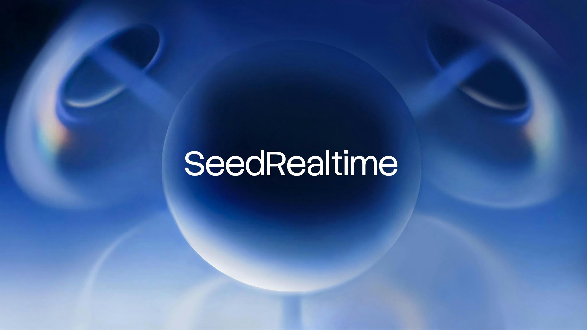
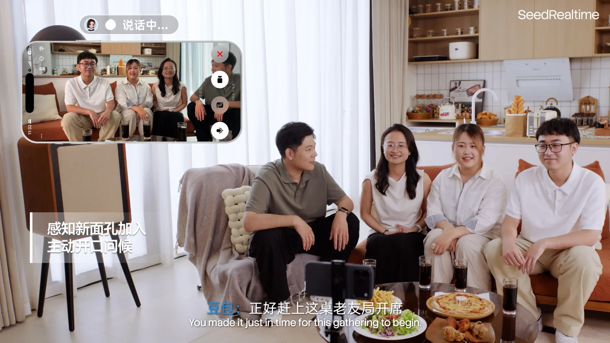
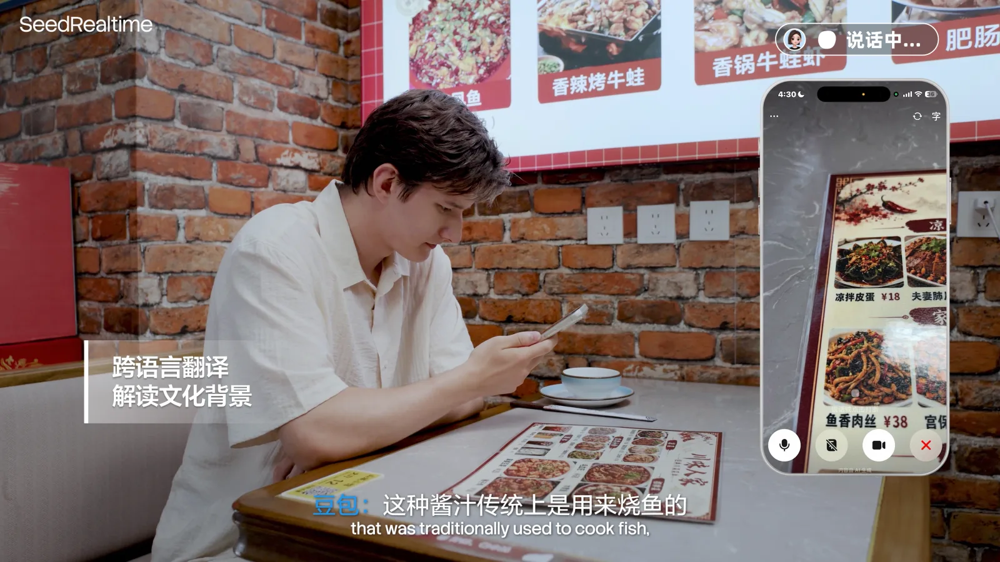
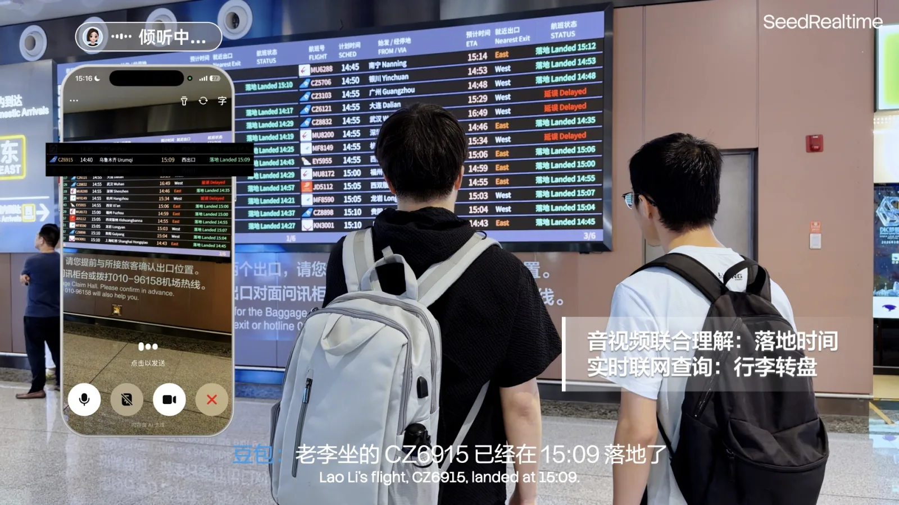

# SeedRealtime 深度拆解：实时语音 Agent 的下一层，不是更快回复，而是音视频全双工

> **TL;DR:** 字节 Seed 在 2026-08-05 发布 SeedRealtime，并将其定义为原生音视频全双工大模型。它的重点不是把语音助手做得更快，而是让一个模型持续接收音频、画面和时间序列，在真实环境里边看、边听、边说。官方称 SeedRealtime 已在豆包 App 全量上线，并在端到端人工评测中相对级联系统把对话节奏问题减少约一半。真正值得关注的是产品范式变化：实时 Agent 的主战场正在从“听完一句再回答”转向“持续感知、判断时机、选择对象并安全行动”。

- **Source:** [SeedRealtime product page](https://seed.bytedance.com/zh/seedrealtime)
- **Technical blog:** [SeedRealtime: 音视频全双工大模型发布，迈向全模态自然交互](https://seed.bytedance.com/zh/blog/seedrealtime-audio-visual-full-duplex-llm-released-toward-omni-modal-natural-interaction)
- **Published:** 2026-08-05
- **Topic:** audio-visual full duplex / real-time voice agent / multimodal interaction / Doubao



## 一句话判断

**SeedRealtime 的核心不是“语音模型 + 摄像头”，而是把音频、视频、文本和交互时序放进同一个实时运行时。**

这件事听起来像一个产品功能，实际上是 AI 交互架构的转向。

过去很多语音助手仍然是回合制的：用户说一句，系统转写成文本，大模型生成回答，再由 TTS 播出来。即便中间某个环节速度很快，整体交互仍然依赖“你说完了吗”这个边界。摄像头能力也常被做成附加输入：拍一张图、截一帧视频、把视觉信息转成描述，再交给语言模型。

SeedRealtime 想解决的是另一个问题：真实世界不是一串提交按钮。人会停顿、插话、看向某个物体、被旁边人打断，也会在嘈杂环境里半句话表达意图。一个真正实时的 Agent 需要同时回答四个问题：

- 现在是谁在说？
- 用户指的是画面里的哪个对象？
- 这句停顿是思考、结束，还是被噪声打断？
- 我应该现在说、继续听、短暂确认，还是调用工具？

这就是音视频全双工比“更低延迟语音”更重要的地方。

## 为什么全双工不是简单的“可打断”

全双工最容易被理解成用户可以打断 AI。但打断只是表层体验。

更深一层是输入和输出不再互相排斥。模型在说话时仍要继续听；在听的时候也要判断是否该说；在看画面时还要持续更新对象、动作、方位和用户注意力。这类系统真正优化的是互动节奏，而不是单次回答速度。

官方对 SeedRealtime 的定位很明确：它是原生音视频全双工大模型，可以联合理解声音、画面和时序信息，带来边看、边听、边说的自然交互体验。这里的关键词是“联合”和“时序”。如果只是把视频转成 caption，再把音频转成文字，模型拿到的就是离散片段；而全双工系统需要处理的是连续流。

这会改变语音 Agent 的评价指标。过去我们关心 ASR 准确率、首 token 延迟、TTS 自然度。以后还必须测：

- 误打断率；
- 用户插话后的停止速度；
- 背景噪声下的误触发率；
- 多人说话时的目标说话人选择；
- 视觉指代是否稳定；
- 后台工具调用是否在合适时机插入；
- 长时间对话里是否能保持上下文和节奏。

换句话说，实时 Agent 不只是一个会说话的模型，而是一个对话调度器。

## 级联系统的瓶颈：每一层都在丢时序

SeedRealtime 官方把自己的技术路线和多阶段级联系统区分开来。传统方案大致是：

```text
麦克风/摄像头
  -> ASR / 视觉识别 / 视频理解
  -> 文本或结构化描述
  -> 大语言模型推理
  -> TTS / 语音输出
```

这个架构很容易工程化，也便于复用现有模型。但它有一个天然问题：每一层都可能压缩掉交互信息。

语音里的犹豫、重音、拖长、抢话和背景声，转成文字后会损失很多。视频里的视线、动作变化、物体出现和用户手势，如果只变成一句 caption，也很难保留精确时序。最终语言模型看到的是“已经加工过的摘要”，而不是同步变化的真实场景。

SeedRealtime 的官方说法是采用端到端统一音视频建模框架，把感知、理解、决策和表达放在一个模型中，减少多阶段级联系统的信息损失和误差累积。这里的战略意义在于：模型不只是回答内容，还参与决定何时回答、回答谁、用什么粒度回答。

这也是为什么它更接近交互模型，而不是单纯的语音识别或视频理解模型。

## 三个能力：看懂、主动、会等

官方把 SeedRealtime 的进展概括为三类：音视频联合理解、主动交互、对话时机。

第一是音视频联合理解。模型需要把声音、画面和时间关联起来。例如多人重叠说话时，它要区分谁在说、用户可能在问谁、屏幕中哪个对象是当前问题的目标。类似“这个是什么”“刚才那个人说的对吗”“帮我翻译她说的话”这类请求，单靠文字转写很容易丢失指代。



同一类能力也会进入跨语言和场景解释。用户拍到菜单、展品、设备或路牌时，模型不只是翻译文字，还要结合画面和当下问题解释背景。



第二是主动交互。传统助手更像被动问答机：用户说完需求，它才回应。SeedRealtime 强调持续环境感知和主动沟通，例如在博物馆场景里识别用户正在看的展品，在设备操作场景里根据画面提醒下一步，在阅读或学习任务中围绕视觉内容提供帮助。


第三是对话时机。这个能力听起来不如模型参数和 benchmark 亮眼，但对语音体验非常关键。人类对话里，沉默不一定意味着结束，背景声不一定意味着用户在说话，旁边人的话也不一定是对 AI 的指令。SeedRealtime 官方强调它能感知对话状态和节奏，在嘈杂车站、机场、多说话人的家庭环境里减少误触发和不合时宜的插话。



把这三件事合起来看，SeedRealtime 的目标不是“更聪明的聊天”，而是“更像一个在场的助手”。它需要知道自己此刻是否应该介入。

## 豆包全量上线的信号

官方页面提到 SeedRealtime 已在豆包 App 全量上线，并称这是音视频全双工技术在行业内的规模化落地。这一点比单纯 demo 更值得注意。

实时音视频模型的难点不只是模型能力，还包括部署成本和产品安全。它需要处理连续流输入、低延迟输出、移动端网络波动、摄像头和麦克风权限、用户误触发、多人场景、未成年人保护、隐私提示和工具调用边界。只要进入消费级 App，系统就必须面对比实验室 demo 更混乱的场景。

这也解释了为什么全双工模型不是“把响应速度压到更低”就结束。真正的成本来自长期连接和持续感知：

- 音视频流怎么分块进入模型；
- 输出怎么流式生成；
- 推理怎么量化和优化；
- 什么时候在端上处理，什么时候送到云端；
- 如何避免摄像头/麦克风持续输入带来的隐私不安；
- 工具调用和主动提醒如何避免越界。

SeedRealtime 官方提到 chunked audio-visual input、streaming generation output、quantization 和 inference optimization。它没有公开完整系统细节，但这些关键词说明问题已经进入实时推理工程，而不是普通离线多模态问答。

## 和 Seed2.1、Seedream 的关系

如果把字节 Seed 近期产品线放在一起看，SeedRealtime 不是 Seed2.1 或 Seedream 的重复发布。

Seed2.1 更偏通用生产力、推理、代码和 Agent 稳定交付。Seedream 5.0 Pro 则是图像生成和设计生产接口。SeedRealtime 关注的是另一层：用户和模型之间的实时交互运行时。

可以把它理解成三类能力的分工：

| 方向 | 重点 | 典型问题 |
|---|---|---|
| Seed2.1 | 文本、推理、代码、Agent 任务 | 能不能把复杂任务稳定做完 |
| Seedream | 图像生成、设计、视觉生产 | 能不能把视觉资产稳定产出 |
| SeedRealtime | 音视频全双工交互 | 能不能在真实场景里自然介入 |

所以 SeedRealtime 的竞争对象也不只是“语音助手”。它更接近未来实时 Agent 的前台控制层：听、看、等、说、打断、确认、提醒、调用工具。

## 评测要谨慎读

官方称，在端到端人工评测中，SeedRealtime 相比级联系统把对话节奏问题减少了一半，同时降低打断、延迟、误触发等问题，并提升单轮对话可用率。

这个结论方向上很重要，但目前仍应当作为官方发布信息理解。页面没有公开完整评测集、样本规模、打分准则、对照系统配置和置信区间。对于开发者和产品团队，更稳妥的读法是：字节认为全双工端到端架构在体验评测上明显优于级联系统，但外部仍需要可复现的测试方法来判断边界。

尤其是实时音视频 Agent，很难只靠单一分数评估。它至少应该拆成几类指标：

- 感知：看错、听错、指代错的频率；
- 时机：抢话、冷场、误停、误触发；
- 任务：工具调用成功率和恢复能力；
- 安全：隐私提示、敏感场景识别、权限控制；
- 成本：延迟、带宽、算力和电量；
- 主观体验：用户是否觉得自然、可控、不冒犯。

这套评测体系本身会成为实时 Agent 的新基础设施。

## 对产品团队意味着什么

如果你正在做实时语音、陪伴、教育、导览、客服、硬件助手或桌面 Agent，SeedRealtime 给出的方向很明确：不要只把语音当输入法。

真正的产品问题会变成：

- 用户说话时，屏幕和现实环境提供了哪些关键上下文？
- AI 什么时候应该主动说话，什么时候应该保持沉默？
- 多人环境里如何确认自己被呼叫？
- 用户插话后，系统能不能立刻停止并改道？
- 主动提醒是否需要用户授权？
- 工具调用前是否需要二次确认？
- 连续摄像头/麦克风输入的存储、训练和删除策略是什么？

很多团队会先从“低延迟语音”入手，但最终会发现体验瓶颈并不只在延迟。最难的是交互策略：在一个持续变化的场景里，AI 如何既有用，又不过度介入。

## 结论

SeedRealtime 的发布说明，实时 Agent 的竞争正在从“更快回答”进入“更自然地在场”。

音视频全双工的意义，是让模型不再把世界切成一句话、一张图、一次请求，而是持续理解声音、画面、时序和人际节奏。它要判断谁在说、看什么、什么时候该回应、什么时候该等待，以及什么时候可以安全地调用工具。

这条路还很早。评测、隐私、成本、权限和误触发都会是硬问题。但方向已经清楚：下一代语音 Agent 不会只是聊天框的声音版本，它会是连接真实场景、屏幕信息和行动能力的实时交互层。
