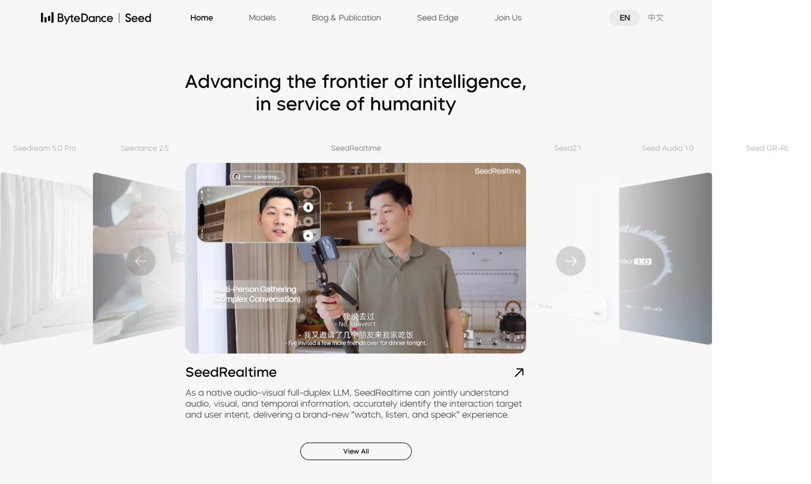
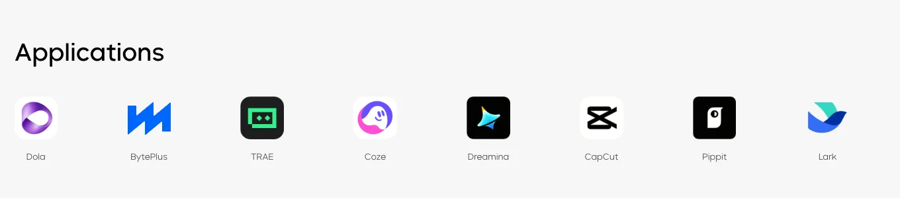
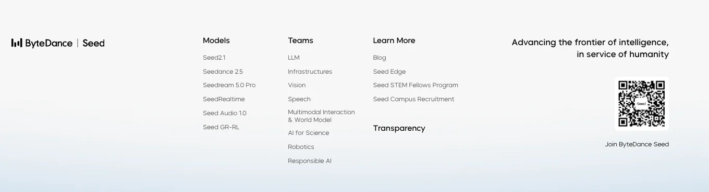
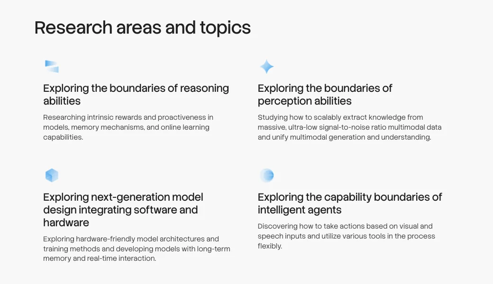
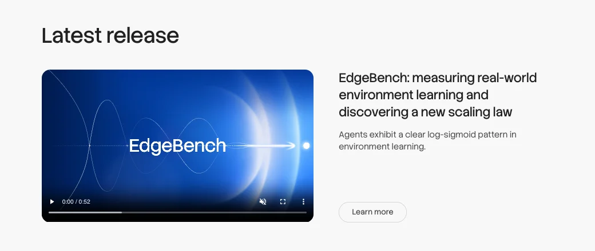
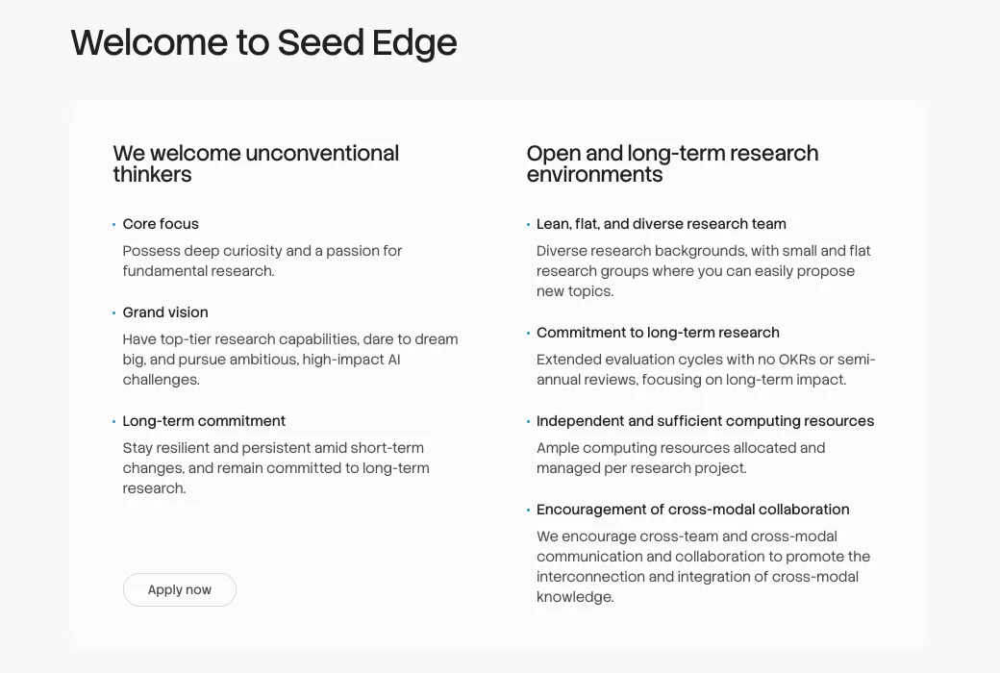

# Reading ByteDance Seed's Website: The Lab Homepage Is Now a Product Catalog, and the Research Signal Lives in Seed Edge

> **TL;DR:** Read ByteDance Seed's English homepage as a public document and it says three things: six models in a carousel, eight updates across four months, and eight shipped products that consume those models. Research in the traditional sense — papers, open problems, long bets — is folded into a separate entrance called Seed Edge, whose page promises extended review cycles with **no OKRs and no semi-annual reviews**, plus compute allocated per research project. That information architecture is itself the strategy statement: model lines answer to products, and long-horizon research is explicitly insulated from them. If you want to judge ByteDance's AI position, the four Seed Edge research directions and its review policy tell you more than any model blurb on the front page.

- **Source:** [ByteDance Seed official site (English)](https://seed.bytedance.com/en/)
- **Related page:** [Seed Edge](https://seed.bytedance.com/en/seed-edge)
- **Captured:** 2026-08-06 (dynamic page; contents will change)
- **Topic:** AI lab org structure / model portfolio / long-horizon research program / talent pipeline

## Why read a lab's homepage at all

A model launch post tells you how good a model is. A lab's homepage tells you **what the institution thinks it is**. That's harder to walk back and carries less rhetoric.

The top of Seed's homepage carries one line: "Advancing the frontier of intelligence, in service of humanity." The nav has five items: Home, Models, Blog & Publication, Seed Edge, Join Us, in English and Chinese, with the English site on its own path.

One absence is worth noticing: **there is no top-level "Research" entry.** Research is split in two — the publishable half merges into "Blog & Publication," and the long-horizon half becomes "Seed Edge."

## Six model lines, all in parallel

The hero carousel lists six models, not one flagship with derivatives:

| Model | Official positioning |
|---|---|
| SeedRealtime | Native audio-visual full-duplex LLM that jointly understands audio, visual, and temporal information and identifies the interaction target and user intent |
| Seed2.1 | Next-generation agent for real-world productivity |
| Seed Audio 1.0 | Full-scene audio generation, end-to-end film-grade audio creation |
| Seed GR-RL | Dexterous manipulation breakthrough — first real-robot shoe lacing achieved with reinforcement learning |
| Seedream 5.0 Pro | Multimodal image generation with advanced reasoning and efficient content creation |
| Seedance 2.5 | New-generation video model for 30-second storytelling with precise reference control and editing |

Agent, image, video, audio, real-time interaction, robotics. None is labeled the main line, and the footer's Models column lists the same six in a different order.

That's a different story from "one base model plus application skins." It reads closer to an organizational statement: **modalities aren't extensions of a flagship — each is its own product line** with its own release cadence, page, and owning team.

## Cadence: eight updates in four months, five of them in July

The homepage's "Latest updates" module lists eight items with official dates and categories:

| Date | Category | Title |
|---|---|---|
| 2026-08-05 | Models | Seed Audio-Visual Full-Duplex LLM Released: Toward Fully Multimodal Natural Interaction |
| 2026-07-31 | Models | One-take Creation, Flexible Referencing: Introducing Seedance 2.5 |
| 2026-07-23 | Partnership | Seed STEM Fellows Program is Now Open |
| 2026-07-20 | Models | From Speech to Audio Creation: Introducing Seed Audio 1.0 |
| 2026-07-08 | Models | Beyond Generation, It Understands Design: Introducing Seedream 5.0 Pro |
| 2026-07-07 | Research | EdgeBench: Measuring Real-World Environment Learning and Discovering a New Scaling Law |
| 2026-06-23 | Models | Seed2.1 Officially Released: Advancing AI Productivity |
| 2026-04-23 | Models | Seed3D 2.0 Released: Higher Precision and Greater Usability |

Two readable signals.

First, **five shipped in July alone** (Jul 7, 8, 20, 23, 31) — roughly weekly, and spread across image, audio, video, research, and recruiting. That's the shape of parallel teams shipping independently, not one team grinding.

Second, of eight items only one is tagged Research (EdgeBench) and one Partnership (STEM Fellows). The other six are Models. **The default genre of this homepage is the product launch.**

## Applications: the product surfaces listed on the lab's own page

Below the updates sits a row of application logos — the most informative screen on the page.

Eight surfaces: Dola, BytePlus, TRAE, Coze, Dreamina, CapCut, Pippit, Lark. That covers a chat assistant, cloud services, an AI IDE, an agent platform, image and video creation, editing, content marketing, and workplace collaboration.

A research organization listing consumer and enterprise products under its own name is being clear about what it is: **Seed is the group's model supplier, not a standalone research brand.** That's very different from the usual vague promise that research will eventually reach products — here the downstream list is named.

For anyone sizing up the competitive picture, this screen says more than benchmark tables. Model capability plugs straight into distribution surfaces that already exist (CapCut, Lark, Coze), with no need to incubate a new entry point first.

## Eight teams as an org chart

The footer's Teams column lists eight directions, each with its own page:

LLM, Infrastructures, Vision, Speech, Multimodal Interaction & World Model, AI for Science, Robotics, Responsible AI.

Three things stand out:

1. **Infrastructures sits alongside research directions**, so training and inference infrastructure is a first-class team rather than a function inside LLM.
2. **Multimodal Interaction & World Model is one team.** Binding "interaction" and "world model" under a single name lines up with the SeedRealtime product line — they're treating real-time interaction as a world-model problem.
3. **Responsible AI appears in the team list**, not just as a compliance link; Transparency has its own separate footer entry.

## Seed Edge: long-horizon research, explicitly insulated

Of the five nav items, Seed Edge is the only one that doesn't point at a product. The official definition: a long-term research program launched by the ByteDance Seed team, dedicated to establishing general intelligence, focused on long-term research topics and pushing the boundaries of AI. It encourages cross-team and cross-modal collaboration, provides an open research environment and dedicated computing resources, and **adopts a longer-term performance review cycle for its members**.

The four research directions are written more concretely than any model blurb on the front page:

- **Boundaries of reasoning** — intrinsic rewards and proactiveness in models, memory mechanisms, and online learning.
- **Boundaries of perception** — scalably extracting knowledge from massive, ultra-low signal-to-noise multimodal data, and unifying multimodal generation and understanding.
- **Next-generation model design integrating software and hardware** — hardware-friendly architectures and training methods, and models with long-term memory and real-time interaction.
- **Boundaries of agent capability** — acting on visual and speech input while flexibly using tools along the way.

Set those four against the six model lines and they're clearly not the same layer. The product lines ask how good a modality can get right now. Seed Edge's list names **structural gaps in the current paradigm**: models have no intrinsic motivation, no reliable long-term memory, no online learning, architectures divorced from hardware, and poor efficiency at extracting knowledge from low signal-to-noise data.

The list is itself a judgment: ByteDance does not think the next increment comes from scaling the current recipe a bit further.

The page's featured output is EdgeBench:

The official one-liner is that agents exhibit a clear log-sigmoid pattern in environment learning, presented as a newly discovered scaling law. That one deserves a trip to the source — both the homepage and the Seed Edge page give only the conclusion sentence, with no experimental setup. **Until the EdgeBench write-up is read, don't repeat this as an established scaling-law result.**

## The hardest signal is the review policy, not the research agenda

The lower half of the Seed Edge page describes the research environment, and it carries more information than the agenda does, because these are executable commitments rather than aspirations:

- **Lean, flat, diverse research teams** — varied backgrounds, small flat groups where new topics are easy to propose.
- **Commitment to long-term research** — extended evaluation cycles with **no OKRs or semi-annual reviews**, focused on long-term impact.
- **Independent and sufficient compute** — allocated and managed per research project.
- **Cross-modal collaboration encouraged** — to connect and integrate knowledge across modalities.

The three things they say they want in people are equally direct: deep curiosity and a passion for fundamental research; top-tier research ability, the nerve to dream big, and pursuit of ambitious high-impact AI challenges; and resilience through short-term change with a long-term commitment.

"No OKRs or semi-annual reviews," published on the site of a company known for execution cadence, is a specific organizational design move. It concedes something: **the weekly shipping rhythm on the front page is incompatible with what Seed Edge is trying to do, so the two have to be separated by policy.**

The matching talent pipeline is the Seed STEM Fellows Program — officially, an invitation to 100 researchers from the forefront of scientific innovation to work with the Seed team on real research challenges and accelerate scientific discovery with AI. The homepage tags it Partnership rather than recruiting, and it opened on July 23.

## One detail from the site's data layer

The homepage's server-side data carries a module that isn't rendered on the page: seven pinned papers, all journal-tagged arXiv, dated 2025-03 through 2025-07 — Seed LiveInterpret 2.0 (simultaneous speech-to-speech translation), the GR-3 technical report (a vision-language-action robot policy), Seedance 1.0, SeedEdit 3.0, model merging in LLM pre-training, the Seed1.5-VL technical report, and a deep-learning study of integer and fractional topological insulators from the AI for Science team.

To be explicit: **this is a pinned selection returned by the homepage data endpoint, not a feed of recent publications**, so it says nothing about Seed's current paper output. What it does show is that across seven chosen showcase papers, six different teams each get a slot (Vision twice; Speech, Robotics, LLM, Multimodal, and AI for Science once each). **Even the showcase selection optimizes for team coverage rather than depth in one direction.**

## How to actually use this page

- **Competitive analysis** — read the Applications row and the release cadence, not the model blurbs. Seed's capabilities land directly on existing distribution, which changes both its iteration speed and its cost of failure relative to companies building an entry point from scratch.
- **Job hunting** — read the Seed Edge review terms and the eight team pages. "No OKRs, compute per project" is a concrete promise you can interrogate line by line in an interview.
- **Technical selection** — BytePlus and Coze are the main external outlets for these models; the model pages themselves don't carry API detail.
- **Research watching** — chase the EdgeBench source, plus "intrinsic rewards and proactiveness" and "online learning" from the Seed Edge agenda. Real progress on those two matters more than any modality benchmark.

## Caveats

- **This is a snapshot** captured 2026-08-06. The carousel, update list, and pinned papers are CMS-driven and will change; every date and item here reflects that moment.
- **Model descriptions are official marketing copy** with no third-party verification — including Seed GR-RL's "first real-robot shoe lacing with reinforcement learning" and Seed Audio 1.0's "film-grade."
- **The EdgeBench scaling-law claim is unverified here**; only the official one-line summary is reported.
- **The unrendered pinned-paper data is not a recent-publications list**, as noted above.
- **The English and Chinese sites may not be in sync.** This reading is based on the English site; check the Chinese pages separately before quoting official Chinese wording.

What a lab is willing to put on its homepage reflects its present center of gravity better than what it writes in papers. Seed's homepage currently shows six parallel model lines and eight product surfaces, while everything it doesn't yet know how to do is filed neatly into a drawer labeled Edge — a drawer given its own compute and time that isn't reviewed. Those two facts together say more than either does alone.
