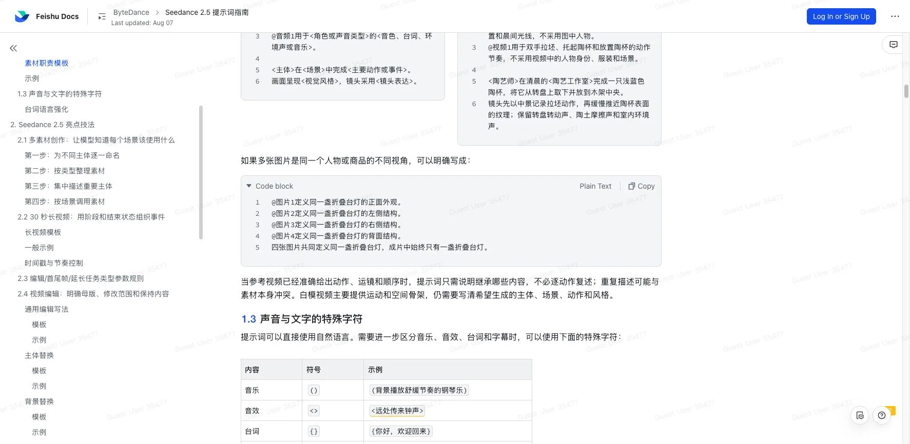

# Seedance 2.5 提示词指南拆解：AI 视频 Prompt 正在从一句咒语变成生产 Brief

> **TL;DR:** 这份 ByteDance Lark 文档不是普通的提示词教程，而是一份面向 Seedance 2.5 的视频生产规范。它把 Prompt 拆成主体、动作、场景、视觉风格、运镜和声音；把图片、视频、音频参考素材拆成明确职责；把 30 秒长视频拆成阶段和结束状态；把视频编辑、首尾帧、延长、一键成片、无缝转场、白模参考和情绪表演都写成可复用模板。真正值得注意的是：Seedance 2.5 的提示词正在从“写得漂亮”变成“能让 Agent 和创作者共同执行的生产 Brief”。

- **Source:** [Seedance 2.5 提示词指南 - Lark](https://bytedance.larkoffice.com/docx/OsiUdR1OxoDqvnxsK8LczYx7nPd)
- **Canonical docs:** [火山方舟 Seedance 2.5 提示词指南](https://docs.volcengine.com/docs/82379/2607689?lang=zh)
- **English docs:** [Dreamina Seedance 2.5 prompt guide](https://docs.byteplus.com/en/docs/ModelArk/2607689)
- **Model launch:** [一镜成片，随心参考｜Seedance 2.5 正式发布](https://seed.bytedance.com/zh/blog/one-take-creation-flexible-referencing-introducing-seedance-2-5)
- **Last updated:** 2026-08-07
- **Topic:** AI video prompting / multimodal references / edit control / creator workflow / agent skill



## 一句话判断

**Seedance 2.5 提示词指南的重点不是教你多写形容词，而是把视频生成任务拆成模型可执行的生产结构。**

早期 AI 视频 Prompt 很像咒语：电影感、4K、赛博朋克、慢动作、史诗光影，一串词堆上去，然后赌模型理解。

Seedance 2.5 这份指南的方向完全不同。它要求用户先讲清楚想生成什么，再说明参考素材、事件过程、视觉表达和声音。换句话说，Prompt 不再只是自然语言描述，而是一个小型 production brief：

- 谁是主体；
- 主体做什么；
- 场景在哪里；
- 每份参考素材负责什么；
- 事件如何分阶段推进；
- 镜头怎么运动或切换；
- 声音、台词、字幕如何出现；
- 哪些内容要保持，哪些内容要替换；
- 最后状态应该停在哪里。

这就是 Seedance 2.5 和过去提示词经验的差别。它不是“更长 Prompt”，而是“更明确的职责分配”。

## 从 2.0 的技巧，到 2.5 的生产规则

Peter 这个仓库之前已经写过 Seedance 2.0 的 skill 和 Prompt Ops。那时的重点是：把 `@` 引用语法、镜头语言、分时段结构和场景模板包装成 Agent 可以执行的导演手册。

Seedance 2.5 这份文档进一步往生产侧走。官方发布稿说 Seedance 2.5 支持单次生成 30 秒视频，支持多轮延长，并且单次可参考最多 30 张图片、10 段视频、10 段音频。指南里对应地增加了三类很具体的规则：

| 变化 | 2.5 指南的处理方式 | 实际意义 |
|---|---|---|
| 参考素材变多 | 每份素材必须写清职责、采用什么、不采用什么 | 防止人物、道具、背景、声音互相串 |
| 视频变长 | 用阶段、时间戳、结束状态组织事件 | 防止 30 秒内容漂移成流水账 |
| 编辑能力增强 | 明确母版、修改范围、保持内容和任务类型参数 | 防止编辑任务把不该改的地方一起改掉 |

所以这不是“Seedance 2.0 技巧加长版”。它更像视频模型进入多素材、长时长、编辑化之后，不得不补上的作业单。

## 基础公式：不是模板，而是信息分层

指南给的基础公式是：

```text
主体 + 动作或事件 + 场景与环境（可选）+ 视觉风格（可选）+ 运镜或切镜（可选）+ 声音（可选）
```

这句话表面上很简单，真正有用的是它的优先级。

主体和动作是最小闭环。场景决定空间和光线，视觉风格决定质感，运镜决定观看方式，声音决定最终视频是否像一段完整作品。你可以省略后面的部分，但不能把所有东西混在一句形容词里。

这对创作者很重要。AI 视频模型不是剪辑师、摄影师、录音师和美术指导自动开会。Prompt 必须把这些工种的意图折叠进一个结构里。写得越像生产 Brief，模型越容易知道哪个信息约束哪个维度。

## 多素材参考：核心不是上传更多，而是绑定关系

Seedance 2.5 支持最多 50 份参考素材。中文指南给出的范围很具体：

| 素材类型 | 输入范围 | 推荐范围 |
|---|---|---|
| 图片 | 最多 30 张，单张不超过 4K | 主体图片以 1 至 8 个主体为宜 |
| 视频 | 最多 10 段，全部视频总时长不超过 30 秒 | 主体音视频以 1 至 5 个主体、单段 5 至 10 秒为宜 |
| 音频 | 最多 10 段，全部音频总时长不超过 30 秒 | 保留与任务直接相关的台词、音色、环境声或音乐 |
| 视频编辑 | 可使用视频与参考图共同完成编辑 | 原视频以 20 秒以内、参考图以 1 至 5 张为宜 |

这组数字本身不是重点。重点是指南反复强调：素材越多，越不能让模型自己猜。

多素材 Prompt 应该先写职责：

```text
@图片1用于<主体>的<外貌、服装、结构或材质>。
@视频1用于<动作、运镜或节奏>。
@音频1用于<角色或声音类型>的<音色、台词、环境声或音乐>。
```

如果同一个商品有四张不同视角图，也要明确它们共同定义同一个对象，而不是四个对象。这一点非常实际。视频生成里最常见的失败不是模型完全不懂素材，而是把 A 的衣服、B 的脸、C 的道具、D 的背景揉在一起。

Seedance 2.5 指南真正教的是“素材职责表”，不是“素材越多越好”。

## 30 秒长视频：时间戳不是剪辑点，而是节奏分配

Seedance 2.5 的一个核心卖点是单次 30 秒生成。30 秒听起来只是时长翻倍，但对 Prompt 来说是质变。

5 秒视频可以只有一个动作。30 秒视频必须有阶段：开场、推进、转折、收束。指南建议把长视频写成多个阶段，并且每个阶段只放一个主要变化，同时写清结束状态。

这很像分镜，不像短句 Prompt。关键不是给每一帧下命令，而是给模型一条可保持的事件轨道：

- 第一阶段发生什么；
- 镜头怎么移动；
- 主体位置如何变化；
- 声音或台词如何进入；
- 这一段结束时画面停在什么状态。

指南也明确给了边界：时间戳只能用于分配事件节奏，不是帧级剪辑点。这个提醒很重要。生成式视频模型能按时间段组织内容，但不能被当成 NLE 时间线逐帧锁死。必须完全准确的字幕、公式、标牌、产品参数和帧级时间点，仍然建议用前期合成素材、视频生成和后期制作共同完成。

## 视频编辑：先定义母版，再定义修改范围

Seedance 2.5 强化了视频编辑能力，指南也把编辑 Prompt 拆得很细。

一个可执行的视频编辑请求至少要说明：

- 哪个视频是唯一母版；
- 修改发生在哪个时间段或区域；
- 修改什么主体、背景、声音或动作；
- 哪些人物、动作、画风、比例和时长保持不变；
- 输出是否继承输入视频的基本约束。

这和图像编辑类似，但视频更难，因为时间连续性会放大错误。主体替换、背景替换、声音编辑、运镜调整，每一种任务都可能影响原视频中本该保留的部分。

指南里的使用边界也很直白：视频编辑可以提高关键事件与原视频对齐的概率，但不能保证逐帧完全重合。视频编辑会锁定输入视频比例和基本时长，输出时长与输入视频可能有最大约 0.3 秒差异。

这类限制写进 Prompt 指南，反而是成熟信号。创作者需要知道哪些约束由模型继承，哪些约束只能后期处理。

## 首尾帧、延长、白模：Prompt 在接管前期制作

指南里最值得关注的一组能力，是首尾帧、多关键帧、宫格分镜、白模参考和视频延长。

这说明 Seedance 2.5 的输入已经不只是“文字 + 参考图”，而是越来越接近前期制作材料：

- 首帧控制开场构图；
- 尾帧控制到达状态；
- 多关键帧控制顺序；
- 宫格分镜提供故事板；
- 白模提供空间结构、主体姿态、运动轨迹和镜头机位；
- 延长任务要求对齐边界画面、运动趋势和声音连续性。

这对专业创作者的意义很大。真正可控的视频生成，不会只靠文字变强，而是把导演台、故事板、角色设定图、场景图、动作参考、音频参考都纳入同一个约束系统。

白模尤其关键。它把“空间关系”和“镜头调度”前置成可验证的结构，而不是让模型从一段文字里猜人物在哪里、镜头怎么走、光源从哪里来。

## 声音和文字：四个符号背后的多轨道思维

指南用四种符号区分声音和文字：

| 内容 | 符号 | 用途 |
|---|---|---|
| 音乐 | `()` | 背景音乐或旋律 |
| 音效 | `<>` | 环境声、动作声、特定声源 |
| 台词 | `{}` | 角色对白 |
| 字幕 | `【】` | 屏幕文字或字幕 |

这不是语法炫技。它说明视频 Prompt 已经进入多轨道描述：画面、音乐、音效、台词、字幕不能全部混成一段自然语言。

同时，指南建议需要控制字幕或声音时直接写清保留和不采用的声音类别，例如无背景音乐、只保留人物对白和环境声、不要字幕。这里的逻辑很实用：画面尽量正向描述，素材职责和容易误带入的内容才需要明确限制。

## 官方 Skill：把提示词经验交给 Agent 执行

文档开头强烈推荐安装 Seedance 2.5 skill：

```bash
npx --yes skills@latest add \
  "https://arkdocs.tos-cn-beijing.volces.com/skills/" \
  --skill sd25-pe \
  --yes
```

然后在 AI 对话框输入 `/sd25-pe + 你的提示词内容` 调试提示词。

这点非常关键。官方不是只发布一份人工阅读文档，而是把指南做成 Agent Skill。它承认了一个现实：复杂视频 Prompt 已经不适合让用户完全手写。

更合理的流程会变成：

1. 用户说创意；
2. Agent 追问素材、人物、时长、任务类型；
3. Skill 根据 Seedance 2.5 的限制重写 Prompt；
4. 创作者用生成结果反向修订分镜、素材职责和编辑范围。

Prompt 工程在这里不再是个人技巧，而是可安装、可版本化、可协作的生产层。

## 对 QCut / AI 视频工作流的启发

这份指南最适合被做成 UI，而不是只留在文档里。

如果把它转成工具，应该不是一个大文本框，而是一组结构化面板：

- 素材库：图片、视频、音频分别绑定角色、道具、场景、动作、声音；
- 场景表：每个阶段有事件、镜头、声音和结束状态；
- 任务类型：生成、编辑、首尾帧、延长、一键成片、无缝转场；
- 锁定规则：自动提示比例、时长、首尾帧和延长的边界；
- 检查器：提交前扫描主体、素材职责、时间段、声音、字幕和使用边界。

对 QCut 这类视频工具来说，Seedance 2.5 指南给的不是一堆可复制的 Prompt，而是一套可以产品化的 schema。用户不应该记住所有规则；工具应该把规则变成表单、分镜轨道、素材映射和自动检查。

## 结论

Seedance 2.5 提示词指南的价值，在于它把 AI 视频创作从“描述画面”推向“组织生产”。

30 秒长视频、多素材参考、视频编辑、延长、白模、无缝转场、声音和字幕控制，都要求 Prompt 承担更多生产责任。它必须说明素材职责、事件顺序、镜头逻辑、声音轨道、保持内容、修改范围和使用边界。

这也是 AI 视频工具下一阶段的方向：不是让每个人写更长的 Prompt，而是把 Prompt 拆成可检查、可复用、可由 Agent 维护的 production brief。Seedance 2.5 的官方 skill 已经把这条路摆出来了。
