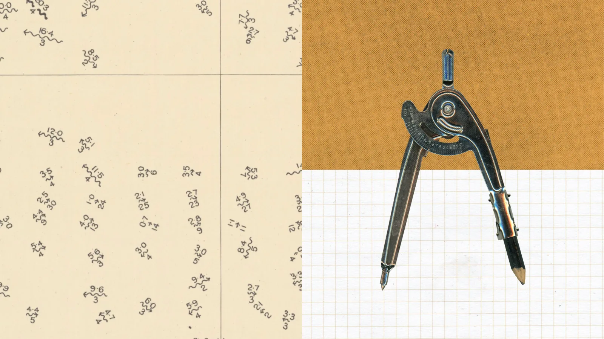

# Anthropic Riemann zeta 结果拆解：Claude 没证明黎曼猜想，但把 AI 数学发现做成了可验证流水线

> **TL;DR:** Anthropic 在 2026-08-10 发布了一项 AI 数学结果：一个未发布的研究版 Claude 没有证明黎曼猜想，但在尝试过程中，把“满足黎曼猜想的 zeta 零点比例”的已知无条件下界从 41.6% 提高到 67.2%。这不是“AI 解决千禧难题”，也不是普通 benchmark；真正值得看的，是 Claude Code 里的多 agent 研究过程、31M output tokens、60 个子 agent、2400 条 shell 命令、数值检查、文献排重、人类数学家审读，以及 Lean 4 / Mathlib 的形式化验证。AI 数学正在从“模型写出一个漂亮证明”变成“候选发现、同行审读、形式化证明和可复现实验记录”的工程流水线。

- **Source:** [Learning more about Claude's mathematical capabilities](https://www.anthropic.com/research/riemann-zeta)
- **Paper:** [More than two thirds of the zeros of the Riemann zeta function lie on the critical line](https://www-cdn.anthropic.com/564f962e60643842f5fcb4a17c9dbc8f608f1c37.pdf)
- **Formalization:** [anthropics/zeta-23-lean](https://github.com/anthropics/zeta-23-lean)
- **Informal note:** [Anthropic note for experts](https://www-cdn.anthropic.com/23455459f8832d06bb175cc0f88d019aed962ef8.pdf)
- **Discovery appendix:** [Claude's explanation of how it arrived at the result](https://www-cdn.anthropic.com/d7f3ecf1d01392d887f8bc974ca187e2a121b1ed.pdf)
- **Transcripts:** [Typeset and annotated Claude sub-agent transcripts](https://www-cdn.anthropic.com/8a0d1add3c637b858a9a181e98c40e9548c3f44f.pdf)
- **Published:** 2026-08-10
- **Topic:** AI-assisted mathematics / Riemann zeta function / Lean formalization / multi-agent discovery workflow

## 一句话判断

**这次最重要的不是 Claude “接近证明黎曼猜想”，而是 Anthropic 把一次 AI 数学发现包装成了可审查、可形式化、可复现的研究对象。**

黎曼猜想本身没有被证明。Anthropic 也明确说，他们不认为 Claude 用到的技术会导向黎曼猜想的证明。

但这不代表结果不重要。Claude 改进的是一个相关问题：在所有 Riemann zeta 函数的非平凡零点中，至少有多大比例位于临界线 `Re(s)=1/2` 上。此前最好的无条件下界是 41.6%；Claude 给出的是 67.2% 左右，论文标题更直接：超过三分之二的 zeta 零点在临界线上。

这类结果的价值不在于“猜想解决了”，而在于它推进了一个长期研究方向：即使无法证明所有零点都在临界线上，能否证明越来越高比例的零点在临界线上。

## 结果到底是什么

粗略地说，Riemann zeta 函数的零点控制着素数分布的细节。黎曼猜想说，所有非平凡零点都在一条特定竖线上，也就是临界线 `Re(s)=1/2`。

完整猜想仍然开放。但数学家已经证明，有一部分零点确实在这条线上。这个比例下界不断被提高：

| 阶段 | 含义 |
|---|---|
| Hardy | 证明临界线上有无穷多个零点 |
| Selberg | 证明正比例零点在临界线上 |
| Levinson / Conrey / 后续工作 | 逐步把比例下界提高 |
| 2020 前后已知记录 | 约 41.6% |
| Claude 这次结果 | 约 67.2%，并有三分之二形式的核心定理 |

Claude 论文的主结果可以理解为：

- 至少三分之二的相关 zeta 零点位于临界线上；
- 至少三分之二的零点是 simple 且在临界线上；
- 至少五分之六的零点是 distinct；
- 使用 Montgomery–Taylor 类型优化窗口时，临界线比例和 simple-on-line 比例提升到约 0.6725，distinct 比例到约 0.83625；
- 类似结果还扩展到 primitive Dirichlet L-functions。

这些表述都不是在说“所有零点”。它们是无条件比例下界。

## 技术新意：把 Montgomery 路线从 RH 假设里拆出来

Anthropic 页面给的简短解释是：Claude 将 Baluyot、Goldston、Suriajaya、Turnage-Butterbaugh 等人的近期工作，与 Bombieri 2000 年的一篇工作结合起来，从而越过 41.6% 的旧下界。

更技术一点说，Montgomery 在 1973 年发展了一组研究零点 pair correlation 的技术，但部分读法依赖黎曼猜想。后来的工作把 Montgomery 的 prime-side 计算放到更无条件的框架里。Claude 的关键动作，是不再试图逐项用正性读出零点侧，而是把整个空间放进一个带 Weil Hermitian form 的线性代数问题里处理。

论文摘要里把新部分说得很清楚：用 Sylvester inertia、rank–trace inequality、von Neumann trace inequality 等线性代数工具，替代原本在 RH 下才容易成立的逐项正性读法。换成人话：Claude 没有发明一条通向 RH 的神秘捷径，而是找到了一个更聪明的 bookkeeping 方式，把已有解析数论输入重新读成更强的比例结论。

这也是为什么 Anthropic 一边强调结果，一边很谨慎地说它不太可能直接导向 RH 证明。

## 方法论：Claude Code 变成数学研究工作台

这次最像工程事件的部分，是 Claude 的发现过程。

Anthropic 披露的流程大致是：

| 环节 | 细节 |
|---|---|
| 初始任务 | Jarred Sumner 让 Claude “take a real stab” at the Riemann hypothesis |
| 第一轮 | Claude 生成并尝试 650 个想法，都失败 |
| 第二轮 | Claude 在一天半里协调约 60 个 Claude subagents |
| 工具使用 | 总计 31M output tokens、2400 条 shell 命令、数百个 Python 脚本 |
| 自检 | 对已知 zeta zeros 做数千次数值检查，子 agent 互相审稿 |
| 排重 | 下载 54 篇 arXiv 论文，检查结果是否已存在 |
| 复证 | 让不同子 agent 独立重证结果、找反例、审查证明 |
| 人类验证 | Anthropic 数学家 Levent Alpöge 和 Ralph Furman 审读并负责对外沟通 |
| 形式化 | Eric Easley 与 Claude 合作给出 Lean formalization |

这个流程不像传统 benchmark，也不像普通聊天。它更像一个研究 harness：模型提出想法，工具执行计算，子 agent 分工探索，人类保持方向和审查边界，最后由形式化系统把核心证明对象钉住。

有趣的是，Jarred Sumner 不是数学家，过程中主要输入是鼓励式消息。这个细节不应被浪漫化为“鼓励就能让模型突破数学”。更合理的理解是：当模型已经有能力搜索和自我审查时，人类未必需要在每一步提供数学内容；但仍然需要设置目标、维持任务、要求验证、决定何时找专家。

## Lean formalization 是这次发布的硬边界

AI 数学结果最怕的不是写得不漂亮，而是写得太像真的。自然语言证明可能在局部有洞，非专家很难发现，专家也需要时间定位。

Anthropic 这次把 Lean 4 / Mathlib formalization 放出来，是一个非常关键的动作。`anthropics/zeta-23-lean` README 说它是论文的静态 companion artifact，不接受维护和贡献；它包含 Theorems A–E 的 complete、`sorry`-free Lean 4 / Mathlib formalization，并形式化了证明所依赖的解析输入。

仓库还给出几条审计边界：

- top-level theorems 没有额外假设；
- repository 不声明项目自有 axioms；
- `#print axioms` 对 headline theorem 只报告 Lean 标准三项：`propext`、`Classical.choice`、`Quot.sound`；
- `Zeta23/` 和 `Solution` 下没有 `sorry`；
- comparator 配置用于检查 trusted statements 与 solution theorem 的一致性。

这不意味着读者可以不用数学家。形式化证明也依赖 Mathlib、定义选择、statement 是否正是想证明的数学命题，以及从非形式论文到形式语句的翻译是否恰当。但它显著提高了 AI 数学结果的审查质量：至少核心命题不再只是一篇会说服人的 PDF。

## 和 OpenAI Astra 的差别

这个仓库前面刚写过 OpenAI Astra 的十项数学与理论计算机科学进展。Anthropic 这次和 OpenAI 那次很容易被放在一起看，但两者展示的信号不同。

| 项目 | OpenAI Astra 十项进展 | Anthropic zeta 结果 |
|---|---|---|
| 体裁 | 多领域批量结果 | 单个经典方向的深挖 |
| 展示重点 | 十个长期问题、论文合集、Lean certificate | 一次发现过程、子 agent 协作、形式化仓库、transcripts |
| 数学对象 | 几何、编码、群论、复杂性、密码、组合等 | Riemann zeta zeros 与临界线比例 |
| 产品信号 | AI 数学可批量产出候选结果 | Claude Code 可承载长程研究搜索 |
| 风险点 | 多结果的共同体验证压力 | 单结果的归属、验证和“是否夸大为 RH”风险 |

两者合起来看，AI 数学正在形成两个层次：模型能力层能提出候选证明，工程层要把候选证明变成可审查对象。没有后者，前者很容易变成漂亮幻觉；没有前者，后者只是传统形式化工程。

## 不该怎么读

这次发布很容易被误读，所以几个边界必须写清楚。

第一，Claude 没有证明黎曼猜想。它推进的是一个相关的比例下界问题。

第二，67.2% 不是“验证了 67.2% 的零点”。它是一个渐近比例下界命题，不是数值枚举。

第三，这不是公开版 Claude 的可复现实验。Anthropic 说使用的是 unreleased research version of Claude。用户不能据此推断当前产品 Claude 在数学研究上有同样能力。

第四，formalization 不等于“无需同行评审”。它让核心证明更硬，但数学意义、上下文、依赖、表述和后续吸收仍然需要共同体判断。

第五，不要把“非数学家给鼓励消息”理解成核心方法。真正的核心是模型搜索、工具使用、子 agent 审查、文献排重、专家验证和形式化。

## 对 AI 研究工具意味着什么

如果把这次事件翻译成产品语言，它给 AI research agent 一个很清楚的规格：

- 需要长期运行，而不是单轮回答；
- 需要多 agent 分工，而不是一个线程无限展开；
- 需要 shell、Python、文献下载、数值实验和 proof assistant；
- 需要内部审稿机制，主动寻找反例；
- 需要 prior-art 检索，防止重复发现；
- 需要能把自然语言证明转成形式化证明；
- 需要人类专家承担最终沟通和责任。

这套系统已经接近“研究操作系统”，而不是“数学聊天机器人”。

未来 AI 数学工具的竞争点，可能不会只是哪个模型更会解题，而是谁能把发现流程做得更可靠：问题选择、假设管理、实验记录、证明状态、形式化进度、引用关系、失败分支、专家审查，全都要成为一等对象。

## 结论

Anthropic 的 Riemann zeta 发布，不该被看成“Claude 证明了黎曼猜想”。更准确的判断是：Claude 在一个与 RH 相关的长期问题上，给出了一个经人类数学家审读、带 Lean formalization 的新比例下界。

这已经足够重要。

AI 数学的下一阶段不会只靠模型说“我有一个证明”。它需要把发现、计算、文献、审稿、形式化和人类责任接在一起。Anthropic 这次最强的信号，是它不仅展示了一个结果，还展示了一条可被审查的 AI 数学发现流水线。
