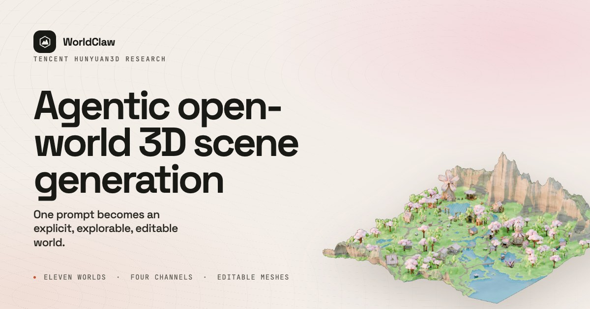
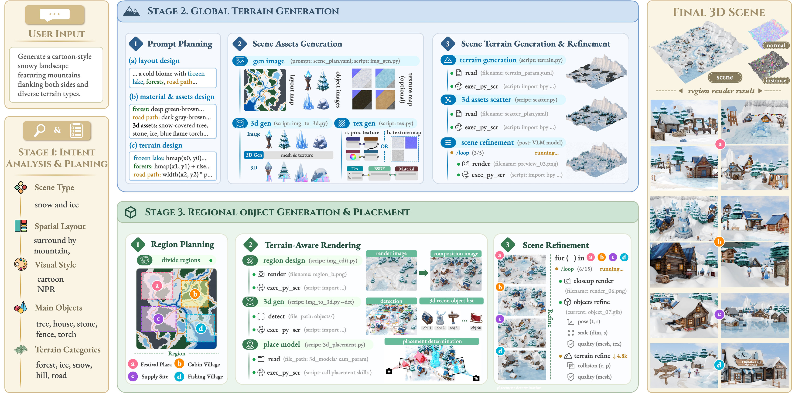
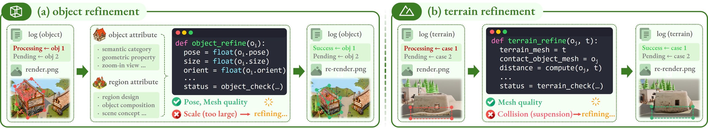

# Tencent Hunyuan WorldClaw Deep Dive: AI Open-World Generation Is About Editable 3D Assets, Not Video-Like Illusion

> **TL;DR:** Tencent Hunyuan introduced WorldClaw on X as an agentic workflow for generating large-scale 3D open worlds from text prompts. The key claim is not just scale. The post explicitly says the result is not video and not Gaussian Splatting: every scene is freely explorable and made from editable, game-ready 3D assets. That shifts the target from "can it look like a world?" to "can the world be inspected, modified, reused, and passed into normal 3D or game workflows?"

- **X source:** [Tencent Hy status](https://x.com/TencentHunyuan/status/2087068591296536755?s=20)
- **Project page:** [Hunyuan3D-WorldClaw](https://tencent-hunyuan.github.io/Hunyuan3D-WorldClaw/)
- **Paper:** [WorldClaw: Agentic 3D Open-World Generation at Scale](https://arxiv.org/abs/2608.05248)
- **GitHub:** [Tencent-Hunyuan/Hunyuan3D-WorldClaw](https://github.com/Tencent-Hunyuan/Hunyuan3D-WorldClaw)
- **Published:** X post on 2026-08-11; paper/project release noted on 2026-08-07; arXiv v1 submitted on 2026-08-05
- **Topic:** Agentic 3D generation / open-world scene construction / editable meshes / game-ready assets

## The Short Read

The interesting part of WorldClaw is that it treats "world generation" as a production pipeline: planning, terrain, assets, placement, render inspection, and local repair.

Many AI world-model demos first read as camera motion. You get a video, a panorama, or a 3D-looking representation that works from a limited range of views. WorldClaw's launch copy draws a deliberate boundary: **not video, not Gaussian Splatting, but explicit 3D assets.**

That distinction matters because games, VR, previs, and robot simulation do not only need something that looks plausible. They need scenes where:

- terrain remains globally coherent;
- objects exist as instances;
- meshes, textures, materials, scale, and pose can be edited;
- the world can be explored from arbitrary viewpoints;
- outputs can move into tools such as Blender, Unreal, or Unity.

WorldClaw's research value is that it decomposes those requirements into an agentic construction pipeline instead of expecting one end-to-end model to emit a finished world in a single pass.

## What It Generates

The paper defines WorldClaw as a coarse-to-fine, global-to-regional framework for open-world 3D scene generation. The input is an open-ended text prompt. The output is not an image or video, but a composed scene made from global terrain plus independently generated and placed 3D objects.

The project page states the product idea cleanly: one prompt becomes an explicit, explorable, editable 3D world.

Those three words are doing real work:

| Term | Meaning |
|---|---|
| explicit | The scene keeps terrain, objects, materials, and placement as structured components |
| explorable | The viewer is not locked to a predetermined camera path |
| editable | Objects remain separable meshes rather than collapsing into one visual blob |

The examples include pirate islands, canyon settlements, desert battlefields, snowy sci-fi outposts, medieval villages, volcanic lairs, and gemstone mines. The project page also shows RGB, instance, normal, and depth channels, which is a quiet but important signal: the system is preserving machine-readable scene structure, not merely rendering an attractive image.

## The Pipeline

WorldClaw's central design choice is to avoid generating the whole world all at once. It establishes global constraints first, then realizes high-detail local regions progressively.

The paper breaks the workflow into three stages:

| Stage | Role | Output |
|---|---|---|
| Intent Analysis & Planning | Extract scene type, theme, regions, objects, spatial relations, and style constraints from the user prompt | Structured scene specification |
| Global Terrain Generation | Build semantic regions, terrain, materials, reusable terrain assets, and a height field | Coherent terrain foundation |
| Regional Object Generation & Placement | Render local terrain, generate objects, reconstruct them as 3D meshes, recover placement, and repair contacts | Independent object instances and the final scene |

The intuition is strong: an open world does not need equal detail everywhere. It needs global structure at a distance and enough local content where the player or camera comes close. WorldClaw therefore separates world organization from instance-level local content.

That is why it feels more like a production system than a single model demo. A planner creates executable structured intent; terrain modules establish semantics and scale; local modules use image editing, detection, image-to-3D, placement, and render feedback to fill the world.

## Why The Agent Loop Matters

WorldClaw does not simply ask an LLM for a plan and stop. The paper emphasizes render-based agents: the system renders current results, checks object quality, scale, pose, orientation, mesh quality, and object-terrain contact, then continues refining.

This matters because many 3D failures are only obvious after rendering:

- a building floats above the ground;
- an object has the wrong scale;
- trees, rocks, buildings, and roads intersect;
- material nodes are connected incorrectly;
- terrain collapses or becomes too smooth;
- a generated object does not match the region's semantics.

So "agentic" is not just launch vocabulary here. It matches the feedback structure of 3D production: **code / generate -> render -> inspect -> refine**.

This also separates WorldClaw from several adjacent AI 3D tracks. Single-image-to-3D solves object creation. Video world models solve visual continuity. WorldClaw is closer to scene orchestration: terrain, objects, materials, placement, channels, and repair loops.

## Why "Not Gaussian Splatting" Matters

Gaussian Splatting is excellent for fast reconstruction and novel-view rendering, but it is usually closer to a visual representation. It can look good and be browsable, yet production teams ask a different set of questions:

- Can I select this building separately?
- Can I replace this tree?
- Can I edit the ground material parameters?
- Can the character collide, navigate, or interact with the scene?
- Can I import the result into an engine for level design, animation, or physics?

WorldClaw's explicit terrain plus independent textured mesh approach is aimed at those questions. It avoids compressing the scene into a single visual field and instead preserves an asset hierarchy where possible.

That does not mean meshes are always superior to splats. They serve different jobs. Splats are strong for capture and viewing. WorldClaw-style systems are closer to editable content production.

## The Honest Implementation Detail

The implementation section is one of the most useful parts of the paper. The experiments use Claude Opus 4.8 as the underlying agent model, with task-specific agent skills connected to GPT-Image-2, SAM3, SAM3D, Hunyuan3D, and executable 3D tools. Terrain generation, object generation and placement, scene refinement, and rendering are performed in Blender 5.1.1 on a server with 4 NVIDIA H20 GPUs.

That tells us WorldClaw is not yet a lightweight consumer product. It is a research production pipeline:

- the LLM handles intent, planning, code, and tool orchestration;
- image models create semantic layouts and regional compositions;
- 3D models reconstruct objects;
- Blender executes procedural terrain, materials, placement, rendering, and visual QA;
- agent skills connect the stages into a long-running workflow.

The GitHub repository currently contains the README, links, and visual assets rather than a complete runnable open-source implementation. Calling it a ready-to-run tool would overstate what has been released.

## The Limitations Point To The Product Problem

The paper's limitation section is more useful than the glossy visuals.

First, WorldClaw depends heavily on the underlying models. The authors note that current open-source language models often struggle to generate procedural terrain and material programs that are both executable and aligned with user requirements. Open-source image models also often fail to produce usable semantic layout maps or preserve object appearance and pose. Full validation of the pipeline therefore still requires strong models such as Claude Opus 4.8, GPT-Image-2, and Hunyuan3D.

Second, code generation remains brittle. Blender APIs and node-based material systems are complex; mistakes in scale, numeric parameters, or node connectivity directly show up as broken worlds.

Third, the pipeline is expensive. To preserve instance-level editability, WorldClaw generates and reconstructs individual objects separately, then runs multiple rounds of render inspection and refinement. For simple scenes, holistic methods may be much faster.

These limitations do not weaken the direction. They clarify the real challenge: editable open-world generation is not just a model-score problem. It depends on agent runtime, tool use, scene representation, asset standards, and the interfaces of creative software.

## What Builders Should Watch

For AI video and 3D tool builders, WorldClaw's signal is clear: the next competition is not only who can generate the most impressive flythrough. It is who can turn generation into a scene state that production tools can continue editing.

The practical product directions are concrete:

- a visual editor from prompt to scene specification;
- intermediate layers for terrain, roads, water, and region semantics;
- automatic object placement, rearrangement, collision, and grounding checks;
- RGB / instance / depth / normal channels for QA;
- export and round-trip support for Blender, Unreal, and Unity;
- per-object provenance for prompt, mesh, texture, scale, pose, and edit history.

WorldClaw is not the final product, but it draws the right line: an AI-generated 3D world should not end as a video that resembles a game scene. It should become a world file that game and film tools can inherit.

## Bottom Line

WorldClaw's launch framing is unusually precise. It is not claiming to be an infinite world video model. It is choosing the explicit, explorable, editable side of the 3D generation problem.

That may look less instantly magical than a polished video demo, but for real 3D production it is closer to usefulness. A world should not just be a visual illusion inside a camera path. It should be a set of objects that can be inspected, replaced, rearranged, and imported into an engine. If AI 3D is going to enter production, this step is unavoidable.
