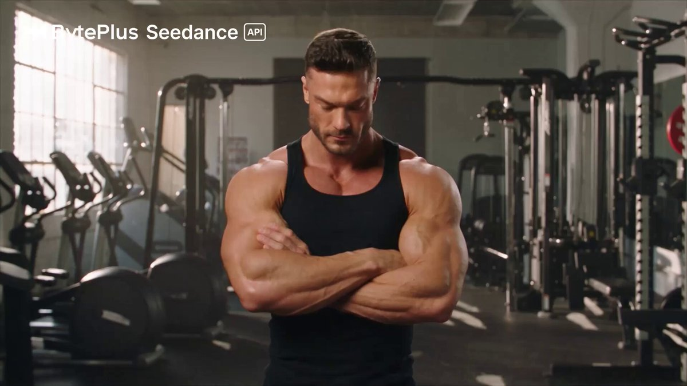
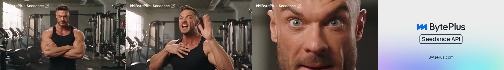

# BytePlus Seedance 2.5 1080P Deep Dive: AI Video Is Moving From Model Demos to Delivery Specs

> **TL;DR:** BytePlus’s X post looks like a simple announcement that Dreamina Seedance 2.5 now supports native 1080P. The larger signal is that AI video is moving from “generate an impressive sample” toward delivery specs that can fit post-production, ads, ecommerce, and API-scale production. 1080P, 10-bit color, MOV output, 30-second duration, 50 reference assets, editing / extension, and resolution-based pricing together show that Seedance 2.5 is now competing on production workflow, not only model taste.

- **Source:** [BytePlus X post](https://x.com/BytePlusGlobal/status/2088156784250986884?s=20)
- **Canonical article:** [Dreamina Seedance 2.5 Now Supports Native 1080P Video Generation](https://www.linkedin.com/pulse/dreamina-seedance-25-now-supports-native-1080p-video-generation-cch7c)
- **Product page:** [Dreamina Seedance 2.5 API on BytePlus](https://www.byteplus.com/en/product/seedance)
- **Model list:** [ModelArk model list](https://docs.byteplus.com/en/docs/ModelArk/1330310)
- **API reference:** [Create a video generation task](https://docs.byteplus.com/en/docs/ModelArk/1520757)
- **Pricing:** [ModelArk pricing](https://docs.byteplus.com/en/docs/ModelArk/1544106)
- **Published:** 2026-08-14
- **Tags:** BytePlus / Seedance 2.5 / Dreamina / AI video / 1080P / 10-bit color / ModelArk / video API / production workflow

## 1. This is not just a resolution bump

BytePlus’s X post says native 1080P is here for Dreamina Seedance 2.5. The supporting claim centers on production-ready frames, native 10-bit color, richer textures, more natural lighting, and better skin tones.

If this is read only as “720P upgraded to 1080P,” the important part gets lost. In AI video, resolution is not an isolated metric. It changes four things at once:

1. **Post-production headroom:** 1080P and 10-bit color create more space for grading, keying, compression, subtitles, and safe-area cropping.
2. **Quality inspection:** hair, skin, fabric, product edges, and small props expose model artifacts more clearly at 1080P.
3. **Cost structure:** BytePlus pricing connects video cost to resolution and whether the request includes video input.
4. **Delivery path:** API access, MOV / MP4, duration, frame rate, and reference-asset limits determine whether the model fits real production.

The important part of this 1080P update is not only that the demo is sharper. It is that BytePlus is packaging Seedance 2.5 as a priced, integrable, post-production-friendly video-generation service.

## 2. API availability has to be read by date: the announcement and docs are mid-transition

There is an important timing detail. BytePlus’s LinkedIn article was published on August 14, 2026. It says Seedance 2.5 supports native 1080P video generation, with API access coming to BytePlus on August 17. The ModelArk pricing page is more precise: Dreamina Seedance 2.5 will officially support 1080p output starting August 17, 2026, Beijing time.

But the ModelArk model list and Create a video generation task page I checked still list Seedance 2.5 with the pre-rollout shape:

| Item | Current docs state |
|---|---|
| Model ID | `dreamina-seedance-2-5-260628` |
| Capabilities | text-to-video, first-frame / first-and-last-frame image-to-video, multimodal reference-to-video, video editing, video extension |
| Currently listed resolution | 480p, 720p |
| Frame rate | 24 fps |
| Duration | 4-30s |
| Output format | `.mp4`, `.mov` |
| Default online limits | enterprise 600 RPM / concurrency 10, individual 180 RPM / concurrency 3 |

This is less a contradiction than a rollout state. Marketing and social channels announce the capability, the pricing page exposes the coming billing tier, and API reference pages update around the effective date.

For developers, the practical rule is simple: if you plan to integrate 1080P after August 17, 2026, do not rely only on the X post. Confirm in the ModelArk console that `resolution=1080p` is enabled for `dreamina-seedance-2-5-260628`, then run a real task and inspect the returned `video_url`, format, duration, and usage fields.

## 3. The 1080P price says this is for delivery, not unlimited iteration

The pricing page gives a Seedance 2.5 1080P baseline:

| Input type | 1080P 16:9 output | List price |
|---|---:|---:|
| No video input | 5 seconds | $2.843 / video, about $0.569 / second |
| With video input | 2-30 seconds input, 5 seconds output | $3.062-$11.907 / video |

BytePlus also offers a limited-time discount: from August 14, 2026 at 14:00 to September 17, 2026 at 14:00 UTC+8, Seedance 2.5 1080P output is billed at 72% of list price, starting at about $0.41 / second. The discount applies to 1080P only, not 480P or 720P.

That positions 1080P as a delivery tier, not the default sketch tier. A sensible creator or product workflow will probably look like this:

1. Use 480P / 720P to explore prompts, references, and shot design.
2. Once composition, performance, and action are locked, upscale the selected shots to 1080P generation.
3. Use 1080P and MOV when the clip needs grading headroom, commercial quality, or platform-transcode tolerance.
4. Budget video-input editing and extension tasks separately, because input duration increases cost.

AI video cost is no longer “how much does one generation cost?” Once a model supports 30-second clips, references, editing, extension, and higher resolution, cost becomes a miniature production budget: draft rounds, selected shots, final resolution, video references, and post-production needs.

## 4. MOV output and 10-bit color are the real post-production signal

BytePlus’s social and LinkedIn posts emphasize native 10-bit color depth. The API reference adds an `output_format` parameter for Seedance 2.5, supporting `mp4` and `mov`.

Those two formats map to different workflows:

| Output format | Best fit |
|---|---|
| `mp4` | browsers, mobile playback, social distribution, fast preview |
| `mov` | color grading, keying, compositing, and editing software |

The docs also warn that MOV output uses H.264 video encoding, YUV 4:4:4 chroma sampling, and PCM audio encoding, which some players may not support. That fine print is the point. Seedance 2.5 is moving into professional post-production territory, where creators care not just whether a clip plays, but whether it survives DaVinci Resolve, Premiere, After Effects, Final Cut, or Nuke without losing color, edges, brightness, or audio sync.

That is the real value of the 1080P update: it moves Seedance 2.5 from “looks good on a webpage” toward “can be processed by editing software.” The closer video models get to production, the more they need to expose engineering parameters.

## 5. 30 seconds and 50 references make 1080P feel like production mode, not single-shot mode

BytePlus’s product page does not position Seedance 2.5 only as a high-resolution model. It emphasizes three broader capabilities:

1. **Generate 30-Second Stories in One Take:** produce complete scenes with space for emotion, product walkthroughs, and narrative progression.
2. **Direct Every Detail with 50 References:** combine images, videos, and audio references so the model can follow character setups, product details, scene structures, camera moves, and brand assets.
3. **Edit Precisely. Keep the Frame Intact:** replace products, styles, faces, lighting, or backgrounds while preserving motion, composition, and visual continuity.

Those capabilities are tied to 1080P. For a short demo, 720P often looks good enough. For 30-second storytelling, product ads, close-ups, brand assets, editing, and extension, image quality becomes a review item. The model has to generate something that not only resembles video, but survives pause, crop, recompression, and client review.

That is the difference between Seedance 2.5 and a simple text-to-video toy. The input is expanding from a prompt into production materials: reference images, reference video, reference audio, brand assets, scripts, shot goals, and final delivery specs.

## 6. The first thing to test is not sharpness. It is the failure boundary

If a team wants to connect Seedance 2.5 1080P to a tool or workflow, I would test these before trusting the official demo:

| Test | Why it matters |
|---|---|
| Same prompt at 720P and 1080P | Check whether 1080P adds real detail or just exposes artifacts |
| Face and skin close-ups | Temporal flicker, hair, teeth, and eyes fail visibly at higher resolution |
| Product edges and text avoidance | Ecommerce and ads cannot tolerate warped logos, packaging, reflections, or edges |
| MOV import into editing software | Verify color, audio, compositing, and player compatibility |
| Video-input editing tasks | More expensive and closer to real repair workflows |
| 30-second one-take generation | Check whether characters, lighting, scenes, and action remain consistent |
| `omni_reference_task_type` | Use `reference`, `edit`, or `extend` to validate task constraints earlier and reduce asynchronous errors |

The last point matters. Seedance 2.5 can automatically infer omni reference-to-video task type, but the docs also expose `omni_reference_task_type` so callers can specify `reference`, `edit`, or `extend`. For production tools, this parameter may matter more than better prompt prose because it moves failures from asynchronous processing back to submission-time validation.

## 7. The real change: AI video now has a delivery spec sheet

The core of BytePlus’s 1080P update is not a prettier demo. It is an implicit spec sheet:

| Dimension | How Seedance 2.5 now needs to be evaluated |
|---|---|
| Image quality | 1080P, 10-bit color, texture, skin, lighting |
| Time | 4-30 seconds, one-take generation, extension |
| Input | text, image, video, audio, and up to 50 reference assets as a production brief |
| Editing | reference-to-video, edit, extend, repair rather than regenerate |
| Output | MP4 for distribution, MOV for post-production |
| Cost | resolution, video input, discount window, per-second pricing |
| Availability | X / LinkedIn announcement, pricing preview, API docs switching by date |

This is AI video moving from model demonstration to production system. Creators need more than a generation button. They need a workflow that can plan budget, organize assets, generate in layers, enter post-production, inspect quality, and deliver at scale.

If Seedance 2.5 native 1080P lands according to BytePlus’s API timeline, its meaning is not simply “the video is now HD.” It means video models are being packaged by cloud providers in terms that look much closer to traditional production: resolution, color depth, format, duration, references, editing constraints, and price. The next AI video tool race may not be about whose demo is most impressive, but whose interface makes those production parameters hard to misuse.
