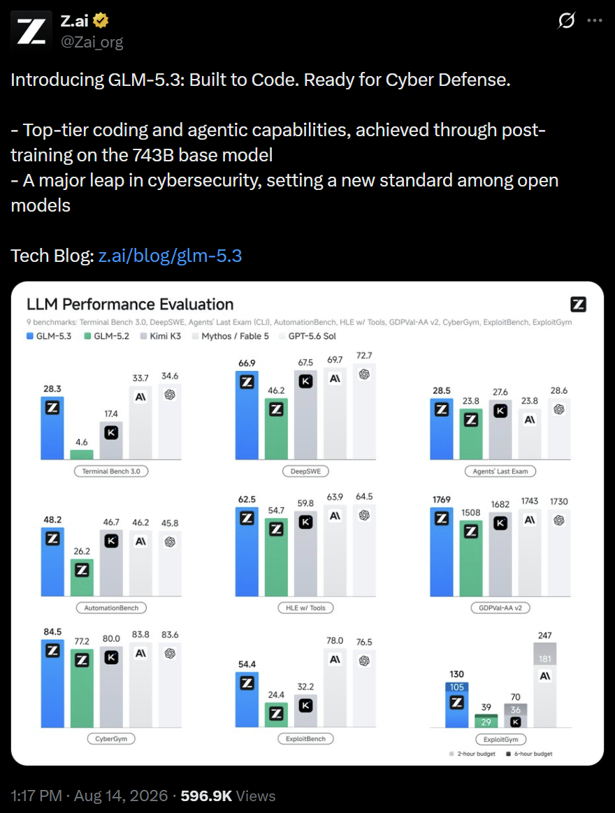
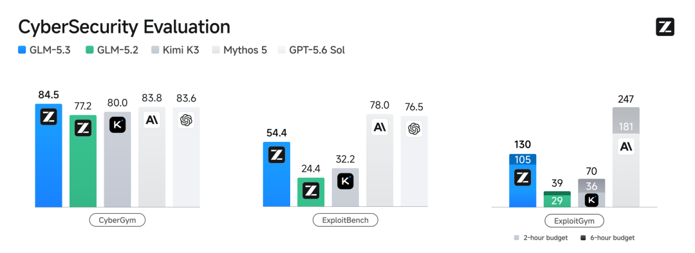
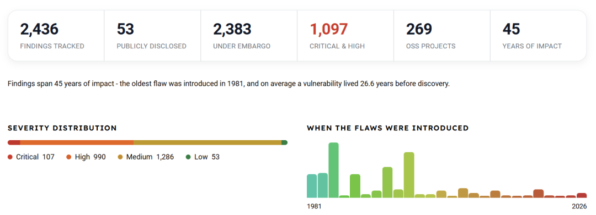
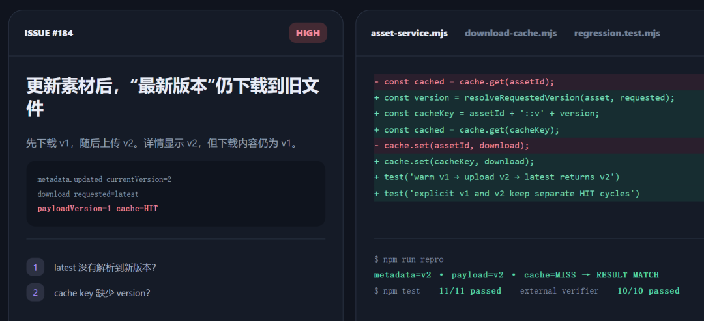
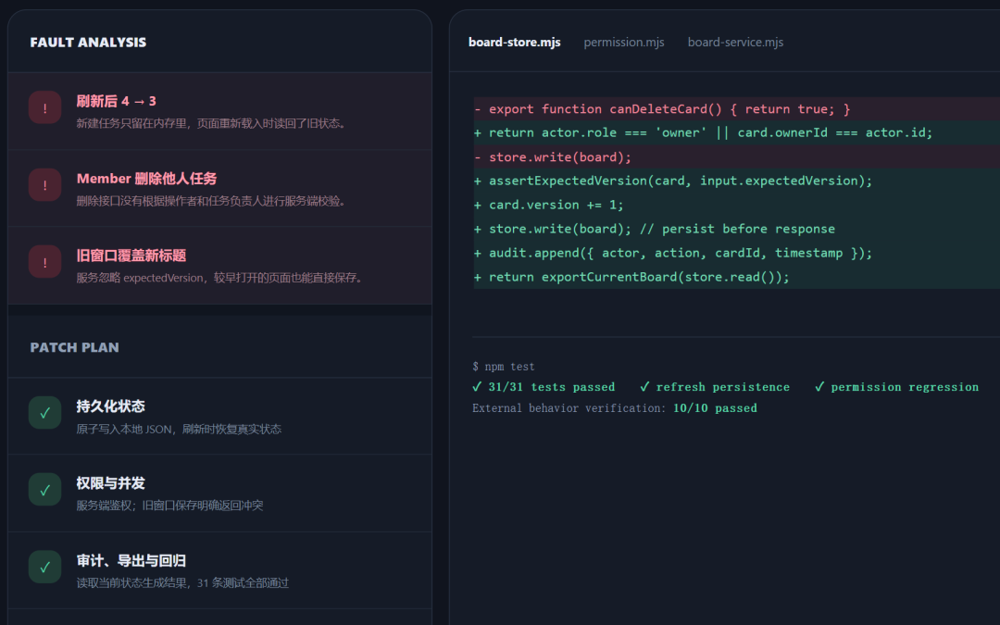
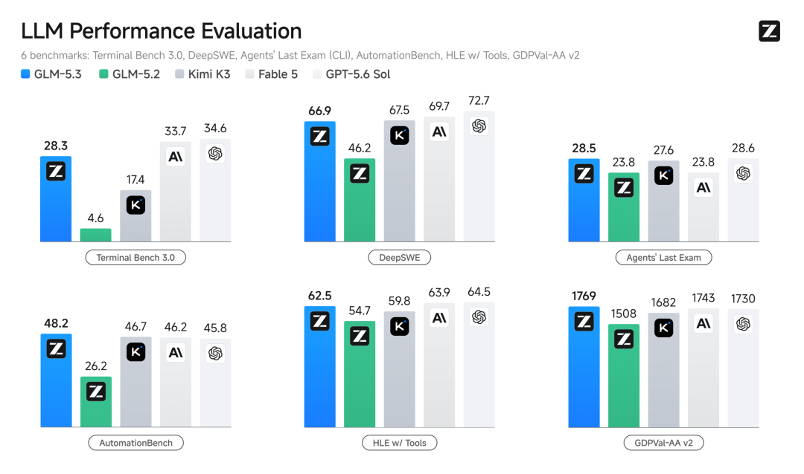
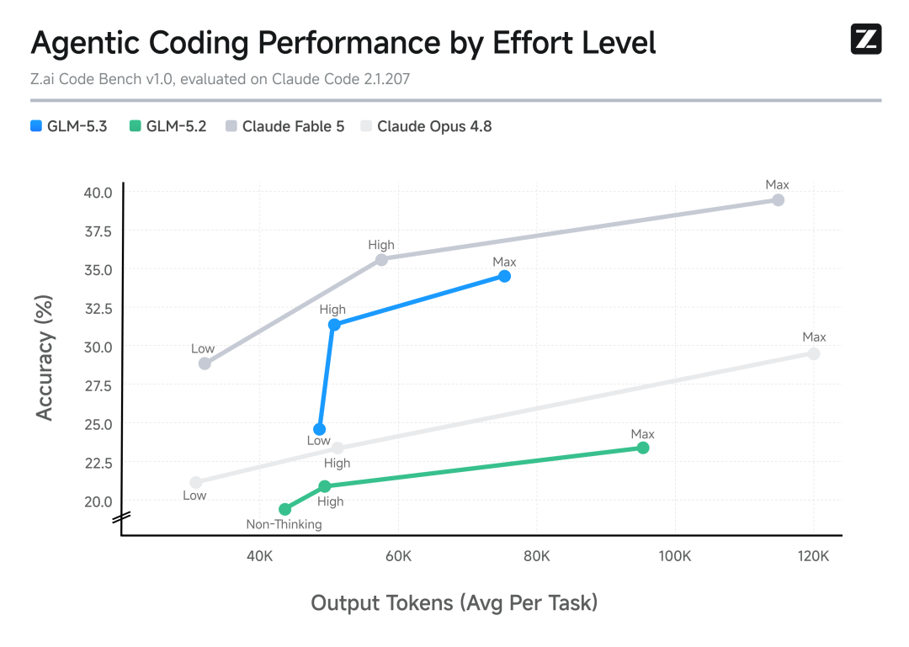

# GLM-5.3 再拆解：真正的问题不是“开源更安全”，而是防守方能不能拿到同等级工具

> **TL;DR:** 这篇微信文章把 GLM-5.3 写成“撕开闭源安全神话”的事件，核心不是 benchmark 排名，而是一个更现实的安全治理问题：攻击者使用 AI 不需要审批，但防守方能不能在自己的代码、日志、内网和敏感资产上部署同等级 AI 工具？GLM-5.3 的 2,436 个漏洞、1,097 个严重及高危、269 个项目覆盖、45 年影响跨度和 `cvd.z.ai` 披露账簿，真正值得看的不是宣传口号，而是 AI 安全能力必须进入可审计、可复核、可 embargo 的披露流程。

- **WeChat source:** [刚刚，GLM-5.3撕开闭源安全神话！0.1倍参数追平Mythos战力](https://mp.weixin.qq.com/s/eO-qusnAD0lj-xcaldRoKQ)
- **Primary source:** [GLM-5.3: Frontier Coding with Emergent Cyber Capabilities](https://z.ai/blog/glm-5.3)
- **Security ledger:** [Z.ai Security Disclosure Ledger](https://cvd.z.ai/)
- **Related repo article:** [GLM-5.3 深度拆解：同一个 743B 基座，Z.ai 把后训练扩展推向 Coding Agent 和网络安全](2026-08-14-zai-glm-53-post-training-cyber-coding-agent.md)
- **Published:** 2026-08-14
- **Tags:** GLM-5.3 / Z.ai / Cybersecurity / Open Security / Coordinated Vulnerability Disclosure / AI Security Agent / Coding Agent

## 1. 这篇不是再写一遍 GLM-5.3 发布稿

仓库里已经有一篇 GLM-5.3 文章，重点是 post-training scaling：同一个 743B base，Z.ai 通过更长程、更真实的 coding / cyber environments，把模型推向 coding agent 和安全任务。

这篇微信文章提供的是另一个角度：**闭源前沿安全模型如果只给少数机构，防守侧会出现能力不对称。**

这个判断有现实基础。安全团队要分析的不是公开玩具题，而是私有代码、生产日志、二进制、内网拓扑、漏洞复现环境和厂商 embargo 信息。很多情况下，把这些材料交给第三方闭源 API 本身就是合规问题。即使闭源模型更强，如果拿不到、不能部署、不能审计、不能接入内网数据，它对大量防守方就是不可用能力。

所以问题不应简化成“开源一定比闭源安全”。更准确的说法是：

> 在攻防 AI 化之后，防守方需要一种可部署、可治理、可审计的高能力模型；否则安全能力会集中在少数有资格访问闭源模型的大机构手里。

## 2. 微信文章的核心事实和需要保留的 caveat

微信文章引用了几个关键信号：

| 项目 | 文中说法 | 需要怎样读 |
|---|---|---|
| 漏洞规模 | 自 GLM-5.2 以来发现 2,436 个漏洞 | 与 Z.ai 披露账簿首页口径一致 |
| 严重性 | 1,097 个 critical / high | 与账簿摘要一致 |
| 覆盖范围 | 269 个项目，横跨内核、浏览器、开源组件、协议 | 账簿给出总体数，单个案例需看公开条目 |
| 时间跨度 | 最早可追溯 45 年 | 账簿摘要也给出 45 年跨度 |
| Benchmark | CyberGym 84.5%，高于 Mythos 5 83.8% 和 GPT-5.6 Sol 83.6% | 这是 Z.ai 官方评测口径；不能等同于所有安全任务全面领先 |
| Exploit 能力 | ExploitBench / ExploitGym 比上一代大幅提升，但仍未追上 Mythos | 这个 caveat 很关键，不能省略 |
| 实战案例 | Cursor、DNS、Microsoft / Kunlun、Neo 等 | 有些细节仍需要厂商公告、CVE 或 ledger 条目公开后才能完全验证 |

这里最容易写过头的是“开源模型已经追平闭源前沿”。如果只看 CyberGym，可以这么说得很激进；但如果看 ExploitBench 和 ExploitGym，Z.ai 自己的图表显示 GLM-5.3 仍落后闭源前沿。更严谨的结论是：

1. GLM-5.3 在白盒漏洞发现和验证任务上已经接近或超过部分闭源前沿结果。
2. 在更深的漏洞利用链任务上，它进步很大，但仍有明显差距。
3. 这已经足够改变防守工具链，因为真实防守的第一步往往是大规模发现、定位、复现、分级和修复。

## 3. CVD 账簿比 benchmark 更重要

这次最值得关注的不是“84.5%”这个数字，而是 `cvd.z.ai`。

原因很简单：当模型能真实发现漏洞，产物就不能停留在 demo、截图和 PR 话术里。它必须进入协调漏洞披露流程：

1. 专家复核。
2. 去重和误报排除。
3. 严重性分级。
4. 厂商联系。
5. CVE / CNVD / CNNVD 等编号流程。
6. embargo 管理。
7. 修复后公开。
8. 不公开可直接利用的攻击代码。

Z.ai 披露账簿当前显示 2,436 个发现，其中 53 个公开、2,383 个未公开，严重及高危 1,097 个，覆盖 269 个开源项目。这个结构比单纯发布“我们发现了很多漏洞”更有价值，因为外部至少可以检查已经公开的部分，并观察 embargo 项目如何逐步释放。

但这里也有一个反向压力：2,383 个 embargo 漏洞不是一张胜利海报，而是一个巨大的协调负担。每个未公开漏洞都意味着厂商、维护者、复现环境、补丁窗口和潜在滥用风险。如果 AI 把漏洞发现吞吐量提高 10 倍，披露和修复流程也必须相应扩容，否则瓶颈会从“发现不了”变成“发现了但处理不过来”。

## 4. “开源的盾”真正解决的是部署权，不是自动安全

微信文章最后把论点落在“最好的盾，必须属于所有人”。这个说法有传播力，但工程上要拆开看。

开放模型确实解决了几个闭源 API 难解决的问题：

| 防守需求 | 为什么开放 / 可本地部署重要 |
|---|---|
| 私有代码审计 | 不必把核心代码库上传给外部 API |
| 生产日志分析 | 日志可能含用户数据、凭证痕迹、内网地址和业务机密 |
| 二进制和固件分析 | 需要大量本地工具链、沙箱、调试器和复现环境 |
| 内网攻防演练 | 模型需要接入受控网络和内部资产，云端 API 常常不可行 |
| 中小企业安全 | 预算和准入门槛低于闭源高阶访问计划 |

但开放不等于自动安全。开放模型也会带来滥用面，尤其当它的 exploit-chain 能力持续增强。Z.ai 也因此没有在发布当天直接放出权重，而是说要在安全评估和 hardening 后再释放。

这个动作本身说明：**开放安全模型的合理路径不是“能力一出来就无限制扩散”，而是“能力、部署权、披露流程、滥用监控和安全加固一起发布”。**

## 5. 从代码审计例子看，GLM-5.3 的价值在“长链路修复”

微信文章里还有几个 Vibe Coding / 产品安全例子：版本化素材库 AssetFlow、团队看板 SprintBoard、3D 智能仓库。它们不一定是公开可复现实验，但作为工作流说明有参考价值。

这些例子共同指向一个事实：安全 agent 的价值不只是发现 bug，而是沿着系统链路追到修复点。

以 AssetFlow 的描述为例，问题不是“按钮坏了”，而是版本化资产在上传、存储、索引、缓存、下载链路之间发生了状态错配：页面显示 v2，下载拿到 v1。模型沿链路检查后，定位到缓存只区分素材 ID，没有区分版本号。

这个类型的问题很典型。静态扫描器可能会漏掉，因为它不是单点语法漏洞；普通单轮 Chat 也很难稳定处理，因为需要理解业务状态机。长程 coding agent 的优势是：

1. 读 UI 行为。
2. 查后端路由。
3. 查存储 schema。
4. 查缓存 key。
5. 构造复现。
6. 修改代码。
7. 跑测试。
8. 验证同类路径。

这就是 GLM-5.3 和普通代码模型的差别所在。它的核心卖点不是“能写函数”，而是能在较长上下文、工具反馈和业务约束下，把一个“能跑但不安全”的原型推向可交付状态。

## 6. 评测应该按任务层级看，而不是只看“第一名”

微信文章强调 GLM-5.3 在六项主流编程评测中拿下开源第一，并在 Z.ai Code Bench High 下用约 5 万 output tokens 达到 31.4%，超过 Claude Opus 4.8 Max 的 29.5% 且后者约 12 万 tokens。

这个对开发者有用，但要按层级读：

| 层级 | 该看什么 |
|---|---|
| 短代码能力 | 普通 benchmark、函数生成、补全质量 |
| 长程工程能力 | Terminal-Bench、Agents' Last Exam、AutomationBench、真实 repo task |
| 成本效率 | 每任务 output tokens、effort level、wall time、失败重试次数 |
| 安全能力 | CyberGym、ExploitBench、ExploitGym、真实 disclosure 结果 |
| 产品可用性 | API contract、thinking effort、IDE / agent harness、权限和日志 |

如果一个模型在长程任务上更便宜、更稳定，即使某些静态榜单不是第一，也可能更适合日常工程 agent。反过来，如果一个模型在安全 exploit 任务上很强，但没有披露流程和访问治理，它也不适合直接放进企业生产环境。

## 7. 真正该问的四个问题

这篇微信文章的姿态很明确：闭源安全能力集中在少数机构，开放模型让防守方重新获得工具。这是一个重要论点，但落到工程实践，需要继续追问四个问题。

第一，**权重什么时候真正可用？**
截至 GLM-5.3 发布初期，Z.ai 的官方口径是权重会在 launch 后两周、安全评估和 hardening 完成后发布。微信文章说“每一个开发者都能部署”，方向上成立，但时间点上要等权重真正放出。

第二，**CVD 账簿如何处理误报和争议？**
公开条目可以外部检查，embargo 条目只能看摘要。未来关键是：误报率、厂商确认率、平均修复周期、撤回机制和复核标准是否公开。

第三，**开放安全模型如何限制滥用？**
安全模型既能帮防守，也可能帮攻击。合理方案不会是简单封锁，也不会是裸奔开放，而是分层访问、日志、用途约束、模型 hardening、输出策略和社区审计。

第四，**防守工具链能不能吸收模型产出？**
AI 发现漏洞只是第一步。真正决定价值的是维护者有没有时间复现、修补、发版、回归测试、通知用户和监测 exploit activity。

## 8. 我的判断

GLM-5.3 这次安全叙事最有价值的部分，不是“0.1 倍参数追平 Mythos”这种 headline，而是它把三件事放到了一起：

1. 一个接近前沿的开放模型能力。
2. 一个持续更新的漏洞披露账簿。
3. 一个面向开发者日常工作流的代码审计入口。

这三者合在一起，才构成“开源的盾”。模型本身只是发动机；真正的防守系统还需要数据边界、运行环境、披露流程、厂商协作和修复闭环。

对安全团队来说，GLM-5.3 的直接启发不是马上把所有漏洞扫描交给 AI，而是开始重构安全工作流：

1. 把模型放进受控环境，不让它越权接触生产资产。
2. 让模型先做 triage、复现、根因定位和补丁建议。
3. 所有高危发现进入人工复核和披露流程。
4. 用测试和日志验证修复，而不是相信模型文字解释。
5. 对模型输出保留审计记录，方便事后追责和复盘。

如果闭源前沿模型代表“少数机构拥有最锋利的矛”，那开放安全模型要证明的不是“我也能当矛”，而是“我能被纳入防守方的日常工程系统”。GLM-5.3 已经把这个方向推到台前。下一步要看的，是权重释放、ledger 透明度、误报处理和真实维护者反馈。

## Sources

1. WeChat source: 刚刚，GLM-5.3撕开闭源安全神话！0.1倍参数追平Mythos战力
   https://mp.weixin.qq.com/s/eO-qusnAD0lj-xcaldRoKQ

2. Z.ai official blog: GLM-5.3: Frontier Coding with Emergent Cyber Capabilities
   https://z.ai/blog/glm-5.3

3. Z.ai Security Disclosure Ledger
   https://cvd.z.ai/

4. Z.ai GLM-5.3 docs
   https://docs.z.ai/guides/llm/glm-5.3
