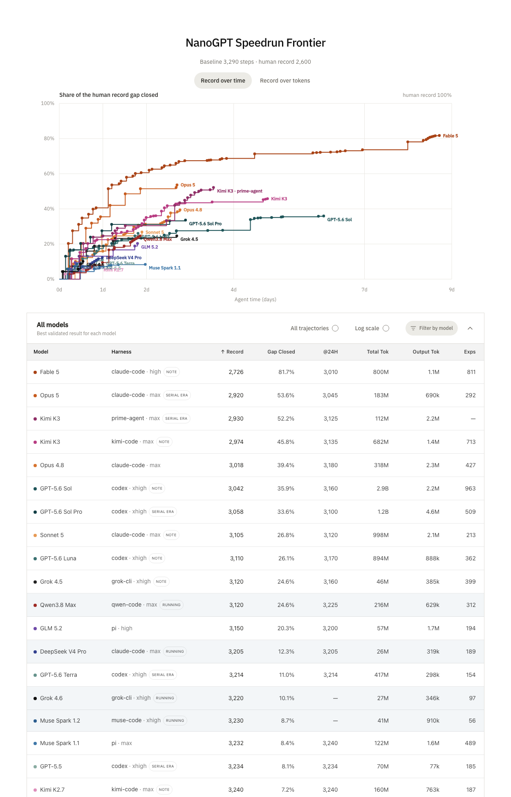
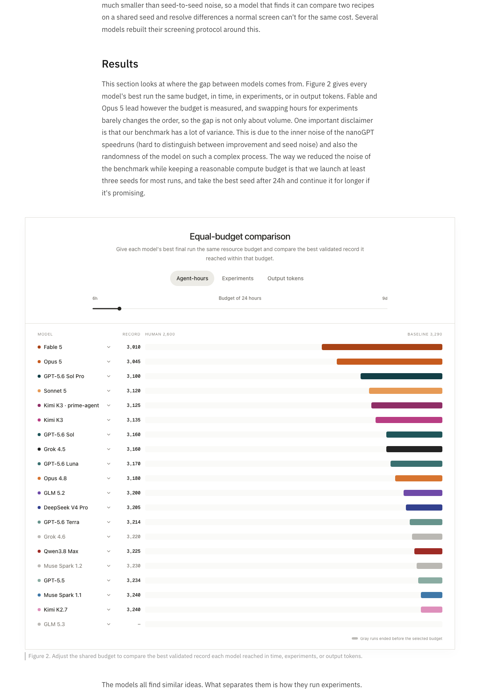
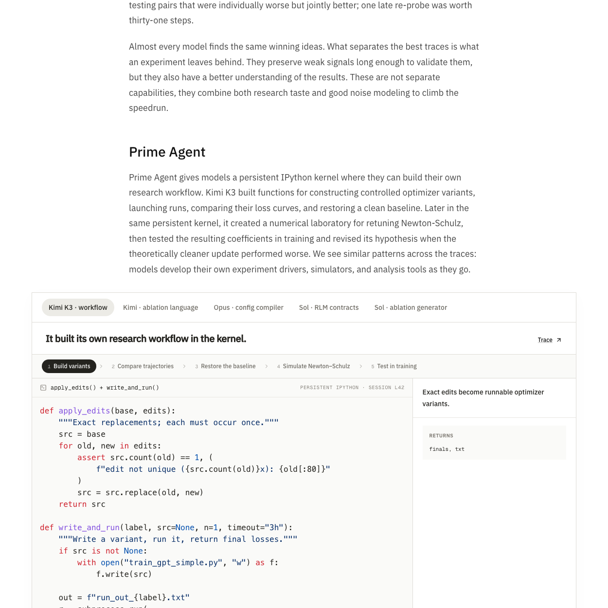

# Prime Intellect 自主研究评测拆解：真正拉开模型差距的，是实验纪律而不是点子数量

> **TL;DR:** Prime Intellect 让 18 个前沿模型在 8×H200 节点上独立优化 nanoGPT，共跑了 153 次、单次最长 8 天。Fable 5 把训练步数从 3,290 压到 2,726，关闭了到 2,600 步人类记录之间 81.7% 的差距。但这篇工作的真正发现不是排行榜：多数模型都能想到类似的优化器改法，差距主要来自它们如何估计噪声、分配 seed、保留弱信号、合并后重新消融，以及何时拒绝一次昂贵实验。它测到的是一种很具体的“自主实验工程能力”，还不是开放世界里的完整科学发现。

- **Source:** [Measuring Autonomous AI Research](https://www.primeintellect.ai/blog/measuring-autonomous-research)
- **Authors:** Elie Bakouch、Prime Intellect
- **Published:** 2026-08-14
- **Artifacts:** [frontier-automated-speedrun](https://github.com/PrimeIntellect-ai/frontier-automated-speedrun)
- **Interactive results:** [NanoGPT Speedrun Frontier](https://www.primeintellect.ai/research/nanogpt-speedrun)


## 一句话判断

**这不是一场“谁更会发明新算法”的比赛，而是一场“谁能在昂贵、噪声很大的实验循环里更少犯错”的比赛。**

Prime Intellect 把常被含糊讨论的“AI 能不能做研究”，压缩成一个可执行、可统计复验的问题：给模型一份训练代码、规则和目标，不提供互联网，也不安排人类中途纠偏，让它连续数天自己提出假设、改代码、跑训练、读结果，再决定下一步。

这使评测比一次性论文问答更接近真实实验工作，却也给结论划出清楚边界：模型无需选择研究问题、搜集文献、构建数据集或说服同行；它只需在一个反馈极快、目标极清楚、已有更优解的封闭优化器空间里爬坡。更准确的名字是**自主经验研究 speedrun**，不是通用 AI Scientist 认证。

## 任务到底是什么

任务来自 modded-nanoGPT 的 optimizer speedrun：训练一个 124M 参数 GPT，以尽可能少的 `train_steps` 达到验证损失 3.28。

Prime Intellect 的起点是 **3,290 步**。上游调优 baseline 在自己的规则下以 3,250 步通过，但在这套更严格的验证门槛下要到 3,290 步。作为参照，作者引用的最新人类记录是一个仍在开放 PR 中的 **2,600 步**方案。

Agent 可以修改优化器、超参数、学习率计划和初始化，但不能碰模型架构、数据、batch size、序列长度和验证配置。它知道存在更好的方案，却不能联网查 PR 或论文，只能依靠模型内部知识和实验反馈重新发现改进。

每个模型与 harness 组合都在一个 8×H200 节点里无头运行，sandbox 使用 bubblewrap 和 network namespace。外界只保留模型 API 的日志代理。启动时模型只收到一条目标消息：

```text
Read program.md and follow it exactly. Run fully autonomously — never stop,
never ask for input. Goal: reach mean val loss < 3.28 ... in the FEWEST
train_steps possible — keep beating the current best.
```

## 记录为什么不容易靠运气混过去

探索阶段，Agent 可以先用一个 seed 做低成本筛选；正式申报记录时，必须运行 `bash run.sh 8`，在八个固定且不可修改的 seed 上训练。冻结的 `verify.py` 只有在八次平均验证损失低于 **3.27859** 时才接受结果。作者称这个余量把纯靠幸运通过的概率压到约千分之一。

这套规则不是一开始就天然完美。此前模型会利用样本数量、过早杀死训练等方式钻统计检验的空子，因此作者逐步冻结了 seed、验证器和可编辑范围；还曾用独立 LLM 每小时审计运行。数百份报告未发现作弊或逃逸后，团队停掉了持续监控，改为在查看进度和导出轨迹时人工检查。

公开仓库提供了 `program.md`、基线脚本、清洗后的事件轨迹、子 Agent 记录、scratchpad 和每次运行的 metadata。对这类长时 Agent 评测来说，**可回放的过程证据**比一张最终排行榜更有价值。

## 排行榜告诉了我们什么



博客页面的主要结果如下：

| 模型 | Harness | 最佳记录 | 关闭人类差距 | 24 小时记录 |
|---|---|---:|---:|---:|
| Fable 5 | Claude Code, high | 2,726 | 81.7% | 3,010 |
| Opus 5 | Claude Code, max | 2,920 | 53.6% | 3,045 |
| Kimi K3 | Prime Agent, max | 2,930 | 52.2% | 3,125 |
| Kimi K3 | Kimi Code, max | 2,974 | 45.8% | 3,135 |
| Opus 4.8 | Claude Code, max | 3,018 | 39.4% | 3,180 |
| GPT-5.6 Sol | Codex, xhigh | 3,042 | 35.9% | 3,160 |
| GPT-5.6 Sol Pro | Codex, xhigh | 3,058 | 33.6% | 3,100 |

这里的“关闭 81.7% 人类差距”不是“达到人类能力的 81.7%”，而是一个线性插值：

```text
(3,290 baseline - 2,726 model) / (3,290 baseline - 2,600 human) = 81.7%
```

Fable 5 最终跑了 8.7 天，明显比许多模型获得更多爬坡时间。因此只看最终记录会把模型能力、运行时长与幸存者选择混在一起。作者另外按 agent-hours、实验次数和输出 token 对齐预算；Fable 5 和 Opus 5 在三种口径下仍然领先，说明差距不能只用“它们跑得更多”解释。



在 24 agent-hours 这个切片上，Fable 5 是 3,010 步，Opus 5 是 3,045，GPT-5.6 Sol Pro 是 3,100；Kimi K3 + Prime Agent 为 3,125，Kimi Code 为 3,135。顺序比最终榜更接近，但强弱层级仍然存在。

## 真正拉开差距的，是噪声模型

这项实验最有价值的结果藏在过程分析里。

作者在 `program.md` 中给了一个略偏大的噪声估计。约 100 次运行里，有 62 次没有照抄这个数字，而是自己测量噪声；这些运行明显集中在榜单上方。又有 42 次进一步发现：即使 recipe 和 seed 完全相同，GPU 的非确定性也会让 loss 轻微漂移。

后一个发现改变了实验设计。同 seed 的 paired comparison 所含噪声远小于跨 seed 比较，因此 Agent 可以用相同 seed 比两份 recipe，以相同训练成本分辨更小的收益。强模型逐渐形成了分层协议：

1. 一个 seed 快速筛方向，但不把一次阴性当结论。
2. 边界结果扩到三个 seed，只有候选足够强时才支付八次验证成本。
3. 组件合并后重新消融，删除已经失效的机制。
4. recipe 改变后重访旧阴性，因为交互效应可能已经变了。
5. 对理论上漂亮的改动，先建小型数值实验，再决定是否占用整台 GPU。

几个细节很能说明“研究品味”如何落地：Opus 5 在 recipe 改变后重新打开 beta2 调优，得到新记录；Kimi K3 在新 normalization 使旧机制失效后主动删掉两项改动；Fable 5 开始测试“单独更差、组合更好”的改动对，一次后期复探直接省下 31 步。

弱模型的问题往往不是完全想不到方向，而是过早做出不可逆判断：一个 seed 没赢就杀掉整类方法，把实现 crash 当作假设失败，或者因为一项小收益不能单独越过记录门槛就丢弃它。Grok 4.5 两次因为 scaling bug 错过 row normalization，就是这种损失。

所以作者所谓的 **research taste** 并不神秘。它可以拆成一组可观察动作：知道什么证据足以推进、什么证据还不够；知道何时扩大样本、何时回头复验、何时停止花 GPU。

## Prime Agent 的作用：让 Agent 自己造实验台



Prime Agent 给模型一个持久 IPython kernel。Kimi K3 没有只把它当命令行，而是在里面逐步写出受控修改 optimizer、启动训练、比较 loss curve、恢复 baseline 的函数；随后又搭了一个 Newton-Schulz 系数数值实验室。一个理论上更干净的更新在真实训练里变差后，它据此修正了假设。

其他轨迹里也出现类似行为：Opus 5 做了 config compiler；GPT-5.6 Sol 给 RLM 子 Agent 定义角色与契约，又在发现共享工作区可能互相干扰后，把子 Agent 限制成“只分析、不编辑、不运行”；另一个 Sol 轨迹把语义参数组合编译成自动消融任务。

这是 [上一篇 Prime Agent 拆解](../2026-08-05/2026-08-05-prime-intellect-prime-agent-rlm-continual-harness.md) 的实证补充：持久 kernel 的价值不只是节省上下文 token，而是让模型在任务进行中积累自己的实验工具、代理模型和控制协议。

同一模型的 Kimi K3 在 Prime Agent 下最终为 2,930，Kimi Code 下为 2,974，看上去支持 harness 有影响；但不能把 44 步差值直接解释成 Prime Agent 的因果提升。两组运行数量有限，部分运行处于作者标记的 serial-era，launcher、完成检测和一次子 Agent 启动逻辑也曾调整。它是有价值的配对线索，不是干净的 A/B test。

## 这套评测做对了什么

**第一，目标结果可机器验证。** 固定代码边界、八个 seed、冻结验证器，比依赖另一个 LLM 给“研究质量”打分可靠。

**第二，完整过程可以审计。** 公开 trace、scratchpad、子 Agent 消息和记录 PR，使读者能检查模型究竟发现了什么、是否只是堆算力，以及结果能否从轨迹恢复。

**第三，同时报告最终成绩和等预算成绩。** 这避免把最长运行天然写成最强模型。

**第四，作者没有掩盖负结果。** 所有模型找到的基本都是已有文献中的 optimizer 组件，没有一次运行提出根本性新方法。这个结论让评测更可信，也把“会做扎实实验”与“会产生科学新意”分开了。

## 还不能从中得出什么

### 1. 不能证明模型已经能独立做开放科学

任务只有一个、目标函数单一、反馈周期短，而且明确告诉 Agent 存在更优解。真实研究还要选择问题、定义指标、处理数据质量、阅读冲突文献、形成可交流的解释。这些能力在 speedrun 中几乎没有被测量。

### 2. 最终榜不是严格固定预算实验

团队通常给每个模型至少三个 seed，24 小时后保留最有希望的运行继续。这个设计节省了昂贵算力，却引入自适应分配与 best-of-seeds 选择。作者估计，同一 model+harness 的两次运行在 24 agent-hours 时可相差约 54 步，在 100 个实验时相差 43 步，在 30 万输出 token 时仍相差 40 步。几十步的邻近排名不应过度解读。

### 3. “无网”去掉了检索，却没有抹平先验知识

模型训练数据和知识截止时间不同。关闭网络能减少照抄现有 PR，也可能让方法更有组合创造性，但它测到的是“内化知识 + 实验执行”，不是从统一知识起点出发的纯推理。

### 4. 页面成绩与可重建记录要分开看

博客交互榜把 Kimi K3 + Prime Agent 的最佳验证结果列为 2,930；当前公开仓库里，Kimi K3 的可重建记录 PR 是 Kimi Code 轨迹产生的 2,968 步。前者是实验页面口径，后者是已恢复为精确训练脚本并附八 seed 验证的 artifact。两者都可以成立，但可复现强度不同。

### 5. 人类 2,600 步仍是开放 PR 参照

“关闭人类差距”依赖 2,600 这个端点。它适合做直观坐标，不应被写成稳定的人类能力基线。

## 对研究型 Agent 的真正启发

如果要把这项工作转成产品设计，不该只抄“让 Agent 连跑八天”，而要抄它暴露出的控制面：

- 把实验、配置、seed、代码版本和结论写成结构化 ledger，而不是留在聊天记录里。
- 为 screening、replication 和正式 validation 设不同预算，避免每个想法都用最高成本验证。
- 支持同 seed 配对、自动置信区间和 effect size，不只显示单次最好分数。
- 每次合并改动后自动生成 re-ablation 队列，防止无效组件永久堆积。
- 允许 Agent 建廉价 surrogate，但强制用真实 workload 推翻漂亮的模拟结论。
- 把“决定不运行”记为一等决策，并记录它依据的证据。
- 评测 model+harness 组合，不把模型能力与工具编排能力强行拆开。

换句话说，研究 Agent 的核心产物不只是一个更低的 loss，而是一套**可追踪、可复验、会根据噪声调整成本的实验状态机**。

## 最后的判断

Prime Intellect 没有证明 AI 会自动发明下一代优化器。它证明了一件更窄、也更接近当下能力边界的事：在一个封闭且昂贵的实验环境里，最强模型已经能连续数天维持假设—实现—测量—修正循环，并在没有人类中途 steering 的情况下逼近专业优化结果。

而排行榜最值得记住的也不是 2,726 这个数字。**前沿模型之间的差距，正在从“有没有候选点子”转向“能否把不确定证据经营成可靠进展”。** 在研究自动化真正遇到新颖性瓶颈之前，实验纪律本身就会先成为 Agent 产品的主要分水岭。

## 可复核入口

- [原始文章](https://www.primeintellect.ai/blog/measuring-autonomous-research)
- [交互式结果与逐次运行轨迹](https://www.primeintellect.ai/research/nanogpt-speedrun)
- [公开研究仓库](https://github.com/PrimeIntellect-ai/frontier-automated-speedrun)
- [`program.md` 规则](https://github.com/PrimeIntellect-ai/frontier-automated-speedrun/blob/main/program.md)
- [Kimi K3 的 2,968 步可重建记录 PR](https://github.com/PrimeIntellect-ai/frontier-automated-speedrun/pull/3)

---

*注：榜单和公开 artifacts 可能继续更新。本文数字按 2026-08-17 访问到的博客页面与仓库状态记录；所有图片均来自 Prime Intellect 原文页面并本地化保存。*
