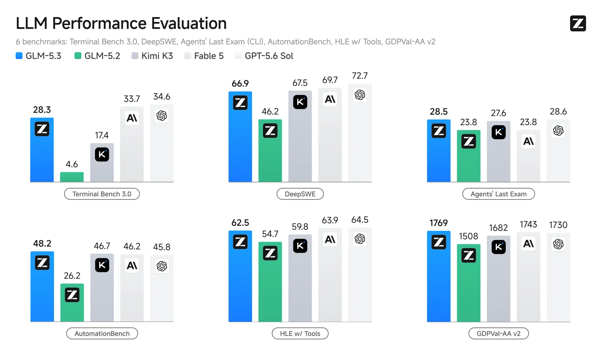
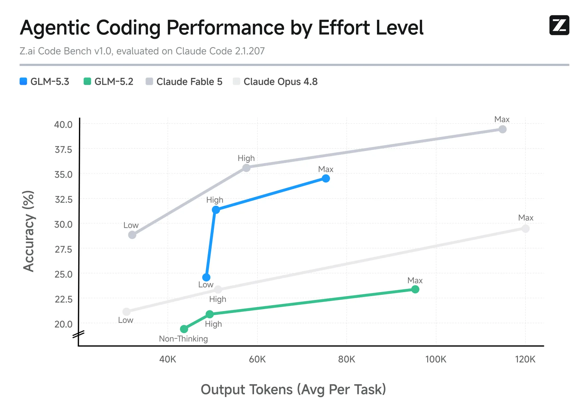
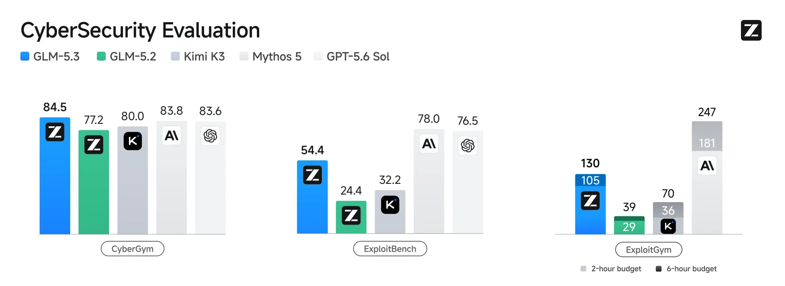

# GLM-5.3 Deep Dive: Z.ai Pushes the Same 743B Base Toward Coding Agents and Cyber Defense Through Post-Training

> **TL;DR:** Z.ai launched GLM-5.3 on 2026-08-14 with the framing "Built to Code. Ready for Cyber Defense." The important detail is not a new larger base model. Z.ai says GLM-5.3 uses the same 743B base as GLM-5.2, and that the gains come from post-training scaling. The model is being pushed from long-horizon coding into realistic engineering workflows, vulnerability discovery, and exploitation-chain reasoning. One boundary matters: the weights were not released on launch day. Z.ai says they will be released two weeks after launch once safety evaluation and hardening are complete. As of 2026-08-15, the docs still say the GLM-5.3 API is coming soon, while GLM Coding Plan users already have access.

- **X source:** [Z.ai announcement](https://x.com/Zai_org/status/2088132965922476159?s=20)
- **Tech blog:** [GLM-5.3: Frontier Coding with Emergent Cyber Capabilities](https://z.ai/blog/glm-5.3)
- **Docs:** [GLM-5.3 overview](https://docs.z.ai/guides/llm/glm-5.3)
- **Security ledger:** [Z.ai Security Disclosure Ledger](https://cvd.z.ai/)
- **Published:** 2026-08-14
- **Topic:** Coding agents / post-training scaling / cyber capability / long-horizon RL / open-weight release caveats


## The Short Read

GLM-5.3 continues the GLM-5.2 direction, but the center of gravity moves from "can long context keep an agent stable?" to "can post-training environments push a model into real engineering and security work?"

This repo already covered GLM-5.2. That article focused on 1M context, IndexShare, SAO, Slime, anti-hacking, and inference serving: the infrastructure needed to keep long-running agents from falling apart.

GLM-5.3 is narrower and sharper. Z.ai does not present a new architecture story. It says: **Scaling post-training is all we did.** The same base model is trained with more environments, more diverse tasks, and more compute, with the gains showing up in coding, agentic workflows, and cyber defense.

If that framing holds, the competition is moving from "who has the bigger base model?" to "who can build executable, verifiable, scalable training environments?"

## The Launch-Day Caveat: Open Weights, But Not Yet

The X post says GLM-5.3 has top-tier coding and agentic capabilities, achieved through post-training on the 743B base model. The blog also says Z.ai will release the weights, but only two weeks after launch, once safety evaluation and hardening are complete.

So GLM-5.3 should not be described as already open and locally deployable. The more precise state is:

| Item | Launch status |
|---|---|
| GLM Coding Plan | Rolled out to subscribers |
| ZCode / coding agents | Officially recommended across ZCode, Claude Code, OpenCode, and others |
| Standard GLM-5.3 API | Docs say coming soon |
| Local weights | Promised two weeks after launch |
| Context / output | Docs list 1M context and 128K maximum output tokens |

For users, this matters. The release is currently product/subscription-first, with weights delayed, rather than a Hugging Face model-card-first launch.

## The Benchmark Story Is Really About Environments

Z.ai provides a large set of public benchmark numbers. They are useful, but the ranking alone is not the story.



The clearest GLM-5.2 to GLM-5.3 deltas are:

| Benchmark | GLM-5.2 | GLM-5.3 | Signal |
|---|---:|---:|---|
| Terminal-Bench 3.0 | 4.6 | 28.3 | Large jump on terminal-style long-horizon tasks |
| DeepSWE v1.1 | 46.2 | 66.9 | Stronger containerized software engineering |
| Agents' Last Exam CLI | 23.8 | 28.5 | Improvement on general agent tasks |
| AutomationBench v1.0.6 | 26.2 | 48.2 | Major automation gain |
| CyberGym | 77.2 | 84.5 | Better vulnerability discovery benchmark result |
| ExploitBench | 24.4 | 54.4 | More than 2x on exploitation reasoning |
| ExploitGym 2h / 6h | 29 / 39 | 105 / 130 | More exploitation tasks completed under time budgets |

These numbers need caveats. Many of the official footnotes involve specific harnesses: Claude Code 2.1.207, mini-swe-agent, official evaluators, different context windows, output limits, timeouts, anti-cheating rules, and container setups. Model capability, agent harness, tool permissions, verifier design, and timeout policy are all entangled.

Still, the pattern is clear: GLM-5.3's gains land mostly on execution-heavy, long-horizon, tool-using tasks rather than short coding prompts.

## The Value and Risk of Z.ai Code Bench

Z.ai also introduces its private Z.ai Code Bench for coding agents in realistic user scenarios. It evaluates two dimensions: end-to-end task completion rate and fine-grained checklist accuracy.



The official blog reports several strong numbers:

- at Max effort, GLM-5.3 reaches 34.5% with roughly 75K output tokens per task;
- GLM-5.2 reaches 23.4% with roughly 96K output tokens per task;
- at High effort, GLM-5.3 reaches 31.4% with roughly 50K output tokens;
- Claude Opus 4.8 is shown at 29.5% with roughly 120K output tokens;
- GLM-5.3 still trails Claude Fable 5, which reaches 39.5% at Max effort.

The useful part is not the simple win/loss framing. A private benchmark cannot be externally reproduced, but it may map more closely to product usage. What matters is that Z.ai is plotting **accuracy, output token cost, and effort level** together.

The next stage for coding agents is not just "the model is smarter." It is whether an agent can move a task to a deliverable state under explicit token, time, cost, and verification constraints.

## Cyber Capability: From Bug Finding To Exploitation Chains

The cyber section is the part of GLM-5.3 that most deserves separate treatment. Z.ai says it added vulnerability discovery data and environments into post-training, and that the capability developed faster than expected. The model did not merely improve at identifying isolated flaws; it began reasoning across multiple stages of exploitation.



The three reported benchmark groups target different stages:

| Benchmark | What it measures | Official GLM-5.3 result |
|---|---|---:|
| CyberGym | White-box source-code vulnerability identification and validation | 84.5% |
| ExploitBench | Deeper reasoning about real vulnerabilities and exploitation | 54.4% |
| ExploitGym | Exploitation tasks under 2h / 6h budgets | 105 / 130 |

This is where restraint matters. GLM-5.3 is slightly ahead of Mythos 5 and GPT-5.6 Sol on CyberGym, but still well behind the closed frontier on ExploitBench and ExploitGym. Z.ai says the same thing: the deeper the benchmark sits in the exploitation chain, the larger the remaining gap.

The direction is the important signal. Cyber capability is not just "the model knows CVEs." It shares the same structure as long-horizon agent training: search code, form hypotheses, run validation, modify payloads, observe feedback, and iterate. That is why it is both useful and risky.

## The Security Disclosure Ledger Should Not Be Ignored

The blog includes a concrete real-world claim: since GLM-5.2, Z.ai has worked with several security teams in China to run its models against real-world codebases. After expert review, screening, and deduplication, the models reportedly identified 2,436 vulnerabilities across 269 projects; the disclosure ledger currently marks 1,097 of them as critical/high.

Z.ai has also launched a [Security Disclosure Ledger](https://cvd.z.ai/). The current page shows:

| Metric | Count |
|---|---:|
| Findings tracked | 2,436 |
| Publicly disclosed | 53 |
| Under embargo | 2,383 |
| Critical and high | 1,097 |
| OSS projects | 269 |
| Years of impact | 45 |

This ledger is more important than a single benchmark score. Once a cyber agent can find real vulnerabilities, the key question becomes disclosure workflow: expert review, deduplication, CVE assignment, vendor coordination, embargo handling, abuse risk, and audit records.

In other words, GLM-5.3's cyber release is not only a capability demo. It connects model output to a disclosure pipeline. That pipeline still needs humans and institutional guardrails, but the direction is right: security-agent outputs cannot remain in demos; they need responsible disclosure infrastructure.

## Slime: Turning Training Environments Into A Dataflow

GLM-5.3 continues to build on Z.ai's open-source post-training framework [slime](https://github.com/THUDM/slime). The blog says slime uses Megatron on the training side and SGLang on the rollout side, keeping training, rollout, and the data buffer in one dataflow.

The product meaning is clear: long-horizon RL is no longer just "train on a batch of prompts." Math, code, sandboxes, verifiers, and agentic environments become data-generation modules plugged into the training loop.

GLM-5.3 also mentions several engineering optimizations:

- top-p mask, top-k OPD, and full-vocabulary OPD;
- R3-style setups and training-rollout logprob alignment;
- average logprob difference controlled at the `1e-7` level;
- local storage as an extra cache layer;
- dynamic teacher switching and prefetch for multi-teacher OPD;
- joint scheduling and load balancing between the router and slime;
- more than 2.3x end-to-end RL training throughput improvement for long-horizon coding RL tasks.

These details are not launch-tagline material, but they determine whether "more realistic training environments" can actually scale. Without this layer, post-training scaling gets stuck on environment construction and rollout cost.

## API Migration: Thinking Can No Longer Be Disabled

For developers, GLM-5.3 also changes the API contract. The docs say it supports three thinking effort levels:

- `low`
- `high`
- `max`

But `thinking.type: "disabled"` is no longer supported. Existing apps that disable thinking need to migrate to:

```json
{
  "model": "glm-5.3",
  "thinking": { "type": "enabled" },
  "reasoning_effort": "low"
}
```

Then they can change the model ID. Z.ai explicitly says the request will fail otherwise.

This reinforces a broader trend: reasoning effort is now an API contract, a cost-control knob, and a scheduling interface. For coding agents, `max` is recommended. For general integrations, `low` may be the safer migration starting point.

## Lessons For Agent Products

GLM-5.3 gives agent-product teams five practical lessons:

1. **Environments matter more than problem sets.** Capability is pushed by executable, verifiable, realistic long-horizon environments, not just more coding puzzles.
2. **Evaluation has to include cost.** Output tokens, effort level, timeout, harness, and verifier design are part of the capability picture.
3. **Cyber capability needs a workflow.** Security-agent outputs must flow into disclosure ledgers, expert review, and embargo processes.
4. **Open weights do not mean immediate usability.** Even after release, a 743B-class model is a serious serving-infrastructure problem.
5. **Thinking is a product knob.** Reasoning effort affects price, latency, success rate, and migration risk.

If GLM-5.2 asked how an agent can work longer without losing stability, GLM-5.3 asks how agents can be trained and evaluated in more realistic, more dangerous, longer-chain environments.

## Bottom Line

GLM-5.3 is less a new-base-model launch than a progress report on post-training infrastructure.

It pushes the same 743B base further into long-horizon coding and cyber defense. The numbers are strong, but the real variables are environments, verifiers, anti-cheating systems, disclosure workflows, and cost control. The next open-model frontier may be determined less by parameter count and more by who can continuously manufacture high-quality, verifiable, hard-to-game training environments that look like real work.
