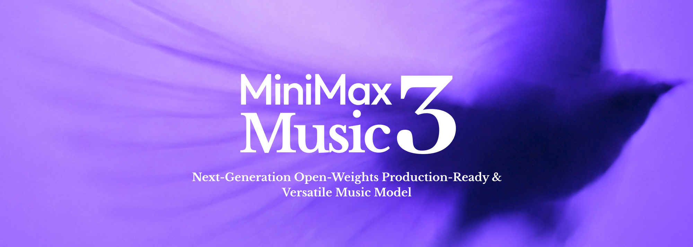

# MiniMax Music 3 Deep Dive: AI Music Is Moving From Short Clips to Five-Minute Song Engineering

> **TL;DR:** MiniMax Music 3 is not just another text-to-song demo. MiniMax has packaged complete-song generation as an open model entry point with local serving, structured prompting, and an agent-ready prompt skill. The system uses an 8B Global LLM for long-range musical structure, a 0.6B Local LLM for frame-level acoustic detail, then synthesizes 32 kHz, 16-bit stereo WAV audio through Flow Matching and Flow-VAE from continuous hidden states. The bigger signal is that AI music is moving from “generate a song-like clip” toward “generate a controllable, section-aware, serviceable full song.”

- **GitHub:** [MiniMax-AI/MiniMax-Music3](https://github.com/MiniMax-AI/MiniMax-Music3)
- **Demo:** [MiniMax Music 3 Demo](https://minimax-ai.github.io/music3-demo/)
- **Model:** [MiniMaxAI/MiniMax-Music3 on Hugging Face](https://huggingface.co/MiniMaxAI/MiniMax-Music3)
- **License:** [MiniMax-Music3 Community License](https://huggingface.co/MiniMaxAI/MiniMax-Music3/blob/main/LICENSE)
- **Published context:** GitHub repo created on 2026-08-11 and pushed on 2026-08-14
- **Tags:** MiniMax Music 3 / AI Music / Open Model / Hybrid-LM / Flow Matching / Flow-VAE / Music Prompt Engineering / Agent Skill



## 1. The One-Line Read

MiniMax Music 3 is easy to misread as “Music 2.6 with better sound quality.” The repository suggests something more structural: model weights, serving instructions, prompt tooling, a demo, and architecture notes are bundled into one open developer entry point.

That continues the earlier MiniMax Music 2.6 story. Music 2.6 emphasized creator workflow: faster feedback, stronger structural control, Cover, and several Music Skills. Music 3 pushes the question deeper: if music generation is going to enter local deployment and product integration, the model has to understand long-form structure, preserve vocal identity, maintain arrangement development, and convert vague musical intent into a more stable production brief.

So the real keywords are not simply “sounds better.” They are three engineering questions:

1. **Long-range structure:** how does a five-minute song avoid falling apart?
2. **Acoustic detail:** how do vocal articulation, instrument texture, and stereo continuity survive compression through tokens?
3. **Control interface:** how does a user’s short taste description become executable Global Metadata, Vocal Details, and Arrangement?

## 2. This Is Not Only a Web Product. It Is a Deployable Model Entry Point

The README positions MiniMax Music 3 as a high-performance music generation model for complete songs up to five minutes long. It takes two complementary inputs:

| Input | Role |
|---|---|
| `input` / lyrics | The words to be sung, optionally with section tags such as `[Verse]`, `[Chorus]`, and `[Bridge]` |
| `instructions` / music description | Style, emotional progression, vocal performance, instrumentation, arrangement, and production profile |

The output is 32 kHz, 16-bit stereo WAV. The official example exposes generation through SGLang-Omni with a speech-API-style `/v1/audio/speech` endpoint: lyrics in `input`, music description in `instructions`, and `response_format` set to `wav`.

That matters. MiniMax is not only placing the capability behind a consumer demo page. It provides:

1. A Hugging Face weight download path.
2. An SGLang-Omni serving command.
3. A generation request shaped like a familiar speech endpoint.
4. An installable `music-caption-rewriter` skill.

In other words, the product imagination is not merely “try a song on the website.” It is “tools, agents, and content pipelines can call music generation as a service.”

## 3. Hybrid-LM Separates Song Structure From Acoustic Detail

The core architecture is called **Hybrid-LM**. Rather than asking one model layer to handle every time scale at once, MiniMax splits the problem hierarchically:

| Module | Scale | Responsibility |
|---|---:|---|
| Global LLM | 8B | Predicts the first RVQ codebook and models long-range musical semantics and structure |
| Local LLM | 0.6B | Predicts the remaining acoustic codebooks within each frame |
| Flow Matching | 2.4B | Generates Flow-VAE latents from fused continuous hidden states |
| Flow-VAE Decoder | 123M | Decodes into 32 kHz stereo audio |

The intuition is straightforward: a complete song has both large-time-scale and small-time-scale problems.

The large scale includes section order, verse-chorus contrast, bridge transitions, emotional build, melodic recurrence, and vocal identity over time. The small scale includes articulation, breath, consonants, drum transients, guitar picking, reverb tails, stereo position, and instrument texture.

If all of that is forced through one flat token-prediction task, the model can easily trade one axis for another: stable structure with blurry sound, or impressive local texture with a collage-like song form. Hybrid-LM is MiniMax’s answer: let the 8B Global LLM stabilize where the song is going, then let the 0.6B Local LLM fill in frame-level acoustics.


## 4. Why Continuous Hidden-State Synthesis Matters

Many audio generation systems represent sound through discrete audio tokens or RVQ codebooks. Discretization is useful: it turns audio into a sequence-modeling problem that resembles language modeling. But music contains a lot of delicate continuous information, especially around vocals and instrumental texture.

One key design choice in MiniMax Music 3 is that final synthesis does not rely only on discrete RVQ tokens. The system fuses the final hidden states of the Global and Local LLMs, then uses Flow Matching and Flow-VAE to decode audio.

The path can be summarized as:

```text
Global / Local LLM hidden states
        -> hidden-state fusion
        -> Flow Matching
        -> Flow-VAE latent
        -> Flow-VAE Decoder
        -> 32 kHz stereo audio
```

The underlying bet is that hidden states retain richer continuous information than discrete tokens alone. That matters for vocal articulation, instrumental texture, and temporal continuity. In music, those are not minor polish details. Whether a singer feels natural, whether an arrangement breathes, and whether transitions feel abrupt often depends on exactly the detail that aggressive tokenization can erase.

This also explains why the README notes that Flow-VAE is adapted from MiniMax Speech but retrained for music’s dynamic range and spectral characteristics. A speech model can focus on intelligibility. A music model also has to handle rhythm, harmony, stereo space, stacked instruments, and emotional tension.

## 5. The Prompt Skill Is the Most Agent-Native Part

One of the most interesting pieces in the repository is the `music-caption-rewriter` skill.

It does not merely beautify a prompt. It converts a short music description into a structured caption with three sections:

| Caption section | Content |
|---|---|
| Global Metadata | Genre, subgenre, BPM or tempo range, key/scale, emotional progression, listening scenario, production profile |
| Vocal Details | Vocal gender, timbre, performance style, harmonies, backing vocals, vocal effects |
| Arrangement | Primary and secondary instruments, section-level evolution, groove, bass, percussion, textures, spatial effects |

This is more important than it looks. The hard part of music generation is not that users lack adjectives. It is that a single natural-language prompt often mixes style, emotion, section plan, instruments, tempo, vocals, reference context, and exclusions into one unstructured blob.

The skill turns that blob into something closer to a producer’s brief. Section tags such as `[Intro]`, `[Verse]`, `[Chorus]`, `[Bridge]`, `[Instrumental]`, and `[Outro]` can become an arrangement timeline instead of being treated as plain text.

This mirrors the recent trend in AI video prompt guides: a prompt is no longer a magic sentence. It is an executable production brief. Here the objects are not camera motion, characters, and lighting, but genre, vocals, groove, instrument lifecycle, and section-level energy arc.

## 6. The Usability Boundary: This Is Not Yet a Lightweight Consumer Tool

MiniMax Music 3 provides a local serving path, but the deployment bar is still high. The README lists several practical constraints:

| Constraint | Current state |
|---|---|
| GPU | Inference requires two CUDA GPUs |
| Streaming | Only non-streaming generation is currently supported |
| Text prompt | Tokenized text prompt is limited to 5,000 tokens |
| Audio generation | Limited to 9,000 acoustic frames |
| Control guarantee | Section tags and descriptions provide generative control, not strict symbolic guarantees |

These constraints make Music 3 more suitable for researchers, tool builders, and GPU-equipped creative teams than for ordinary local one-click use.

The last line is especially important. Section tags are not a MIDI arranger, and music descriptions are not DAW automation lanes. They offer probabilistic control, not symbolic enforcement. You can ask for a wider chorus, a lower-energy bridge, or harmonies in the final chorus. You should not expect beat-accurate obedience like an editable project file.

## 7. Read the License Carefully

The Hugging Face model uses the MiniMax-Music3 Community License. It allows use, copy, modification, merging, publishing, distribution, sublicensing, and redistribution, but with several practical conditions:

1. Copyright and license notices must be preserved.
2. Usage must follow laws, regulations, and the Acceptable Use Policy, especially around third-party intellectual property.
3. Commercial products or services using the software must prominently display “MiniMax-Music3” in the user interface.
4. If annual aggregate revenue from relevant products or services exceeds $20 million, separate prior written authorization from MiniMax is required.
5. Hosted products or services that let third parties generate outputs must maintain reasonable safeguards against prohibited use and infringing outputs.

This is not a minimal Apache/MIT-style license. It leaves significant room for personal research and smaller product experiments, but commercial music products, API wrappers, and large-scale generation platforms need to design for attribution, revenue thresholds, safety, and output governance from day one.

## 8. My Read: AI Music Competition Is Moving Toward the Engineering Control Plane

The real signal in MiniMax Music 3 is not just that it can generate five-minute songs. It is that MiniMax decomposes music generation into several engineering layers:

1. **Open weights:** developers can evaluate, deploy, and adapt the model in their own environments.
2. **Serving interface:** music generation can enter APIs, agents, and automated pipelines.
3. **Structured prompting:** musical intent becomes a production brief instead of a pile of mood words.
4. **Hierarchical modeling:** long-form structure and local acoustic detail get different modeling responsibilities.
5. **Continuous synthesis:** hidden-state fusion reduces the loss of timbre and continuity caused by discrete tokens alone.

That changes how AI music tools will compete. Previously, the race was often about whose one-shot demo sounded most impressive. The next stage will be about:

1. Who can generate complete structures reliably.
2. Who can be called precisely inside workflows.
3. Who can translate user intent into executable arrangement.
4. Who can make commercial use feel safe around licensing, attribution, and abuse controls.

MiniMax Music 3 has not solved every part of that stack. Two CUDA GPUs, non-streaming generation, probabilistic control, and custom license terms all keep it in developer-tool territory for now. But the direction is clear: AI music is moving from “the model can sing” to “the model can be orchestrated by a production system.”

That is what makes Music 3 worth paying attention to.

## Sources

1. MiniMax-AI/MiniMax-Music3 GitHub repository
   https://github.com/MiniMax-AI/MiniMax-Music3

2. MiniMax Music 3 Demo
   https://minimax-ai.github.io/music3-demo/

3. MiniMaxAI/MiniMax-Music3 on Hugging Face
   https://huggingface.co/MiniMaxAI/MiniMax-Music3

4. MiniMax-Music3 Community License
   https://huggingface.co/MiniMaxAI/MiniMax-Music3/blob/main/LICENSE

5. `music-caption-rewriter` Skill source
   https://github.com/MiniMax-AI/MiniMax-Music3/tree/main/skills/music-caption-rewriter
