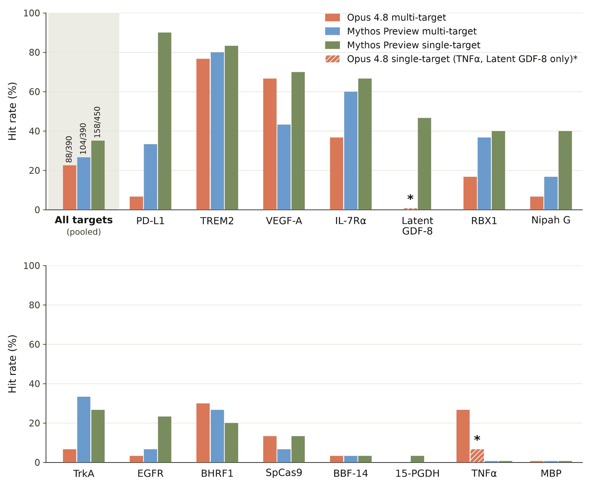
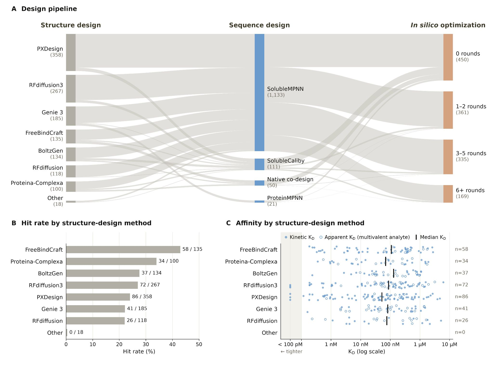
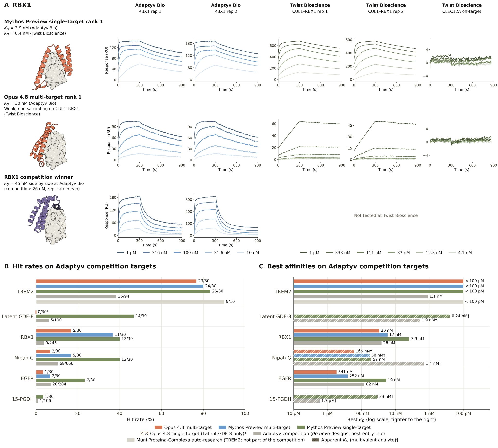
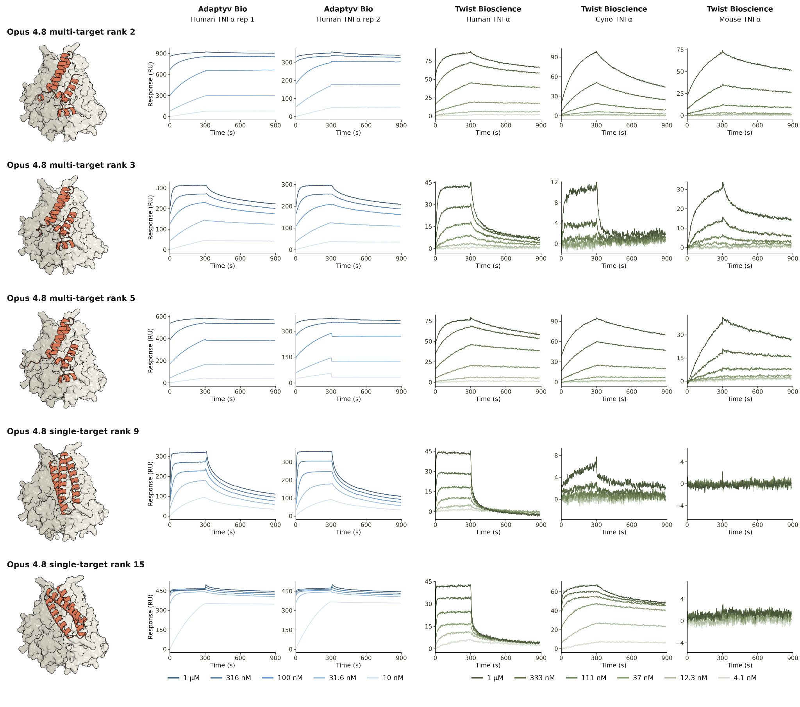
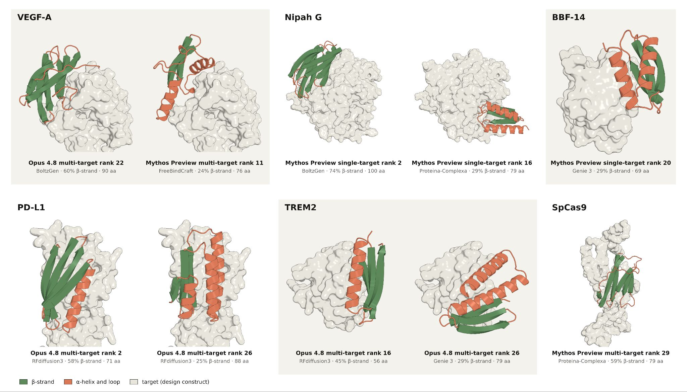
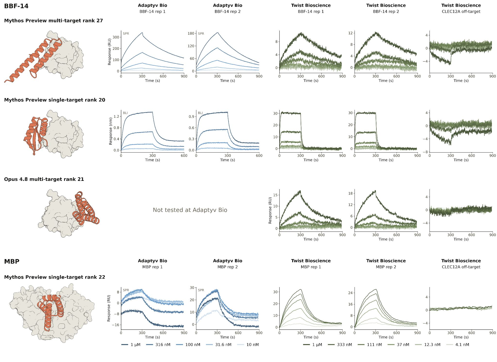
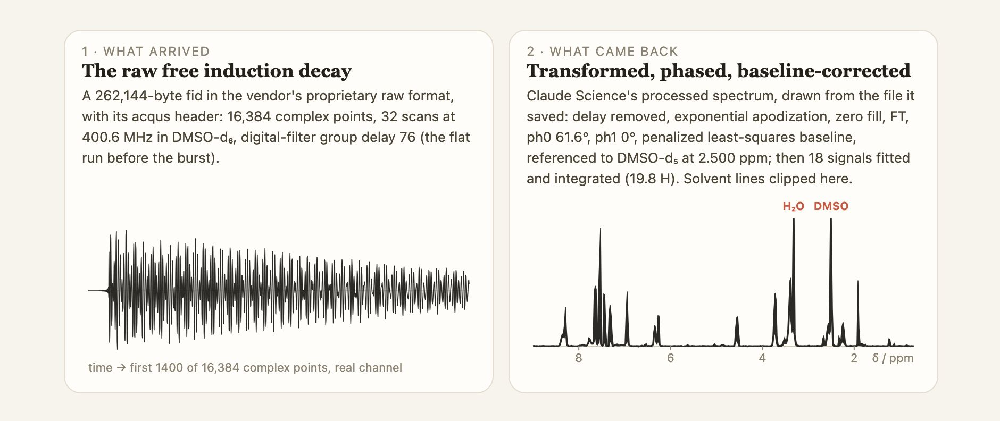
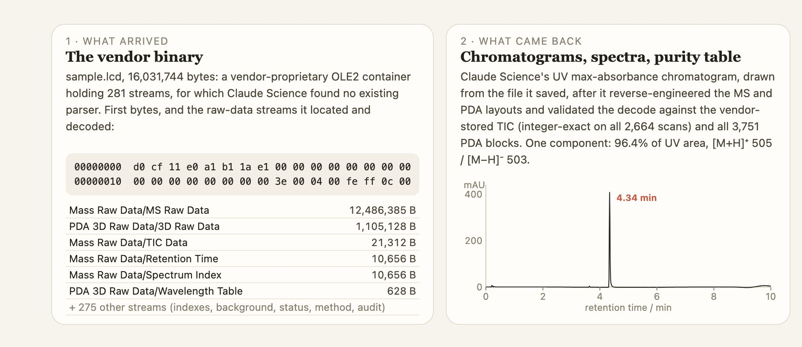

# Anthropic Claude 生物化学结果拆解：真正的突破不是“AI 发明药物”，而是 Agent 开始跑湿实验前的科研流水线

> **TL;DR:** Anthropic 这次不是发布一个“AI 新药”故事，而是给了两个更具体、也更可信的实验结果：Claude Mythos Preview 和 Opus 4.8 在 15 个蛋白靶点上从零设计 protein binders，湿实验验证成功覆盖 14 个靶点，单个设计的成功率达到 22% 到 35%，高于当下蛋白设计 campaign 常见的 10% 到 15%；Claude Opus 5 则在只有原始 NMR / LC-MS 文件和两句 prompt 的情况下，分别用 23 和 19 分钟完成分析，纯度结果为 96.4%，接近实验室报告的 96.33%。关键不是“Claude 替代科学家”，而是模型开始能把文献、工具、GPU、文件格式、候选筛选和报告写作串成可验证的科研 agent workflow。

- **X source:** [Anthropic announcement](https://x.com/AnthropicAI/status/2089842387845804246?s=20)
- **Canonical post:** [How Claude is accelerating protein design and analytical chemistry](https://www.anthropic.com/research/Claude-accelerates-protein-design)
- **Dataset / prompts:** [Anthropic/claude-protein-binder-design](https://huggingface.co/datasets/Anthropic/claude-protein-binder-design/tree/main)
- **Published:** 2026-08-18
- **Tags:** Anthropic / Claude / AI for Science / Protein Design / Analytical Chemistry / Claude Science / Drug Discovery / Biosecurity

## 1. 一句话判断

这次 Anthropic 的结果最容易被标题党写成“Claude 设计新药”。这不准确。

Anthropic 自己也强调：protein binders 不是药物。设计一个高亲和力 binder 只是药物开发早期的一步，后面还有成药性、毒性、递送、稳定性、动物实验、临床试验、制造、监管和商业化。这里的价值不是跳过这些环节，而是把早期研究里一部分昂贵、慢、需要专家编排的工作压缩成 agent 可执行流程。

真正值得看的，是 Claude 做了两类以前很难交给通用模型的事：

1. **设计新分子候选**：在 protein design campaign 中，读资料、选 epitope、调用结构设计和 co-folding 模型、优化候选、筛选表达性/溶解性/新颖性，再把设计送去湿实验验证。
2. **分析实验数据**：在 analytical chemistry 任务中，直接处理原始仪器文件，恢复 NMR / LC-MS 信号，生成图谱、积分、纯度、质量和报告。

这不是聊天助手帮你“解释论文”。这是一个模型开始坐进科研流水线，承担一段可外部验证的工作。

## 2. 蛋白设计：15 个靶点，14 个成功，但别把 binder 等同于 drug

Anthropic 测的是 de novo protein binder design。Protein binder 是一种小蛋白，目标是紧密结合某个 target protein。很多药物确实通过“结合目标并抑制、激活或递送某种功能”发挥作用，但 binder design 仍然只是早期代理任务。

官方结果如下：

| 指标 | 结果 |
|---|---:|
| 设计靶点 | 15 个有可用实验结果的 targets |
| 成功覆盖 | 14 / 15 个 targets |
| 总设计数 | 1,320 个 designs |
| 实验验证 binders | 354 个 |
| Multi-target 模式 hit rate | Mythos Preview 26.7%，Opus 4.8 22.6% |
| Single-target 模式 hit rate | Mythos Preview 35.1% |
| 行业常见 hit rate | 10% 到 15% |
| 高亲和力结果 | 至少 6 个 targets 有 high-affinity binders |
| 达到或超过已发表最佳亲和力 | 至少 4 个 targets |

这里最强的信号不是单点最高分，而是“覆盖面”。一个模型不是只在一个熟悉靶点上过拟合出好结果，而是在一组靶点上跑完整 campaign，并且实验室真的合成和测试了候选。

Anthropic 找了 Adaptyv Bio 和 Twist Bioscience 做外部验证，这点很重要。AI for science 最怕停在“计算上看起来合理”。蛋白设计尤其如此，因为 in silico 分数和 wet lab 结果之间经常有断层。湿实验不是锦上添花，而是这类 claim 能成立的地基。

## 3. 这更像“科研项目经理 + 工具编排器”，不是单一蛋白模型

Claude 这次不是自己内部长出一个 AlphaFold / RFdiffusion / ProteinMPNN 替代品。Anthropic 的描述更像 agent orchestration：Claude 在 Claude Science 环境里调用公开可用的 specialist protein design、sequence design、folding 和 co-folding 模型。

Anthropic 给 Claude 的资源包括：

1. 一个约 30,000 token 的 protein design prompt。
2. 互联网和蛋白设计相关论文/资料。
3. Google Drive、Slack、Gmail、BioRxiv 等 connectors。
4. GPU，用于运行 specialist protein design 和 folding models。
5. 在给定时间内不限制 token 和 sub-agent budget，并启用 fast mode。

实验设置也不轻：multi-target 模式给 Opus 4.8 和 Mythos Preview 48 小时 wall time，并可使用最高 12,500 NVIDIA H100 hours；single-target 模式让 Mythos Preview 针对每个 target 用 24 小时 wall time 和最高 2,500 H100 hours。

这说明结果不是“一个 prompt 秒出答案”。更准确地说，Claude 承担了以前由 computational protein design 专家手工编排的流程：

1. 理解 target 和相关文献。
2. 选择结合位点。
3. 组合多个结构设计方法。
4. 生成候选骨架和序列。
5. 反复做 in silico 优化。
6. 筛掉不新颖、不稳定、不易表达、不溶或不太可能结合的候选。
7. 输出可交给湿实验的 ranked designs。

这才是这次结果最重要的产品形态：**Claude 不是替代所有科学工具，而是把工具链编排成一个长程 agent run。**

## 4. 为什么 RBX1、TNFα 和 β-sheet 例子值得单独看

Anthropic 给了几个具体 target 例子，能帮助判断结果是否只是平均数好看。

第一个是 **RBX1**。Mythos Preview 在 single-target 模式下达到 40% hit rate，而 Adaptyv Bio 竞赛参与者的 hit rate 是 3.7%。它的 top-ranked design 还是 high-affinity binder，超过了 245 个竞赛设计中的 winning design。

第二个是 **TNFα**。这是一个更接近药物现实世界的靶点，因为阻断 TNFα 是 Humira 等重磅药物的治疗基础。这里有个有意思的细节：成功的不是整体更强的 Mythos Preview，而是 Opus 4.8。Opus 4.8 设计出了多个 binders，其中一些还能跨物种结合 human、cynomolgus monkey 和 mouse TNFα，这对动物实验很重要。

第三个是 **β-sheet binders**。很多计算设计的 binder 是 α-helix bundle；β-sheet 更容易误折叠和聚集。Claude 在 6 个 targets 上设计出 15 个确认 binders，包含至少 20% β-strand，说明它不只是沿着最舒服的结构类型走。

这些例子加起来，比“14/15”这个 headline 更有信息量：Claude 有能力在不同结构难度、不同生物意义和不同设计空间里做出可测结果。但它并不稳定到每个 target 都漂亮成功。

## 5. 失败同样重要：BBF-14 和 MBP 暴露了边界

Anthropic 没有只展示胜利。他们写明 Claude 在 **BBF-14** 和 **maltose-binding protein (MBP)** 上遇到困难。

BBF-14 本身就是 de novo designed β-barrel 蛋白，天然界不存在，因此很适合作为 novelty benchmark。Claude 最终仍然在 BBF-14 上产出 3 个独立 binder，但亲和力只是 modest。MBP 更难，因为它大、柔性强、表面亲水且平滑，binder 很难找到抓手；Claude 的 90 个 designs 没有确认结合，只有一个弱的、可复现 binding signal。

这个失败很有价值。它提醒我们：模型并不会神奇绕过生物物理难度。它能提高候选生成和工具编排效率，但 wet lab 仍然决定最终事实。

## 6. 化学分析：Opus 5 的价值是读原始仪器文件，而不只是读图

第二个实验更接近日常实验室生产力。Anthropic 给 Claude Opus 5 的不是干净 CSV，而是 contract lab 的原始 NMR 和 LC-MS 文件。

NMR 和 LC-MS 的难点不只是“看懂图”。真实工作里，仪器会输出厂商格式文件。科学家要用专门软件打开、处理、校准、积分、判峰、算纯度，再写报告。这个过程很耗时间，也很容易被排队和人工处理拖慢。

Anthropic 的结果是：

| 任务 | Claude 输入 | Claude 输出 | 时间 |
|---|---|---|---:|
| NMR | 原始 1H FID 文件 + 一句处理 prompt | 校准图谱、18 个 peaks、每个 peak 的 hydrogen count、可疑 N/O hydrogen 标注 | 23 分钟 |
| LC-MS | 原始二进制 LC-MS 文件 + 一句处理 prompt | chromatogram、mass / UV spectra、纯度表、分子质量、可复用解析代码 | 19 分钟 |

Claude 的 NMR hydrogen counts 和实验室结果每个 peak 相差不超过 0.08 ¹H。LC-MS 纯度结果是 96.4%，实验室报告是 96.33%。

这里还有一个细节很说明问题：Claude 不仅标注了 4 个可能连在 N/O 上的 broad peaks，还提出加 heavy water 的 follow-up check。实验室三天后独立做了同样的检查；Claude 读到 heavy-water run 后，还纠正了自己第一次“4 个都消失”的过度判断，最终和实验室结论一致。

LC-MS 更偏工程。Claude 需要从 undocumented vendor binary format 里恢复数据，并先复现仪器记录的 2,664 scans totals，确认自己没读错，再进入分析。

这说明 Opus 5 的价值不是“化学知识问答”，而是能把文件解析、信号处理、校验、图表、报告和 caveat 写进一个完整 workflow。

## 7. 安全边界：biology agent 是明确的 dual-use 能力

Anthropic 对安全边界写得很直白：agentic biological discovery 是 dual-use。更强的生物研究 agent 可以加速疗法和基础科学，也可能帮助坏人做危险研究，例如生物武器相关开发。

所以这次发布里有一个重要产品限制：

1. 蛋白设计等 dual-use biology capabilities 仍不向 Claude Fable 5 general access 开放。
2. Anthropic 说 life science research tasks 当前在其最强模型中被 blocked。
3. Anthropic 的优先事项之一是推出面向科学家的 access program。
4. Opus 5 仍是当前 generally available model 中最强的模型，可用于 analytical chemistry 这类任务。

这个限制不只是合规姿态。蛋白设计 agent 一旦能接入文献、网络、代码执行、GPU、序列设计、结构预测和湿实验外包，风险面比普通聊天模型大很多。这里的治理问题不是“模型会不会拒答某个问题”这么简单，而是要管理工具权限、实验材料、数据导出、外包下单、实验目的和审计记录。

## 8. 对科研团队的实际启发

如果我是一个生物技术团队，我不会把这篇读成“马上让 Claude 自动做 drug discovery”。更现实的 SOP 是：

1. 让模型先承担 literature triage、target briefing 和方法比较。
2. 把 protein design campaign 拆成可审计阶段：target selection、epitope choice、model orchestration、candidate ranking、novelty screen、solubility / expression screen。
3. 所有候选进入 wet lab 前保留完整 provenance：prompt、工具版本、参数、模型输出、筛选理由。
4. 对 NMR / LC-MS 这类分析任务，先让 Claude 处理低风险样本，与人工报告对照，建立误差边界。
5. 对任何涉及 dual-use biology 的任务，必须有访问控制、日志、人工批准和外部合规审查。

这类 workflow 不会让科学家消失。相反，它会改变科学家的时间分配：少做格式转换、文件解析、工具胶水和候选初筛，多做实验设计、失败解释、验证策略和风险判断。

## 9. 我的判断：AI for Science 正在从“解题”进入“跑实验前系统”

Claude 在数学上的 Riemann zeta 结果说明，模型开始能在形式化/半形式化领域推进可验证发现。Anthropic 这次的蛋白设计和化学分析结果则说明，模型开始进入验证更慢、更贵、更脏的实验科学。

这里的进展不是“AI 直接替代实验”。恰恰相反，实验变得更重要，因为它是把模型输出从漂亮候选变成事实的唯一关口。

真正的变化在实验之前：

1. 候选生成更快。
2. 工具编排更自动。
3. 原始数据处理更短。
4. 报告生成更及时。
5. 失败案例能更快回流到下一轮设计。

药物开发的瓶颈仍然很多，尤其是临床、制造、监管和商业化。Anthropic 自己也承认，端到端加速 drug development 有很多环节更像 policy 和 operational bottlenecks，而不是模型能力问题。

但这次结果已经给出一个清楚方向：AI for Science 的下一阶段不是只让模型回答科学问题，而是让模型参与“可验证科研流水线”的执行。Claude 还不是科学家，但它越来越像一个能坐在实验室系统里干活的 agent。

## Sources

1. Anthropic X announcement
   https://x.com/AnthropicAI/status/2089842387845804246?s=20

2. Anthropic research post: How Claude is accelerating protein design and analytical chemistry
   https://www.anthropic.com/research/Claude-accelerates-protein-design

3. Dataset and prompts: Anthropic/claude-protein-binder-design
   https://huggingface.co/datasets/Anthropic/claude-protein-binder-design/tree/main

4. Protein design technical report
   https://www-cdn.anthropic.com/30bf50e22a01388bb29bf077ee3f244531594b7a.pdf

5. Chemical analysis technical report
   https://www-cdn.anthropic.com/9f08da5189ac269b3242ca760de9823805c3f5f6.pdf/
