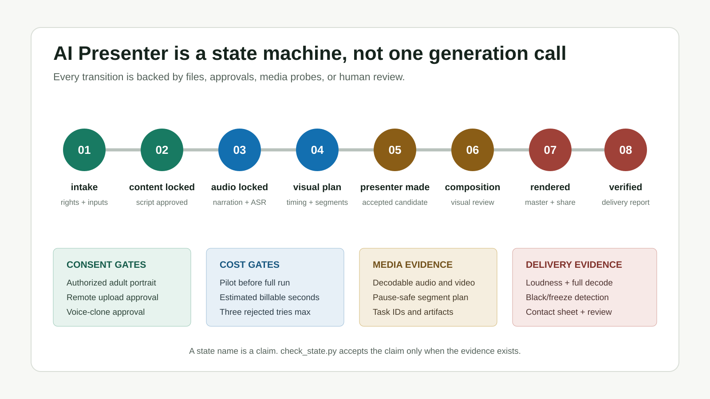
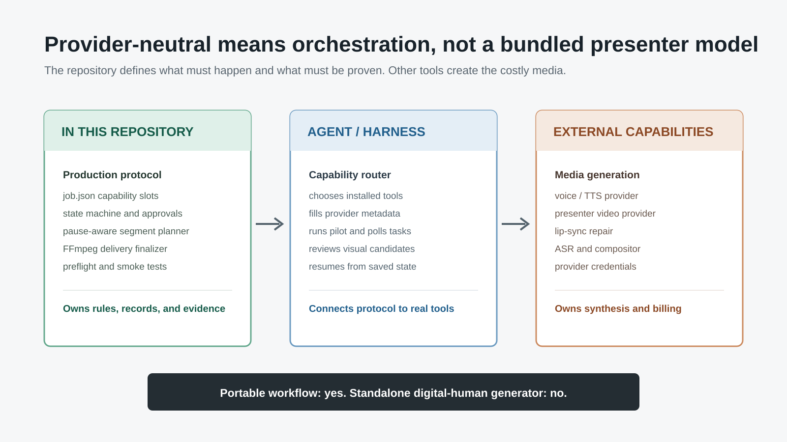

# lanshu AI Presenter Source Audit: Not a Digital-Human Model, but an Evidence-Gated Video Production Pipeline

> **In one sentence:** `lanshu-create-ai-presenter-video` is neither a digital-human model nor a turnkey application. It is a production protocol for coding agents: connect external voice, presenter, and lip-sync capabilities, then keep the script, permissions, budget, task IDs, outputs, and QA evidence in one recoverable state machine.



`cclank/lanshu-create-ai-presenter-video` was first published on August 20, 2026. Its name suggests that the repository might contain a model that animates a portrait. The source says otherwise. There are no model weights, inference service, or fixed provider API client. Its center of gravity is a `SKILL.md`, a `job.json` production ledger, and local utilities for FFmpeg, media probing, state validation, and verified delivery.

As audited on October 9, the repository had roughly 2,558 stars and 392 forks, at commit `c24720a85d63b1bd494f6447e48a59384733647b`. I covered the nine presenter-free visual styles added on October 6 in a [separate source audit](../2026-10-06/2026-10-06-lanshu-explainer-skill-nine-hyperframes-styles-en.md). This article returns to the original `presenter` route and asks a more fundamental question: **how does it turn a portrait and script into an auditable AI-presenter production process?**

---

## 01 | What It Is, and What It Is Not

The system has three layers:

| Layer | What it contains | Included in the repository? |
|---|---|---|
| Production protocol | Input rules, consent gates, state machine, cost records, recovery, and visual acceptance | Yes |
| Local tooling | Job initialization, preflight, segmentation, state checking, FFmpeg delivery, and smoke tests | Yes |
| Generation capabilities | TTS, presenter motion, lip-sync repair, ASR, and optional compositing | No; the agent environment must provide them |

This is not an open-source replacement for a service such as HeyGen or Synthesia, and it is not a digital-human foundation model. It is better described as a **provider-neutral agent skill**. It tells an agent which class of capability to call, when it may spend money, where outputs belong, and which evidence must exist before the workflow can proceed.



“Provider-neutral” cuts both ways. A team can replace its voice, presenter, or lip-sync supplier without redesigning the job structure. But the repository itself cannot generate a presenter. It expects an installed CLI, API integration, or local model with credentials, which the agent maps into capability slots in `job.json`.

---

## 02 | `job.json` Is a Production Ledger

`scripts/init_job.py` starts a job by copying the script, portrait, and supporting media into a self-contained directory. It does not leave the job dependent on absolute paths scattered across one machine, does not modify the originals, and refuses to overwrite a non-empty destination.

The important artifact is `job.json`. It records:

- whether the portrait is authorized and depicts an adult;
- whether remote upload and voice cloning are approved;
- aspect ratio, frame rate, voice settings, and creative route;
- estimated billable seconds, expected cost, pilot approval, and approval for the full paid run;
- the capabilities selected for voice, primary presenter, short motion, lip-sync repair, ASR, compositing, and encoder QA;
- artifacts, remote task IDs, human reviews, and delivery reports for each stage.

A conventional script usually knows only the next command. This manifest also knows why that command is allowed, whether repeating it may incur another charge, and which remote task should be polled after an interruption. It behaves more like a lightweight production database than a prompt container.

---

## 03 | Eight States Turn “Done” Into a Verifiable Claim

The workflow uses eight states:

```text
intake
→ content_locked
→ audio_locked
→ visual_plan_locked
→ presenter_generated
→ composition_checked
→ rendered
→ verified
```

An agent cannot advance by merely writing “complete” into the manifest. `scripts/check_state.py` recomputes the supported state from actual evidence: a locked script, decodable audio and video streams, a segment plan, human review, and a final report that verifies both master and share outputs. If a manifest claims `verified` while the disk only supports `audio_locked`, the utility can move it back to the truthful state.

That addresses a common failure mode in long-running agent work. Chat context can disappear, remote jobs can stall, and an API success response can be mistaken for a delivered video. The state machine moves progress out of conversational memory and into inspectable artifacts.

---

## 04 | Why Audio Must Be Locked First

The final narration is the workflow's **master clock**. The order is not “animate a face, then fit audio afterward.” It is:

```text
lock script → generate full narration → verify with ASR → measure real duration
→ plan visuals and segments → generate presenter → mute generated source audio
→ compose against the locked narration
```

ASR is not used to rewrite the captions. It checks omissions, additions, numbers, and proper names. Only after the audio passes does its real duration drive the shot plan, subtitles, keyword graphics, cover, and close.

This yields two practical benefits. Every visual and caption follows the same clock, so independently generated sections do not accumulate drift. And when the motion is acceptable but the mouth is not, the paid motion plate can be retained while lip sync is repaired against the exact locked narration.

---

## 05 | Segmentation Uses Real Pauses, Not Equal Slices

Many presenter services limit the duration of one request and may bill in whole seconds. `scripts/plan_segments.py` reads word-level ASR spans, searches for pauses of at least 0.25 seconds, selects the latest safe break under the provider limit, and keeps every segment at least two seconds long.

It can round according to whole-second billing and records each boundary, seam, and total requested duration. If no valid pause exists before the limit, it refuses to produce a plan rather than cutting through speech.

That small utility captures one of the repository's best production judgments: **a system should not pretend every constraint can be automated away.** When there is no safe boundary, revising the script or changing provider is cheaper than manufacturing an unfixable speaking seam.

---

## 06 | Record Cost and Recovery Before the Paid Call

Before every potentially paid remote request, the protocol asks the agent to record:

- what will be uploaded and how many seconds or units are requested;
- unit price and estimated total, or an explicit “unknown”;
- whether a low-cost pilot has passed;
- the expected output artifact;
- whether failure should be polled or retried, and the retry ceiling.

A short pilot precedes a full run. When a remote task is interrupted, its task ID is saved and polled before anything is resubmitted. After three paid candidates are rejected, the workflow stops and asks for a change in inputs or strategy.

This is not a creative algorithm, but it may be the repository's most commercially useful feature. Presenter pipelines often waste money not on the first request but on an uncertain result being submitted twice, or on an entire motion clip being regenerated when only its mouth needs repair. The skill turns those quiet costs into enforceable rules.

---

## 07 | Delivery Is an Atomic Publication, Not Just an MP4 Export

`scripts/finalize_delivery.sh` builds all outputs in a temporary directory and publishes nothing when a check fails. Its default delivery sequence:

1. confirms that inputs contain decodable video and audio streams;
2. performs two-pass loudness normalization around -16 LUFS with true peak no higher than -1 dBTP;
3. creates H.264 `yuv420p` plus AAC master and share files;
4. fully decodes both outputs;
5. runs black-frame and freeze detection;
6. generates a nine-frame contact sheet;
7. writes a portable JSON report without local absolute paths;
8. publishes the delivery directory only after every condition passes.

Numeric checks still cannot replace human acceptance. The guide asks reviewers to inspect identity, face shape, hair and glasses, clothing, hands, blinking, lighting, anchor phonemes, segment seams, and the final hold. In other words, `verified` means the media is technically deliverable. Whether the presenter looks natural, preserves identity, and gives an appropriate performance remains a visual judgment.

---

## 08 | What I Independently Verified

I ran `tests/smoke.sh` against current commit `c24720a` on macOS. All seven groups passed:

- initialization copies inputs and refuses overwrite;
- preflight blocks missing manual consent and writes a portable report;
- unsupported state claims are rejected;
- the segment planner cuts inside pauses;
- state advances only when evidence appears;
- the finalizer verifies before publication;
- the test job ultimately reaches `verified`.

The repository's `Validate Skill` GitHub Actions run also passes at the current commit. It checks metadata, Python compilation and help commands, shell syntax, JSON, accidental `/Users/` paths, and smoke tests for both production routes.

The scope of this evidence matters. The presenter used by the smoke test is synthetic media generated locally with FFmpeg. It never calls a real TTS, presenter, or lip-sync service. The result proves that **orchestration, state transitions, and delivery tools run**. It does not prove presenter quality or an end-to-end provider integration.

---

## 09 | Three Current Boundaries

### 1. Provider neutrality also means no ready-made provider adapter

There is no fixed provider client in Python or Node. The agent must discover capabilities already available in its environment and write their results back to the expected job structure. For a team with an existing toolchain, that is portability. For someone expecting “upload one photo and click generate,” it is a missing product layer.

### 2. Tests cover the protocol, not real-person quality

The repository does not bundle a real presenter sample from the original route, nor does it publish a cross-provider benchmark for identity retention, long-form lip sync, seams, or cost. The review checklist is thoughtful, but real service performance still requires independent evaluation.

### 3. Two narrow input-robustness gaps are reproducible

The open [Issue #1](https://github.com/cclank/lanshu-create-ai-presenter-video/issues/1) reports two crashes, both reproducible at the audited commit. When `--job-dir` points to a regular file, `init_job.py` raises an unhandled `NotADirectoryError`. When `supporting_media` is JSON `null`, `preflight.py` raises a `TypeError`. CI is green, but these edge cases are not covered.

They do not invalidate the core workflow. They do show that strict evidence gating and graceful handling of every malformed input are separate qualities.

---

## 10 | Who It Is For

The skill makes sense for individuals and teams that already have voice, presenter, or lip-sync tools and want to turn scattered calls into an auditable workflow. It is particularly useful when:

- providers need to be replaceable;
- generation is expensive enough to require saved task IDs and retry evidence;
- portraits and voices require explicit authorization;
- work may be interrupted and must resume from disk state;
- delivery requires master, share, captions, a contact sheet, and a QA report.

It is not a one-click presenter app packaged as a GitHub repository. Users still need external capabilities, credentials, and visual review, and some failures should lead to script revision rather than unlimited automatic retries.

---

## Conclusion: It Open-Sources How to Produce Responsibly

The most reusable part of `lanshu-create-ai-presenter-video` is not a particular presenter effect. It turns a process usually held together by operator experience and chat history into explicit states, artifacts, permissions, and checks.

Inputs pass rights and budget gates before generation. Narration becomes the master clock rather than a post-production accessory. Remote jobs have task IDs, pilots, and retry ceilings instead of behaving as black boxes. And an MP4 is not accepted merely because it exists: full decoding, loudness, black/freeze detection, a contact sheet, and human viewing form the delivery evidence.

So this is not “an open-source digital human.” It open-sources an operating protocol for how an agent can make AI-presenter video **with more control, less waste, and clearer responsibility**. For agent-native media production, that boundary matters more than the model name.

---

## Primary Sources

- [`cclank/lanshu-create-ai-presenter-video`](https://github.com/cclank/lanshu-create-ai-presenter-video)
- [Initial open-source commit `04f6bce`](https://github.com/cclank/lanshu-create-ai-presenter-video/commit/04f6bceab888ad923e192fb02542eda06d1fdda8)
- [Evidence-gating and verified-delivery hardening commit `c76c6d3`](https://github.com/cclank/lanshu-create-ai-presenter-video/commit/c76c6d3)
- [Current `SKILL.md`](https://github.com/cclank/lanshu-create-ai-presenter-video/blob/main/SKILL.md)
- [Generation and segmentation guide](https://github.com/cclank/lanshu-create-ai-presenter-video/blob/main/references/generation.md)
- [QA and recovery guide](https://github.com/cclank/lanshu-create-ai-presenter-video/blob/main/references/qa-recovery.md)
- [Smoke test](https://github.com/cclank/lanshu-create-ai-presenter-video/blob/main/tests/smoke.sh)
- [Passing Validate Skill workflow](https://github.com/cclank/lanshu-create-ai-presenter-video/actions/runs/37442861791)

*Audited on October 9, 2026. Stars, forks, commit status, and open issues will continue to change.*
