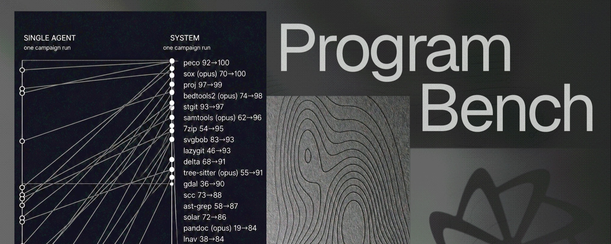
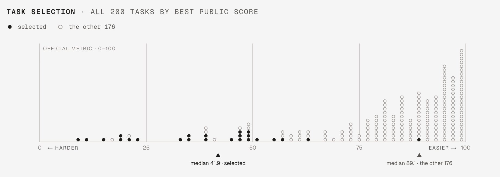
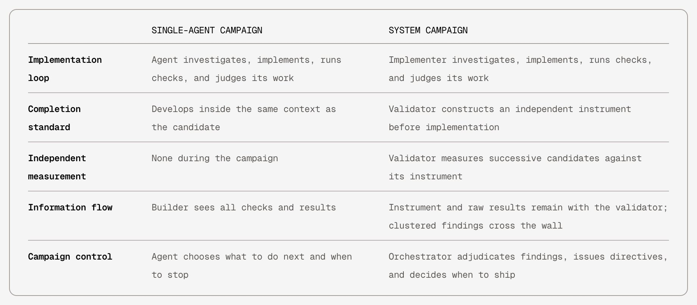
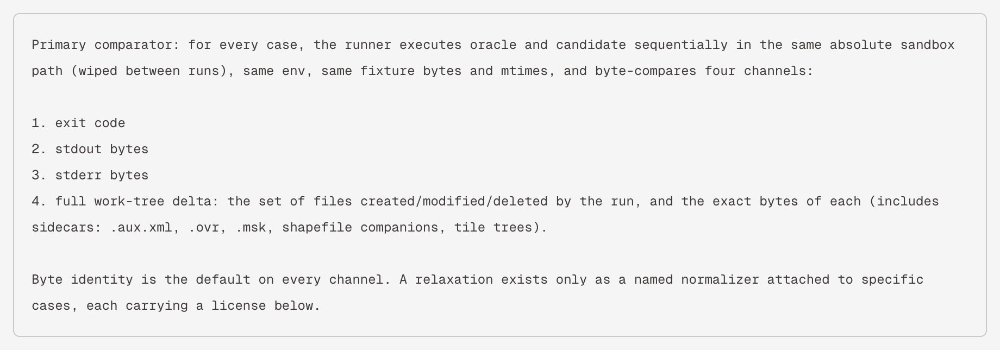
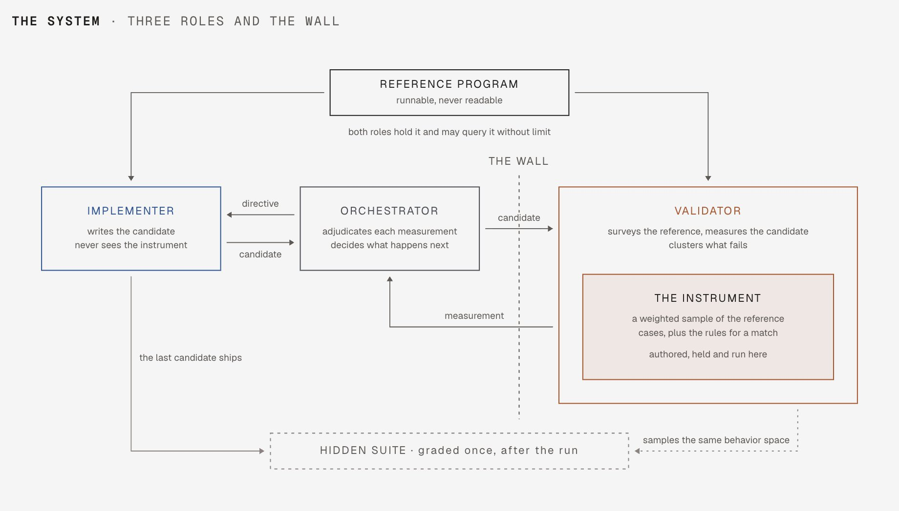
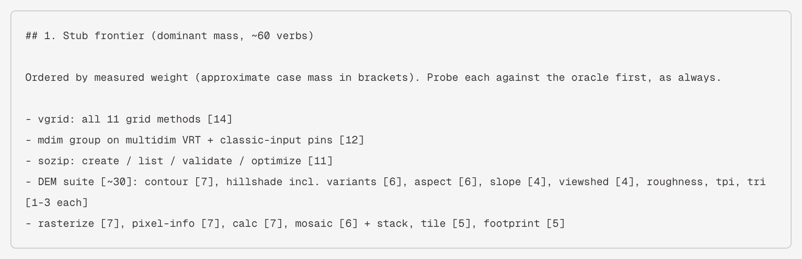
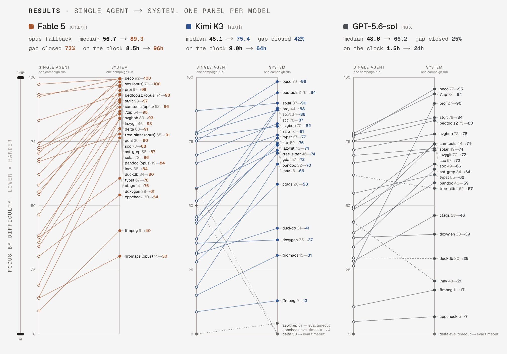
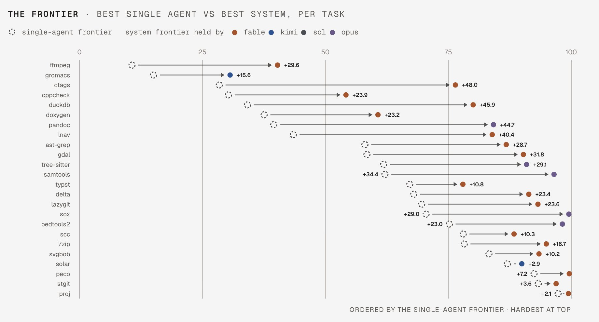

# Factory Droid 大任务实验拆解：Coding Agent 真正缺的不是能力，而是可执行的完成标准

> **TL;DR:** Factory 在 2026-08-27 发布了一篇关于 Droid 完成大型软件任务的实验文章。实验选取 24 个较难的 ProgramBench 任务，比较同一模型作为 single agent 与“orchestrator / implementer / validator”三角色系统时的表现。最值得看的不是“多 agent 一定更强”，而是完成判断被从实现者上下文里拿出来，变成一个先于实现构建、由 validator 持有、不断扩展但不能向已实现内容塌缩的 executable standard of completion。结果很强，但也有边界：每个 cell 只有一次 run，不是均值；system runs 更久更贵；任务是手选难例；141/144 个 cells 完成评分；Fable panel 有 6 个 Opus substitute cells。所以这篇的正确读法不是“Droid 已经能自动重写大型软件”，而是“长程 coding agent 的核心工程问题，是独立验证体系和完成标准治理”。

- **X source:** [luckyalways1 / @droid_35719](https://x.com/droid_35719/status/2093068852917899336?s=61)
- **X Article:** [What it Takes for Coding Agents to Complete Large Software Tasks](https://x.com/i/article/2093068846634819584)
- **Canonical post:** [Factory blog](https://factory.ai/news/what-it-takes-for-coding-agents-to-complete-large-software-tasks)
- **Benchmark:** [ProgramBench](https://programbench.com/)
- **Published:** 2026-08-27
- **Tags:** Factory / Droid / Coding Agent / ProgramBench / Agent Evaluation / Multi-Agent / Validation



## 1. 一句话判断

这篇 Factory 文章讨论的是一个很具体的问题：coding agent 为什么在大型软件任务上会停得太早。

小任务里，agent 可以边写边测：改一个函数，跑一个测试，看到结果，再决定是否继续。这种局部闭环在 bugfix、简单 feature、脚本生成里通常够用。

大型任务不一样。需求可以描述目标状态，但不一定说明“为了证明已经完成，必须运行、检查、比较哪些东西”。agent 会在实现过程中临时构造验证方式。每个局部判断都可能合理，但整体仍然漏掉大量行为。

Factory 的核心判断是：single agent 不一定是不会继续做，而是没有建立完整的“还剩什么没做”的度量。它会在自己的局部证据里宣布完成。

所以这次实验的关键不是堆更多 agent，而是把完成标准独立出来。

## 2. 实验对象：ProgramBench，不是普通 SWE-Bench bugfix

ProgramBench 是一个 cleanroom software-engineering benchmark。任务给 agent 一个 reference program、fixtures 和部分文档。reference 是黑盒 oracle：可以运行，但不能读源码、反编译、trace，也不能看隐藏测试。

目标不是修一个 bug，而是从零实现一个程序，使它的可观察行为尽量接近 reference。官方 ProgramBench 页面把问题概括为：给定 compiled binary 和 documentation，agent 必须 architect and implement 一个完整 codebase 来复现原程序行为。

ProgramBench 论文还给了一个重要背景：它包含 200 个任务，从小型 CLI 到 FFmpeg、SQLite、PHP interpreter 这类大型软件。论文提交于 2026-05-05，摘要里说，当时评测的 9 个语言模型没有一个能完全解决任何任务，最好模型也只在 3% 的任务上通过 95% 测试。

也就是说，这不是“让模型补一个函数”的 benchmark。它测试的是软件整体重建能力：架构、接口发现、边界行为、文件格式、错误输出、组合参数、长期上下文和验证策略。



Factory 这次没有跑全部 200 个任务，而是选了 24 个最难任务之一组，选择依据是当前 top leaderboard score。文章也说明，这组任务是 hand-picked，并且偏向 best-public score 较低的任务。一些候选任务因为 persistent safety blocks、single-agent saturation，或一个 undocumented environment variable 决定分数，被筛掉。

这点要记住：结果展示的是“手选难任务上的实验信号”，不是全量 ProgramBench 的无偏均值。

## 3. gdal 例子：同一任务，36% 到 90%

Factory 用 `gdal` 作为主例。

`gdal` 是 GDAL 项目的命令行工具，长期服务于地理空间数据处理。Factory 文章说，上游 GDAL 大约是 2M 行 C/C++，去掉 bundled third-party libraries 后约 1.9M 行；在这个任务配置中，通过 CLI 可达的表面约 600K 行。

实验给 Droid 两种方式重建 `gdal`：

| 条件 | 机制 | 结果 |
|---|---|---:|
| Single agent | agent 自己实现、检查、判断是否完成 | 写出 17K 行 C++，复现 36% 行为 |
| System run | validator 先建立完成标准，implementer 被该标准约束，orchestrator 决定下一步 | 写出 115K 行 C++，达到 90% behavioral parity |

文章强调 single agent 没有用完时间或预算。它停止是因为它自己判断已经完成。这是最重要的 failure mode：不是能力耗尽，而是 completion judgment 提前收敛。

Factory 还给了两个同样直观的例子：同一系统把 7-Zip recreation 从 54% 提到 95%，把 DuckDB recreation 从 34% 提到 80%。多个重建任务达到了 upper 90s。

这说明“完成标准”在 ProgramBench 这种黑盒复现任务上有迁移效果，但不能简单推出“所有真实工程任务都能获得同等提升”。真实产品任务的 oracle 通常不如 ProgramBench 明确。

## 4. System run 的关键不是三个人设，而是验证权分离

Factory 的 system condition 有三个角色：

1. **Orchestrator**：决定测什么，解释 validator findings，给 implementer 下一个工作指令，决定何时 ship。
2. **Implementer**：像普通 coding agent 一样研究 reference、写代码、跑检查、推进 candidate。
3. **Validator**：在实现开始前先构造 instrument，后续用它衡量 successive candidates。

重要的是信息流：

| 维度 | Single-agent campaign | System campaign |
|---|---|---|
| Implementation loop | agent 调研、实现、运行检查、判断结果 | implementer 调研、实现、运行检查、判断结果 |
| Completion standard | 在 candidate 同一上下文里形成 | validator 在实现前构造独立 instrument |
| Independent measurement | campaign 中没有独立度量 | validator 用 instrument 衡量 successive candidates |
| Information flow | agent 看见所有 checks 和 results | instrument 和 raw results 留在 validator 侧，clustered findings 穿过 wall |
| Campaign control | agent 自己决定下一步和何时停止 | orchestrator 裁决 findings、下发 directives、决定何时 ship |



这不是简单的“多 agent 协作更聪明”。如果 implementer 能看到 validator 的所有测试样本，它很快就会把样本当目标，过拟合可见测试。Factory 的设计是让 findings 过墙，但不让 instrument 本身过墙。

这个边界很关键。validator 和 implementer 可以使用同一个模型、同一 reasoning level、同一个 reference program。区别不是知识更多，而是验证权被隔离，避免实现上下文把完成标准压缩成“我已经想到的那部分”。

## 5. Instrument 是什么：把完成变成可运行的样本和比较规则

在 ProgramBench 里，完整行为空间无法穷尽。一个程序可以接受无限组合的输入、flags、文件格式和错误条件。任何实际验证都只能抽样。

Factory 把这个抽样体系叫做 instrument。validator 在实现前 survey reference program，映射行为空间，构造加权 case 集合和比较规则。文章给了 `gdal` instrument 的两个例子：

```text
D('hillshade.combined', ['raster', 'hillshade', '--variant', 'combined', 'dem.tif', 'out.tif'])
D('contour.levels', ['raster', 'contour', '--levels', '120,150,180', 'dem.tif', 'out.geojson'])
```

更重要的是 comparator。Factory 写到，每个 case 都在同一个 absolute sandbox path 里顺序执行 oracle 和 candidate，并比较四个 channel：

1. exit code；
2. stdout bytes；
3. stderr bytes；
4. full work-tree delta，包括创建、修改、删除的文件集合，以及每个文件的 exact bytes。

默认策略是 byte identity。只有在 reference 本身不能产生稳定 bytes 时，才允许 named normalizer。文章说 `gdal` validator 写了数百个 cases，所有 cases 中只授权了两个 relaxation：debug traces 里的 heap address mask，以及文件 header 里的日期。



这个细节很有工程意义。很多 agent eval 失败不是因为没有测试，而是测试语义太软。Factory 这里把完成标准做成了可运行、可比较、可追踪的仪器。

## 6. “Wall”的价值：避免测试样本变成实现目标

Factory 的系统里有一堵 wall。

validator 可以扩展 instrument，但不能为了适配 candidate 而削弱它。implementer 不编写 instrument，不运行 instrument，也看不到 cases 或 raw output。orchestrator 看到的是 validator 聚合后的 root-cause findings，然后把它转成面向功能、子系统、行为缺口的 directive。



文章给了 `gdal` run 的一个 directive 片段，内容不是“修第 37 个测试”，而是类似：

```text
Stub frontier (dominant mass, ~60 verbs)

- vgrid: all 11 grid methods
- mdim group on multidim VRT + classic-input pins
- sozip: create / list / validate / optimize
- DEM suite: contour, hillshade, aspect, slope, viewshed, roughness, tpi, tri
- rasterize, pixel-info, calc, mosaic + stack, tile, footprint
```



这就是 wall 的作用：implementer 得到的是“哪里弱”，不是“测试样本是什么”。它必须独立研究 reference，再补实现。这样可以减少 sample leakage，同时保留改进方向。

## 7. 结果：提升明显，但成本和方法 caveat 必须一起读

Factory 跑了三个 model panel：Fable 5、Kimi K3、GPT-5.6 Sol。每个 selected task 和 model panel 都跑 single-agent 和 system 两种条件。

核心结果如下：

| Model panel | Single median | System median | Gap closed | Wall time |
|---|---:|---:|---:|---:|
| Fable 5 xhigh | 56.7 | 89.3 | 73% | 8.5h -> 96h |
| Kimi K3 high | 45.1 | 75.4 | 42% | 9.0h -> 64h |
| GPT-5.6 Sol max | 48.6 | 66.2 | 25% | 1.5h -> 24h |



单看提升，很容易得出“system run 更强”的结论。但 Factory 自己给了几个必要 caveat：

1. **不是 compute-matched。** system runs 明显更久、更贵。`gdal` 上 system run 是 single run 的 14 倍 credits、13 倍 wall time。
2. **每个 cell 只有一次 run。** 文章明确说，每个数字都是 single run，不是 repeated-run average，没有 variance estimate。
3. **不是所有 cells 都有分数。** 144 个 cells 中 141 个完成评分；剩下三个 system runs 被中断，没有重跑。
4. **Fable panel 有 substitutes。** 6 个 Fable cells 因 safety block 用 Opus 代跑，包括 bedtools2、gromacs、pandoc、samtools、sox 和 tree-sitter。
5. **任务是 hand-picked。** 这 24 个任务偏向难例，不是随机样本。

所以更准确的判断是：这个系统说明“完成标准外置”能显著改变 agent 对长程任务的停止行为，并在这些 ProgramBench 任务上带来独立隐藏测试的提升。它还没有证明同样结构在所有真实软件任务上都稳定产生同等收益。

## 8. 为什么这对真实工程团队重要

真实工程任务通常没有 ProgramBench 这种 reference binary 和 hidden behavioral suite。迁移、重写、支付系统改造、权限系统重构、移动端适配、数据管道迁移，往往只有需求文档、旧系统、日志、用户路径和人工经验。

但 Factory 这篇文章给出的工程原则可以迁移：

1. **先定义完成证据，再开始实现。** 不要让 agent 在写代码过程中临时决定什么叫完成。
2. **把实现者和验证者分离。** 同一个模型也可以扮演不同角色，关键是上下文和信息流隔离。
3. **让验证标准可执行。** 验证不是 checklist 文本，而是能运行、能比较、能复用的 procedures。
4. **验证标准可以扩展，但不能向 candidate 妥协。** 如果发现新边界，可以加 case；不能因为实现缺失就降低标准。
5. **把 raw failures 转成 root-cause directives。** 实现者需要方向，不应该直接吃到 hidden sample。
6. **最终评分应独立于开发循环。** shipping 之前要有开发过程中没见过的评估入口。

这和成熟软件工程里的 requirements traceability、acceptance tests、conformance suites、independent verification and validation 是同一类思想。区别是，agent 让“为每个项目构造验证标准”的成本开始下降。

## 9. 对 coding agent 产品的启发

这篇文章对 coding agent 产品有三个直接信号。

第一，**长程任务的主要瓶颈是完成判断，不只是代码生成能力。** 一个 agent 能写 17K 行可工作的 C++，但仍然只覆盖 36% 行为，因为它不知道自己漏掉了多少。

第二，**多 agent 架构必须说明验证边界。** “orchestrator + implementer + validator”不是魔法。真正有效的是 validator 持有 instrument，implementer 只接收聚合后的缺口信号，orchestrator 管理是否继续扩展验证或推进实现。

第三，**成本会跟完成标准一起上升。** Factory 文章没有掩盖这一点。`gdal` system run 花了 3.00B credits、196.9h wall time，implementer 占 system spend 的 97%。更强的完成标准会让 agent 继续工作，也会让账单继续增长。产品上必须配套预算、优先级、停止条件和可解释的验收进度。



## 10. 我的判断：这是 coding agent 从“会做事”到“知道没做完”的一步

过去一年，很多 agent 展示的是“能做什么”：修 bug、写 feature、跑测试、开 PR、调用工具。

Factory 这篇更重要的问题是“它怎么知道自己做完了”。这个问题比 demo 难，也更接近生产环境。

对大型软件任务来说，完成不是一个感觉，而是一套证据系统：

1. 行为面 inventory；
2. 可运行验证 procedures；
3. 独立评价上下文；
4. 防泄漏信息边界；
5. root-cause feedback；
6. 最终独立评分；
7. 成本和时间记录。

这也是我认为这篇值得写的原因。它没有单纯宣传 Droid 更强，而是把 coding agent 的一个关键 failure mode 讲清楚了：agent 不是只会写错，也会在缺少全局度量时过早停下。

下一代 coding agent 的竞争点，不会只是“哪个模型更会写代码”。更关键的是，哪个系统能让模型持续面对一个外部、可执行、不会塌缩的完成标准。

## Sources

1. X source
   https://x.com/droid_35719/status/2093068852917899336?s=61

2. X Article
   https://x.com/i/article/2093068846634819584

3. Factory: What it Takes for Coding Agents to Complete Large Software Tasks
   https://factory.ai/news/what-it-takes-for-coding-agents-to-complete-large-software-tasks

4. ProgramBench
   https://programbench.com/

5. ProgramBench paper: Can Language Models Rebuild Programs From Scratch?
   https://arxiv.org/abs/2605.03546

6. Factory `pb-gdal-fable` artifact
   https://github.com/Factory-AI/pb-gdal-fable
