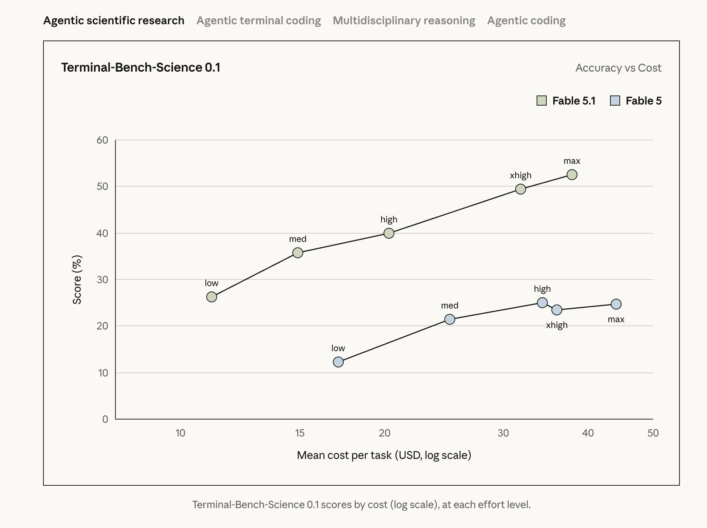
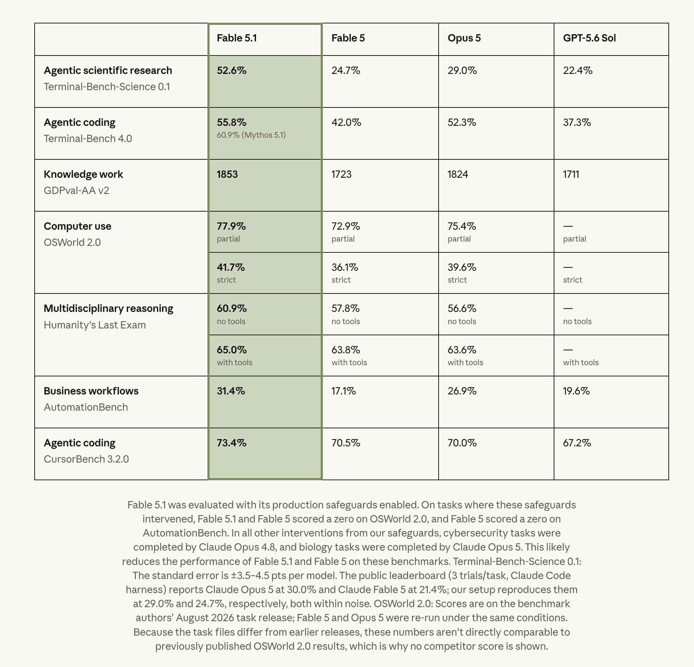
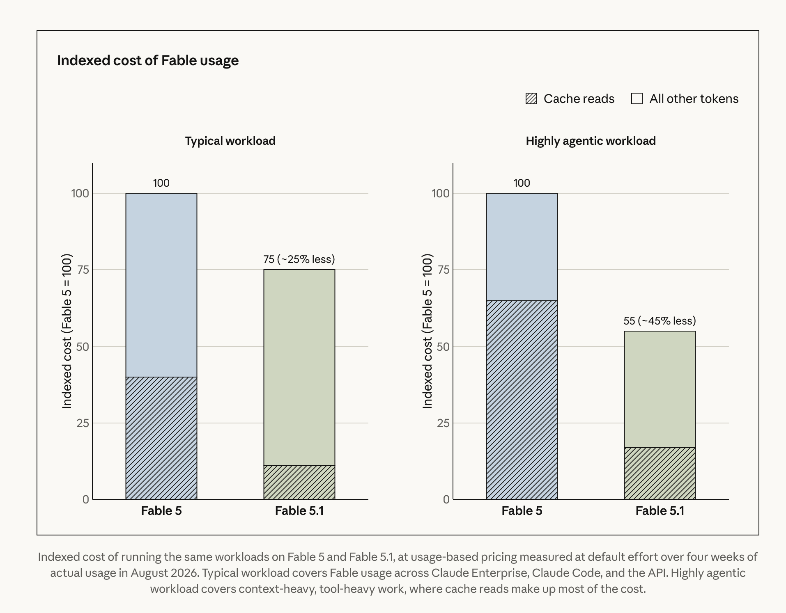

# Claude Fable 5.1 and Mythos 5.1: One Model, Segmented by Safeguards, Cache Economics, and Data Sovereignty

> **TL;DR:** Baoyu's X post correctly identifies the three changes with the most practical impact: performance, cost, and data retention. The deeper signal is a change in how frontier models are packaged. Fable 5.1 and Mythos 5.1 are the same underlying model. Fable applies stricter cyber and biology safeguards for general availability, while Mythos exposes a wider capability envelope to vetted researchers. Anthropic has also left input and output prices unchanged while cutting cache-read pricing by 75%, directly targeting the economics of long-context agents. Enterprise Frontier Safeguards then moves monitoring data into customer-controlled cloud infrastructure, attempting to make model safety and enterprise data sovereignty part of the same architecture.

- **X source:** [Baoyu on Claude Fable 5.1 and Mythos 5.1](https://x.com/dotey/status/2094854620732375335?s=20)
- **Official launch:** [Claude Fable 5.1 and Mythos 5.1](https://www.anthropic.com/claude-fable-and-mythos-5-1)
- **Fable page:** [Claude Fable](https://www.anthropic.com/claude/fable)
- **Mythos page:** [Claude Mythos](https://www.anthropic.com/claude/mythos)
- **Enterprise safeguards:** [Enterprise Frontier Safeguards](https://www.anthropic.com/news/enterprise-frontier-safeguards)
- **Published:** 2026-09-01

## 1. One-line Takeaway

This is not a routine 5.0-to-5.1 update. Anthropic is combining model capability, access policy, inference effort, cache pricing, and enterprise logging architecture into one product system.

Model tiers have traditionally been defined by three variables: larger models are smarter, smaller models are faster, and each tier has a different price. Fable 5.1 and Mythos 5.1 introduce another axis: **the underlying model is the same, but the permitted capability envelope is different.**

Fable 5.1 is the generally available version, with stricter safeguards for high-risk cybersecurity, biology, and chemistry tasks. Mythos 5.1 is available to vetted cyberdefense and life-sciences organizations with more permissive research access. The gap is not simply more parameters or more thinking time. It emerges from deployment policy, eligibility, routing, and safeguards.

That changes what it means to compare models. The useful questions now include: Which safeguard configuration was used? Which tasks fall back to another model? Which access program does the account belong to? What is the retention policy? Which effort level produced the result?

## 2. One Model, Two Permission Boundaries

Anthropic explicitly describes Claude Fable 5.1 and Claude Mythos 5.1 as the same model. Fable is the version wrapped for broad deployment; Mythos provides a wider cyber and life-sciences envelope to vetted organizations.

| Dimension | Fable 5.1 | Mythos 5.1 |
|---|---|---|
| Underlying model | Same as Mythos 5.1 | Same as Fable 5.1 |
| Access | Pro, Max, Team, Enterprise, and API | Vetted cyberdefense and life-sciences organizations |
| Cybersecurity | May find source-code vulnerabilities; penetration testing, exploit generation, and binary scanning remain restricted or routed | Wider access for qualified defensive research |
| Life sciences | Research-level biology and chemistry remain restricted or routed | Professional access through the Life Sciences Verification Program |
| Default retention | Fable-class use defaults to 30 days; eligible enterprises may use EFS or transitional ZDR | 30-day safety-monitoring retention by default |
| Starting price | $10/MTok input, $50/MTok output | Starts at $10/MTok input, $50/MTok output |

This is more consequential than a simple public/pro split. Anthropic is turning the safety layer into part of the model product: the same weights can behave differently in real tasks because safeguards, fallbacks, eligibility checks, and auditing differ.

The benchmarks expose this directly. On Terminal-Bench 4.0, Fable 5.1 scores 55.8%, while Mythos 5.1 reaches 60.9%. Anthropic attributes the gap to safeguard intervention on cybersecurity tasks. The score is therefore measuring deployment policy as well as model capability.

## 3. Large Benchmark Gains, With the Safety System in the Loop

Anthropic reports the following results for Fable 5.1:

| Task | Fable 5.1 | Fable 5 | Opus 5 | GPT-5.6 Sol |
|---|---:|---:|---:|---:|
| Terminal-Bench-Science 0.1 | 52.6% | 24.7% | 29.0% | 22.4% |
| Terminal-Bench 4.0 | 55.8% | 42.0% | 52.3% | 37.3% |
| AutomationBench | 31.4% | 17.1% | 26.9% | 19.6% |
| CursorBench 3.2.0 | 73.4% | 70.5% | 70.0% | 67.2% |
| OSWorld 2.0 strict | 41.7% | 36.1% | 39.6% | - |

The jump from 24.7% to 52.6% on Terminal-Bench-Science is the headline result and supports the claim that agentic scientific work improved substantially. Three caveats matter:

1. These are vendor-published release evaluations, not independent replications.
2. Terminal-Bench-Science has a reported standard error of roughly 3.5 to 4.5 percentage points per model, so small gaps should not be overinterpreted.
3. Fable 5.1 was evaluated with production safeguards enabled. Some interventions produce zero credit, while other tasks fall back to Opus 4.8 or Opus 5. The table measures a deployed system of model, safeguards, and routing rather than bare weights.

For procurement, that may be the more useful measurement. Enterprises do not buy raw weights; they buy a service with policies, routing, limits, and audits. The requirement is to document those conditions instead of calling every difference model intelligence.

## 4. Effort Levels Are Becoming an Agent Compute Control

Fable 5.1 provides five effort levels: Low, Medium, High, XHigh, and Max. Anthropic's curves show lower-effort Fable 5.1 runs matching or beating higher-effort Fable 5 runs.

This matters more to agent products than the maximum score. Long tasks spend money across repeated cycles of context reads, tool calls, output checks, recovery, and continuation. Running every step at maximum reasoning effort can look good on a benchmark while destroying throughput and unit economics.

A better architecture allocates effort by stage:

1. Use Low or Medium for search, classification, and file operations with cheap verification.
2. Escalate architecture decisions, root-cause analysis, and scientific reasoning to High or XHigh.
3. Reserve Max for rare nodes with high difficulty or high failure cost.
4. Let automated evaluation trigger escalation instead of fixing an entire workflow to one level.

The Fable 5.1 curves make “how long should the model think?” a product control rather than an invisible inference parameter. Agent routing will increasingly happen both across models and across effort levels within one model.

## 5. The Price Cut Is in Cache Reads, Not Input or Output

Baoyu highlights the 75% reduction in cache-read pricing. It is easy to overlook, but it is the change with the most immediate impact on agent builders.

Fable 5.1 still costs $10 per million input tokens and $50 per million output tokens. Cache reads fall from $1 to $0.25 per million tokens.

Using four weeks of August 2026 usage at default effort, Anthropic estimates approximately 25% lower total cost for typical workloads and up to roughly 45% for highly agentic, context-heavy, tool-heavy workloads. This is not an automatic 45% discount for every request. It depends heavily on cache hit rate.

The pricing reveals a key fact about agent economics: when system prompts, codebase summaries, tool definitions, conversation history, and project state are repeatedly reread, **effective cost depends on cache structure, not just list prices for input and output.**

Teams evaluating Fable 5.1 should measure:

- the ratio of total input tokens to cached tokens;
- real cache-write and cache-read charges;
- how much repeated context is injected on each step;
- success rate, token use, and wall time at each effort level;
- cost per completed and accepted task, rather than cost per API request.

If the agent rewrites large prefixes every turn and invalidates the cache, the 75% cache-read reduction will not automatically become a 45% reduction on the bill.

## 6. EFS Does Not Mean “No Data Exists”; It Moves Log Sovereignty to the Customer

The enterprise objection to Fable 5 was its 30-day retention requirement. Anthropic argues that sophisticated misuse may span sessions and accounts, making it impossible to detect through stateless, per-message analysis. Regulated industries, however, often cannot let a model provider retain sensitive logs.

Enterprise Frontier Safeguards changes the architecture rather than removing monitoring:

1. Automated systems analyze agent traffic across a rolling window.
2. Activity logs remain in customer-controlled cloud infrastructure.
3. The customer controls encryption keys, access policy, and audit logs.
4. Alerts go directly to the customer's own security team.
5. Anthropic human review is not required by default.

Anthropic says EFS was developed with more than 100 customers and with AWS, Google Cloud, and Microsoft Azure. It is intended for Claude Code, Claude Enterprise, the Claude Platform, Amazon Bedrock, Google's Agent Platform, and Microsoft Foundry, with phased rollout beginning in fall 2026.

The meaning of ZDR requires precision here. EFS offers a provider-side zero-retention privacy boundary: Anthropic does not hold the logs, and the customer controls storage, keys, access, and human review. Activity data may still be retained in the customer's own cloud account so misuse can be correlated over time. This is not “there are no logs.” It is “the model provider does not custody the logs.”

For enterprise procurement, that is more concrete than a privacy promise because data location, key ownership, review responsibility, and human access become inspectable architecture. EFS is still a phased, eligibility-based rollout, however, and should not be treated as a default capability already available to every customer.

## 7. Safety Controls Are Moving Deeper Into API Behavior

Two less visible changes matter to developers.

The first is anti-distillation. Newly registered API accounts can no longer manually edit Claude's prior context in a multi-turn conversation while preserving the earlier thinking transcript. Anthropic describes this as closing a publicly documented distillation technique. Existing accounts are not immediately affected, but the restriction is intended to apply to future model releases.

The second is text watermarking. After Anthropic signed the EU AI Act Code of Practice on transparency for AI-generated content in July 2026, outputs from models released after August 2 include an invisible watermark. The detection API is currently a limited private preview for eligible regulators, media organizations, fact-checkers, researchers, and enterprises with related compliance obligations.

These changes show model governance extending beyond prompt refusal into whether conversation state may be rewritten, how thinking records persist, and how outputs can be identified. Agent harnesses that edit history, replay sessions, or rely on custom state protocols need to test these interface constraints as carefully as model quality.

## 8. What the Science Demonstrations Do and Do Not Show

Anthropic presents three science examples:

1. Fable 5.1 trained a neural network on NASA Magellan radar data to produce a higher-resolution elevation map for roughly one-third of Venus, released under a Creative Commons license.
2. Mythos 5.1 performed binder design across 12 protein targets, reaching a hit rate near 50%. On three competition targets, its binding affinities were about ten times stronger than previous best submissions and were externally validated in the lab.
3. Mythos 5.1 wrote GPU kernels and cached intermediate results for seven open-source protein and genomics models, achieving up to 2.5x inference speedups and estimated GPU-cost reductions of 30% to 60% on genome-wide analyses.

These results go beyond scientific question answering because they include a public map, wet-lab validation, and identical-output performance optimization. They still come primarily from Anthropic's launch materials. Protein binders require much more biological and developability validation, while the optimized code awaits the promised open-source release and independent reproduction.

The defensible conclusion is that Fable 5.1 and Mythos 5.1 combine general reasoning, code execution, specialist tools, and long-horizon orchestration into a scientific agent. They identify stages that can be accelerated; they do not demonstrate end-to-end replacement of scientific research.

## 9. A Practical Checklist for Agent Teams

Evaluating Fable 5.1 requires more than changing the model identifier:

1. **Measure cost on the real workflow.** Record cache hits, effort, wall time, tool calls, and final acceptance rate.
2. **Confirm safeguards and fallbacks.** Cybersecurity, biology, and chemistry tasks may run on different models; logs should preserve the actual executor.
3. **Build effort routing.** Treat Max as an escalation path, not the default.
4. **Audit retention eligibility.** Distinguish default 30-day retention, transitional ZDR, and formal EFS.
5. **Test state compatibility.** Pay special attention to harnesses that edit history, retain reasoning, or replay conversations.
6. **Replicate critical tasks internally.** Release benchmarks can shortlist models; production decisions require your codebase, documents, permissions, and acceptance criteria.

## Conclusion

Fable 5.1's performance gains matter, but three product shifts are more durable.

First, one frontier model can become multiple capability tiers through safeguards, fallbacks, and access programs, so a model name no longer describes everything a user can actually do. Second, agent cost is moving from a simple token-price comparison toward cache hit rates and effort routing. Third, enterprise safety is becoming an infrastructure design in which logs, keys, review, and alert ownership can remain under customer control.

Fable 5.1 and Mythos 5.1 are therefore more than another leaderboard update. They look like the next stage of frontier-model productization, where capability, risk, cost, and data governance are designed as one system.

## Sources

1. Baoyu's X post on Claude Fable 5.1 and Mythos 5.1
   https://x.com/dotey/status/2094854620732375335?s=20

2. Anthropic: Claude Fable 5.1 and Mythos 5.1
   https://www.anthropic.com/claude-fable-and-mythos-5-1

3. Anthropic: Claude Fable
   https://www.anthropic.com/claude/fable

4. Anthropic: Claude Mythos
   https://www.anthropic.com/claude/mythos

5. Anthropic: Developing Enterprise Frontier Safeguards with our customers
   https://www.anthropic.com/news/enterprise-frontier-safeguards
