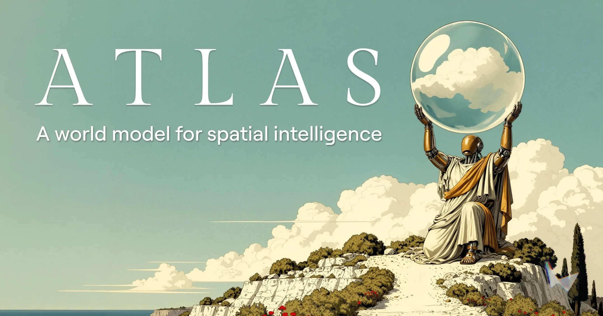
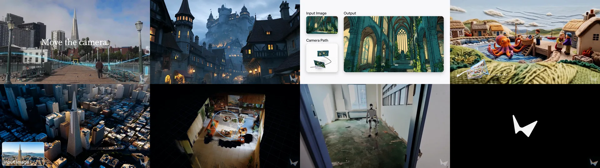
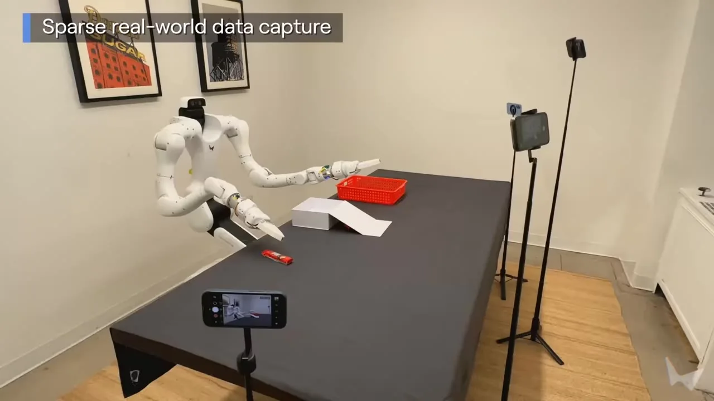

# World Labs Atlas 深度拆解：AI 视频的下一层不是更会动，而是可控的空间上下文

> **TL;DR:** World Labs 在 2026-09-01 发布 Atlas，把它定义为面向 spatial intelligence 的 omni world model。它不是单纯的视频生成器：Atlas 把文本、图片、视频、相机位姿和 3D 深度图放进同一个空间上下文里，用 autoregressive diffusion transformer 逐步生成后续图像、视频和 3D 输出。最重要的信号是：AI 视频正在从“按文字想象画面”进入“按空间坐标、相机路径和稀疏观测来构建世界”的阶段。对影视、游戏、设计、机器人和仿真工具来说，真正的新变量不是画面更漂亮，而是世界能不能被重拍、重建、编辑和模拟。

- **Source:** [Atlas: A World Model for Spatial Intelligence](https://www.worldlabs.ai/blog/atlas)
- **Published:** 2026-09-01
- **Product direction:** [Marble](https://marble.worldlabs.ai/)
- **Early access:** [Request early access to Atlas](https://form.typeform.com/to/zHFR4r3A)
- **Tags:** World Labs / Atlas / Spatial Intelligence / World Model / 3D Reconstruction / Camera Control / Real-to-Sim / Robotics / Gaussian Splatting

## 1. Atlas 不是把视频模型换个名字叫 world model

World Labs 对 Atlas 的定义很清楚：world models generate, reconstruct, and simulate any possible world。它们理解世界如何呈现、如何变化、如何演化，所以可以服务三类任务：创作想象世界、以高保真方式模拟真实世界、帮助机器人规划动作。

这句话容易被当成愿景口号，但 Atlas 这篇发布文真正有信息量的地方，是它把“world model”拆成了可执行的产品能力：

| 能力 | Atlas 官方描述 |
|---|---|
| Camera-controlled generation | 从一张或多张参考图生成新视角图片和视频，支持像素级相机控制，最长 1 分钟、1440p 输出 |
| Spatial reconstruction | 从一张到几十张真实图片重建场景，输出新视角帧和显式 3D 结果 |
| Space-time simulation | 从输入视频建模空间和时间，用于 VFX 重构镜头和机器人 real-to-sim |
| Image generation | 从文本生成图片和 360 全景，能跟随复杂 prompt 和渲染文字 |

这四项放在一起，说明 Atlas 的目标不是成为“更强的文生视频”。它想把视频生成、novel view synthesis、3D reconstruction、camera planning 和 robotics simulation 放到同一个模型框架里。

## 2. 关键概念是 spatial context，而不是 prompt

Atlas 的核心机制是 spatial context。World Labs 的说法是：Atlas 会把输入编码成上下文，但和 LLM 不同，每张图都被放在 3D 空间中的一个位置上。图像、视频帧、相机位姿和深度图不再只是“参考素材”，而是构成同一个空间场景的观测。

这带来一个很大的产品差异。普通视频模型里，用户主要通过文本描述镜头：pan、truck、crane、orbit、zoom。模型理解这些词以后，自己猜应该怎么运动。Atlas 则把精确相机几何当作原生输入类型。用户指定相机位置和角度，模型沿着这条路径生成世界中还没被看见的部分。

这也是为什么 World Labs 反复强调 camera path。Atlas 示例里，视频可以由 1 到 6 张输入图片和手工设计的相机路径生成。你不是只告诉模型“来一个电影感推进镜头”，而是在摆放参考帧、规划相机运动、让模型填补空间连续性。

这句话对创作者特别重要：你是在 staging the scene，不是在拉老虎机。这里的生产方式更接近虚拟摄影棚，而不是一次性 prompt 抽卡。

## 3. 一分钟 1440p 的意义是：可控长镜头开始变成规格项

World Labs 在长视频部分给了一个很具体的规格：用少量参考图片，手工设计相机路径，生成 1 分钟、1440p 的连贯世界。页面上其他视频为了加载速度做了压缩，但这个规格本身已经足够说明方向。

对 AI 视频来说，长并不只是时间更久。长镜头会把三个问题同时放大：

1. **空间一致性**：同一个房间、建筑、角色、物体是否能在镜头移动后保持位置关系。
2. **相机可控性**：模型是否真的跟随 path，而不是用视觉上相似的运动糊过去。
3. **遮挡和补全**：镜头绕到背面、走进室内、越过建筑时，未观测区域是否被合理想象。

传统文生视频的强项是局部视觉质量。Atlas 想解决的是“可反复拍摄的世界”。这会直接影响影视预演、广告分镜、游戏场景探索、建筑可视化和虚拟制作：用户不只是生成一个片段，而是保留一个能继续移动相机的空间上下文。

## 4. 稀疏重建是 Atlas 的第二个关键赌注

Atlas 的空间重建能力同样值得重视。World Labs 表示，Atlas 可以从一张到几十张输入图重建真实世界空间；当输入不足时，它会基于 world knowledge 补全不可见区域；当输入更多时，想象的成分减少，重建更忠实。

发布文给了几个很具体的边界：

| 场景 | Atlas 的官方说法 |
|---|---|
| 少量真实图 | 通常只用 2 到 3 张图就能得到较忠实的重建 |
| 更多输入 | spatial context 可以使用超过 100 张图片 |
| Stanford Main Quad 示例 | 从 2 到 25 张地面视角图片生成高空路径 |
| 输出形态 | 新视角 2D 帧、点云、3D Gaussian splats |

这部分的价值不只是“单图转 3D”。Atlas 同时生成新视角和估计几何，再把点云补全为可在设备上高分辨率、高帧率渲染的 Gaussian splat 场景。World Labs 特别指出，这和 Marble 使用的表示方式一致，因此 Atlas 会自然接入它们现有产品。

换句话说，Atlas 的 3D 输出不是附属功能，而是产品管线的一部分。它把“生成一张图”和“得到一个可浏览、可渲染、可继续编辑的空间资产”拉近了。

## 5. Robotics 部分才是 World Labs 长期野心

Atlas 的 space-time simulation 部分，把文章从创意工具推到了机器人训练。World Labs 展示了两类任务：

1. **Reframing video**：用 3 到 5 台普通手机或运动相机拍摄素材，Atlas 重建场景后，可以从不可能的角度重新观看动作，接近低成本 bullet time。
2. **Real-to-Sim**：用手机视频捕捉大环境，选取 24 帧做重建，然后模拟机器人沿不同路径移动时，机身摄像头会看到的 RGB 和 depth 数据。

这里的核心不是视觉特效，而是数据生成。机器人训练最贵的地方之一，是获得足够多、足够多样、又足够接近真实世界的交互数据。Atlas 如果能从少量真实记录里构建可变体仿真，就可以让团队改变物体、位置、机器人动作、灯光、背景，生成更多训练和测试环境。

这也是 World Labs 和普通视频生成公司最不同的地方。它们不是只在抢创作者市场，而是在把空间模型作为机器人数据引擎来做。视频 demo 是表层，real-to-sim-to-real 才是更大的系统问题。

## 6. 架构上的混合：LLM 的序列能力加 diffusion 的连续生成

Atlas 的技术描述很值得拆。World Labs 称它为 multimodal autoregressive diffusion transformer。这个名字有点长，但每个词都有含义：

| 组件 | 意义 |
|---|---|
| Multimodal | 当前可处理文本、图片、相机位姿、3D 深度图；视频被表示为图片序列 |
| Autoregressive | 按序列逐个生成新元素，每个输出都依赖前面的上下文 |
| Diffusion | 使用 rectified flow 逐步去噪生成高维连续数据 |
| Transformer | 依赖大规模矩阵乘法，适合现代硬件和规模化训练 |

这个组合的价值在于任务统一。对 Atlas 来说，不同任务只是不同序列：输入后面接输出，参考帧后面接新视角，相机路径后面接视频帧，视频观测后面接深度和 3D 表示。

World Labs 也明确把 Atlas 放在 LLM 和视频模型之间：它像 LLM 一样是 autoregressive transformer，因此可以借鉴 KV-cache、cache-aware routing、disaggregated serving 等推理系统技术；它又像现代图像 / 视频模型一样是 latent diffusion model，可以借鉴 diffusion distillation、classifier-free guidance、shifted noise schedules 和 VAE 设计。

这段信息很关键，因为它说明 World Labs 不是把一个视频扩散模型硬扩到 3D，而是在设计一个可以承载多种空间任务的基础架构。

## 7. Benchmark 要读方法，不要只读胜负

Atlas 发布文说它在两个方向上做了量化评测：camera-conditioned generation 和 3D reconstruction。World Labs 的结论是，Atlas 在这两项上都超过更专门的模型。

但这里最值得记录的不是“赢了谁”，而是评测方式：

| 评测方向 | 方法 |
|---|---|
| Camera-conditioned generation | 给模型单张输入图和 1 到 3 个电影镜头运动，由第三方人类评审判断谁更跟随目标相机路径 |
| 3D reconstruction | 给定图像和相机位姿，预测每个输入像素对应的 3D 点，并在多个基准上复现 baseline |

第一个评测有一个重要 caveat：其他视频模型没有原生相机输入，所以 World Labs 用文字 prompt 描述 camera path。官方也承认，更复杂的 prompt engineering 或 multimodal prompt 可能改善部分模型的表现。换句话说，这个评测测到的是“原生相机控制接口”相对于“文本描述相机运动”的优势，不只是模型视觉质量本身。

这并不削弱 Atlas，反而说明它的真正差异就在接口。AI 工具竞争到最后，输入控制方式会和模型能力一样重要。谁能把相机、空间、深度、参考图和时间组织成稳定的上下文，谁就能更接近专业工作流。

## 8. 早期接入意味着还不能按通用 API 来评估

Atlas 目前是 select partners early access。发布文没有公开完整 API、价格、模型尺寸、训练数据规模、推理成本、生成速度或商用 SLA。World Labs 也没有给出所有 benchmark 的完整数值表和独立复现包。

所以现在更合理的读法是：Atlas 是 World Labs 的技术路线宣言和产品预览，不是已经可以被所有开发者立即接入的通用基础设施。

如果团队想申请早期接入，我会优先验证下面几件事：

| 测试项 | 为什么重要 |
|---|---|
| 相机路径精度 | 看模型是否严格跟随位姿，而不是只生成类似运动 |
| 长镜头一致性 | 1 分钟视频里，角色、几何和物体关系是否保持 |
| 稀疏输入边界 | 1 张、3 张、10 张、50 张图时，想象和忠实重建的比例如何变化 |
| 显式 3D 可用性 | 点云和 Gaussian splat 是否能进入现有引擎、编辑器或 Web viewer |
| 深度输出质量 | 机器人仿真是否能使用，而不只是视觉上好看 |
| 失败可解释性 | 当重建错误时，能不能定位到相机位姿、输入视角不足还是模型幻觉 |
| 成本和速度 | 1440p、1 分钟、3D 输出如果太慢或太贵，会限制产品形态 |

对创意工具来说，Atlas 的问题是能不能让导演、设计师和技术美术真正控制世界。对机器人公司来说，问题是仿真数据能不能改善 policy training 和 evaluation，而不是只做漂亮 demo。

## 9. 结论：从生成画面到生成可操作世界

Atlas 的发布，把 AI 视频竞争推进了一层。过去一年，视频模型主要比拼运动自然度、画面审美、人物一致性、文字渲染和时长。Atlas 把问题换成了：模型是否拥有可被用户操控的空间记忆。

这会带来一个很实际的行业分化：

| 产品类型 | 未来竞争点 |
|---|---|
| 文生视频工具 | prompt 理解、镜头美感、低成本生成 |
| 专业创作工具 | 相机控制、参考素材管理、长镜头一致性、后期资产 |
| 3D / 游戏工具 | 可编辑场景、Gaussian splats、引擎集成 |
| 机器人平台 | real-to-sim、depth / RGB 合成、可变体训练环境 |
| 视觉基础设施 | 多模态序列推理、缓存、路由、长上下文空间状态 |

Atlas 现在还不是一个公开可用的通用 API，但它已经把 World Labs 的方向讲得很清楚：未来的 AI 视觉系统不会只生成一段视频，而会维护一个世界。你可以换相机、补视角、重建几何、模拟动作、导出 3D，再把它接进创作或机器人管线。

这也是 spatial intelligence 这个词终于开始变得具体的地方。它不只是“模型看懂三维世界”，而是模型能把少量观察组织成可继续拍摄、可继续推理、可继续操作的空间上下文。AI 视频的下一层，不是更会动，而是世界本身开始变成模型的工作对象。
