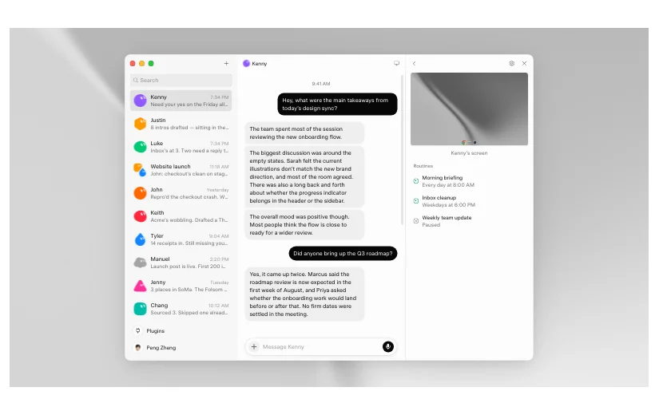
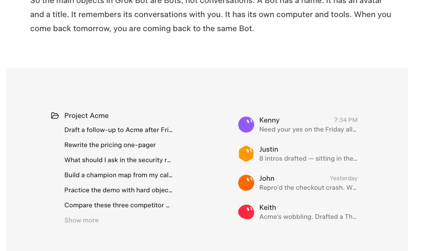
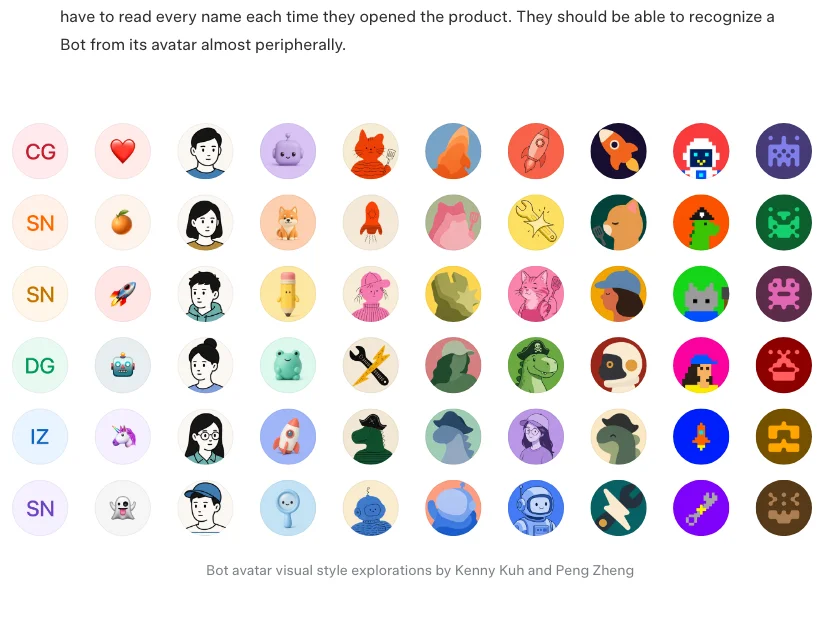
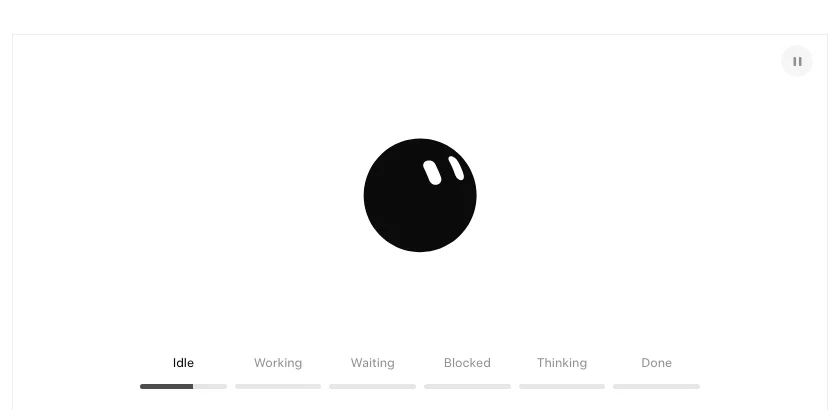
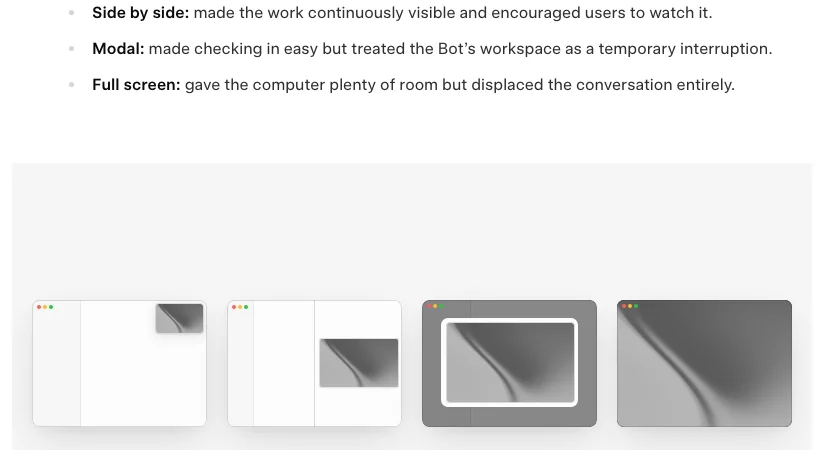
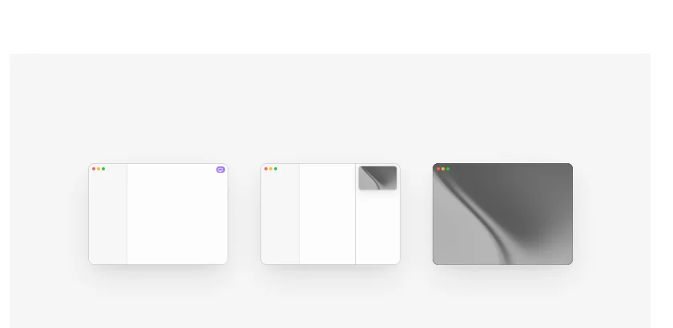
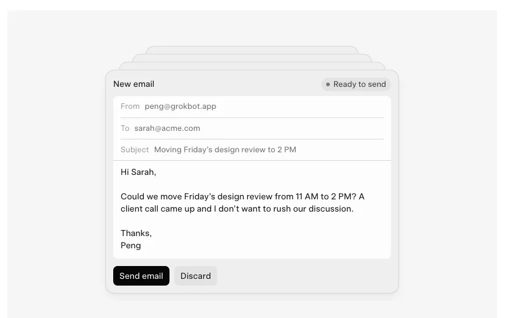
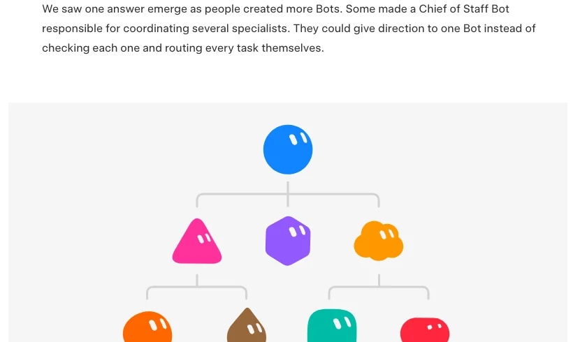
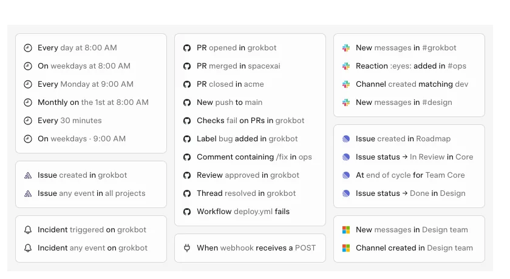

# Grok Bot 设计拆解：当 Agent 不再随会话消失，界面要做的是减法而不是加法

> **TL;DR:** SpaceXAI 在 2026-09-03 发了一篇 Grok Bot 的设计复盘。核心主张是:当 Agent 会跨会话存活、自己有电脑、还能在没人提示时开工,界面的基本对象就不该再是"会话"。他们把整个产品收敛到五个原语(Bot / Chat / Prompt / Tool / Artifact),用头像同时承载身份和六种生命周期状态,并且**刻意不展示完整执行日志**。全文最值得注意的不是他们加了什么,而是删了什么 —— 每一处删除都在减少"监督"这个动作的存在感。这是一个赌注:赌模型已经可靠到不需要你盯着。而这篇设计稿里没有任何关于可靠性的数据。

- **Source:** [Designing Grok Bot for a world of persistent agents](https://x.ai/news/designing-grok-bot)
- **Published:** 2026-09-03(SpaceXAI News)
- **Credits(文中署名):** Kenny Kuh、Peng Zheng(头像系统与壁纸)、Benji Taylor(头像动效)、Luke Barker(壁纸)
- **Topic:** 持久化 Agent / Agent 交互设计 / presence / Routines / 委派 vs 监督

## 一句话判断

**这篇设计稿真正的主线只有一条:每一个设计决策都在回答"界面应该邀请用户监督多少",而每一次答案都是"更少"。**

他们自己在结尾把话说明白了:到项目后期,大量设计工作是在**拿掉东西** —— 窗口和面板控件、电脑视图的各种选项、Agent 的元数据,全删。判断标准只有一句:这个东西是帮人**委派**,还是又给了他一件要**管理**的事?

这条线索能把全文串起来,也能暴露它最脆弱的地方。先看他们怎么做的。

## 五个原语:减法是从命名开始的

原文开头有一段很诚实的观察:AI 产品在很短时间里堆出了一大堆词汇 —— chat、session、model、context window、memory、system prompt、project、skill、connector、agent、tool、sandbox、permission、automation。每一个都对应系统里真实存在的部件,但**把每个部件都暴露成一个产品概念,等于要求用户理解得比他需要的多**。

他们最后留下五个:

| 原语 | 定义 |
|---|---|
| **Bots** | 持久化 Agent,有自己的身份、记忆、运行时和工具 |
| **Chats** | 与 Bot 协作的对话界面 |
| **Prompts** | 给 Bot 的上下文或指令;可以用一次、存成 Skill,或作为 Routine 自动触发 |
| **Tools** | 让 Bot 通过软件、API、connector、shell 或 computer use 获取信息和执行动作 |
| **Artifacts** | Bot 产出或修改的文档、设计、代码、数据等持久产物 |

注意 Prompt 这一条的处理最巧妙:**"用一次的提示词""可复用的技能""定时触发的自动化"在实现上是三种东西,在概念上被压成了一个**——都是 Prompt,区别只在于生命周期。用户不需要先学会"什么是 Skill"才能存下一段常用指令。

这是整篇文章里最可直接借鉴的一手:**减少概念数量,不等于减少能力,只是把能力的分类轴从"实现结构"换成"用户意图"。**

## 从会话列表到 Bot 名册

原文对 chat 的判断很直白:会话是**一次性的**。你为了解决一个问题开一个,它被挤到侧边栏下面,一周后你再开一个新的。你几乎不会回看最近五条以外的任何会话。

当交互单元是"一个问题"时,这个行为完全合理。但**当对面那个东西应该认识你、记得之前的工作、并且要长期承担责任时,这就变得很奇怪了。**

所以 Grok Bot 的主对象是 Bot,不是对话。Bot 有名字、有头像、有 title,记得和你的历史,有自己的电脑和工具。明天回来,你回到的是同一个 Bot。

这个切换看起来只是侧边栏换了内容,实际上改变了**责任的归属方式**。会话列表里,责任在每一次提问上;名册里,责任在一个持续存在的角色上。后者才可能积累"这件事一直是它在跟"的关系。

## 头像:既是身份,也是状态

一旦 Bot 变成需要长期维护的对象,它在界面里的呈现就得同时回答三个问题:**这是谁?它在干什么?我需要知道多少?**

**"这是谁"是个扫描问题。** 名册变长以后,他们不希望用户每次打开都得逐个读名字,而应该**靠余光就能从头像认出来**。同时头像之间又要足够统一,读起来像同一个系统。

他们研究了插画、动画、游戏和界面设计里的角色系统,试过首字母、emoji、像素画、水彩、粘土质感、则武风格线描、剪影、identicon。结论很有意思:**水彩和粘土给了单个 Bot 足够个性,但在侧边栏尺寸下细节太多;更简单的系统在界面里更自然,却让 Bot 们看起来可以互换。**

最终方案是:基本构造统一(简单形状 + 有表情的眼睛),差异化靠受控的变体和配饰。

**"它在干什么"则被塞进了同一个头像。** Bot 有六种状态:idle、thinking、working、waiting、blocked、done。他们本可以为每种状态做一个独立指示器,但那等于**再加一层需要用户解读的 UI**。于是他们让头像自己承载生命周期:静止时安静而略带好奇,任务到达时确认,开始工作时进入状态,等待或需要帮助时动作再变,完成后归于平静。

## 全文最值得争论的一处:他们拒绝展示执行细节

第三个问题"我需要知道多少",答案是这篇文章里最有争议的决策。

他们先否定了"三个跳动的点":信息太少,用户分不清 Bot 是在工作还是卡住了。然后他们试了**显示当前动作的一句话描述** —— 结果是:

> 一旦人们能看到一步,他们就想看到其余所有步。

而用户研究给出的解释是:**大家要这些细节,主要是为了确认 Bot 还在跑、方向没错 —— 是要"安心",不是要"控制"。**

于是最终设计的逻辑变成:头像的动效提供第一层安心(证明它是活的),想知道具体在干什么,**悬停**才看当前动作。

这个推理链条我认为值得停下来看一眼,因为它有一个隐含的替换:**用户要的是安心 → 所以我们给安心,而不给信息。**

动效确实能提供安心。但动效是**不可证伪的** —— 一个陷入死循环的 Agent 和一个正在稳步推进的 Agent,在头像层面长得一模一样。原文自己在否定"三个点"时用的理由恰恰是"分不清在工作还是卡住",而最终方案在这个具体问题上并没有比三个点强多少,只是**动得更好看**。

我不是说这个决策错了 —— 对 90% 的日常委派,这大概率是对的,完整日志确实会把人拖回监督者的位置。但它成立的前提是:**Bot 卡住是罕见事件。** 这个前提是模型能力问题,不是设计问题,而这篇文章从头到尾没有给出任何关于它的数据。

## "它的电脑,不是你的"

每个 Bot 有自己的电脑,可以浏览网页、处理文件、运行软件。问题是:这台电脑应该多可见?用户什么时候可以控制它?

他们试了四种布局,并且把每种的问题写得很清楚:

- **浮动窗口**:容易够到,但**盖住对话**;
- **左右并排**:工作持续可见,**鼓励用户一直看着**;
- **模态弹窗**:查看方便,但把 Bot 的工作区当成了**临时打断**;
- **全屏**:空间充足,但**完全挤掉对话**。

结论是一句很值得抄下来的话:**我们把电脑做得越显眼,产品就越是在鼓励用户去监督它。**

最终方案是三级访问,让用户能进入 Bot 的工作区,而不被拉进去操作它:

1. **Status** —— 电脑活跃时,标题栏图标变紫;
2. **Preview** —— 打开后是一个固定的侧面板,不离开对话就能跟进;
3. **Takeover** —— Bot 需要帮助时,可全屏接管,处理完再交还。

他们还给这台电脑做了随时间变化的壁纸:早上更亮,夜里更暗。理由是让 Bot 的电脑有**自己的时间感**,和用户的桌面区分开。

原文的比喻是:这更接近和同事共事,而不是操作一台远程机器 —— 你能看出他在工作,需要上下文时瞟一眼他的屏幕,有事需要你时才坐过去。

这个比喻很准,但也暴露了同一个前提:**你之所以不盯着同事的屏幕,是因为你信任他的能力和判断。** 界面可以先把信任的姿态摆出来,能力得由模型兑现。

## 回答的形态,也是回答的一部分

早期版本的 Grok Bot 几乎什么都用散文回答:描述一份五天预报,而不是把它画出来;叙述一组任务,而不是排成看板。用户拿到之后**还得自己重新结构化一遍**。

于是他们把"回答的形态"当成了答案的一部分:内建 inline card 和 widget,散文适合就用散文,不适合就用结构化 UI。

同一个原则也适用于**动作**:Bot 创建了 Routine、改了设置、给另一个 Bot 发了消息 —— 这些事件直接出现在 transcript 里,有细节可查时用户可以展开。

结果是一条**异质的时间线**:对话、系统事件、可交互对象、可视化共享同一条 transcript。

这一条对做 Agent 产品的人有直接价值:**当 Agent 会自主执行动作时,transcript 就不再只是聊天记录,而是审计日志 + 控制面板 + 对话的合体。** 把它设计成只能放文本,后面所有的可审计性都会被这个决定卡住。

## 能力与上下文的边界:这其实是一份权限模型

人一旦创建了多个 Bot,产品就必须回答:哪些上下文属于哪个角色?工作重叠时怎么共享?怎么协调它们而不把用户变成调度员?

他们观察到用户自己长出了答案:有人做了一个 **Chief of Staff Bot**,负责协调若干专才 Bot —— 给一个 Bot 下指令,而不是逐个检查、逐个派活。

由此定下的边界值得原样记住:

> **Tools 和 Skills 属于账号级**,因为很多 Bot 都需要浏览网页、处理文档、发邮件。
> **Memory 和 Routines 属于 Bot**,因为它们反映了这个角色随时间知道什么、做什么。
> 换句话说:**能力可以广泛共享,上下文留在需要它的角色那里。**

理由给的是信息质量:法务 Bot 需要争议历史,财务 Bot 需要多年财务记录,把它们合成一个大记忆,反而更难给每个 Bot 相关信息。这个理由是对的。

**但这条边界同时也是一份权限模型,而原文完全没有从这个角度谈它。** "Tools 属于账号级"翻译成安全语言就是:**哪个 Bot 能发邮件?全都能。** 一个由外部事件触发、拥有账号级工具、还能给其他 Bot 发消息的 Agent 集群,权限面是很大的。文章里没有出现 permission、approval、audit 这类词 —— 对一篇讲"Agent 会在你不在场时开工"的设计稿来说,这是个显眼的缺口。

跨角色的工作用**群聊**解决:共享项目上下文,同时每个 Bot 保留自己的专门记忆。他们**明确否决了**仪表盘、任务分派板和显式交接控件 —— 理由还是那条:每一个都在给用户增加协调工作。

## 工作不再从 prompt 开始

大多数 Agent 会话始于用户发出提示。**这等于让一个"持久"的 Bot 一直在等人来激活它。**

Routines 让用户给 Bot 一个常驻职责:按计划或按事件运行 —— 盯一个行业、每天早上准备简报。用户定义一次,Routine 在该发生的时候激活 Bot。

触发器清单本身就是信息量:除了定时(每天 8:00、工作日、每 30 分钟、每月 1 号),还有大量事件源 —— issue 创建、PR 打开/合并/关闭、推送到 main、PR 检查失败、加了 bug 标签、评论里含 `/fix`、review 通过、workflow 失败、**收到 webhook POST**、某频道有新消息、某条消息被加了 `:eyes:` 反应。

他们还提到一个过程细节:**Routines 最初被当作次要配置**,随着自主工作变得重要,才被移进 Bot 的主界面。

原文的结论句是:"提示可以开启一次会话,但计划、事件或另一个 Bot 也可以。**随着时间推移,越来越多的工作可能在用户完全不在场的情况下开始。**"

这句话值得和上一节连起来读:**账号级工具 + 外部事件触发 + Bot 之间可互相激活。** 三者叠在一起,意味着任何能制造一个事件的人(提一个 issue、发一条频道消息、打一个 webhook),都能启动一个持有你账号能力的 Agent。这是提示注入的经典地形。设计稿没有讨论它。

## 消失的界面:两个数字

最后一节最短,但信息密度最高。除了那些删除,他们给了全文**仅有的两个硬数字**:

- 每个账号大约 **50 个 Bot** 上限;
- 每个群聊 **6 个 Bot** 上限。

50 这个数字透露了他们设想的常态:**不是养一两个助手,而是养一个编制。** 6 这个数字则是协调复杂度的经验值 —— 超过它,群聊里的多 Agent 对话大概就不可读了。

收尾那句话是这篇文章的立场声明:

> 操作 AI 和委派给同事之间的那条线,会随着模型变强而不断移动。Grok Bot 反映的是我们认为它今天所在的位置。

**"我们认为"是关键词。** 这条线的位置是个经验判断,不是测量结果。

## 和本站此前那篇拆解的对照

这个 repo 在 [2026-08-23](../2026-08-23/2026-08-23-grok-bot-018-reconstructed-agent-runtime.md) 写过 Grok Bot 0.18 的非官方重建项目。两篇放在一起读有意思:

- 这篇官方设计稿讲的是**意图**:"每个 Bot 有自己的电脑",三级可见性,不鼓励监督。
- 那个重建项目暴露的是**边界**:Electron main 之下有 remote box connector 和 owned local Docker connector,再往下是 coordinator + host。

也就是说,"Bot 的电脑"在实现上是一个**可远程可本地的沙箱连接层**。设计上它被包装成"同事的屏幕",工程上它是一个需要被沙箱、被审计、被限权的执行环境。**设计语言在弱化它的存在感,而安全工作恰恰要求它的存在感。** 这两者不必然矛盾,但产品团队需要知道自己在同时做这两件事。

⚠️ 需要说明:那个重建项目是非官方的第三方工作,其对上游归属的描述是该仓库自己的说法,不构成对本文所述官方产品实现的确认。上面的对照是两份公开材料之间的结构相似性观察,不是等号。

## 对做 Agent 产品的团队意味着什么

**一、先定原语,再定界面。** 五个原语这一步是整篇文章里最可复制的方法论。列出你产品里所有暴露给用户的概念,然后问每一个:用户不理解它能不能用?能,就沉到界面之下。

**二、状态要有,细节要可选。** 头像承载六态 + 悬停看当前动作,是个可抄的分层:**常态给存在感,按需给信息量。** 但请给"卡住"留一个比动效更强的信号 —— 这是原方案我认为最需要补的地方。

**三、显眼程度决定行为。** "电脑做得越显眼,越是在鼓励监督"这条,可以推广到任何 Agent 产品的每一个面板:**你把什么放在显眼位置,就是在要求用户对什么负责。**

**四、transcript 是审计日志。** 从第一天就按"对话 + 系统事件 + 可交互对象"来设计它,而不是先做聊天记录再往里塞卡片。

**五、能力与上下文分开定边界之后,记得再从权限角度审一遍。** 账号级工具是个好的默认,但它需要配一套 Bot 级的授权,否则"每个 Bot 都能发邮件"就成了事实上的能力泄漏。

## 需要自己验证的部分

- **这是设计复盘,不是产品评测。** 全文没有可靠性数据、错误率、takeover 触发频率,也没有用户研究的样本和方法。所有"我们发现用户……"都是无法核对的自述。
- **文中所有界面都是官方演示物料。** 本文配图是从官方页面抓取的渲染结果(部分区块在页面上是动效,截图只能定格在某一态,如头像那张停在 Idle),不代表实际使用中的表现。
- **两个数字的性质不明。** ~50 Bot / 6 Bot per group chat 没说是硬限制、软限制还是当前版本的临时值。
- **安全与权限完全缺席。** 一个支持 webhook 和第三方事件触发、持有账号级工具的 Agent 系统,其权限模型、审批流和注入防护都不在这篇文章的范围内 —— 落地评估时必须单独找材料。
- **公司名与产品线。** 页面页脚署名 SpaceXAI LLC,产品线包含 Chat / Build / Imagine / Voice / Bot / Grokipedia;引用时以当时页面为准。

## 结论

这篇设计稿的价值不在于它展示了多漂亮的头像系统,而在于它**把"持久化 Agent"这个抽象概念翻译成了一串具体的、互相咬合的界面决策**:主对象从会话换成角色、状态挤进头像、执行细节默认折叠、Bot 的电脑保持是 Bot 的、回答的形态成为答案的一部分、能力共享而上下文隔离、工作可以在你不在时开始。

这七条合起来是同一个方向:**把用户从操作员的位置上移开。**

方向我认同。但整套设计的地基是一个未被言明的假设 —— 模型已经好到值得这种程度的放手。设计可以先走一步,把姿态摆出来;代价是当模型没跟上时,用户手里恰好少了那些用来发现问题的工具。这篇文章最后一句说"随着 Agent 承担更多责任,界面应该向人索取更少"。这句话的另一半是:**界面向人索取得越少,模型就必须给得越多。**
