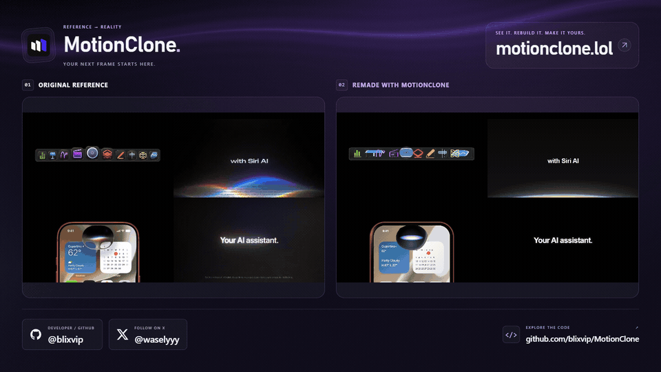
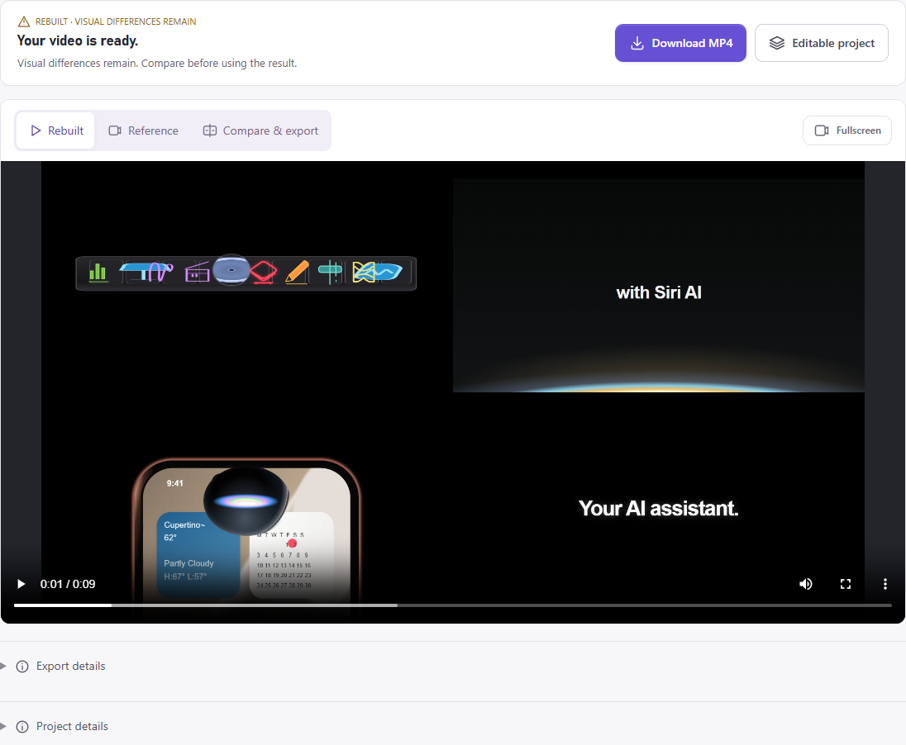
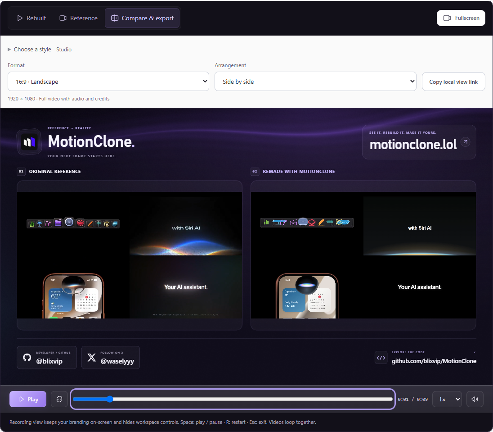

# MotionClone Deep Dive: Not a Remotion Skill, but an Agent Pipeline That Compiles Reference Video Into Editable HyperFrames Layers

> **TL;DR:** MotionClone is neither a new video-generation model nor merely a prompt skill for Remotion or HyperFrames. It is an application. Given a reference clip, OpenCV and FFmpeg inspect the video and select informative frames. Codex and ChatGPT then produce text, shape, SVG-path, and keyframe data under a strict schema. HyperFrames, GSAP, Chrome, and FFmpeg render the result. The system compares rebuilt and source frames before exporting a rebuilt MP4, a comparison video, or an editable project. MotionClone addresses the middle problem of having motion you like but no source project. It cannot recover the original author's true layers, and a similarity score is not proof of a one-to-one reconstruction.

- **Project:** [blixvip/MotionClone](https://github.com/blixvip/MotionClone)
- **Online studio:** [motionclone.lol](https://motionclone.lol)
- **First published:** September 10, 2026 UTC
- **Checked:** September 13, 2026
- **Inspected revision:** [12618d6](https://github.com/blixvip/MotionClone/commit/12618d665316bf645b9face50c278b2e1595ad02)
- **Repository snapshot:** 16 commits, 133 stars, 8 forks; no tags, GitHub Releases, or project-wide open-source license

## The short answer

The most accurate description of MotionClone is: **a reference-driven motion-reconstruction application that uses a vision model to author structured scene data and a web-video engine to render it deterministically.**

It is not a Remotion skill. It has its own local web interface, FastAPI service, media ingestion, task state, caching, comparison player, project library, and export pipeline. It is not HyperFrames either. HyperFrames turns HTML, CSS, media, and seekable animation into video; MotionClone performs the reference analysis and layer reconstruction before rendering, then handles comparison, acceptance, and packaging afterward.

Its four main actors are easy to separate:

| Component | Responsibility inside MotionClone |
|---|---|
| Codex + ChatGPT | Inspect selected reference frames, author constrained scene JSON, and propose bounded corrections for weak scenes |
| OpenCV + FFmpeg | Download, probe, normalize, scan motion, sample frames, encode, preserve audio, and verify outputs |
| HyperFrames + GSAP + Chrome | Render text, shapes, SVG, and keyframe timelines as deterministic video frames |
| MotionClone | Orchestrate the workflow and provide the UI, comparison tools, project library, and exports |

This makes MotionClone closer to a reference-video compiler than a video model. A flattened MP4 is the input, the model authors an intermediate representation, and the renderer turns that representation into an editable project and final video.

## What actually happens between MP4 and editable project

The README compresses the experience into Add reference, Rebuild, and Compare & export. The implementation is more substantial:

1. Import a clip from X, YouTube, Vimeo, a direct URL, or a local file.
2. Use ffprobe to validate dimensions, frame rate, duration, audio, and variable timing, then normalize it into a seekable MP4.
3. Scan every decoded frame at reduced resolution with OpenCV and record visual changes.
4. Divide the clip into scenes of roughly six seconds, or about three seconds in Detailed mode.
5. Select 16 or 24 images per scene, prioritizing cuts, flashes, and their neighboring frames.
6. Send up to three scenes to Codex in parallel and require Pydantic-valid layer JSON.
7. Merge the scenes and write a HyperFrames-renderable project containing HTML, CSS, SVG, GSAP, and project.json.
8. Render checkpoints in Chrome and compare them with source frames at matching timestamps using SSIM.
9. Offer one bounded revision to the two weakest scenes and keep the original version if the patch regresses.
10. Render a PNG sequence with HyperFrames, encode it with FFmpeg, restore source audio when requested, and write verification plus an editable ZIP.

The application does not ask one model call to watch, code, render, and judge the whole clip. Perception, generation, execution, and acceptance live in different modules, with intermediate artifacts persisted to disk.

## It does not send every frame to the model

MotionClone's media.py inspects every decoded frame, but inspection is not the same as uploading every frame to ChatGPT.

The scanner shrinks frames to roughly 160 pixels wide, measures adjacent-frame deltas, and marks possible cuts, flashes, or fast changes. The standard sampling budget is 192; Detailed mode uses 384. A single scene usually attaches no more than 16 or 24 images. Regular temporal samples provide coverage, while detected jumps and neighboring frames help preserve short effects.

This is a sensible token and latency architecture. Cheap computer vision scans the entire clip, while the vision model receives a sparse set of higher-value evidence.

The boundary is equally clear. Pixel change says that something changed, not whether the cause was a camera move, mask, 3D transform, particle effect, motion blur, or hard cut. The code explicitly notes that a flattened reference cannot reveal hidden layers and effects. Sampling can still miss details that last only one or two frames; Detailed mode reduces that risk but cannot remove it.

## The key engineering decision: model output is data, not arbitrary code

MotionClone puts tighter boundaries around Codex than a generic request to build a web animation.

The default reconstruction path invokes the official Codex CLI with an ephemeral session and a read-only sandbox. Shell tools, unified execution, plugins, apps, and skill search are disabled. The prompt defines reference images as design data rather than instructions and tells the model not to call tools, read files, or execute commands.

The model cannot return a free-form application. It must return SceneProject JSON:

- layer kinds are limited to text, rect, ellipse, path, and group;
- every layer has a start, end, and timed Pose values;
- SVG paths accept only a restricted path character set;
- CSS is limited to an allowlist;
- URLs, JavaScript, expression, HTML tags, and imports are rejected;
- hierarchy, identifiers, timing, coordinates, and collection sizes are validated by Pydantic.

Only after validation does MotionClone's own template write project.json, project.js, renderer.js, and index.html. This makes generation resumable and patchable while narrowing the chance that prompt injection inside a reference frame becomes arbitrary local code.

It is not a zero-risk design. Selected frames still leave the machine for ChatGPT analysis, the workflow depends on an online model service, and valid structured data can still contain visual mistakes. The meaningful improvement is a smaller authority and output surface, with failures more likely to be caught at validation.

## How HyperFrames and Remotion fit

This is where the repository is easiest to misread.

**HyperFrames is the current default rendering substrate.** HeyGen's open-source framework converts HTML, CSS, media, and seekable animation into deterministic frame-by-frame video. MotionClone pins HyperFrames 0.8.33 and GSAP 3.14.2, then writes projects that can be previewed and rendered outside the application.

**Remotion is not the main path.** The repository does contain a remotion directory, React compositions, render.mjs, and Remotion 4.0.522. It also retains a legacy rebuild and export branch. The development guide calls Remotion an optional renderer for legacy projects. Describing MotionClone as a Remotion skill misses its perception, schema, resume, comparison, and export layers, and it misstates the default stack.

| Tool | Primary input | Main output | Position in MotionClone |
|---|---|---|---|
| Remotion | React components and data | Programmatic video | Optional renderer for legacy projects |
| HyperFrames | HTML, CSS, media, and seekable animation | Deterministic video and a web project | Default renderer |
| MotionClone | A flattened reference clip | Rebuilt MP4, comparison MP4, editable HyperFrames ZIP | Analysis and workflow application above the renderer |

Remotion and HyperFrames answer how code becomes video. MotionClone tries to answer where the first editable code comes from when the only source is a reference video.

## The visual feedback loop matters more than one-shot generation

scene_pipeline.py does not accept the first valid JSON response as success. It opens the reconstructed page with Playwright, captures several timestamps per scene, extracts matching frames from the source, and computes structural similarity.

The two scenes with the lowest mean scores can receive one correction pass if their score is below 0.96 and the time budget allows. Codex sees ordered source and current-rebuild images and may return a small patch that changes, adds, or removes at most 12 layers. The patch is accepted only if mean similarity improves by at least 0.002 without a material drop in the weakest frame.

The final verification report records frame count, dimensions, frame rate, audio state, mean and minimum SSIM, and worst frames. An independent reconstruction is labeled near perfect only when mean SSIM reaches 0.97 and minimum SSIM reaches 0.90.

That is a useful feedback loop because it replaces the model's own impression with comparable output. SSIM still measures pixel structure, not textual correctness, brand accuracy, motion quality, or semantic editability. The README repeatedly warns that visual differences remain. Synchronized human review remains the real acceptance test.

## Four kinds of success must remain separate

MotionClone exposes several outcomes that are easy to conflate:

1. **Rebuilt video only:** an MP4 rendered from independent text, shapes, SVG, and keyframes.
2. **Editable project:** a ZIP containing HyperFrames code, project.json, fonts, assets, and optional audio. The reference video and screenshots are excluded.
3. **Comparison MP4:** a presentation video arranging source and reconstruction side by side, stacked, or with the rebuild emphasized.
4. **Faithful or source-backed mode:** a high-fidelity HyperFrames render that reuses every frame of the source video but does not independently reconstruct text, objects, or effects.

The fourth distinction is crucial. It can produce excellent frame similarity because source.mp4 is the visual layer. That is not recovered editability. The implementation keeps source_backed, independent_visual_layers, and visual_match as separate manifest fields so the product does not silently equate rendering with reconstruction.

## The output includes a proof format

MotionClone offers Studio, Editorial, Signal, Cobalt, Peach, and Monochrome comparison styles, plus landscape, portrait, and square exports. Users can select side-by-side, stacked, or rebuild-focused arrangements and preserve source audio in the comparison MP4.

This is separate from reconstruction quality, but it is a good product decision. The most credible way to communicate whether a reference was matched is rarely a standalone result. It is synchronized playback, one scrubber, and optional slow motion. MotionClone puts generating the artifact and demonstrating the artifact in the same workspace.

## Local and hosted privacy are not the same

The documented local application currently targets Windows and requires Git, Python 3.11+, Node.js 22+, FFmpeg and ffprobe, Google Chrome, and the official Codex CLI. It uses the user's codex login instead of an API key. Projects and media stay under the local data directory, but selected reference frames are sent to ChatGPT and URL imports contact the source service. It is not an offline application.

The online studio is in early access. Its public page says users must sign in, connect ChatGPT separately, and depend on an available processing worker. Hosted videos and account connections are stored privately on its processing computer; disconnecting removes its ChatGPT access. Sensitive-media decisions should not assume that the local and hosted deployments have the same boundary.

Reference reconstruction also creates copyright and brand questions. The repository instructs users to work with footage they own or have permission to adapt. Technical access to a public advertisement is not a license to clone, redistribute, or commercialize it.

## An engineered but very early project

As of September 13, the repository was only a few days old, with 16 commits and no tags or GitHub Releases. It contains 63 Python test functions, 19 browser acceptance scripts, and Node tests for Remotion motion interpolation. During this review, every app module passed Python syntax compilation and both Node motion tests passed. The full Python suite was not run because pytest was not installed in the review environment.

The larger practical limitation is that **the repository has no project-wide LICENSE**. Its own README warns that no blanket open-source or redistribution rights have been granted. HyperFrames, Remotion, GSAP, and bundled fonts retain their respective licenses, but those licenses do not automatically cover MotionClone as a whole.

The right current label is therefore public source and locally testable early product, not a mature open-source package with stable releases and established commercial terms.

## Where it fits, and where it does not

MotionClone is a promising fit for:

- product-launch motion dominated by text, panels, icons, and geometry;
- title entrances, feature callouts, data cards, and simple logo motion;
- references whose timing should survive while copy, color, brand, and layout change;
- turning visual inspiration into an editable project a coding agent can refine.

It should not be expected to:

- recover an original After Effects, Figma, or 3D project from pixels;
- faithfully rebuild photography, people, complex materials, particles, or real 3D;
- produce a full product demo from a script without separate screen recording and editing;
- make unauthorized one-to-one copies of public commercial work;
- replace frame-by-frame human review with one SSIM number.

A practical workflow is to trim a clear five-to-fifteen-second reference, create a first pass, inspect copy, geometry, transitions, and the ending in Compare, download the editable project, ask Codex to apply the real brand assets and timing changes, and then combine the motion with genuine product footage in a normal editing pipeline.

## Conclusion

MotionClone matters because it fills a missing step in programmatic video production, not because it adds another AI video button.

Remotion and HyperFrames already turn code into reproducible video, and coding agents can already author animation code. The difficult middle problem is translating flattened pixels into an editable, verifiable project when the user has only a reference. MotionClone offers a coherent answer through full-frame scanning, sparse visual evidence, a structured layer schema, scene checkpoints, bounded visual revision, and output verification.

Its limits remain those of an early project: Windows is the only documented local target, hosted-worker availability is variable, the repository has no project-wide license, and flattened video cannot reveal the original scene graph. The direction is nevertheless clear. An AI motion workflow does not have to begin with a blank prompt. It can begin with, “I like how this moves; turn it into a project I can inspect, own, and change.”

## Sources

1. MotionClone repository and README
   https://github.com/blixvip/MotionClone

2. MotionClone online studio
   https://motionclone.lol

3. MotionClone scene analysis and bounded visual revision
   https://github.com/blixvip/MotionClone/blob/12618d665316bf645b9face50c278b2e1595ad02/app/scene_pipeline.py

4. MotionClone constrained scene schema and Codex invocation
   https://github.com/blixvip/MotionClone/blob/12618d665316bf645b9face50c278b2e1595ad02/app/rebuild_author.py

5. MotionClone HyperFrames rendering and verification
   https://github.com/blixvip/MotionClone/blob/12618d665316bf645b9face50c278b2e1595ad02/app/reconstruction.py

6. HyperFrames official documentation
   https://hyperframes.heygen.com/introduction

7. Remotion official website
   https://www.remotion.dev/
