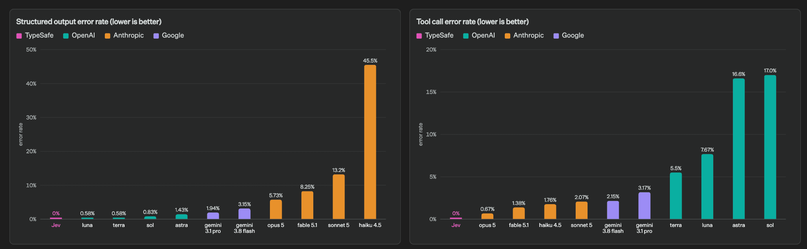

# TypeSafe Jev Deep Dive: Giving Up Text Generation to Become a Probabilistic If-Statement for Software

> **TL;DR:** TypeSafe AI's Jev is neither a chatbot nor an ordinary LLM wrapped in JSON Schema. It receives text or JSON state plus predefined `Noul`, `Choice`, and `Score` questions, then returns fixed-type answers, probability distributions, and confidence. TypeSafe says this System One Model uses parallel sampling and Reinforcement Learning for Calibrated Decisions (RLCD) to place semantic judgment inside ordinary code at 70–500ms latency and $0.042 per million input tokens. The defensible breakthrough is that a closed output space prevents schema and tool-call shape errors. Semantic accuracy, probability calibration, cross-domain generalization, and sustainable pricing still require independent evidence.

- **Publisher:** [TypeSafe AI](https://typesafe.ai/)
- **Launch post:** [Introducing System One Models & Jev](https://typesafe.ai/blog/introducing-system-one-models-and-jev)
- **Author:** Diogo Almeida, founder of TypeSafe
- **Published:** September 15, 2026
- **Product status:** Jev early access; hosted API; model weights not published
- **Public developer components:** Python and TypeScript SDKs, Agent Skill, and System One LLM Adapter, all MIT-licensed
- **Checked:** September 16, 2026


## The short answer

The interesting part of Jev is not that it is another faster model. It deliberately gives up the capability most associated with LLMs: **free-form string generation.**

An ordinary LLM exposes a text-to-text interface. Even with structured output enabled, the underlying job remains token-by-token generation, followed by schemas, parsers, retries, and application code that compress a string back into a finite state. Jev changes the interface to:

```text
unstructured or structured state + finite answer spaces
                                  ↓
typed decisions + distributions + confidence
```

That makes it resemble a learnable, uncertainty-aware function call rather than an assistant. TypeSafe describes the shape as “smart if-statements”: the neural model handles fuzzy semantics while normal code controls flow, weights, thresholds, and side effects.

## System One is not merely a faster System Two

The name borrows from Daniel Kahneman's System 1 and System 2 distinction. Here, System One means a fast, focused, intuitive judgment. It does not write replies, generate code, or explain reasoning.

Jev is designed for questions that a knowledgeable person could answer in seconds when given sufficient context:

- Does this email convey urgency?
- Should the ticket route to billing, technical, or sales?
- Which defined level best describes customer frustration?
- Does this agent trace require human review?

It is not designed to “analyze everything and recommend the best course of action” in one request. Complex tasks must become several independent judgments composed by code. Jev does not eliminate workflow engineering; it makes workflow design the central product asset.

## Three primitives define what it can say

The current API exposes three question primitives:

| Primitive | Question shape | Return | Typical use |
|---|---|---|---|
| `Noul` | Yes or no | Probability of yes, from 0 to 1 | Fraud, urgency, whether a skill is mentioned |
| `Choice` | One item from a closed set | Selected item, all option probabilities, confidence | Intent classification, routing, document type |
| `Score` | Rating across ordered levels | Interpolated score, level probabilities, confidence | Severity, risk, sentiment, quality |

A request may mix all three. Every question sees the same `state`, but is evaluated independently; an earlier answer does not become hidden context for a later question. TypeSafe recommends sending every question that can use the same state in one request, including speculative questions that application code may ignore.

The documented request budget is about 32,000 tokens, roughly 150,000 English characters. `Choice` cardinality reaches 255; larger sets require an independent scoring stage followed by explicit selection. Jev currently evaluates text or JSON state, not images.

## Confidence is not the model saying “I feel 95% sure”

For `Choice` and `Score`, confidence is a statistic derived from the full probability distribution, not another self-assessment. A concentrated distribution produces high confidence. A flat one suggests no clear winner, ambiguous criteria, or insufficient evidence. A `Noul` is already P(true), so it has no separate confidence field.

Two layers matter:

1. **Probability** says how much mass each outcome receives.
2. **Calibration** requires events assigned 0.8 probability to occur about 80% of the time over many predictions.

Calibration applies to groups of predictions. It cannot guarantee that one 0.99 answer is correct. TypeSafe's own documentation recommends risk-dependent thresholds: low-risk read operations may run automatically, while transfers, bans, and deletion should retain confirmation or human review even at high confidence.

This is more operationally useful than asking an LLM to append “confidence: 95%” to prose. Teams still need calibration curves, Expected Calibration Error, Brier scores, and false-positive/false-negative analysis on their own traffic.

## Why parallel output may genuinely be faster

Autoregressive LLMs generate token N after tokens 1 through N-1. Longer answers require more decoding steps. Even when answering 30 classification questions, the model must still spell out labels, probabilities, field names, commas, and braces token by token.

TypeSafe says Jev uses a new architecture and parallel sampler to produce all decision distributions in one query. It generates no explanations, repeated field names, or closing delimiters, so additional independent questions have little latency cost. The company calls this speculative fan-out: send the state once and evaluate tens or hundreds of judgments in parallel.

The launch page publishes these figures:

| Metric | Official Jev figure |
|---|---|
| Input price | $0.042 per million tokens |
| Output price | Free, described as too cheap to meter |
| End-to-end latency | 70–500ms |
| Relative claim | 40–200x faster on System One-shaped queries |

The numbers have a plausible architectural explanation, but they are not an independent benchmark. TypeSafe says latency measurements generally originate from employee laptops on the US West Coast, where its service is currently hosted. Whether launch pricing is subsidized can only be established over time.

## RLCD publishes the objective, not the recipe

TypeSafe calls its training method Reinforcement Learning for Calibrated Decisions:

- RLHF optimizes chat responses people prefer;
- RLVR optimizes results that programs can verify;
- RLCD optimizes decisions and calibrated probabilities over closed answer spaces.

The objective is clear: higher probability should correspond to a higher empirical chance of correctness, and persuasive prose should provide no reward. At launch, however, TypeSafe had not published Jev's parameter count, base model, detailed architecture, training data, RLCD loss or reward design, calibration method, training compute, model weights, or a technical paper.

“New architecture” and “new training method” are therefore company claims, not independently reproducible research results. The acronym also has a prior, unrelated use: a 2023 alignment paper named Reinforcement Learning from Contrast Distillation. TypeSafe's Calibrated Decisions method is different.

## Workflow eval does not measure general intelligence

TypeSafe did not place Jev on conventional chat, mathematics, or coding leaderboards. It built four workflow evaluations:

- Security Incidents;
- Agent Trace Observability;
- Invoice Processing;
- Customer Service.

Each task becomes a fixed compute graph. Code handles deterministic rules; models answer narrow questions. Every model receives the same workflow. Reference labels are not human ground truth. They are the average probabilities produced by GPT-6 Astra and Claude Fable 5.1 at high thinking for every question.


The chart places Jev at about 67.8% mean accuracy, below some expensive models but at roughly $0.0004 per workflow. The homepage claims of 193.6x faster and 444.6x cheaper come from the upper-end gaps in this evaluation. The launch post itself says those are likely near the high end of real-world gains.

Three aspects of the evaluation are constructive:

1. The workflow is fixed instead of giving each model a different harness.
2. It compares a decomposed workflow with one prompt asked to perform all logic.
3. It publishes tasks, queries, disagreements, and cost rather than only a leaderboard.

Four limitations remain:

1. TypeSafe's capability team authored all four workflows, so they may fit the product's native shape.
2. “Correct” means agreement with two frontier models, not observed business outcomes.
3. Evaluated LLMs use default reasoning while reference models use high thinking.
4. The comparison covers System One-shaped tasks and cannot establish equal general intelligence.


The useful conclusion is not that Jev defeats frontier models. It is that free-form text generation may be an unnecessarily general and expensive compute shape when a task decomposes into many independent judgments.

## “Cannot hallucinate” needs a narrower definition

The launch post says Jev “can't hallucinate,” while its own chart shows imperfect accuracy. These claims coexist only because hallucination is being narrowed to output-contract failure.

The caller defines Jev's answer space in advance, so it cannot:

- invent an enum member;
- omit a required field;
- return prose where a number belongs;
- produce a tool call outside the schema;
- drift into explanations, refusals, or Markdown.

Those structural errors can be eliminated by design. Jev can still choose the wrong legal option among `billing`, `technical`, and `sales`, or assign high probability to an incorrect answer. That is a **semantic error**, not a type error.



Jev's 0% bar is not an observed sample rate. TypeSafe explicitly says the figure is “not empirical”: schema matching is guaranteed, so the chart assigns 0%. That is a strong and falsifiable structural guarantee. It does not establish zero factual or decision errors.

## The real difference from LLM structured output

OpenAI, Anthropic, and other APIs can already return JSON Schema-constrained values through structured output and tool calling. TypeSafe even open-sourced `system-one-adapter-python`, which maps ordinary LLMs into the same `Noul`, `Choice`, and `Score` interface for comparison.

The distinction is not whether JSON is possible. It is what the model is optimized to do:

| Route | Model objective | Output production | Failure handling |
|---|---|---|---|
| LLM plus structured output | General text and reasoning | Autoregressive constrained JSON | Schema constraints, parsing, retries, probability normalization |
| Jev | Typed decisions and calibrated probabilities | Officially described as parallel answer generation | Output space is intrinsically constrained; no text repair |

An LLM retains open-ended reasoning, explanation, code, planning, and the ability to generate new answers. Jev offers fixed answer spaces, high fan-out, low latency, and a probability-native interface. The likely architecture is a cascade: Jev classifies, routes, scores, guards, and verifies; a low-confidence or genuinely generative case escalates to a reasoning model or person.

## The practical place inside an agent product

Jev looks less like an agent's brain than a fast control plane inside its runtime:

- assess intent, permissions, and risk before every tool call;
- decide whether an execution trace needs human review;
- score RAG documents for relevance, contradiction, and prompt injection;
- shortlist skills before a reasoning model reads a few full definitions;
- implement confidence-gated routing for support, risk, billing, and security;
- act as a cheap verifier that accepts, retries, or escalates expensive generation.

That changes the cost model. Instead of sending every semantic task to one expensive LLM, a system can move most narrow decisions into a low-latency layer and reserve generative models for difficult cases.

Reliable implementation still requires questions, options, thresholds, and rules to be centralized, versioned, and replayed against real traffic. TypeSafe's own Agent Skill concedes that coding agents are not great at authoring questions in one pass. Developers should edit them collaboratively and keep questions and threshold constants in one reviewable file.

## What cannot yet be concluded

Jev remains in early access. This review did not have a TypeSafe API key, so it did not independently reproduce latency, pricing, availability, or calibration. Current public evidence does not establish:

- whether 70–500ms remains stable across regions, concurrency, and long state;
- whether $0.042 per million tokens is sustainable pricing;
- whether calibration holds on private enterprise data, non-English text, or distribution shift;
- whether independent questions truly remain invariant as shared state becomes dense;
- how accuracy behaves near the 32K token budget;
- whether the architecture, training data, and RLCD method can be reproduced;
- whether retention, compliance, and SLAs meet high-stakes production requirements.

Open-source SDKs and Agent Skills do not make Jev an open model. Developers can audit clients, types, and retries, but the hosted model remains a black box.

## Conclusion

Jev presents a serious alternative shape for production AI. Intelligence does not necessarily need to produce an infinitely flexible string first and then be forced back into software. It can be trained from the outset as a finite, probabilistic, composable decision interface.

The trade is deliberate: general generation is exchanged for structural guarantees, parallel efficiency, and probabilities that code can route on. The strongest current result is not “zero hallucination,” but **zero schema escape**. The open question is whether those probabilities remain honest and stable on real business distributions, and whether Jev consistently beats cheaper classifiers or LLM structured output over time.

If TypeSafe can demonstrate calibration, transfer, and sustainable economics on third-party data, System One Models could become a new layer in agent infrastructure. They would not replace reasoning models. They would give semantic judgment to the enormous class of if-statements that have historically been too fuzzy for code and too cheap to justify an LLM.

## Sources

1. TypeSafe AI, “Introducing System One Models & Jev”
   https://typesafe.ai/blog/introducing-system-one-models-and-jev

2. TypeSafe documentation: System One
   https://docs.typesafe.ai/concepts/system-one

3. TypeSafe documentation: Primitives
   https://docs.typesafe.ai/primitives

4. TypeSafe documentation: Confidence
   https://docs.typesafe.ai/confidence

5. TypeSafe Workflow Evals
   https://evals.typesafe.ai/

6. TypeSafe AI primer and RLCD description
   https://docs.typesafe.ai/introduction/machine-learning-primer

7. TypeSafe System One Adapter for LLM comparisons
   https://github.com/typesafe-ai/system-one-adapter-python

8. TypeSafe Python and TypeScript SDKs
   https://github.com/typesafe-ai/typesafe-sdk-python
   https://github.com/typesafe-ai/typesafe-sdk-js

9. Prior, unrelated RLCD paper: Reinforcement Learning from Contrast Distillation
   https://arxiv.org/abs/2307.12950
