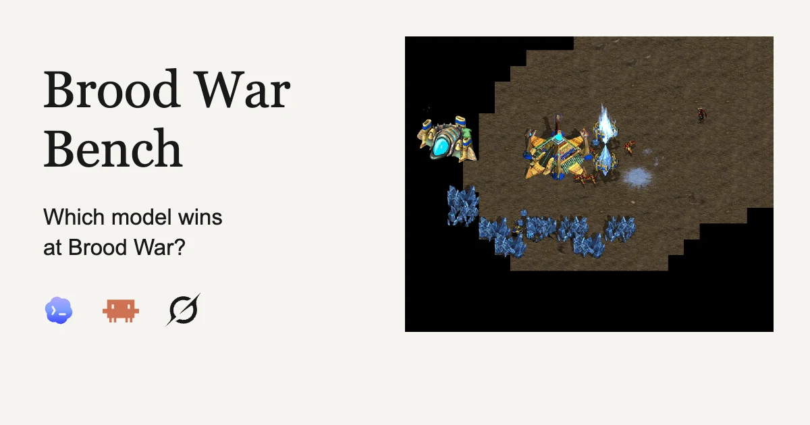
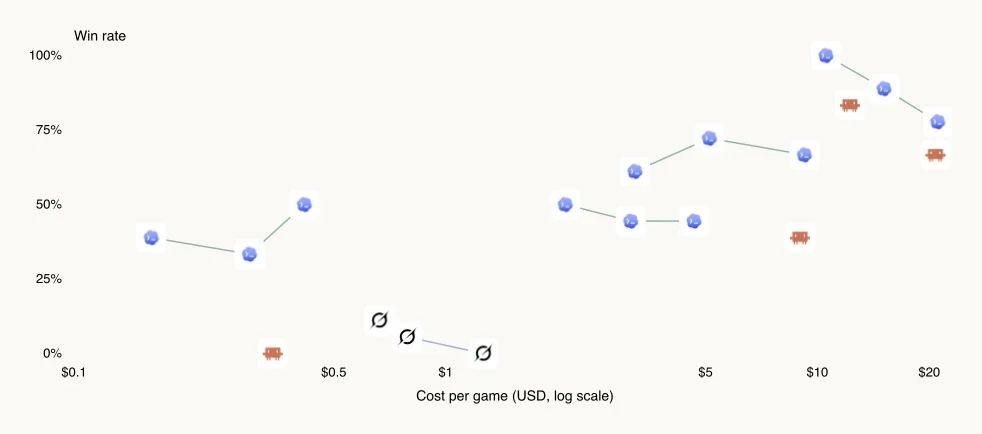

# Brood War Bench 深度拆解：171 场星际循环赛，暴露实时 Agent 的思考延迟与协作断层

> **TL;DR:** Ben Swerdlow 让 19 个模型与推理强度配置打完 171 场《星际争霸：母巢之战》循环赛。Codex Astra / xhigh 以 18–0 第一，Claude Fable 15–3 排第三，Grok 与 Claude Haiku 落在末尾。但这份报告最有价值的不是胜负，而是把 Agent 放进一个不会等它想完的世界：推理延迟会让基地在思考期间被拆掉，子 Agent 缺乏共享计划会让新兵逐个送死，更高推理强度也不保证更高胜率或更低单局成本。它测到的是闭环控制能力，而不只是静态题目的正确率。

- **作者:** [Ben Swerdlow](https://twitter.com/benswerd)
- **报告:** [Brood War Bench](https://bw.swerdlow.dev/report)
- **规模:** 19 个配置、171 场完整循环赛、342 个 player-runs
- **保存证据:** 游戏引擎记录、双方 Agent harness 日志、对局回放、30 秒间隔趋势数据
- **发布日期:** 2026-09-19（报告页未显示日期，按首次公开索引记录）
- **核验日期:** 2026-09-23

## 一句话判断

Brood War Bench 真正测到的不是“语言模型懂多少星际知识”，而是它能否在**观察、推理、行动和重新观察**组成的实时循环里持续活下去。

传统基准可以让模型思考几分钟，再检查最后答案是否正确。《星际争霸》不会暂停：模型每多想一秒，对手就多采一秒矿、多造一只兵，或者继续拆它的基地。于是推理延迟不再是隐藏的服务指标，而会直接变成游戏状态里的损失。

这也是为什么作者的结论看起来矛盾却非常重要：Astra / xhigh 全胜，但同一家族里更高 effort 并非总是更强；旧模型尤其容易把 RTS 当回合制游戏，在思考时被消灭。能力、思考深度、行动频率和环境时钟必须一起看。

## 这 171 场是怎么组成的

19 个“模型 × 推理强度”配置彼此各打一场，完整循环赛刚好是：

`19 × 18 ÷ 2 = 171`

每场比赛运行在 Freestyle VM 上，本地 player CLI 与 opponent CLI 向同一局游戏交换观察和命令。报告保存两侧 harness 日志与游戏引擎记录，并提供回放。趋势数据每 30 秒采样一次，记录工人、军队、建筑、矿物、气体、人口与科技。

这个设计有三个优点：

1. **同一对手池:** 每个配置都面对其余 18 个配置，排名不是由不同题目集合拼出来的。
2. **过程可观察:** 不只有胜负，还能看到经济、兵力、科技与动作频率如何演化。
3. **失败可复盘:** G043、G005、G009、G007、G027、G036 等案例保留了具体时间段的回放与 Agent 行为。

但它仍不是纯模型对比。Codex、Claude Code 和 Grok 使用各自的 Agent harness；不同工具调用协议、上下文管理和命令执行方式都可能影响结果。这里评测的是“模型加运行时”的组合。

## 排名很清楚，但绝对水平依然很低

| 排名 | 配置 | 战绩 | 胜率 | APM | 单局成本 |
|---:|---|---:|---:|---:|---:|
| 1 | Codex Astra / xhigh | 18–0 | 100.0% | 12.6 | $10.54 |
| 2 | Codex Astra / medium | 16–2 | 88.9% | 17.2 | $15.11 |
| 3 | Claude Fable | 15–3 | 83.3% | 12.6 | $12.24 |
| 4 | Codex Astra / low | 14–4 | 77.8% | 25.7 | $21.07 |
| 5 | Codex 5.6 Sol / medium | 13–5 | 72.2% | 10.1 | $5.12 |
| 6 | Codex 5.6 Sol / low | 12–6 | 66.7% | 18.1 | $9.23 |
| 7 | Claude Opus 5 | 12–6 | 66.7% | 10.5 | $20.78 |
| 8 | Codex 5.6 Sol / xhigh | 11–7 | 61.1% | 8.0 | $3.23 |
| 9 | Codex 5.6 Luna / low | 9–9 | 50.0% | 23.8 | $0.42 |
| 10 | Codex 5.6 Terra / xhigh | 9–9 | 50.0% | 15.8 | $2.10 |

Astra / xhigh 的 18–0 证明它明显强于这批对手，却不能推出它已经“会打星际”。作者直接写明：没有一个模型超过新手水平，一个初学者的光子炮 rush 就可能击败全部 Agent。

因此，这张榜单同时成立的两句话是：**Astra 是本次最强配置；所有配置都离人类稳定对战能力很远。** 相对排名不能替代绝对能力基线。

## 更高 effort 为什么不总是更好

三个 Codex 家族呈现出三种不同关系：

| 家族 | 最佳胜率配置 | 最低成本配置 | 结论 |
|---|---|---|---|
| Astra | xhigh：100% | xhigh：$10.54 | 深思考与结果一致 |
| Sol | medium：72.2% | xhigh：$3.23 | 中等 effort 胜率更高 |
| Luna | low：50.0% | xhigh：$0.16 | 低 effort 反而最能赢 |

这里不能简单得出“低 effort 更适合游戏”。更合理的解释是，实际表现由至少四项共同决定：决策质量、单次推理延迟、动作批次大小和对局持续时间。

成本也不是固定的“模型价格 × 一次调用”。一场更早结束的比赛可能总花费更低；一个单 token 更便宜、但长期无法结束比赛的 Agent，反而会持续消耗。报告中的 Codex 与 Sonnet 成本还是基于 token 的估算，因此这些美元数字更适合做本次运行的相对比较，而不是精确的采购报价。

## APM 不是越高越好

Terra / low 的 APM 高达 48.3，却只有 44.4% 胜率；Astra / xhigh 只有 12.6 APM，却全胜。Grok / xhigh 只有 2.8 APM，几乎无法形成有效控制。

报告里的 APM 应理解为 Agent 通过控制接口产生动作的频率，不应直接与职业选手的鼠标键盘 APM 等同。高层命令可能一次控制多个单位；反过来，大量重复、过时或互相冲突的命令也能制造很高的动作数。

真正有用的指标是“有效闭环频率”：Agent 多久刷新一次世界状态，发现偏差后多久纠正，以及每批命令在执行前是否已经过期。12 个彼此一致的动作可能优于 48 个没有共享计划的动作。

## Codex 会分工，但共享状态没有跟上

报告记录到 Codex 经常创建不同子 Agent，分别负责经济、生产和军队控制。这听起来很像正确的多 Agent 架构，但实际比赛暴露了通信缺口：负责生产的 Agent 不知道军队正在集结，负责控制的 Agent 又会把每个新造出的单位立即送去进攻，结果兵力逐个撞进防线。

问题不是“不会调用 subagent”，而是缺少一个所有角色都服从的共享作战状态：

- 当前战略是骚扰、守家、集结还是总攻；
- 集结点、攻击阈值和最早出发时间；
- 哪个 Agent 拥有某组单位的控制权；
- 最近一次观察何时产生，命令是否仍基于新鲜状态；
- 什么事件可以中断长期计划。

当作者提供人类指导后，规划和时机明显改善。这说明模型不是完全没有策略知识，而是难以在持续变化的环境中把知识变成同步执行。

## “骚扰”为什么比宏观运营更容易奏效

Codex 最有效的重复策略不是建立完善经济，而是尽早派 Probe 过图进行干扰。对手会花几十秒重新思考，实时延迟本身就变成可利用的弱点。

这是一种很典型的 benchmark adaptation：Agent 找到的未必是最好的《星际争霸》策略，而是最能击穿当前对手运行时的策略。它攻击的不是游戏单位，而是对手的控制循环。

与此同时，多数 Agent 的持续生产、科技推进和部队集结都很弱。Claude Fable 相对更会发展经济与科技：G007 造到 Lair、Spire 和 Mutalisk；G027 建出 Robotics Facility、Citadel、Observatory 与 Templar Archives。但“能造到高科技”仍不等于能把经济、兵种和交战时机组织成稳定胜法。

Grok 则把延迟问题推到极端。G043 中，Grok / xhigh 在 43 分钟内生成 11,138 个 reasoning tokens，却只发出六批命令，连一个战斗单位都没有造出来。静态看，这可能是一段很长的思考；放进实时系统，它几乎等于没有行动。

## 五分钟快照透露了什么

报告把不同 effort 合并到模型家族后，在第 5 分钟给出存活 player-runs 的均值：

| 指标 | Codex Astra | Claude Fable | Grok 4.6 |
|---|---:|---:|---:|
| 工人 | 14.7 | 16.7 | 7.4 |
| 军队 | 8.3 | 7.6 | 2.0 |
| 建筑 | 6.2 | 7.4 | 4.5 |
| 科技 | 0.3 | 0.2 | 0.0 |
| 已用人口 | 26.5 | 26.6 | 11.3 |
| 库存矿物 | 240.6 | 248.6 | 536.6 |

Grok 的高库存矿物不是经济更好，而是资源没有及时转化为工人、建筑和军队。这个表也有重要限制：已经结束的对局会从后续时间点退出，模型视图还合并了不同 effort；它不是固定样本上的因果比较。

## 对实时 Agent 设计最直接的六条启示

1. **快循环与慢规划分层。** 反应式控制器负责保命、补工人和处理突发攻击；慢规划器负责科技路线、兵种组合与阶段目标。
2. **为推理设置时限。** 每轮思考都要知道环境能容忍多少延迟，超时后应执行可逆的保底动作，而不是让世界停在旧计划上。
3. **异步执行与持续观察。** 长推理不应阻塞采集和基础控制；新观察必须能够取消已经过时的计划。
4. **共享状态而不只共享聊天。** 子 Agent 需要结构化的世界状态、资源预算、单位所有权和作战阶段，不能靠零散自然语言互相猜。
5. **按结果衡量动作。** APM、token 数和子 Agent 数都是中间量；更重要的是资源转化率、状态新鲜度、命令失效率和计划完成率。
6. **保留可回放的过程证据。** Brood War Bench 最值得借鉴的是同时保存游戏记录、Agent 日志和时间序列，使失败可以定位到观察、推理、决策还是执行。

## 这份评测还不能证明什么

这是一份很有启发性的研究者实验，但不应被包装成最终模型排名：

- 每对配置只打一场，没有重复种子、置信区间或显著性检验；
- 报告页没有完整公开 system prompt、工具 schema、race/map 分配、命令预算和超时规则；
- 不同提供方使用不同 harness，模型能力与运行时能力没有被拆开；
- 相对胜率可能受 matchup 与早期骚扰策略影响，不保证存在稳定的传递排序；
- APM 是接口动作频率，不是人类操作能力的同尺度测量；
- 成本部分包含 token 估算，且受到比赛时长影响；
- 没有系统的人类或传统游戏 Bot 基线，只有作者关于新手水平的定性判断。

因此，18–0 最准确的表述是：Astra / xhigh 在这一套 harness、规则与单场循环赛里击败了其余 18 个配置。它不是“AI 已掌握《星际争霸》”的证据。

## 结论

Brood War Bench 把一个常被隐藏的问题变得可见：**Agent 的答案可能是对的，但答案到达时，世界已经变了。**

Astra 的优势说明新模型开始更清楚思考本身有成本；Fable 展示了相对完整的经济与科技；Grok 的长推理、低行动则说明仅增加 reasoning tokens 无法自动生成实时控制能力。更深的推理只有嵌入快速感知、截止时间、可中断执行和共享状态，才会变成优势。

对 Agent 基准而言，这比又一道静态题更有价值。真实软件、浏览器、交易系统、机器人和多人协作都不会永远等模型。下一代评测不只应该问“最后答对了吗”，还应该问：它多久才行动、行动时状态是否仍然新鲜、多个执行者是否共享同一个计划，以及失败能否通过完整日志被复现。

## Sources

1. Ben Swerdlow, “Brood War Bench”
   https://bw.swerdlow.dev/report

2. Machine-readable benchmark results
   https://bw.swerdlow.dev/benchmark/report.json

3. Aggregated 30-second trend data
   https://bw.swerdlow.dev/benchmark/trends.json

4. G043 replay example
   https://bw.swerdlow.dev/benchmark/replay.html?game=G043&start=210&duration=120&seat=0&focus=guest-base
